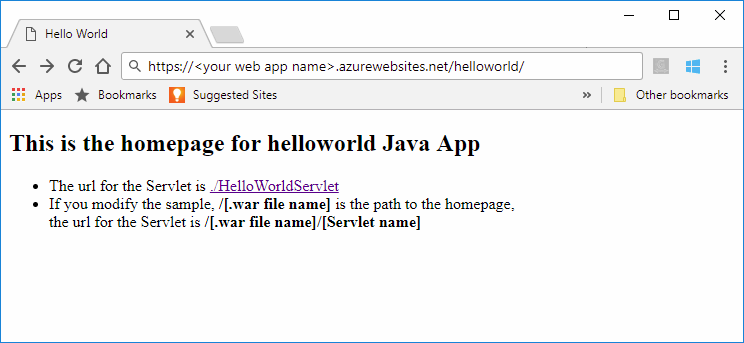

# Quickstart: Create a Java web app in App Service on Linux

[App Service on Linux](app-service-linux-intro.md) provides a highly scalable, self-patching, web hosting service using the Linux operating system. This quickstart shows how to use the [Azure CLI](https://docs.microsoft.com/cli/azure/get-started-with-azure-cli) with the [Maven Plugin for Azure Web Apps (Preview)](https://github.com/Microsoft/azure-maven-plugins/tree/develop/azure-webapp-maven-plugin) to deploy a Java web app web archive (WAR) file.


[!INCLUDE [quickstarts-free-trial-note](../../../includes/quickstarts-free-trial-note.md)]

[!INCLUDE [cloud-shell-try-it.md](../../../includes/cloud-shell-try-it.md)]

## Create a Java app

Execute the following Maven command in the Cloud Shell prompt to create a new web app named `helloworld`:

```bash
mvn archetype:generate -DgroupId=example.demo -DartifactId=helloworld -DarchetypeArtifactId=maven-archetype-webapp
```

## Configure the Maven plugin

To deploy from Maven, use the code editor in the Cloud Shell to open up the project `pom.xml` file in the `helloworld` directory. 

```bash
code pom.xml
```

Then add the following plugin definition inside the `<build>` element of the `pom.xml` file.

```xml
<plugins>
    <!--*************************************************-->
    <!-- Deploy to Tomcat in App Service Linux           -->
    <!--*************************************************-->
      
    <plugin>
        <groupId>com.microsoft.azure</groupId>
        <artifactId>azure-webapp-maven-plugin</artifactId>
        <version>1.4.0</version>
        <configuration>
   
            <!-- Web App information -->
            <resourceGroup>${RESOURCEGROUP_NAME}</resourceGroup>
            <appName>${WEBAPP_NAME}</appName>
            <region>${REGION}</region>
   
            <!-- Java Runtime Stack for Web App on Linux-->
            <linuxRuntime>tomcat 8.5-jre8</linuxRuntime>
   
        </configuration>
    </plugin>
</plugins>
```    


> [!NOTE] 
> In this article we are only working with Java apps packaged in WAR files. The plugin also supports JAR web applications. Use the following alternate plugin definition for these applications. This configuration will deploy a JAR built by Maven at `${project.build.directory}/${project.build.finalName}.jar` on your local filesystem.
>
>```xml
><plugin>
>            <groupId>com.microsoft.azure</groupId>
>            <artifactId>azure-webapp-maven-plugin</artifactId>
>            <version>1.4.0</version>
>            <configuration>
>                <deploymentType>jar</deploymentType>
>
>           <!-- Web App information -->
>            <resourceGroup>${RESOURCEGROUP_NAME}</resourceGroup>
>            <appName>${WEBAPP_NAME}</appName>
>            <region>${REGION}</region>  
>
>                <!-- Java Runtime Stack for Web App on Linux-->
>                <linuxRuntime>jre8</linuxRuntime>
>            </configuration>
>         </plugin>
>```    


Update the following placeholders in the plugin configuration:

| Placeholder | Description |
| ----------- | ----------- |
| `RESOURCEGROUP_NAME` | Name for the new resource group in which to create your web app. By putting all the resources for an app in a group, you can manage them together. For example, deleting the resource group would delete all resources associated with the app. Update this value with a unique new resource group name, for example, *TestResources*. You will use this resource group name to clean up all Azure resources in a later section. |
| `WEBAPP_NAME` | The app name will be part the host name for the web app when deployed to Azure (WEBAPP_NAME.azurewebsites.net). Update this value with a unique name for the new Azure web app, which will host your Java app, for example *contoso*. |
| `REGION` | An Azure region where the web app is hosted, for example `westus2`. You can get a list of regions from the Cloud Shell or CLI using the `az account list-locations` command. |

## Deploy the app

Deploy your Java app to Azure using the following command:

```bash
mvn package azure-webapp:deploy
```

Once deployment has completed, browse to the deployed application using the following URL in your web browser, for example `http://<webapp>.azurewebsites.net/helloworld`. 



**Congratulations!** You've deployed your first Java app to App Service on Linux.


[!INCLUDE [cli-samples-clean-up](../../../includes/cli-samples-clean-up.md)]


## Next steps

In this quickstart, you used Maven to create a Java web app, configured the [Maven Plugin for Azure Web Apps (Preview)](https://github.com/Microsoft/azure-maven-plugins/tree/develop/azure-webapp-maven-plugin), then  deployed a web archive packaged Java web app to App Service on Linux. To learn more about using Java with Azure, follow the link below.

> [!div class="nextstepaction"]
> [Azure for Java Developers](https://docs.microsoft.com/java/azure/)

