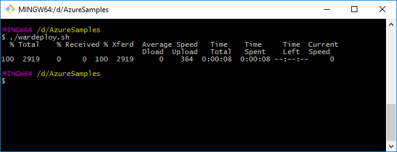
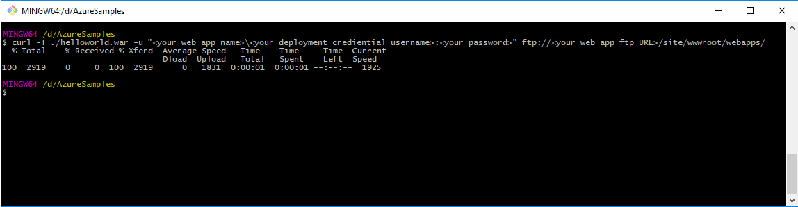
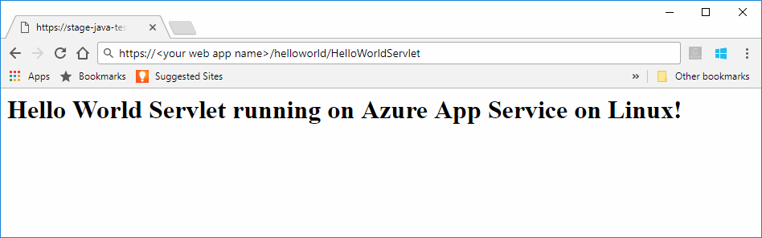

# Preview: Create a Java web app in App Service on Linux

App Service on Linux currently provides preview feature to support Java web apps. Please review the [Supplemental Terms of Use for Microsoft Azure Previews](https://azure.microsoft.com/support/legal/preview-supplemental-terms/) for more information on previews. [Deploying Java web apps to a Linux container in the cloud using the Azure Toolkit for IntelliJ](https://docs.microsoft.com/java/azure/intellij/azure-toolkit-for-intellij-hello-world-web-app-linux) is an alternative approach to deploy your Java app to your own container.

> [!NOTE]
> This article deploys a Java web app to App Service on Linux.
>

[App Service on Linux](app-service-linux-intro.md) provides a highly scalable, self-patching web hosting service using the Linux operating system. This quickstart shows how to deploy a Java app to App Service on Linux using a built-in image. You create the web app with built-in image using the [Azure CLI](https://docs.microsoft.com/cli/azure/get-started-with-azure-cli), and you deploy the Java app to the web app.


[!INCLUDE [quickstarts-free-trial-note](../../../includes/quickstarts-free-trial-note.md)]


## Prerequisites

To complete this quickstart: 

* You must have an Azure subscription. If you don't have an Azure subscription, create a [free account](https://azure.microsoft.com/free/?ref=microsoft.com&utm_source=microsoft.com&utm_medium=docs&utm_campaign=visualstudio) before you begin.
* [Install Git](https://git-scm.com/).
* Install [Eclipse](https://www.eclipse.org/downloads/).


[!INCLUDE [cloud-shell-try-it.md](../../../includes/cloud-shell-try-it.md)]

[!INCLUDE [Configure deployment user](../../../includes/configure-deployment-user.md)]


## Create a resource group

In the Cloud Shell, create a resource group with the [`az group create`](/cli/azure/group?view=azure-cli-latest#az_group_create) command. The following example creates a resource group named *myResourceGroup* in the *West Europe* location. To see all supported locations for App Service, run the [`az appservice list-locations`](/cli/azure/appservice?view=azure-cli-latest#az_appservice_list_locations) command.

```azurecli-interactive
az group create --name myResourceGroup --location "West US"
```

You generally create your resource group and the resources in a region near you. 

When the command finishes, a JSON output shows you the resource group properties.


[!INCLUDE [Create app service plan](../../../includes/app-service-web-create-app-service-plan-linux.md)]


## Create a web app

In the Cloud Shell, create a [web app](../app-service-web-overview.md) in the `myAppServicePlan` App Service plan. You can do it by using the [`az webapp create`](/cli/azure/webapp?view=azure-cli-latest#az_webapp_create) command. In the following example, replace *\<app_name>* with a globally unique app name (valid characters are `a-z`, `0-9`, and `-`). 

```azurecli-interactive
az webapp create --name <app_name> --resource-group myResourceGroup --plan myAppServicePlan --runtime "TOMCAT|8.5-jre8"
```

For the **runtime** parameter, use one of the following runtimes:
 * TOMCAT|8.5-jre8
 * TOMCAT|9.0-jre8


When the web app has been created, the Azure CLI shows information similar to the following example:

```json
{
  "additionalProperties": {},
  "availabilityState": "Normal",
  "clientAffinityEnabled": true,
  "clientCertEnabled": false,
  "cloningInfo": null,
  "containerSize": 0,
  "dailyMemoryTimeQuota": 0,
  "defaultHostName": "<your web app name>.azurewebsites.net",
  "enabled": true,
  "enabledHostNames": [
    "<your web app name>.azurewebsites.net",
    "<your web app name>.scm.azurewebsites.net"
  ],
  "ftpPublishingUrl": "ftp://<your ftp URL>",  
  < JSON data removed for brevity. >
}
```

Copy the value for **ftpPublishingUrl**. You will use this later, if you choose FTP deployment.

Browse to the newly created web app.

```
http://<app_name>.azurewebsites.net
```

If the web app is up and running, you should get a default screen similar to the following image:


## Download the sample Java app

In a terminal window on your machine, run the following command to clone the sample app repository to your local machine. You will deploy this sample app in a later step.

```bash
git clone https://github.com/Azure-Samples/java-docs-hello-world
```


## Deploying the Java app to App Servic on Linux

Open the sample project in [Eclipse](https://www.eclipse.org/downloads/), and [export the java app to a Web Archive (WAR) file](http://help.eclipse.org/kepler/index.jsp?topic=%2Forg.eclipse.wst.webtools.doc.user%2Ftopics%2Ftwcrewar.html) named `helloworld.war`.

To deploy your Java app WAR file, you can use WarDeploy (currently in [Preview](https://azure.microsoft.com/support/legal/preview-supplemental-terms/)), or FTP.

Depending on which method of deployment you use, the relative path to browse to your Java web app will be slightly different.

### Deploy with WarDeploy 

To deploy your WAR file with WarDeploy, create a new bash script using the following example script:

```bash
#!/bin/bash 

# change the following variables to use your web app name, App Service deployment credentials, and local war file path.
sitename='your web app name'
username='your deployment username'
password='your deployment user password'
warFilePath='local-path-to-war-file' 

# deploy to App Service on Linux
curl -X POST -u $username:$password https://$sitename.scm.azurewebsites.net/api/wardeploy --data-binary @$warFilePath
```

Change the variables in the script to the values for your web app name, deployment credientials, and WAR file path.

After making the required changes, run the script to deploy the WAR file.



Browse to the deployed application using the following URL in your web browser.

```bash
http://<app_name>.azurewebsites.net
```

The Java sample code is running in a web app with built-in image.


Browse to the servlet using your web browser.

```bash
http://<app_name>.azurewebsites.net/HelloWorldServlet
```

The servlet is running in a web app with built-in image.


**Congratulations!** You've deployed your first Java app to App Service on Linux.


### FTP deployment

Alternatively, you can also use FTP to deploy the WAR file. 

FTP the file to the `/home/site/wwwroot/webapps` directory of your web app. The following example commandline uses CURL:

```bash
curl -T ./helloworld.war -u "webappname\deploymentuser:deploymentpassword" ftp://webappFTPURL/site/wwwroot/webapps/
```

Replace the following text in the example commandline:

- *webappname* - Use your app name.
- *deploymentuser* - Use the deployment username you created earlier.
- *deploymentpassword* - Use the password for your deployment user.
- *webappFTPURL* - Use the **FTP hostname** value for your web app. This is listed on **Overview** blade for your web app in the [Azure portal](https://portal.azure.com/).


Run the curl command.



Browse to the deployed application using the following URL in your web browser.

```bash
http://<app_name>.azurewebsites.net/helloworld
```

The Java sample code is running in a web app with built-in image.


Browse to the servlet using your web browser.

```bash
http://<app_name>.azurewebsites.net/helloworld/HelloWorldServlet
```

The Java sample code is running in a web app with built-in image.




**Congratulations!** You've deployed your first Java app to App Service on Linux.


[!INCLUDE [cli-samples-clean-up](../../../includes/cli-samples-clean-up.md)]


## Next Steps

For more information about using Java with Azure, see the following links:

* [Azure for Java Developers](https://docs.microsoft.com/java/azure/)
* [Deploy a Hello World web app to a Linux container in the cloud using the Azure Toolkit for IntelliJ](https://docs.microsoft.com/java/azure/intellij/azure-toolkit-for-intellij-hello-world-web-app-linux)
* [Java Tools for Visual Studio Team Services](https://java.visualstudio.com/)
