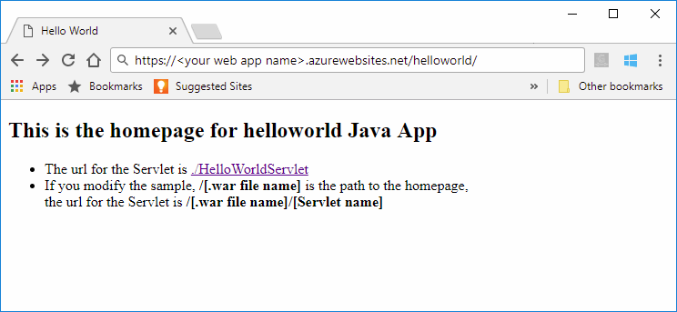

# Quickstart: Create a Java app in App Service on Linux

[App Service on Linux](app-service-linux-intro.md) provides a highly scalable, self-patching, web hosting service using the Linux operating system. This quickstart shows how to use the [Azure CLI](https://docs.microsoft.com/cli/azure/get-started-with-azure-cli) with the [Maven Plugin for Azure App Service](https://github.com/Microsoft/azure-maven-plugins/tree/develop/azure-webapp-maven-plugin) to deploy a Java web archive (WAR) file.
> [!NOTE]
>
> The same thing can also be done using popular IDEs like IntelliJ and Eclipse. Check out our similar documents at [Azure Toolkit for IntelliJ Quickstart](/java/azure/intellij/azure-toolkit-for-intellij-create-hello-world-web-app) or [Azure Toolkit for Eclipse Quickstart](/java/azure/eclipse/azure-toolkit-for-eclipse-create-hello-world-web-app).
>


[!INCLUDE [quickstarts-free-trial-note](../../../includes/quickstarts-free-trial-note.md)]

[!INCLUDE [cloud-shell-try-it.md](../../../includes/cloud-shell-try-it.md)]

## Create a Java app

Execute the following Maven command in the Cloud Shell prompt to create a new app named `helloworld`:

```bash
mvn archetype:generate -DgroupId=example.demo -DartifactId=helloworld -DarchetypeArtifactId=maven-archetype-webapp
```

## Configure the Maven plugin

To deploy from Maven, use the code editor in the Cloud Shell to open up the project `pom.xml` file in the `helloworld` directory. 

```bash
code pom.xml
```

Then add the following plugin definition inside the `<build>` element of the `pom.xml` file.

```xml
<plugins>
    <!--*************************************************-->
    <!-- Deploy to Tomcat in App Service Linux           -->
    <!--*************************************************-->
    <plugin>
        <groupId>com.microsoft.azure</groupId>
        <artifactId>azure-webapp-maven-plugin</artifactId>
        <version>1.7.0</version>
    </plugin>
</plugins>
```

The deploy process to Azure App Service uses account credentials from the Azure CLI. [Sign in with the Azure CLI](/cli/azure/authenticate-azure-cli?view=azure-cli-latest) before continuing.

```azurecli
az login
```

Then you can configure the deployment, run the maven command `mvn azure-webapp:config` in the Command Prompt and use the default configurations by pressing **ENTER** until you get the **Confirm (Y/N)** prompt, then press **'y'** and the configuration is done.

```cmd
~@Azure:~/helloworld$ mvn azure-webapp:config
[INFO] Scanning for projects...
[INFO]
[INFO] ----------------------< example.demo:helloworld >-----------------------
[INFO] Building helloworld Maven Webapp 1.0-SNAPSHOT
[INFO] --------------------------------[ war ]---------------------------------
[INFO]
[INFO] --- azure-webapp-maven-plugin:1.6.0:config (default-cli) @ helloworld ---
[WARNING] The plugin may not work if you change the os of an existing webapp.
Define value for OS(Default: Linux):
1. linux [*]
2. windows
3. docker
Enter index to use:
Define value for javaVersion(Default: jre8):
1. jre8 [*]
2. java11
Enter index to use:
Define value for runtimeStack(Default: TOMCAT 8.5):
1. TOMCAT 9.0
2. jre8
3. TOMCAT 8.5 [*]
4. WILDFLY 14
Enter index to use:
Please confirm webapp properties
AppName : helloworld-1558400876966
ResourceGroup : helloworld-1558400876966-rg
Region : westeurope
PricingTier : Premium_P1V2
OS : Linux
RuntimeStack : TOMCAT 8.5-jre8
Deploy to slot : false
Confirm (Y/N)? : Y
```

> [!NOTE]
> In this article we are only working with Java apps packaged in WAR files. The plugin also supports JAR web applications, visit [Deploy a Java SE JAR file to App Service on Linux](https://docs.microsoft.com/java/azure/spring-framework/deploy-spring-boot-java-app-with-maven-plugin?toc=%2fazure%2fapp-service%2fcontainers%2ftoc.json) to try it out.

Navigate to `pom.xml` again to see the plugin configuration is updated,  You can modify other configurations for App Service directly in your pom file if needed, some common ones are listed below:

 Property | Required | Description | Version
---|---|---|---
`<schemaVersion>` | false | Specify the version of the configuration schema. Supported values are: `v1`, `v2`. | 1.5.2
`<resourceGroup>` | true | Azure Resource Group for your Web App. | 0.1.0+
`<appName>` | true | The name of your Web App. | 0.1.0+
[`<region>`](/java/api/overview/azure/maven/azure-webapp-maven-plugin/readme#region) | true | Specifies the region where your Web App will be hosted; the default value is **westus**. All valid regions at [Supported Regions](/java/api/overview/azure/maven/azure-webapp-maven-plugin/readme#region) section. | 0.1.0+
[`<pricingTier>`](/java/api/overview/azure/maven/azure-webapp-maven-plugin/readme##pricingtier) | false | The pricing tier for your Web App. The default value is **P1V2**.| 0.1.0+
[`<runtime>`](/java/api/overview/azure/maven/azure-webapp-maven-plugin/readme#runtimesetting) | true | The runtime environment configuration, you could see the detail [here](/java/api/overview/azure/maven/azure-webapp-maven-plugin/readme#runtimesetting). | 0.1.0+
[`<deployment>`](/java/api/overview/azure/maven/azure-webapp-maven-plugin/readme#deploymentsetting) | true | The deployment configuration, you could see the details [here](/java/api/overview/azure/maven/azure-webapp-maven-plugin/readme#deploymentsetting). | 0.1.0+

## Deploy the app

Deploy your Java app to Azure using the following command:

```bash
mvn package azure-webapp:deploy
```

Once deployment has completed, browse to the deployed application using the following URL in your web browser, for example `http://<webapp>.azurewebsites.net`. 


**Congratulations!** You've deployed your first Java app to App Service on Linux.

## Clean up resources

In the preceding steps, you created Azure resources in a resource group. If you don't expect to need these resources in the future, delete the resource group by running the following command in the Cloud Shell:

```azurecli-interactive
az group delete --name <your resource group name; for example: helloworld-1558400876966-rg> --yes
```

This command may take a minute to run.

## Next steps

> [!div class="nextstepaction"]
> [Tutorial: Java Enterprise app with PostgreSQL](tutorial-java-enterprise-postgresql-app.md)

> [!div class="nextstepaction"]
> [Configure Java app](configure-custom-container.md)

> [!div class="nextstepaction"]
> [CI/CD with Jenkins](/azure/jenkins/deploy-jenkins-app-service-plugin)

> [!div class="nextstepaction"]
> [Other Azure for Java Developers Resources](/java/azure/)
