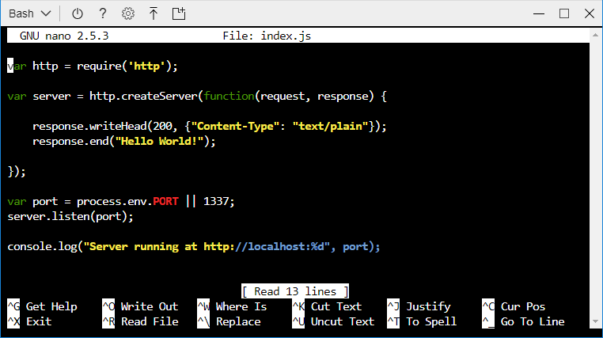
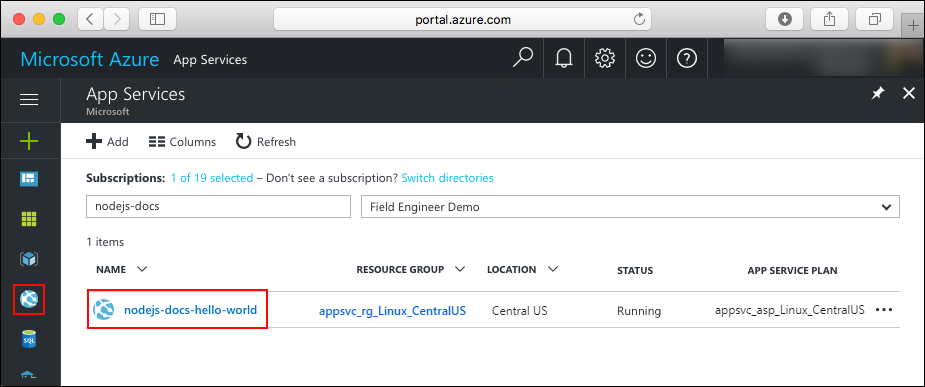
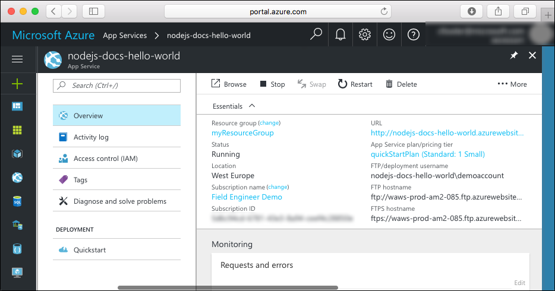

# Create a Node.js app in Azure App Service on Linux

> [!NOTE]
> This article deploys an app to App Service on Linux. To deploy to App Service on _Windows_, see [Create a Node.js app in Azure](../app-service-web-get-started-nodejs.md).
>

[App Service on Linux](app-service-linux-intro.md) provides a highly scalable, self-patching web hosting service using the Linux operating system. This quickstart shows how to deploy a Node.js app to App Service on Linux using the [Cloud Shell](https://docs.microsoft.com/azure/cloud-shell/overview).

You'll complete this quickstart in Cloud Shell, but you can also run these commands locally with [Azure CLI](/cli/azure/install-azure-cli).


[!INCLUDE [quickstarts-free-trial-note](../../../includes/quickstarts-free-trial-note.md)]

[!INCLUDE [cloud-shell-try-it.md](../../../includes/cloud-shell-try-it.md)]

## Download the sample

In the Cloud Shell, create a quickstart directory and then change to it.

```bash
mkdir quickstart

cd quickstart
```

Next, run the following command to clone the sample app repository to your quickstart directory.

```bash
git clone https://github.com/Azure-Samples/nodejs-docs-hello-world
```

While running, it displays information similar to the following example:

```bash
Cloning into 'nodejs-docs-hello-world'...
remote: Counting objects: 40, done.
remote: Total 40 (delta 0), reused 0 (delta 0), pack-reused 40
Unpacking objects: 100% (40/40), done.
Checking connectivity... done.
```

> [!NOTE]
> The sample index.js sets the listening port to process.env.PORT. This environment variable is assigned by App Service.
>

## Create a web app

Change to the directory that contains the sample code and run the `az webapp up` command.

In the following example, replace <app_name> with a unique app name.

```bash
cd nodejs-docs-hello-world

az webapp up -n <app_name>
```

This command may take a few minutes to run. While running, it displays information similar to the following example:

```json
Creating Resource group 'appsvc_rg_Linux_CentralUS' ...
Resource group creation complete
Creating App service plan 'appsvc_asp_Linux_CentralUS' ...
App service plan creation complete
Creating app '<app_name>' ....
Webapp creation complete
Updating app settings to enable build after deployment
Creating zip with contents of dir /home/username/quickstart/nodejs-docs-hello-world ...
Preparing to deploy and build contents to app.
Fetching changes.

Generating deployment script.
Generating deployment script.
Generating deployment script.
Running deployment command...
Running deployment command...
Running deployment command...
Deployment successful.
All done.
{
  "app_url": "https://<app_name>.azurewebsites.net",
  "location": "Central US",
  "name": "<app_name>",
  "os": "Linux",
  "resourcegroup": "appsvc_rg_Linux_CentralUS ",
  "serverfarm": "appsvc_asp_Linux_CentralUS",
  "sku": "STANDARD",
  "src_path": "/home/username/quickstart/nodejs-docs-hello-world ",
  "version_detected": "6.9",
  "version_to_create": "node|6.9"
}
```

The `az webapp up` command does the following actions:

- Create a default resource group.

- Create a default app service plan.

- Create an app with the specified name.

- [Zip deploy](https://docs.microsoft.com/azure/app-service/deploy-zip) files from the current working directory to the app.

## Browse to the app

Browse to the deployed application using your web browser. Replace <app_name> with your app name.

```bash
http://<app_name>.azurewebsites.net
```

The Node.js sample code is running in App Service on Linux with a built-in image.


**Congratulations!** You've deployed your first Node.js app to App Service on Linux.

## Update and redeploy the code

In the Cloud Shell, type `nano index.js` to open the nano text editor.



 Make a small change to the text in the call to `response.end`:

```nodejs
response.end("Hello Azure!");
```

Save your changes and exit nano. Use the command `^O` to save and `^X` to exit.

You'll now redeploy the app. Substitute `<app_name>` with your app.

```bash
az webapp up -n <app_name>
```

Once deployment has completed, switch back to the browser window that opened in the **Browse to the app** step, and refresh the page.


## Manage your new Azure app

Go to the <a href="https://portal.azure.com" target="_blank">Azure portal</a> to manage the app you created.

From the left menu, click **App Services**, and then click the name of your Azure app.



You see your app's Overview page. Here, you can complete basic management tasks like browse, stop, start, restart, and delete.



The left menu provides different pages for configuring your app.

## Clean up resources

In the preceding steps, you created Azure resources in a resource group. If you don't expect to need these resources in the future, delete the resource group from the Cloud Shell. If you modified the region, update the resource group name `appsvc_rg_Linux_CentralUS` to the resource group specific to your app.

```azurecli-interactive
az group delete --name appsvc_rg_Linux_CentralUS
```

This command may take a minute to run.

## Next steps

> [!div class="nextstepaction"]
> [Tutorial: Node.js app with MongoDB](tutorial-nodejs-mongodb-app.md)

> [!div class="nextstepaction"]
> [Configure Node.js app](configure-language-nodejs.md)
