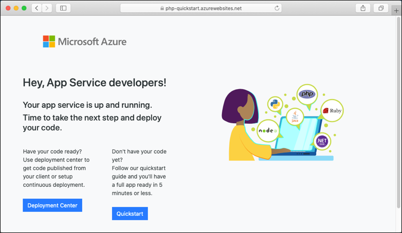

# Create a PHP app in App Service on Linux

> [!NOTE]
> This article deploys an app to App Service on Linux. To deploy to App Service on _Windows_, see [Create a PHP app in Azure](../app-service-web-get-started-php.md).
>

[App Service on Linux](app-service-linux-intro.md) provides a highly scalable, self-patching web hosting service using the Linux operating system. This quickstart tutorial shows how to deploy a PHP app to Azure App Service on Linux using the [Cloud Shell](https://docs.microsoft.com/azure/cloud-shell/overview).


You can follow the steps in this article using a Mac, Windows, or Linux machine.

[!INCLUDE [quickstarts-free-trial-note](../../../includes/quickstarts-free-trial-note.md)]

## Prerequisites

To complete this quickstart:

* <a href="https://git-scm.com/" target="_blank">Install Git</a>
* <a href="https://php.net" target="_blank">Install PHP</a>

## Download the sample

In a terminal window, run the following commands to clone the sample application to your local machine, and navigate to the directory containing the sample code.

```bash
git clone https://github.com/Azure-Samples/php-docs-hello-world
cd php-docs-hello-world
```

## Run the app locally

Run the application locally so that you see how it should look when you deploy it to Azure. Open a terminal window and use the `php` command to launch the built-in PHP web server.

```bash
php -S localhost:8080
```

Open a web browser, and navigate to the sample app at `http://localhost:8080`.

You see the **Hello World!** message from the sample app displayed in the page.


In your terminal window, press **Ctrl+C** to exit the web server.

[!INCLUDE [cloud-shell-try-it.md](../../../includes/cloud-shell-try-it.md)]

[!INCLUDE [Configure deployment user](../../../includes/configure-deployment-user.md)]

[!INCLUDE [Create resource group](../../../includes/app-service-web-create-resource-group-linux.md)]

[!INCLUDE [Create app service plan](../../../includes/app-service-web-create-app-service-plan-linux.md)]

## Create a web app

[!INCLUDE [Create web app](../../../includes/app-service-web-create-web-app-php-linux-no-h.md)] 

Browse to the site to see your newly created app with built-in image. Replace _&lt;app name>_ with your app name.

```bash
http://<app_name>.azurewebsites.net
```

Here is what your new app should look like:



[!INCLUDE [Push to Azure](../../../includes/app-service-web-git-push-to-azure.md)] 

```bash
Counting objects: 2, done.
Delta compression using up to 4 threads.
Compressing objects: 100% (2/2), done.
Writing objects: 100% (2/2), 352 bytes | 0 bytes/s, done.
Total 2 (delta 1), reused 0 (delta 0)
remote: Updating branch 'master'.
remote: Updating submodules.
remote: Preparing deployment for commit id '25f18051e9'.
remote: Generating deployment script.
remote: Running deployment command...
remote: Handling Basic Web Site deployment.
remote: Kudu sync from: '/home/site/repository' to: '/home/site/wwwroot'
remote: Copying file: '.gitignore'
remote: Copying file: 'LICENSE'
remote: Copying file: 'README.md'
remote: Copying file: 'index.php'
remote: Ignoring: .git
remote: Finished successfully.
remote: Running post deployment command(s)...
remote: Deployment successful.
To https://<app_name>.scm.azurewebsites.net/<app_name>.git
   cc39b1e..25f1805  master -> master
```

## Browse to the app

Browse to the deployed application using your web browser.

```bash
http://<app_name>.azurewebsites.net
```

The PHP sample code is running in App Service on Linux with built-in image.


**Congratulations!** You've deployed your first PHP app to App Service on Linux.

## Update locally and redeploy the code

In the local directory, open the `index.php` file within the PHP app, and make a small change to the text within the string next to `echo`:

```php
echo "Hello Azure!";
```

Commit your changes in Git, and then push the code changes to Azure.

```bash
git commit -am "updated output"
git push azure master
```

Once deployment has completed, switch back to the browser window that opened in the **Browse to the app** step, and refresh the page.


## Manage your new Azure app

Go to the <a href="https://portal.azure.com" target="_blank">Azure portal</a> to manage the app you created.

From the left menu, click **App Services**, and then click the name of your Azure app.


You see your app's Overview page. Here, you can perform basic management tasks like browse, stop, start, restart, and delete.


The left menu provides different pages for configuring your app. 

[!INCLUDE [cli-samples-clean-up](../../../includes/cli-samples-clean-up.md)]

## Next steps

> [!div class="nextstepaction"]
> [Tutorial: PHP app with MySQL](tutorial-php-mysql-app.md)

> [!div class="nextstepaction"]
> [Configure PHP app](configure-language-php.md)
