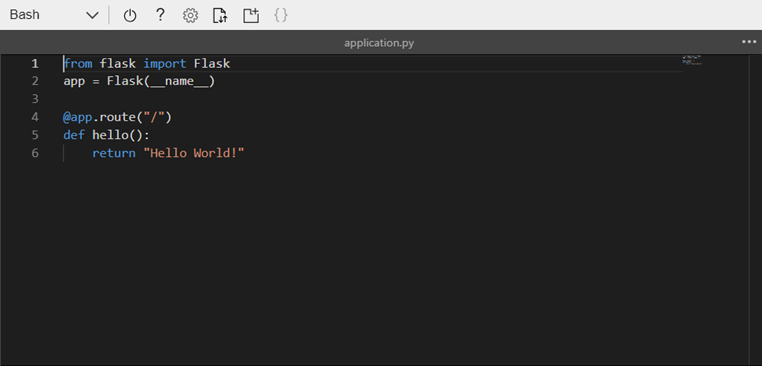

# Create a Python app in Azure App Service on Linux (Preview)

[App Service on Linux](app-service-linux-intro.md) provides a highly scalable, self-patching web hosting service using the Linux operating system. This quickstart shows how to deploy a Python app on top of the built-in Python image (Preview) in App Service on Linux using the [Cloud Shell](https://docs.microsoft.com/azure/cloud-shell/overview).

You can follow the steps in this article using a Mac, Windows, or Linux machine.


[!INCLUDE [quickstarts-free-trial-note](../../../includes/quickstarts-free-trial-note.md)]

[!INCLUDE [cloud-shell-try-it.md](../../../includes/cloud-shell-try-it.md)]

## Download the sample

In the Cloud Shell, create a quickstart directory and then change to it.

```bash
mkdir quickstart

cd quickstart
```

Next, run the following command to clone the sample app repository to your quickstart directory.

```bash
git clone https://github.com/Azure-Samples/python-docs-hello-world
```

While running, it displays information similar to the following example:

```bash
Cloning into 'python-docs-hello-world'...
remote: Enumerating objects: 43, done.
remote: Total 43 (delta 0), reused 0 (delta 0), pack-reused 43
Unpacking objects: 100% (43/43), done.
Checking connectivity... done.
```

## Create a web app

Change to the directory that contains the sample code and run the `az webapp up` command.

In the following example, replace *\<app_name>* with a globally unique app name (valid characters are `a-z`, `0-9`, and `-`).

```bash
cd python-docs-hello-world

az webapp up -n <app_name>
```

This command may take a few minutes to run. While running, it displays information similar to the following example:

```json
The behavior of this command has been altered by the following extension: webapp
Creating Resource group 'appsvc_rg_Linux_CentralUS' ...
Resource group creation complete
Creating App service plan 'appsvc_asp_Linux_CentralUS' ...
App service plan creation complete
Creating app '<app_name>' ....
Webapp creation complete
Creating zip with contents of dir /home/username/quickstart/python-docs-hello-world ...
Preparing to deploy contents to app.
All done.
{
  "app_url": "https:/<app_name>.azurewebsites.net",
  "location": "Central US",
  "name": "<app_name>",
  "os": "Linux",
  "resourcegroup": "appsvc_rg_Linux_CentralUS ",
  "serverfarm": "appsvc_asp_Linux_CentralUS",
  "sku": "BASIC",
  "src_path": "/home/username/quickstart/python-docs-hello-world ",
  "version_detected": "-",
  "version_to_create": "python|3.7"
}
```

The `az webapp up` command does the following actions:

- Create a default resource group.

- Create a default app service plan.

- Create an app with the specified name.

- [Zip deploy](https://docs.microsoft.com/azure/app-service/deploy-zip) files from the current working directory to the app.

## Browse to the app

Browse to the deployed application using your web browser.

```bash
http://<app_name>.azurewebsites.net
```

The Python sample code is running in App Service on Linux with a built-in image.


**Congratulations!** You've deployed your first Python app to App Service on Linux.

## Update locally and redeploy the code

In the Cloud Shell, type `code application.py` to open the Cloud Shell editor.



 Make a small change to the text in the call to `return`:

```python
return "Hello Azure!"
```

Save your changes and exit the editor. Use the command `^S` to save and `^Q` to exit.

You'll now redeploy the app. Substitute `<app_name>` with your app.

```bash
az webapp up -n <app_name>
```

Once deployment has completed, switch back to the browser window that opened in the **Browse to the app** step, and refresh the page.


## Manage your new Azure app

Go to the <a href="https://portal.azure.com" target="_blank">Azure portal</a> to manage the app you created.

From the left menu, click **App Services**, and then click the name of your Azure app.


You see your app's Overview page. Here, you can perform basic management tasks like browse, stop, start, restart, and delete.


The left menu provides different pages for configuring your app. 

[!INCLUDE [cli-samples-clean-up](../../../includes/cli-samples-clean-up.md)]

## Next steps

The built-in Python image in App Service on Linux is currently in Preview, and you can customize the command used to start your app . You can also create production Python apps using a custom container instead.

> [!div class="nextstepaction"]
> [Tutorial: Python app with PostgreSQL](tutorial-python-postgresql-app.md)

> [!div class="nextstepaction"]
> [Configure Python app](how-to-configure-python.md)

> [!div class="nextstepaction"]
> [Tutorial: Deploy from private container repository](tutorial-custom-docker-image.md)
