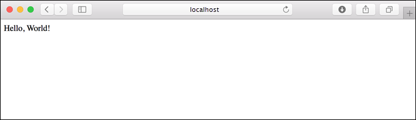
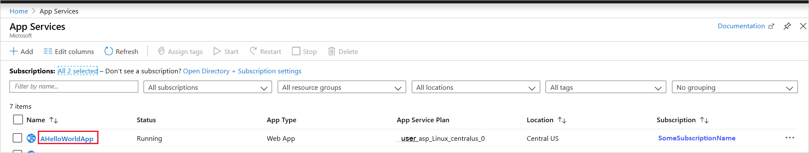
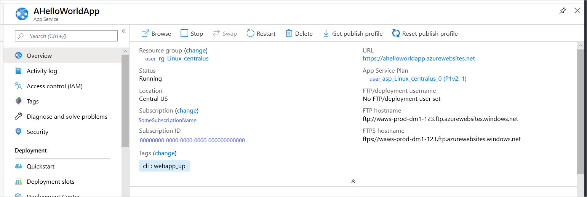

# Quickstart: Create a Python app in Azure App Service on Linux

In this quickstart, you deploy a Python web app to [App Service on Linux](app-service-linux-intro.md), Azure's highly scalable, self-patching web hosting service. You use the local [Azure command-line interface (CLI)](/cli/azure/install-azure-cli) on a Mac, Linux, or Windows computer. The web app you configure uses a free App Service tier, so you incur no costs in the course of this article.

If you prefer to deploy apps through an IDE, see [Deploy Python apps to App Service from Visual Studio Code](/azure/python/tutorial-deploy-app-service-on-linux-01).

## Prerequisites

- Azure subscription - [create one for free](https://azure.microsoft.com/free/?ref=microsoft.com&utm_source=microsoft.com&utm_medium=docs&utm_campaign=visualstudio)
- <a href="https://www.python.org/downloads/" target="_blank">Python 3.7</a> (Python 3.6 is also supported)
- <a href="https://git-scm.com/downloads" target="_blank">Git</a>
- <a href="https://docs.microsoft.com/cli/azure/install-azure-cli" target="_blank">Azure CLI</a>

## Download the sample

In a terminal window, run the following command to clone the sample application to your local computer. 

```terminal
git clone https://github.com/Azure-Samples/python-docs-hello-world
```

Then go into that folder:

```terminal
cd python-docs-hello-world
```

The repository contains an *application.py* file, which tells App Service that the code contains a Flask app. For more information, see [Container startup process and customizations](how-to-configure-python.md).

## Run the sample

In a terminal window, use the commands below (as appropriate for your operating system) to install the required dependencies and launch the built-in development server. 

# [Bash](#tab/bash)

```bash
python3 -m venv venv
source venv/bin/activate
pip install -r requirements.txt
export FLASK_APP=application.py
flask run
```

# [PowerShell](#tab/powershell)

```powershell
py -3 -m venv env
env\scripts\activate
pip install -r requirements.txt
Set-Item Env:FLASK_APP ".\application.py"
flask run
```

# [Cmd](#tab/cmd)

```cmd
py -3 -m venv env
env\scripts\activate
pip install -r requirements.txt
SET FLASK_APP=application.py
flask run
```

---

Open a web browser, and go to the sample app at `http://localhost:5000/`. The app displays the message **Hello World!**.



In your terminal window, press **Ctrl**+**C** to exit the web server.

## Sign in to Azure

The Azure CLI provides you with many convenient commands that you use from a local terminal to provision and manage Azure resources from the command line. You can use commands to complete the same tasks that you would through the Azure portal in a browser. You can also use CLI commands in scripts to automate management processes.

To run Azure commands in the Azure CLI, you must first sign in using the `az login` command. This command opens a browser to gather your credentials.

```terminal
az login
```

## Deploy the sample

The [`az webapp up`](/cli/azure/webapp#az-webapp-up) command creates the web app on App Service and deploys your code.

In the *python-docs-hello-world* folder that contains the sample code, run the following `az webapp up` command. Replace  `<app-name>` with a globally unique app name (*valid characters are `a-z`, `0-9`, and `-`*). Also replace `<location-name>` with an Azure region such as **centralus**, **eastasia**, **westeurope**, **koreasouth**, **brazilsouth**, **centralindia**, and so on. (You can retrieve a list of allowable regions for your Azure account by running the [`az account list-locations`](/cli/azure/appservice?view=azure-cli-latest.md#az-appservice-list-locations) command.)


```terminal
az webapp up --sku F1 -n <app-name> -l <location-name>
```

This command may take a few minutes complete run. While running, it displays information similar to the following example:

```output
The behavior of this command has been altered by the following extension: webapp
Creating Resource group 'appsvc_rg_Linux_centralus' ...
Resource group creation complete
Creating App service plan 'appsvc_asp_Linux_centralus' ...
App service plan creation complete
Creating app '<app-name>' ....
Webapp creation complete
Creating zip with contents of dir /home/username/quickstart/python-docs-hello-world ...
Preparing to deploy contents to app.
All done.
{
  "app_url": "https:/<app-name>.azurewebsites.net",
  "location": "Central US",
  "name": "<app-name>",
  "os": "Linux",
  "resourcegroup": "appsvc_rg_Linux_centralus ",
  "serverfarm": "appsvc_asp_Linux_centralus",
  "sku": "BASIC",
  "src_path": "/home/username/quickstart/python-docs-hello-world ",
  "version_detected": "-",
  "version_to_create": "python|3.7"
}
```

[!INCLUDE [AZ Webapp Up Note](../../../includes/app-service-web-az-webapp-up-note.md)]

## Browse to the app

Browse to the deployed application in your web browser at the URL `http://<app-name>.azurewebsites.net`.

The Python sample code is running a Linux container in App Service using a built-in image.


**Congratulations!** You've deployed your Python app to App Service on Linux.

## Redeploy updates

In your favorite code editor, open *application.py* and change the `return` statement on the last line to match the following code. The `print` statement is included here to generate logging output that you work with in the next section. 

```python
print("Handling request to home page.")
return "Hello Azure!"
```

Save your changes and exit the editor. 

Redeploy the app using the following `az webapp up` command, using the same command you used to deploy the app the first time, replacing `<app-name>` and `<location-name>` with the same names you used before. 

```terminal
az webapp up --sku F1 -n <app-name> -l <location-name>
```

Once deployment has completed, switch back to the browser window open to `http://<app-name>.azurewebsites.net` and refresh the page, which should display the modified message:


> [!TIP]
> Visual Studio Code provides powerful extensions for Python and Azure App Service, which simplify the process of deploying Python web apps to App Service. For more information, see [Deploy Python apps to App Service from Visual Studio Code](/azure/python/tutorial-deploy-app-service-on-linux-01).

## Stream logs

You can access the console logs generated from inside the app and the container in which it runs. Logs include any output generated using `print` statements.

First, turn on container logging by running the following command in a terminal, replacing `<app-name>` with the name of your app and `<resource-group-name>` with the name of the resource group shown in the output of the `az webapp up` command you used (such as "appsvc_rg_Linux_centralus"):

```terminal
az webapp log config --name <app-name> --resource-group <resource-group-name> --docker-container-logging filesystem
```

Once container logging is turned on, run the following command to show the log stream:

```terminal
az webapp log tail --name <app-name> --resource-group <resource-group-name>
```

Refresh the app in the browser to generate console logs, which should include lines similar to the following text. If you don't see output immediately, try again in 30 seconds.

```output
2019-10-23T12:40:03.815574424Z Handling request to home page.
2019-10-23T12:40:03.815602424Z 172.16.0.1 - - [23/Oct/2019:12:40:03 +0000] "GET / HTTP/1.1" 200 12 "-" "Mozilla/5.0 (Windows NT 10.0; Win64; x64) AppleWebKit/537.36 (KHTML, like Gecko) Chrome/78.0.3904.63 Safari/537.36 Edg/78.0.276.19"
```

You can also inspect the log files from the browser at `https://<app-name>.scm.azurewebsites.net/api/logs/docker`.

To stop log streaming at any time, type `Ctrl`+`C`.

## Manage the Azure app

Go to the <a href="https://portal.azure.com" target="_blank">Azure portal</a> to manage the app you created. Search for and select **App Services**.


Select the name of your Azure app.



You see your app's Overview page. Here, you can perform basic management tasks like browse, stop, start, restart, and delete.



The App Service menu provides different pages for configuring your app.

## Clean up resources

In the preceding steps, you created Azure resources in a resource group. The resource group has a name like "appsvc_rg_Linux_CentralUS" depending on your location. If you use an App Service SKU other than the free F1 tier, these resources will incur ongoing costs.

If you don't expect to need these resources in the future, delete the resource group by running the following command, replacing `<resource-group-name>` with the resource group shown in the output of the `az webapp up` command, such as "appsvc_rg_Linux_centralus". The command may take a minute to complete.

```terminal
az group delete -n <resource-group-name>
```

## Next steps

> [!div class="nextstepaction"]
> [Tutorial: Python (Django) web app with PostgreSQL](tutorial-python-postgresql-app.md)

> [!div class="nextstepaction"]
> [Configure Python app](how-to-configure-python.md)

> [!div class="nextstepaction"]
> [Tutorial: Run Python app in custom container](tutorial-custom-docker-image.md)
