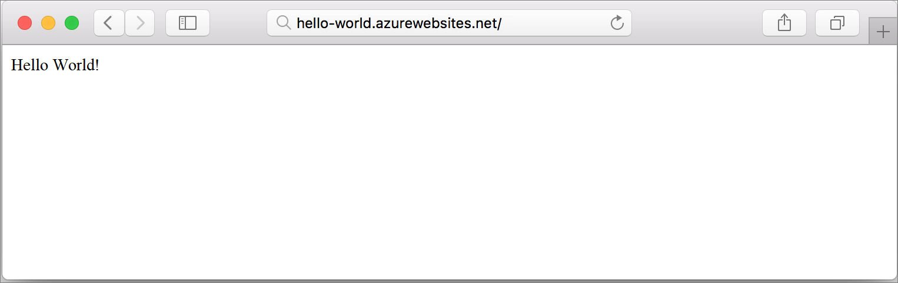

# Create a Ruby web app in a Linux container in Azure

[!INCLUDE [app-service-linux-preview](../../../includes/app-service-linux-preview.md)]

[Azure Web Apps](https://docs.microsoft.com/azure/app-service-web/app-service-web-overview) provides a highly scalable, self-patching web hosting service. This quickstart shows you how to you deploy a basic Ruby on Rails app to Azure Web Apps for Containers. You create the web app using the [Azure CLI](https://docs.microsoft.com/cli/azure/get-started-with-azure-cli), and you use Git to deploy the Ruby code to the web app.


You can follow the steps below using a Mac or Linux machine. 

## Prerequisites

* [Install Ruby 2.4.1 or higher](https://www.ruby-lang.org/en/documentation/installation/#rubyinstaller).
* [Install Git](https://git-scm.com/downloads).

[!INCLUDE [quickstarts-free-trial-note](../../../includes/quickstarts-free-trial-note.md)]

## Download the sample

In a terminal window on your machine, run the following command to clone the sample app repository to your local machine:

```bash
git clone https://github.com/Azure-Samples/ruby-docs-hello-world
cd ruby-docs-hello-world
```

## Run the app locally

Start the rails server.

```bash
bin/rails server
```
	
Using your web browser, navigate to `http://localhost:3000` to test the app locally.	


In your terminal window, press **Ctrl+C** to exit the web server.

[!INCLUDE [Try Cloud Shell](../../../includes/cloud-shell-try-it.md)]

[!INCLUDE [Configure deployment user](../../../includes/configure-deployment-user.md)]

[!INCLUDE [Create resource group](../../../includes/app-service-web-create-resource-group.md)]

[!INCLUDE [Create app service plan](../../../includes/app-service-web-create-app-service-plan-linux.md)]

## Create a web app

Create a [web app](../../app-service-web/app-service-web-overview.md) in the `myAppServicePlan` App Service plan with the [az webapp create](/cli/azure/webapp#create) command. Don't forget to replace `<app name>` with a unique app name.

The runtime in the following command is set to `ruby|2.3`. To see all supported runtimes, run [az webapp list-runtimes](/cli/azure/webapp#list-runtimes). 

```azurecli-interactive
az webapp create --resource-group myResourceGroup --plan myAppServicePlan --name <app name> --runtime "ruby|2.3" --deployment-local-git
```

[!INCLUDE [Create web app](../../../includes/app-service-web-create-web-app-result.md)] 


You’ve created an empty new web app in a Linux container, with git deployment enabled.

[!INCLUDE [Push to Azure](../../../includes/app-service-web-git-push-to-azure.md)] 

```bash
remote: Using sass-rails 5.0.6
remote: Updating files in vendor/cache
remote: Bundle gems are installed into ./vendor/bundle
remote: Updating files in vendor/cache
remote: ~site/repository
remote: Finished successfully.
remote: Running post deployment command(s)...
remote: Deployment successful.
To https://<your web app name>.scm.azurewebsites.net/<your web app name>.git
  579ccb....2ca5f31  master -> master
myuser@ubuntu1234:~workspace/<app name>$
```

## Browse to the app locally

Browse to the deployed application using your web browser.

```bash
http://<app_name>.azurewebsites.net
```

The Ruby sample code is running in an Azure App Service web app.


**Congratulations!** You've deployed your first PHP app to App Service.

## Update locally and redeploy the code

Using a local text editor, open the `app/controllers/application_controller.rb` file within the PHP app, and make a small change to the text within the string next to `echo`:

```php
render html: "Hello Azure!"
```

Commit your changes in Git, and then push the code changes to Azure.

```bash
git commit -am "updated output"
git push azure master
```

Once deployment has completed, switch back to the browser window that opened in the **Browse to the app** step, and refresh the page.



## Manage your new Azure web app

Go to the <a href="https://portal.azure.com" target="_blank">Azure portal</a> to manage the web app you created.

From the left menu, click **App Services**, and then click the name of your Azure web app.


You see your web app's Overview page. Here, you can perform basic management tasks like browse, stop, start, restart, and delete.


The left menu provides different pages for configuring your app. 

[!INCLUDE [cli-samples-clean-up](../../../includes/cli-samples-clean-up.md)]

## Next steps

> [!div class="nextstepaction"]
> [Azure App Service Web App on Linux FAQ](app-service-linux-faq.md)
