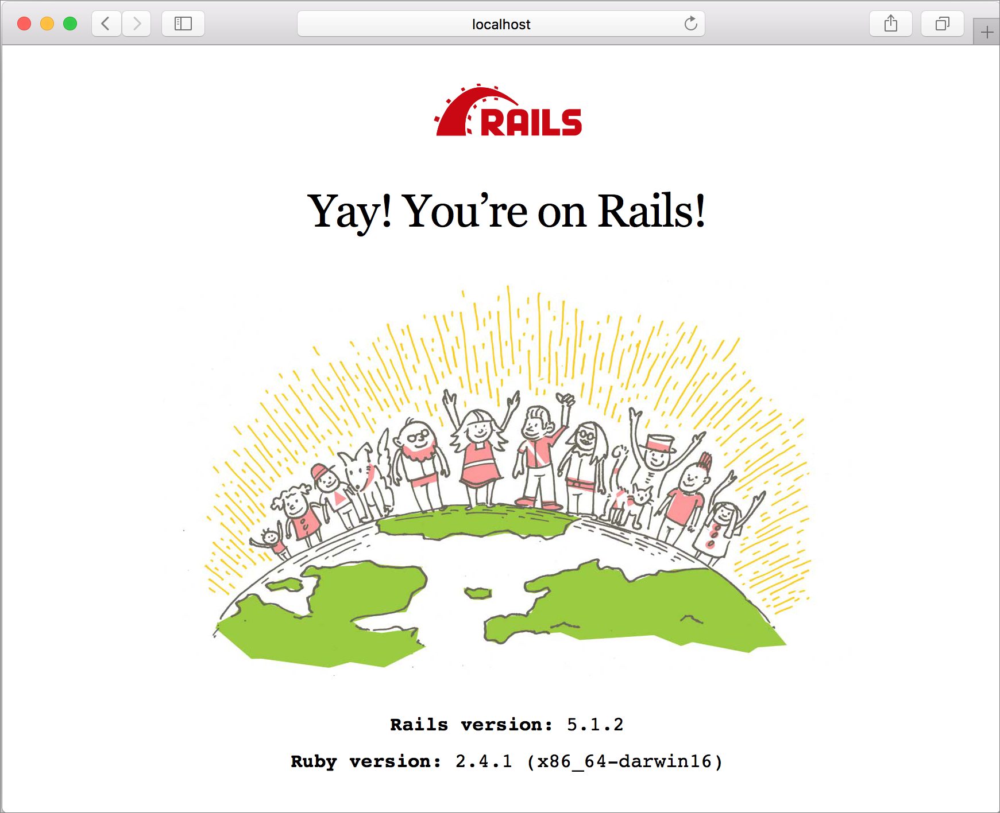

# Create a Ruby App with Web Apps on Linux

[Azure Web Apps](https://docs.microsoft.com/azure/app-service-web/app-service-web-overview) provides a highly scalable, self-patching web hosting service. This quickstart shows you how to create a basic Ruby on Rails application you then deploy it to Azure as a Web App on Linux.


## Prerequisites

* [Ruby 2.4.1 or higher](https://www.ruby-lang.org/en/documentation/installation/#rubyinstaller).
* [Git](https://git-scm.com/downloads).
* An [active Azure subscription](https://azure.microsoft.com/pricing/free-trial/).

[!INCLUDE [quickstarts-free-trial-note](../../../includes/quickstarts-free-trial-note.md)]

## Download the sample

In a terminal window, run the following command to clone the sample app repository to your local machine:

```bash
git clone https://github.com/Azure-Samples/ruby-docs-hello-world
```

## Run the application locally

Run the rails server in order for the application to work. Change to the *hello-world* directory, and the `rails server` command starts the server.

```bash
cd hello-world\bin
rails server
```

Using your web browser, navigate to `http://localhost:3000` to test the app locally.



## Modify app to display welcome message

Modify the application so it displays a welcome message. First, you must setup a route by modifying the *~/workspace/ruby-docs-hello-world/config/routes.rb* file to include a route named `hello`.
    
  ```ruby
  Rails.application.routes.draw do
      #For details on the DSL available within this file, see http://guides.rubyonrails.org/routing.html
      root 'application#hello'
  end
  ```

Change the application's controller so it returns the message as HTML to the browser. 

Open *~/workspace/hello-world/app/controllers/application_controller.rb* for editing. Modify the `ApplicationController` class to look like the following code sample:

  ```ruby
  class ApplicationController > ActionController :: base
    protect_from_forgery with: :exception
    def hello
      render html: "Hello, world from Azure Web App on Linux!"
    end
  end
  ```

Your app is now configured. Using your web browser, navigate to `http://localhost:3000` to confirm the root landing page.


[!INCLUDE [Try Cloud Shell](../../../includes/cloud-shell-try-it.md)]

## Create a Ruby web app on Azure

A resource group is required to contain the assets needed for your web app. To create a resource group, use the [az group create]() command.

```azurecli-interactive
az group create --location westeurop --name myResourceGroup
```

Use the [az appservice plan create](https://docs.microsoft.com/cli/azure/appservice/plan#create) command to create an app service plan for your web app.

```azurecli-interactive
  az appservice plan create --name myAppServicePlan --resource-group myResourceGroup --is-linux
```

Next, issue the [az webapp create](https://docs.microsoft.com/cli/azure/webapp) command to create the web app that uses the newly created service plan. Notice that the runtime is set to `ruby|2.3`. Don't forget to replace `<app name>` with a unique app name.

```azurecli-interactive
  az webapp create --resource-group myResourceGroup --plan myAppServicePlan --name <app name> --runtime "ruby|2.3" --deployment-local-git
```

The output from the command reveals information about the newly created web app as well as the deployment URL. It should look similar to the following sample. Copy the URL for later use in this tutorial.

```bash
https://<deployment user name>@<app name>.scm.azurewebsites.net/<app name>.git
```

Once the web app is created, an **Overview** page is available to view. Navigate to it. The following splash page is displayed:


## Deploy your application

Run the following commands to deploy the local application to your Azure website:

```bash
git remote add azure <Git deployment URL from above>
git add -A
git commit -m "Initial deployment commit"
git push azure master
```

Confirm that the remote deployment operations report success. The commands produce output similar to the following text:

```bash
remote: Using sass-rails 5.0.6
remote: Updating files in vendor/cache
remote: Bundle gems are installed into ./vendor/bundle
remote: Updating files in vendor/cache
remote: ~site/repository
remote: Finished successfully.
remote: Running post deployment command(s)...
remote: Deployment successful.
To https://<your web app name>.scm.azurewebsites.net/<your web app name>.git
  579ccb....2ca5f31  master -> master
myuser@ubuntu1234:~workspace/<app name>$
```

Once the deployment has completed, restart your web app for the deployment to take effect by using the [az webapp restart](https://docs.microsoft.com/cli/azure/webapp#restart) command, as shown here:

```azurecli-interactive
az webapp restart --name <app name> --resource-group myResourceGroup
```

Navigate to your site and verify the results.

```bash
http://<app name>.azurewebsites.net
```


> [!NOTE]
> While the app is restarting, attempting to browse the site results in an HTTP status code `Error 503 Server unavailable`. It may take a few minutes to fully restart.
>

[!INCLUDE [Clean-up section](../../../includes/cli-script-clean-up.md)]

## Next steps

[Azure App Service Web App on Linux FAQ](https://docs.microsoft.com/azure/app-service-web/app-service-linux-faq.md)