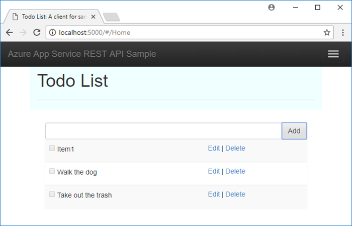
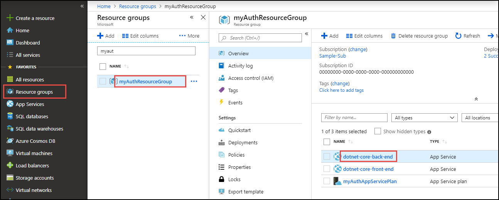
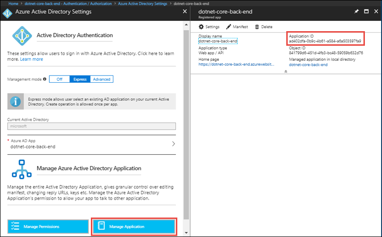
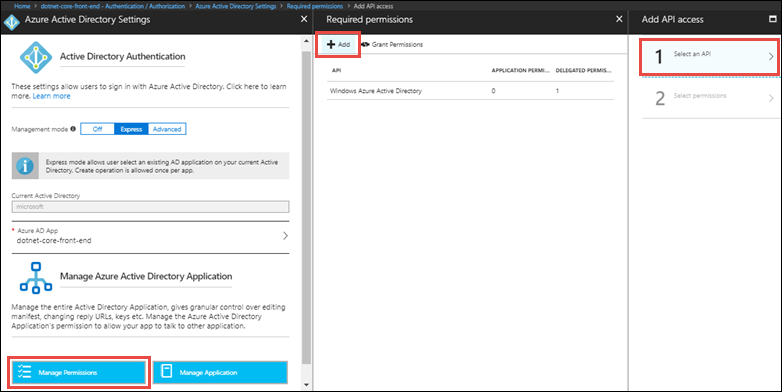
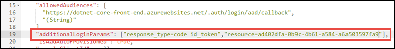

# Tutorial: Authenticate and authorize users end-to-end in Azure App Service on Linux

[App Service on Linux](app-service-linux-intro.md) provides a highly scalable, self-patching web hosting service using the Linux operating system. In addition, App Service has built-in support for [user authentication and authorization](../overview-authentication-authorization.md?toc=%2fazure%2fapp-service%2fcontainers%2ftoc.json). This tutorial shows how to secure your apps with App Service authentication and authorization. It uses an ASP.NET Core app with an Angular.js front end, but it is only for an example. App Service authentication and authorization support all language runtimes, and you can learn how to apply it to your preferred language by following the tutorial.

The tutorial uses the sample app to show you how to secure a self-contained app (in [Enable authentication and authorization for back-end app](#enable-authentication-and-authorization-for-back-end-app)).


It also shows you how to secure a multi-tiered app, by accessing a secured back-end API on behalf of the authenticated user, both [from server code](#call-api-securely-from-server-code) and [from browser code](#call-api-securely-from-browser-code).


These are only some of the possible authentication and authorization scenarios in App Service. 

Here's a more comprehensive list of things you learn in the tutorial:

> [!div class="checklist"]
> * Enable built-in authentication and authorization
> * Secure apps against unauthenticated requests
> * Use Azure Active Directory as the identity provider
> * Access a remote app on behalf of the signed-in user
> * Secure service-to-service calls with token authentication
> * Use access tokens from server code
> * Use access tokens from client (browser) code

You can follow the steps in this tutorial on macOS, Linux, Windows.

[!INCLUDE [quickstarts-free-trial-note](../../../includes/quickstarts-free-trial-note.md)]

## Prerequisites

To complete this tutorial:

* [Install Git](https://git-scm.com/).
* [Install .NET Core 2.0](https://www.microsoft.com/net/core/).

## Create local .NET Core app

In this step, you set up the local .NET Core project. You use the same project to deploy a back-end API app and a front-end web app.

### Clone and run the sample application

Run the following commands to clone the sample repository and run it.

```bash
git clone https://github.com/Azure-Samples/dotnet-core-api
cd dotnet-core-api
dotnet run
```

Navigate to `http://localhost:5000` and try adding, editing, and removing todo items. 



To stop ASP.NET Core at any time, press `Ctrl+C` in the terminal.

[!INCLUDE [cloud-shell-try-it.md](../../../includes/cloud-shell-try-it.md)]

## Deploy apps to Azure

In this step, you deploy the project to two App Service apps. One is the front-end app and the other is the back-end app.

### Create Azure resources

In the Cloud Shell, run the following commands to create two App Service apps. Replace _&lt;front\_end\_app\_name>_ and _&lt;back\_end\_app\_name>_ with two globally unique app names (valid characters are `a-z`, `0-9`, and `-`). For more information on each command, see [Create a .NET Core app in App Service on Linux](quickstart-dotnetcore.md).

```azurecli-interactive
az group create --name myAuthResourceGroup --location "West Europe"
az appservice plan create --name myAuthAppServicePlan --resource-group myAuthResourceGroup --sku B1 --is-linux
az webapp create --resource-group myAuthResourceGroup --plan myAuthAppServicePlan --name <front_end_app_name> --runtime "dotnetcore|2.0" --deployment-local-git --query deploymentLocalGitUrl
az webapp create --resource-group myAuthResourceGroup --plan myAuthAppServicePlan --name <back_end_app_name> --runtime "dotnetcore|2.0" --deployment-local-git --query deploymentLocalGitUrl
```

> [!NOTE]
> Save the URLs of the Git remotes for your front-end app and back-end app, which are shown in the output from `az webapp create`.
>

### Configure CORS

This step is not related to authentication and authorization. However, you need it later to [call the back-end API from the front-end browser code](#call-api-securely-from-browser-code), so that your browser allows the cross-domain API calls from your Angular.js app. App Service on Linux now supports CORS functionality like [its Windows counterpart does](../app-service-web-tutorial-rest-api.md#add-cors-functionality).

In the local repository, open the _Startup.cs_ file. In the `ConfigureServices(IServiceCollection services)` method, add the following line of code:

```csharp
services.AddCors();
```

In the `Configure(IApplicationBuilder app)` method, add the following line of code to the beginning (replace *\<front_end_app_name>*):

```csharp
app.UseCors(builder =>
    builder.WithOrigins("http://<front_end_app_name>.azurewebsites.net"));
```

Save your changes. Back in the _local terminal window_, run the following commands to commit your changes into the Git repository.

```bash
git add .
git commit -m "add CORS to back end"
```

> [!NOTE]
> Don't worry about sharing this code between the front-end and back-end apps. It doesn't have any CORS effect on the front-end app.
> 

### Push to Azure from Git

In the local terminal window, run the following Git commands to deploy to the back-end app. Replace _&lt;deploymentLocalGitUrl-of-back-end-app>_ with the URL of the Git remote that you saved from [Create Azure resources](#create-azure-resources). When prompted for credentials by Git Credential Manager, make sure that you enter [your deployment credentials](../deploy-configure-credentials.md?toc=%2fazure%2fapp-service%2fcontainers%2ftoc.json), not the credentials you use to log in to the Azure portal.

```bash
git remote add backend <deploymentLocalGitUrl-of-back-end-app>
git push backend master
```

In the local terminal window, run the following Git commands to deploy the same code to the front-end app. Replace _&lt;deploymentLocalGitUrl-of-front-end-app>_ with the URL of the Git remote that you saved from [Create Azure resources](#create-azure-resources).

```bash
git remote add frontend <deploymentLocalGitUrl-of-front-end-app>
git push frontend master
```

### Browse to the Azure apps

Navigate to the following URLs in a browser and see the two apps working.

```
http://<back_end_app_name>.azurewebsites.net
http://<front_end_app_name>.azurewebsites.net
```


> [!NOTE]
> If your app restarts, you may have noticed that new data has been erased. This behavior by design because the sample ASP.NET Core app uses an in-memory database.
>
>

## Call back-end API from front end

In this step, you point the front-end app's server code to access the back-end API. Later, you enable authenticated access from the front end to the back end.

### Modify front-end code

In the local repository, open _Controllers/TodoController.cs_. At the beginning of the `TodoController` class, add the following lines and replace _&lt;back\_end\_app\_name>_ with the name of your back-end app:

```cs
private static readonly HttpClient _client = new HttpClient();
private static readonly string _remoteUrl = "https://<back_end_app_name>.azurewebsites.net";
```

Find the `GetAll()` method and replace the code inside the curly braces with:

```cs
var data = _client.GetStringAsync($"{_remoteUrl}/api/Todo").Result;
return JsonConvert.DeserializeObject<List<TodoItem>>(data);
```

The first line makes a `GET /api/Todo` call to the back-end API app.

Next, find the `GetById(long id)` method and replace the code inside the curly braces with:

```cs
var data = _client.GetStringAsync($"{_remoteUrl}/api/Todo/{id}").Result;
return Content(data, "application/json");
```

The first line makes a `GET /api/Todo/{id}` call to the back-end API app.

Next, find the `Create([FromBody] TodoItem item)`  method and replace the code inside the curly braces with:

```cs
var response = _client.PostAsJsonAsync($"{_remoteUrl}/api/Todo", item).Result;
var data = response.Content.ReadAsStringAsync().Result;
return Content(data, "application/json");
```

The first line makes a `POST /api/Todo` call to the back-end API app.

Next, find the `Update(long id, [FromBody] TodoItem item)`  method and replace the code inside the curly braces with:

```cs
var res = _client.PutAsJsonAsync($"{_remoteUrl}/api/Todo/{id}", item).Result;
return new NoContentResult();
```

The first line makes a `PUT /api/Todo/{id}` call to the back-end API app.

Next, find the `Delete(long id)`  method and replace the code inside the curly braces with:

```cs
var res = _client.DeleteAsync($"{_remoteUrl}/api/Todo/{id}").Result;
return new NoContentResult();
```

The first line makes a `DELETE /api/Todo/{id}` call to the back-end API app.

Save your all your changes. In the local terminal window, deploy your changes to the front-end app with the following Git commands:

```bash
git add .
git commit -m "call back-end API"
git push frontend master
```

### Check your changes

Navigate to `http://<front_end_app_name>.azurewebsites.net` and add a few items, such as `from front end 1` and `from front end 2`.

Navigate to `http://<back_end_app_name>.azurewebsites.net` to see the items added from the front-end app. Also, add a few items, such as `from back end 1` and `from back end 2`, then refresh the front-end app to see if it reflects the changes.


## Configure auth

In this step, you enable authentication and authorization for the two apps. You also configure the front-end app to generate an access token that you can use to make authenticated calls to the back-end app.

You use Azure Active Directory as the identity provider. For more information, see [Configure Azure Active Directory authentication for your App Services application](../configure-authentication-provider-aad.md?toc=%2fazure%2fapp-service%2fcontainers%2ftoc.json).

### Enable authentication and authorization for back-end app

In the [Azure portal](https://portal.azure.com), open your back-end app's management page by clicking from the left menu: **Resource groups** > **myAuthResourceGroup** > _\<back\_end\_app\_name>_.



In your back-end app's left menu, click **Authentication / Authorization**, then enable App Service Authentication by clicking **On**.

In **Action to take when request is not authenticated**, select **Log in with Azure Active Directory**.

Under **Authentication Providers**, click **Azure Active Directory** 


Click **Express**, then accept the default settings to create a new AD app and click **OK**.

In the **Authentication / Authorization** page, click **Save**. 

Once you see the notification with the message `Successfully saved the Auth Settings for <back_end_app_name> App`, refresh the page.

Click **Azure Active Directory** again, and then click **Manage Application**.

From the management page of the AD application, copy the **Application ID** to a notepad. You need this value later.



### Enable authentication and authorization for front-end app

Follow the same steps for the front-end app, but skip the last step. You don't need the **Application ID** for the front-end app. Keep the **Azure Active Directory Settings** page open.

If you like, navigate to `http://<front_end_app_name>.azurewebsites.net`. It should now direct you to a sign-in page. After you sign in, you still can't access the data from the back-end app, because you still need to do three things:

- Grant the front end access to the back end
- Configure App Service to return a usable token
- Use the token in your code

> [!TIP]
> If you run into errors and reconfigure your app's authentication/authorization settings, the tokens in the token store may not be regenerated from the new settings. To make sure your tokens are regenerated, you need to sign out and sign back in to your app. An easy way to do it is to use your browser in private mode, and close and reopen the browser in private mode after changing the settings in your apps.

### Grant front-end app access to back end

Now that you've enabled authentication and authorization to both of your apps, each of them is backed by an AD application. In this step, you give the front-end app permissions to access the back end on the user's behalf. (Technically, you give the front end's _AD application_ the permissions to access the back end's _AD application_ on the user's behalf.)

At this point, you should be in the **Azure Active Directory Settings** page for the front-end app. If not, go back to that page. 

Click **Manage Permissions** > **Add** > **Select an API**.



In the **Select an API** page, type the AD application name of your back-end app, which is the same as your back-end app name by default. Select it in the list and click **Select**.

Select the checkbox next to **Access _&lt;AD\_application\_name>_**. Click **Select** > **Done**.


### Configure App Service to return a usable access token

The front-end app now has the required permissions. In this step, you configure App Service authentication and authorization to give you a usable access token for accessing the back end. For this step, you need the back end's Application ID, which you copied from [Enable authentication and authorization for back-end app](#enable-authentication-and-authorization-for-back-end-app).

Sign in to [Azure Resource Explorer](https://resources.azure.com). At the top of the page, click **Read/Write** to enable editing of your Azure resources.


In the left browser, click **subscriptions** > **_&lt;your\_subscription>_** > **resourceGroups** > **myAuthResourceGroup** > **providers** > **Microsoft.Web** > **sites** > **_\<front\_end\_app\_name>_** > **config** > **authsettings**.

In the **authsettings** view, click **Edit**. Set `additionalLoginParams` to the following JSON string, using the Application ID you copied. 

```json
"additionalLoginParams": ["response_type=code id_token","resource=<back_end_application_id>"],
```



Save your settings by clicking **PUT**.

Your apps are now configured. The front end is now ready to access the back end with a proper access token.

For information on how to configure this for other providers, see [Refresh access tokens](../app-service-authentication-how-to.md?toc=%2fazure%2fapp-service%2fcontainers%2ftoc.json#refresh-identity-provider-tokens).

## Call API securely from server code

In this step, you enable your previously modified server code to make authenticated calls to the back-end API.

Your front-end app now has the required permission and also adds the back end's Application ID to the login parameters. Therefore, it can obtain an access token for authentication with the back-end app. App Service supplies this token to your server code by injecting a `X-MS-TOKEN-AAD-ACCESS-TOKEN` header to each authenticated request (see [Retrieve tokens in app code](../app-service-authentication-how-to.md?toc=%2fazure%2fapp-service%2fcontainers%2ftoc.json#retrieve-tokens-in-app-code)).

> [!NOTE]
> These headers are injected for all supported languages. You access them using the standard pattern for each respective language.

In the local repository, open _Controllers/TodoController.cs_ again. Under the `TodoController(TodoContext context)` constructor, add the following code:

```cs
public override void OnActionExecuting(ActionExecutingContext context)
{
    base.OnActionExecuting(context);

    _client.DefaultRequestHeaders.Accept.Clear();
    _client.DefaultRequestHeaders.Authorization =
        new AuthenticationHeaderValue("Bearer", Request.Headers["x-ms-token-aad-access_token"]);
}
```

This code adds the standard HTTP header `Authorization: Bearer <access_token>` to all remote API calls. In the ASP.NET Core MVC request execution pipeline, `OnActionExecuting` executes just before the respective action method (such as `GetAll()`) does, so each of your outgoing API call now presents the access token.

Save your all your changes. In the local terminal window, deploy your changes to the front-end app with the following Git commands:

```bash
git add .
git commit -m "add authorization header for server code"
git push frontend master
```

Sign in to `http://<front_end_app_name>.azurewebsites.net` again. At the user data usage agreement page, click **Accept**.

You should now be able to create, read, update, and delete data from the back-end app as before. The only difference now is that both apps are now secured by App Service authentication and authorization, including the service-to-service calls.

Congratulations! Your server code is now accessing the back-end data on behalf of the authenticated user.

## Call API securely from browser code

In this step, you point the front-end Angular.js app to the back-end API. This way, you learn how to retrieve the access token and make API calls to the back-end app with it.

While the server code has access to request headers, client code can access `GET /.auth/me` to get the same access tokens (see [Retrieve tokens in app code](../app-service-authentication-how-to.md?toc=%2fazure%2fapp-service%2fcontainers%2ftoc.json#retrieve-tokens-in-app-code)).

> [!TIP]
> This section uses the standard HTTP methods to demonstrate the secure HTTP calls. However, you can use [Active Directory Authentication Library (ADAL) for JavaScript](https://github.com/AzureAD/azure-activedirectory-library-for-js) to help simplify the Angular.js application pattern.
>

### Point Angular.js app to back-end API

In the local repository, open _wwwroot/index.html_.

In Line 51, set the `apiEndpoint` variable to the URL of your back-end app (`http://<back_end_app_name>.azurewebsites.net`). Replace _\<back\_end\_app\_name>_ with your app name in App Service.

In the local repository, open _wwwroot/app/scripts/todoListSvc.js_ and see that `apiEndpoint` is prepended to all the API calls. Your Angular.js app is now calling the back-end APIs. 

### Add access token to API calls

In _wwwroot/app/scripts/todoListSvc.js_, above the list of API calls (above the line `getItems : function(){`), add the following function to the list:

```javascript
setAuth: function (token) {
    $http.defaults.headers.common['Authorization'] = 'Bearer ' + token;
},
```

This function is called to set the default `Authorization` header with the access token. You call it in the next step.

In the local repository, open _wwwroot/app/scripts/app.js_ and find the following code:

```javascript
$routeProvider.when("/Home", {
    controller: "todoListCtrl",
    templateUrl: "/App/Views/TodoList.html",
}).otherwise({ redirectTo: "/Home" });
```

Replace the entire code block with the following code:

```javascript
$routeProvider.when("/Home", {
    controller: "todoListCtrl",
    templateUrl: "/App/Views/TodoList.html",
    resolve: {
        token: ['$http', 'todoListSvc', function ($http, todoListSvc) {
            return $http.get('/.auth/me').then(function (response) {
                todoListSvc.setAuth(response.data[0].access_token);
                return response.data[0].access_token;
            });
        }]
    },
}).otherwise({ redirectTo: "/Home" });
```

The new change adds the `revolve` mapping that calls `/.auth/me` and sets the access token. It makes sure you have the access token before instantiating the `todoListCtrl` controller. That way all API calls by the controller includes the token.

### Deploy updates and test

Save your all your changes. In the local terminal window, deploy your changes to the front-end app with the following Git commands:

```bash
git add .
git commit -m "add authorization header for Angular"
git push frontend master
```

Navigate to `http://<front_end_app_name>.azurewebsites.net` again. You should now be able to create, read, update, and delete data from the back-end app, directly in the Angular.js app.

Congratulations! Your client code is now accessing the back-end data on behalf of the authenticated user.

## Clean up resources

In the preceding steps, you created Azure resources in a resource group. If you don't expect to need these resources in the future, delete the resource group by running the following command in the Cloud Shell:

```azurecli-interactive
az group delete --name myAuthResourceGroup
```

This command may take a minute to run.

<a name="next"></a>
## Next steps

What you learned:

> [!div class="checklist"]
> * Enable built-in authentication and authorization
> * Secure apps against unauthenticated requests
> * Use Azure Active Directory as the identity provider
> * Access a remote app on behalf of the signed-in user
> * Secure service-to-service calls with token authentication
> * Use access tokens from server code
> * Use access tokens from client (browser) code

Advance to the next tutorial to learn how to map a custom DNS name to your app.

> [!div class="nextstepaction"]
> [Map an existing custom DNS name to Azure App Service](../app-service-web-tutorial-custom-domain.md?toc=%2fazure%2fapp-service%2fcontainers%2ftoc.json)
