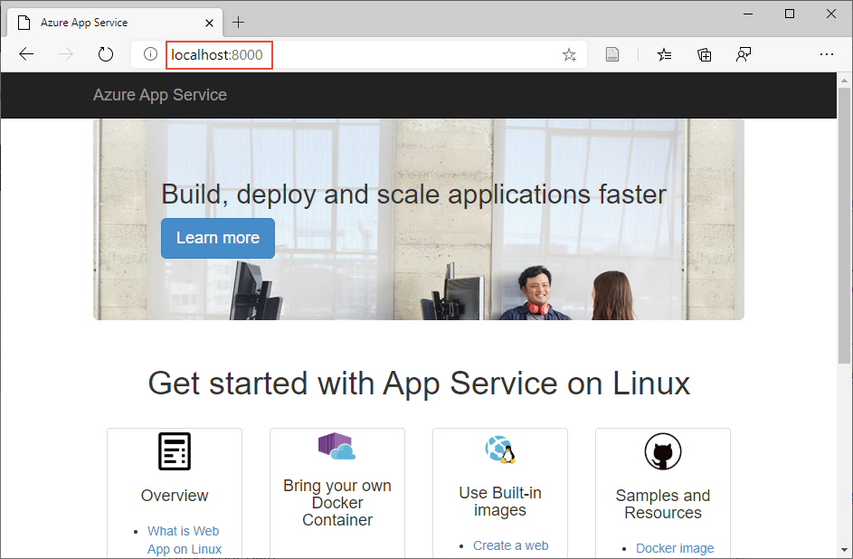
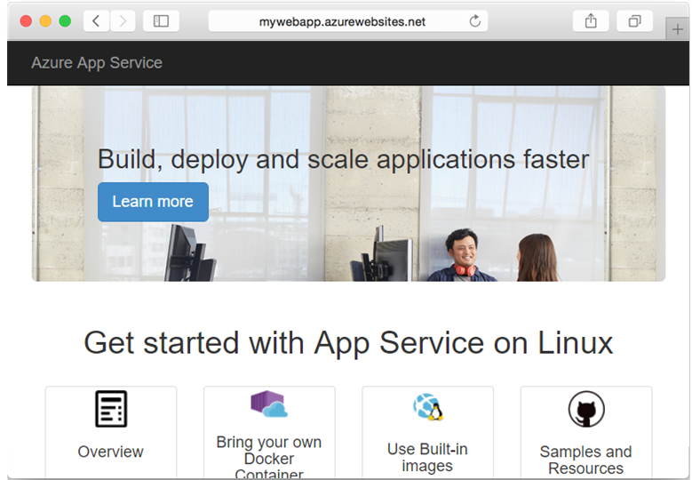

# Tutorial: Build a custom image and run in App Service from a private registry

[App Service](app-service-linux-intro.md) provides built-in Docker images on Linux with support for specific versions, such as PHP 7.3 and Node.js 10.14. App Service uses the Docker container technology to host both built-in images and custom images as a platform as a service. In this tutorial, you learn how to build a custom image and run it in App Service. This pattern is useful when the built-in images don't include your language of choice, or when your application requires a specific configuration that isn't provided within the built-in images.

In this tutorial, you learn how to:

> [!div class="checklist"]
> * Deploy a custom image to a private container registry
> * Run the custom image in App Service
> * Configure environment variables
> * Update and redeploy the image
> * Access diagnostic logs
> * Connect to the container using SSH

[!INCLUDE [Free trial note](../../../includes/quickstarts-free-trial-note.md)]

## Prerequisites

To complete this tutorial, you need:

* [Git](https://git-scm.com/downloads)
* [Docker](https://docs.docker.com/get-started/#setup)

## Download the sample

In a terminal window, run the following command to clone the sample app repository to your local machine, then change to the directory that contains the sample code.

```bash
git clone https://github.com/Azure-Samples/docker-django-webapp-linux.git --config core.autocrlf=input
cd docker-django-webapp-linux
```

## Build the image from the Docker file

In the Git repository, take a look at _Dockerfile_. This file describes the Python environment that is required to run your application. Additionally, the image sets up an [SSH](https://www.ssh.com/ssh/protocol/) server for secure communication between the container and the host.

```Dockerfile
FROM python:3.4

RUN mkdir /code
WORKDIR /code
ADD requirements.txt /code/
RUN pip install -r requirements.txt
ADD . /code/

# ssh
ENV SSH_PASSWD "root:Docker!"
RUN apt-get update \
        && apt-get install -y --no-install-recommends dialog \
        && apt-get update \
	&& apt-get install -y --no-install-recommends openssh-server \
	&& echo "$SSH_PASSWD" | chpasswd 

COPY sshd_config /etc/ssh/
COPY init.sh /usr/local/bin/
	
RUN chmod u+x /usr/local/bin/init.sh
EXPOSE 8000 2222
#CMD ["python", "/code/manage.py", "runserver", "0.0.0.0:8000"]
ENTRYPOINT ["init.sh"]
```

Build the Docker image with the `docker build` command.

```bash
docker build --tag mydockerimage .
```

Test that the build works by running the Docker container. Issue the [`docker run`](https://docs.docker.com/engine/reference/commandline/run/) command and pass the name and tag of the image to it. Be sure to specify the port using the `-p` argument.

```bash
docker run -p 8000:8000 mydockerimage
```

Verify the web app and container are functioning correctly by browsing to `http://localhost:8000`.



[!INCLUDE [Try Cloud Shell](../../../includes/cloud-shell-try-it.md)]

## Deploy app to Azure

To create an app that uses the image you just created, you run Azure CLI commands that create a resource group, pushes the image, and then creates the App Service plan web app to run it.

### Create a resource group

[!INCLUDE [Create resource group](../../../includes/app-service-web-create-resource-group-linux-no-h.md)] 

### Create an Azure Container Registry

In the Cloud Shell, use the [`az acr create`](/cli/azure/acr?view=azure-cli-latest#az-acr-create) command to create an Azure Container Registry.

```azurecli-interactive
az acr create --name <azure-container-registry-name> --resource-group myResourceGroup --sku Basic --admin-enabled true
```

### Sign in to Azure Container Registry

To push an image to the registry, you need to authenticate with the private registry. In the Cloud Shell, use the [`az acr show`](/cli/azure/acr?view=azure-cli-latest#az-acr-show) command to retrieve the credentials from the registry you created.

```azurecli-interactive
az acr credential show --name <azure-container-registry-name>
```

The output reveals two passwords along with the user name.

```json
<
  "passwords": [
    {
      "name": "password",
      "value": "{password}"
    },
    {
      "name": "password2",
      "value": "{password}"
    }
  ],
  "username": "<registry-username>"
}
```

From your local terminal window, sign in to the Azure Container Registry using the `docker login` command, as shown in the following example. Replace *\<azure-container-registry-name>* and *\<registry-username>* with values for your registry. When prompted, type in one of the passwords from the previous step.

```bash
docker login <azure-container-registry-name>.azurecr.io --username <registry-username>
```

Confirm that the login succeeds.

### Push image to Azure Container Registry

Tag your local image for the Azure Container Registry. For example:
```bash
docker tag mydockerimage <azure-container-registry-name>.azurecr.io/mydockerimage:v1.0.0
```

Push the image by using the `docker push` command. Tag the image with the name of the registry, followed by your image name and tag.

```bash
docker push <azure-container-registry-name>.azurecr.io/mydockerimage:v1.0.0
```

Back in the Cloud Shell, verify that the push is successful.

```azurecli-interactive
az acr repository list -n <azure-container-registry-name>
```

You should get the following output.

```json
[
  "mydockerimage"
]
```

### Create App Service plan

[!INCLUDE [Create app service plan](../../../includes/app-service-web-create-app-service-plan-linux-no-h.md)]

### Create web app

In the Cloud Shell, create a [web app](app-service-linux-intro.md) in the `myAppServicePlan` App Service plan with the [`az webapp create`](/cli/azure/webapp?view=azure-cli-latest#az-webapp-create) command. Replace _\<app-name>_ with a unique app name, and _\<azure-container-registry-name>_ with your registry name.

```azurecli-interactive
az webapp create --resource-group myResourceGroup --plan myAppServicePlan --name <app-name> --deployment-container-image-name <azure-container-registry-name>.azurecr.io/mydockerimage:v1.0.0
```

When the web app has been created, the Azure CLI shows output similar to the following example:

```json
{
  "availabilityState": "Normal",
  "clientAffinityEnabled": true,
  "clientCertEnabled": false,
  "cloningInfo": null,
  "containerSize": 0,
  "dailyMemoryTimeQuota": 0,
  "defaultHostName": "<app-name>.azurewebsites.net",
  "deploymentLocalGitUrl": "https://<username>@<app-name>.scm.azurewebsites.net/<app-name>.git",
  "enabled": true,
  < JSON data removed for brevity. >
}
```

### Configure registry credentials in web app

For App Service to pull the private image, it needs information about your registry and image. In the Cloud Shell, provide them with the [`az webapp config container set`](/cli/azure/webapp/config/container?view=azure-cli-latest#az-webapp-config-container-set) command. Replace *\<app-name>*, *\<azure-container-registry-name>*, _\<registry-username>_, and _\<password>_.

```azurecli-interactive
az webapp config container set --name <app-name> --resource-group myResourceGroup --docker-custom-image-name <azure-container-registry-name>.azurecr.io/mydockerimage:v1.0.0 --docker-registry-server-url https://<azure-container-registry-name>.azurecr.io --docker-registry-server-user <registry-username> --docker-registry-server-password <password>
```

> [!NOTE]
> When using a registry other than Docker Hub, `--docker-registry-server-url` must be formatted as `https://` followed by the fully qualified domain name of the registry.
>

### Configure environment variables

Most Docker images use custom environment variables, such as a port other than 80. You tell App Service about the port that your image uses by using the `WEBSITES_PORT` app setting. The GitHub page for the [Python sample in this tutorial](https://github.com/Azure-Samples/docker-django-webapp-linux) shows that you need to set `WEBSITES_PORT` to _8000_.

To set app settings, use the [`az webapp config appsettings set`](/cli/azure/webapp/config/appsettings?view=azure-cli-latest#az-webapp-config-appsettings-set) command in the Cloud Shell. App settings are case-sensitive and space-separated.

```azurecli-interactive
az webapp config appsettings set --resource-group myResourceGroup --name <app-name> --settings WEBSITES_PORT=8000
```

### Test the web app

Verify that the web app works by browsing to it (`http://<app-name>.azurewebsites.net`).

> [!NOTE]
> The first time you access the app, it may take some time because App Service needs to pull the entire image. If the browser times out, just refresh the page.



## Change web app and redeploy

In your local Git repository, open app/templates/app/index.html. Locate the first HTML element and change it to.

```python
<nav class="navbar navbar-inverse navbar-fixed-top">
    <div class="container">
      <div class="navbar-header">
        <a class="navbar-brand" href="#">Azure App Service - Updated Here!</a>
      </div>
    </div>
  </nav>
```

Once you've modified the Python file and saved it, you must rebuild and push the new Docker image. Then restart the web app for the changes to take effect. Use the same commands that you have previously used in this tutorial. You can refer to [Build the image from the Docker file](#build-the-image-from-the-docker-file) and [Push image to Azure Container Registry](#push-image-to-azure-container-registry). Test the web app by following the instructions in [Test the web app](#test-the-web-app).

## Access diagnostic logs

[!INCLUDE [Access diagnostic logs](../../../includes/app-service-web-logs-access-no-h.md)]

## Enable SSH connections

SSH enables secure communication between a container and a client. To enable SSH connection to your container, your custom image must be configured for it. Let's take a look at the sample repository that already has the necessary configuration.

* In the [Dockerfile](https://github.com/Azure-Samples/docker-django-webapp-linux/blob/master/Dockerfile), the following code installs the SSH server and also sets the sign-in credentials.

    ```Dockerfile
    ENV SSH_PASSWD "root:Docker!"
    RUN apt-get update \
            && apt-get install -y --no-install-recommends dialog \
            && apt-get update \
      && apt-get install -y --no-install-recommends openssh-server \
      && echo "$SSH_PASSWD" | chpasswd 
    ```

    > [!NOTE]
    > This configuration does not allow external connections to the container. SSH is available only through the Kudu/SCM Site. The Kudu/SCM site is authenticated with your Azure account.

* The [Dockerfile](https://github.com/Azure-Samples/docker-django-webapp-linux/blob/master/Dockerfile#L18) copies the [sshd_config](https://github.com/Azure-Samples/docker-django-webapp-linux/blob/master/sshd_config) file in the repository to the */etc/ssh/* directory.

    ```Dockerfile
    COPY sshd_config /etc/ssh/
    ```

* The [Dockerfile](https://github.com/Azure-Samples/docker-django-webapp-linux/blob/master/Dockerfile#L22) exposes port 2222 in the container. It is an internal port accessible only by containers within the bridge network of a private virtual network. 

    ```Dockerfile
    EXPOSE 8000 2222
    ```

* The [entry script](https://github.com/Azure-Samples/docker-django-webapp-linux/blob/master/init.sh#L5) starts the SSH server.

	  ```bash
	  #!/bin/bash
	  service ssh start
    ```

### Open SSH connection to container

SSH connection is available only through the Kudu site, which is accessible at `https://<app-name>.scm.azurewebsites.net`.

To connect, browse to `https://<app-name>.scm.azurewebsites.net/webssh/host` and sign in with your Azure account.

You are then redirected to a page displaying an interactive console.

You may wish to verify that certain applications are running in the container. To inspect the container and verify running processes, issue the `top` command at the prompt.

```bash
top
```

The `top` command exposes all running processes in a container.

```
PID USER      PR  NI    VIRT    RES    SHR S %CPU %MEM     TIME+ COMMAND
 1 root      20   0  945616  35372  15348 S  0.0  2.1   0:04.63 node
20 root      20   0   55180   2776   2516 S  0.0  0.2   0:00.00 sshd
42 root      20   0  944596  33340  15352 S  0.0  1.9   0:05.80 node /opt/s+
56 root      20   0   59812   5244   4512 S  0.0  0.3   0:00.93 sshd
58 root      20   0   20228   3128   2664 S  0.0  0.2   0:00.00 bash
62 root      20   0   21916   2272   1944 S  0.0  0.1   0:03.15 top
63 root      20   0   59812   5344   4612 S  0.0  0.3   0:00.03 sshd
65 root      20   0   20228   3140   2672 S  0.0  0.2   0:00.00 bash
71 root      20   0   59812   5380   4648 S  0.0  0.3   0:00.02 sshd
73 root      20   0   20228   3160   2696 S  0.0  0.2   0:00.00 bash
77 root      20   0   21920   2304   1972 R  0.0  0.1   0:00.00 top
```

Congratulations! You've configured a custom Linux container in App Service.

[!INCLUDE [Clean-up section](../../../includes/cli-script-clean-up.md)]

## Next steps

What you learned:

> [!div class="checklist"]
> * Deploy a custom image to a private container registry
> * Run the custom image in App Service
> * Configure environment variables
> * Update and redeploy the image
> * Access diagnostic logs
> * Connect to the container using SSH

Advance to the next tutorial to learn how to map a custom DNS name to your app.

> [!div class="nextstepaction"]
> [Tutorial: Map custom DNS name to your app](../app-service-web-tutorial-custom-domain.md)

Or, check out other resources:

> [!div class="nextstepaction"]
> [Configure custom container](configure-custom-container.md)

> [!div class="nextstepaction"]
> [Tutorial: Multi-container WordPress app](tutorial-multi-container-app.md)
