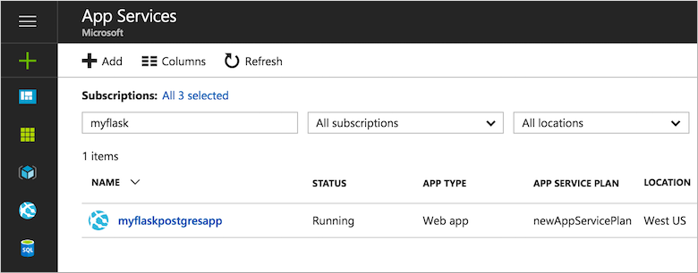

# Build a Docker Python and PostgreSQL web app in Azure

Web App for Containers provides a highly scalable, self-patching web hosting service. This tutorial shows how to create a data-driven Python web app, using PostgreSQL as the database back end. When you are done, you have a Python Flask application running within a Docker container on [App Service on Linux](app-service-linux-intro.md).


In this tutorial, you learn how to:

> [!div class="checklist"]
> * Create a PostgreSQL database in Azure
> * Connect a Python app to PostgreSQL
> * Deploy the app to Azure
> * Update the data model and redeploy the app
> * Manage the app in the Azure portal

You can follow the steps in this article on macOS. Linux and Windows instructions are the same in most cases, but the differences are not detailed in this tutorial.
 
[!INCLUDE [quickstarts-free-trial-note](../../../includes/quickstarts-free-trial-note.md)]

## Prerequisites

To complete this tutorial:

1. [Install Git](https://git-scm.com/)
1. [Install Python](https://www.python.org/downloads/)
1. [Install and run PostgreSQL](https://www.postgresql.org/download/)
1. [Install Docker Community Edition](https://www.docker.com/community-edition)

## Test local PostgreSQL installation and create a database

In a local terminal window, run `psql` to connect to your local PostgreSQL server.

```bash
sudo -u postgres psql
```

If your connection is successful, your PostgreSQL database is running. If not, make sure that your local PostgresQL database is started by following the steps at [Downloads - PostgreSQL Core Distribution](https://www.postgresql.org/download/).

Create a database called *eventregistration* and set up a separate database user named *manager* with password *supersecretpass*.

```sql
CREATE DATABASE eventregistration;
CREATE USER manager WITH PASSWORD 'supersecretpass';
GRANT ALL PRIVILEGES ON DATABASE eventregistration TO manager;
```

Type `\q` to exit the PostgreSQL client. 

<a name="step2"></a>

## Create local Python app

In this step, you set up the local Python Flask project.

### Clone the sample app

Open the terminal window, and `CD` to a working directory.

Run the following commands to clone the sample repository and go to the *0.1-initialapp* release.

```bash
git clone https://github.com/Azure-Samples/docker-flask-postgres.git
cd docker-flask-postgres
git checkout tags/0.1-initialapp
```

This sample repository contains a [Flask](http://flask.pocoo.org/) application. 

### Run the app locally

Install the required packages and start the application.

```bash
pip install virtualenv
virtualenv venv
source venv/bin/activate
pip install -r requirements.txt
cd app
FLASK_APP=app.py DBHOST="localhost" DBUSER="manager" DBNAME="eventregistration" DBPASS="supersecretpass" flask db upgrade
FLASK_APP=app.py DBHOST="localhost" DBUSER="manager" DBNAME="eventregistration" DBPASS="supersecretpass" flask run
```

When the app is fully loaded, you see something similar to the following message:

```bash
INFO  [alembic.runtime.migration] Context impl PostgresqlImpl.
INFO  [alembic.runtime.migration] Will assume transactional DDL.
INFO  [alembic.runtime.migration] Running upgrade  -> 791cd7d80402, empty message
 * Serving Flask app "app"
 * Running on http://127.0.0.1:5000/ (Press CTRL+C to quit)
```

Navigate to `http://localhost:5000` in a browser. Click **Register!** and create a test user.


The Flask sample application stores user data in the database. If you are successful at registering a user, your app is writing data to the local PostgreSQL database.

To stop the Flask server at anytime, type Ctrl+C in the terminal. 

[!INCLUDE [cloud-shell-try-it.md](../../../includes/cloud-shell-try-it.md)]

## Create a production PostgreSQL database

In this step, you create a PostgreSQL database in Azure. When your app is deployed to Azure, it uses this cloud database.

[!INCLUDE [cloud-shell-try-it.md](../../../includes/cloud-shell-try-it.md)]

### Create a resource group

[!INCLUDE [Create resource group](../../../includes/app-service-web-create-resource-group-linux-no-h.md)] 

### Create an Azure Database for PostgreSQL server

Create a PostgreSQL server with the [`az postgres server create`](/cli/azure/postgres/server?view=azure-cli-latest#az-postgres-server-create) command in the Cloud Shell.

In the following example command, replace *\<postgresql_name>* with a unique server name, and replace *\<admin_username>* and *\<admin_password>* with the desired user credentials. The server name is used as part of your PostgreSQL endpoint (`https://<postgresql_name>.postgres.database.azure.com`), so the name needs to be unique across all servers in Azure. The user credentials are for the database admin user account. 

```azurecli-interactive
az postgres server create --resource-group myResourceGroup --name <postgresql_name> --location "West Europe" --admin-user <admin_username> --admin-password <admin_password> --sku-name GP_Gen4_2
```

When the Azure Database for PostgreSQL server is created, the Azure CLI shows information similar to the following example:

```json
{
  "administratorLogin": "<admin_username>",
  "fullyQualifiedDomainName": "<postgresql_name>.postgres.database.azure.com",
  "id": "/subscriptions/00000000-0000-0000-0000-000000000000/resourceGroups/myResourceGroup/providers/Microsoft.DBforPostgreSQL/servers/<postgresql_name>",
  "location": "westus",
  "name": "<postgresql_name>",
  "resourceGroup": "myResourceGroup",
  "sku": {
    "capacity": 100,
    "family": null,
    "name": "PGSQLS3M100",
    "size": null,
    "tier": "Basic"
  },
  "sslEnforcement": null,
  "storageMb": 2048,
  "tags": null,
  "type": "Microsoft.DBforPostgreSQL/servers",
  "userVisibleState": "Ready",
  "version": null
}
```

### Create a firewall rule for the PostgreSQL server

In the Cloud Shell, run the following Azure CLI command to allow access to the database from all IP addresses. 
> [!Note]
> It is not advised to leave all ports open to your database, or to make your database internet-facing.  See other [Azure security articles](https://docs.microsoft.com/azure/security/) to properly secure your new database for production use.  

```azurecli-interactive
az postgres server firewall-rule create --resource-group myResourceGroup --server-name <postgresql_name> --start-ip-address=0.0.0.0 --end-ip-address=0.0.0.0 --name AllowAzureIPs
```

> [!TIP] 
> You can be even more restrictive in your firewall rule by [using only the outbound IP addresses your app uses](../app-service-ip-addresses.md?toc=%2fazure%2fapp-service%2fcontainers%2ftoc.json#find-outbound-ips).
>

In the Cloud Shell, run the command again to allow access to the database from your local computer by replacing *\<you_ip_address>* with [your local IPv4 IP address](https://whatismyipaddress.com/). 

```azurecli-interactive
az postgres server firewall-rule create --resource-group myResourceGroup --server-name <postgresql_name> --start-ip-address=<you_ip_address> --end-ip-address=<you_ip_address> --name AllowLocalClient
```

## Connect Python app to production database

In this step, you connect your Flask sample app to the Azure Database for PostgreSQL server you created.

### Create empty database and user access

In the Cloud Shell, connect to the database by running `psql`. When prompted for your admin password, use the same password you specified in [Create an Azure Database for PostgreSQL server](#create-an-azure-database-for-postgresql-server).

```bash
psql -h <postgresql_name>.postgres.database.azure.com -U <my_admin_username>@<postgresql_name> postgres
```

Create the database and user from the PostgreSQL CLI.

```bash
CREATE DATABASE eventregistration;
CREATE USER manager WITH PASSWORD 'supersecretpass';
GRANT ALL PRIVILEGES ON DATABASE eventregistration TO manager;
```

Type `\q` to exit the PostgreSQL client.

### Test app connectivity to production database

Back in the local terminal window, run the following commands to run Flask database migration and the Flask server.

```bash
FLASK_APP=app.py DBHOST="<postgresql_name>.postgres.database.azure.com" DBUSER="manager@<postgresql_name>" DBNAME="eventregistration" DBPASS="supersecretpass" flask db upgrade
FLASK_APP=app.py DBHOST="<postgresql_name>.postgres.database.azure.com" DBUSER="manager@<postgresql_name>" DBNAME="eventregistration" DBPASS="supersecretpass" flask run
```

When the app is fully loaded, you see something similar to the following message:

```bash
INFO  [alembic.runtime.migration] Context impl PostgresqlImpl.
INFO  [alembic.runtime.migration] Will assume transactional DDL.
INFO  [alembic.runtime.migration] Running upgrade  -> 791cd7d80402, empty message
 * Serving Flask app "app"
 * Running on http://127.0.0.1:5000/ (Press CTRL+C to quit)
```

Navigate to http://localhost:5000 in a browser. Click **Register!** and create a test registration. You are now writing data to the database in Azure.


## Upload app to a container registry

In this step, you create a Docker image and upload it to Azure Container Registry. You can also use popular registries like Docker Hub.

### Build the Docker image and test it

In the local terminal window, build the Docker image.

```bash
cd ..
docker build -t flask-postgresql-sample .
```

Docker displays a confirmation that it successfully created the image.

```bash
Successfully built 7548f983a36b
```

In the repository root, add an environment variable file called _db.env_, and then add the following database environment variables to it. The app connects to the Azure Database for PostgreSQL production database.

```text
DBHOST=<postgresql_name>.postgres.database.azure.com
DBUSER=manager@<postgresql_name>
DBNAME=eventregistration
DBPASS=supersecretpass
```

Run the image locally in a Docker container. The following command specifies the environment variable file and maps the default Flask port 5000 to local port 5000.

```bash
docker run -it --env-file db.env -p 5000:5000 flask-postgresql-sample
```

The output is similar to what you saw earlier. However, the initial database migration no longer needs to be performed and therefore is skipped.

```bash
INFO  [alembic.runtime.migration] Context impl PostgresqlImpl.
INFO  [alembic.runtime.migration] Will assume transactional DDL.
 * Serving Flask app "app"
 * Running on http://0.0.0.0:5000/ (Press CTRL+C to quit)
```

The database already contains the registration you created previously.


Now that you verified that the container works locally, delete _db.env_. In Azure App Service, you will use app settings to define the environment variables.  

### Create an Azure Container Registry

In the Cloud Shell, create a registry in Azure Container Registry with the following command. Replace *\<registry_name>* with a unique registry name.

```azurecli-interactive
az acr create --name <registry_name> --resource-group myResourceGroup --location "West US" --sku Basic
```

### Retrieve registry credentials

In the Cloud Shell, run the following commands to retrieve the registry credentials. You need them to push and pull the images.

```azurecli-interactive
az acr update --name <registry_name> --admin-enabled true
az acr credential show -n <registry_name>
```

In the output, you see two passwords. Make note of the username (which is the registry name by default) and the first password.

```json
{
  "passwords": [
    {
      "name": "password",
      "value": "<registry_password>"
    },
    {
      "name": "password2",
      "value": "<registry_password2>"
    }
  ],
  "username": "<registry_name>"
}
```

### Upload Docker image to registry

From the local terminal window, sign in to your new registry with `docker`. When prompted, supply the password you retrieved.

```bash
docker login <registry_name>.azurecr.io -u <registry_name>
```

Push your Docker image to the registry.

```bash
docker tag flask-postgresql-sample <registry_name>.azurecr.io/flask-postgresql-sample
docker push <registry_name>.azurecr.io/flask-postgresql-sample
```

## Create web app with uploaded image

In this step, you create an app in Azure App Service and configure it to use the uploaded Docker image in Azure Container Registry.

### Create an App Service plan

[!INCLUDE [Create app service plan](../../../includes/app-service-web-create-app-service-plan-linux-no-h.md)]

### Create a web app

In the Cloud Shell, create a web app in the *myAppServicePlan* App Service plan with the [`az webapp create`](/cli/azure/webapp?view=azure-cli-latest#az-webapp-create) command.

In the following command, replace the *\<app_name>* placeholder with a unique app name. This name is part of the default URL for the web app, so the name needs to be unique across all apps in Azure App Service.

```azurecli-interactive
az webapp create --name <app_name> --resource-group myResourceGroup --plan myAppServicePlan --deployment-container-image-name "<registry_name>.azurecr.io/flask-postgresql-sample"
```

When the web app has been created, the Azure CLI shows information similar to the following example:

```json
{
  "availabilityState": "Normal",
  "clientAffinityEnabled": true,
  "clientCertEnabled": false,
  "cloningInfo": null,
  "containerSize": 0,
  "dailyMemoryTimeQuota": 0,
  "defaultHostName": "<app_name>.azurewebsites.net",
  "enabled": true,
  ...
  < Output has been truncated for readability >
}
```

### Configure environment variables

Earlier in the tutorial, you defined environment variables to connect to your PostgreSQL database.

In App Service, you set environment variables as _app settings_ by using the [`az webapp config appsettings set`](/cli/azure/webapp/config/appsettings?view=azure-cli-latest#az-webapp-config-appsettings-set) command.

The following example specifies the database connection details as app settings. It also uses the *WEBSITES_PORT* variable to the container port 5000, which allows the container to receive HTTP traffic on port 80.

```azurecli-interactive
az webapp config appsettings set --name <app_name> --resource-group myResourceGroup --settings DBHOST="<postgresql_name>.postgres.database.azure.com" DBUSER="manager@<postgresql_name>" DBPASS="supersecretpass" DBNAME="eventregistration" WEBSITES_PORT=5000
```

### Configure custom container deployment

Even though you already specified the container image name, you still need to specify the custom registry URL and the user credentials. In the Cloud Shell, run the [az webapp config container set](/cli/azure/webapp/config/container?view=azure-cli-latest#az-webapp-config-container-set) command.

```azurecli-interactive
az webapp config container set --resource-group myResourceGroup --name <app_name> --docker-registry-server-user "<registry_name>" --docker-registry-server-password "<registry_password>" --docker-registry-server-url "https://<registry_name>.azurecr.io"
```

In the Cloud Shell, restart the app. Restarting ensures that all settings are applied and the latest container is pulled from the registry.

```azurecli-interactive
az webapp restart --resource-group myResourceGroup --name <app_name>
```

### Browse to the Azure web app 

Browse to the deployed web app. 

```bash 
http://<app_name>.azurewebsites.net 
```

> [!NOTE]
> The web app takes some time to start because the container has to be downloaded and run when the app is requested the first time. If at first you see an error after a long time, just refresh the page.

You see previously registered guests that were saved to the Azure production database in the previous step.


**Congratulations!** You're running a Python app in Web App for Containers.

## Update data model and redeploy

In this step, you add the number of attendees to each event registration by updating the `Guest` model.

In the local terminal window, check out the *0.2-migration* release with the following git command:

```bash
git checkout tags/0.2-migration
```

This release already made the necessary changes to the model, views, and controllers. It also includes a database migration generated via *alembic* (`flask db migrate`). You can see all changes made via the following git command:

```bash
git diff 0.1-initialapp 0.2-migration
```

### Test your changes locally

In the local terminal window, run the following commands to test your changes locally by running the flask server.

```bash
source venv/bin/activate
cd app
FLASK_APP=app.py DBHOST="<postgresql_name>.postgres.database.azure.com" DBUSER="manager@<postgresql_name>" DBNAME="eventregistration" DBPASS="supersecretpass" flask db upgrade
FLASK_APP=app.py DBHOST="<postgresql_name>.postgres.database.azure.com" DBUSER="manager@<postgresql_name>" DBNAME="eventregistration" DBPASS="supersecretpass" flask run
```

Navigate to http://localhost:5000 in your browser to view the changes. Create a test registration.


### Publish changes to Azure

In the local terminal window, build the new docker image and push it to your registry.

```bash
cd ..
docker build -t flask-postgresql-sample .
docker tag flask-postgresql-sample <registry_name>.azurecr.io/flask-postgresql-sample
docker push <registry_name>.azurecr.io/flask-postgresql-sample
```

In the Cloud Shell, restart the app to make sure the latest container is pulled from the registry.

```azurecli-interactive
az webapp restart --resource-group myResourceGroup --name <app_name>
```

Navigate to your Azure web app and try out the new functionality again. Create another event registration.

```bash 
http://<app_name>.azurewebsites.net 
```


## Manage your Azure web app

Go to the [Azure portal](https://portal.azure.com) to see the web app you created.

From the left menu, click **App Services**, then click the name of your Azure web app.



By default, the portal shows your web app's **Overview** page. This page gives you a view of how your app is doing. Here, you can also perform basic management tasks like browse, stop, start, restart, and delete. The tabs on the left side of the page show the different configuration pages you can open.


## Next steps

Advance to the next tutorial to learn how to map a custom DNS name to your web app.

> [!div class="nextstepaction"]
> [Map an existing custom DNS name to Azure Web Apps](../app-service-web-tutorial-custom-domain.md)
