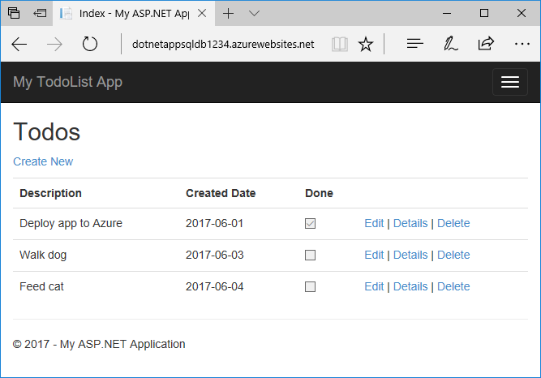

# Tutorial: Build an ASP.NET Core and SQL Database app in Azure App Service on Linux

> [!NOTE]
> This article deploys an app to App Service on Linux. To deploy to App Service on _Windows_, see [Build a .NET Core and SQL Database app in Azure App Service](../app-service-web-tutorial-dotnetcore-sqldb.md).

[App Service on Linux](app-service-linux-intro.md) provides a highly scalable, self-patching web hosting service using the Linux operating system. This tutorial shows how to create a .NET Core app and connect it to a SQL Database. When you're done, you'll have a .NET Core MVC app running in App Service on Linux.


In this tutorial, you learn how to:

> [!div class="checklist"]
>
> * Create a database in Azure SQL Database
> * Connect a .NET Core app to SQL Database
> * Deploy the app to Azure
> * Update the data model and redeploy the app
> * Stream diagnostic logs from Azure
> * Manage the app in the Azure portal

[!INCLUDE [quickstarts-free-trial-note](../../../includes/quickstarts-free-trial-note.md)]

## Prerequisites

To complete this tutorial:

* [Install Git](https://git-scm.com/)
* [Install .NET Core SDK 2.2](https://dotnet.microsoft.com/download/dotnet-core/2.2)

## Create local .NET Core app

In this step, you set up the local .NET Core project.

### Clone the sample application

In the terminal window, `cd` to a working directory.

Run the following commands to clone the sample repository and change to its root.

```bash
git clone https://github.com/azure-samples/dotnetcore-sqldb-tutorial
cd dotnetcore-sqldb-tutorial
```

The sample project contains a basic CRUD (create-read-update-delete) app using [Entity Framework Core](https://docs.microsoft.com/ef/core/).

### Run the application

Run the following commands to install the required packages, run database migrations, and start the application.

```bash
dotnet tool install -g dotnet-ef
dotnet ef database update
dotnet run
```

Navigate to `http://localhost:5000` in a browser. Select the **Create New** link and create a couple _to-do_ items.


To stop .NET Core at any time, press `Ctrl+C` in the terminal.

[!INCLUDE [cloud-shell-try-it.md](../../../includes/cloud-shell-try-it.md)]

## Create a database in Azure SQL Database

In this step, you create a database in [Azure SQL Database](/azure/sql-database/). When your app is deployed to Azure, it uses this database.

### Create a resource group

[!INCLUDE [Create resource group](../../../includes/app-service-web-create-resource-group-linux-no-h.md)]

### Create a server in Azure SQL Database

In the Cloud Shell, create a [server](../../azure-sql/database/logical-servers.md) in Azure SQL Database with the [`az sql server create`](/cli/azure/sql/server?view=azure-cli-latest#az-sql-server-create) command. A server is a logical construct that contains a group of databases managed as a group.

Replace the *\<server-name>* placeholder with a *unique* SQL Database name. This name is used as the part of the globally unique SQL Database endpoint, `<server-name>.database.windows.net`. Valid characters are `a`-`z`, `0`-`9`, `-`. Also, replace *\<db-username>* and *\<db-password>* with a username and password of your choice.

```azurecli-interactive
az sql server create --name <server-name> --resource-group myResourceGroup --location "West Europe" --admin-user <db-username> --admin-password <db-password>
```

When the server is created, the Azure CLI shows information similar to the following example:

<pre>
{
  "administratorLogin": "&lt;db-username&gt;",
  "administratorLoginPassword": null,
  "fullyQualifiedDomainName": "&lt;server-name&gt;.database.windows.net",
  "id": "/subscriptions/00000000-0000-0000-0000-000000000000/resourceGroups/myResourceGroup/providers/Microsoft.Sql/servers/&lt;server-name&gt;",
  "identity": null,
  "kind": "v12.0",
  "location": "westeurope",
  "name": "&lt;server-name&gt;",
  "resourceGroup": "myResourceGroup",
  "state": "Ready",
  "tags": null,
  "type": "Microsoft.Sql/servers",
  "version": "12.0"
}
</pre>

### Configure a server firewall rule

Create a [server-level firewall rule](../../azure-sql/database/firewall-configure.md) using the [`az sql server firewall create`](/cli/azure/sql/server/firewall-rule?view=azure-cli-latest#az-sql-server-firewall-rule-create) command. When both starting IP and end IP are set to 0.0.0.0, the firewall is only opened for other Azure resources.

```azurecli-interactive
az sql server firewall-rule create --resource-group myResourceGroup --server <server-name> --name AllowAzureIps --start-ip-address 0.0.0.0 --end-ip-address 0.0.0.0
```

> [!TIP]
> You can be even more restrictive in your firewall rule by [using only the outbound IP addresses your app uses](../overview-inbound-outbound-ips.md#find-outbound-ips).

In the Cloud Shell, run the command again to allow access from your local computer by replacing *\<your-ip-address>* with [your local IPv4 IP address](https://www.whatsmyip.org/).

```azurecli-interactive
az sql server firewall-rule create --name AllowLocalClient --server <mysql_server_name> --resource-group myResourceGroup --start-ip-address=<your-ip-address> --end-ip-address=<your-ip-address>
```

### Create a database in Azure SQL Database

Create a database with an [S0 performance level](../../azure-sql/database/service-tiers-dtu.md) in the server using the [`az sql db create`](/cli/azure/sql/db?view=azure-cli-latest#az-sql-db-create) command.

```azurecli-interactive
az sql db create --resource-group myResourceGroup --server <server-name> --name coreDB --service-objective S0
```

### Create connection string

Get the connection string using the [`az sql db show-connection-string`](/cli/azure/sql/db?view=azure-cli-latest#az-sql-db-show-connection-string) command.

```azurecli-interactive
az sql db show-connection-string --client ado.net --server cephalin-core --name coreDB
```

In the command output, replace *\<username>*, and *\<password>* with the database administrator credentials you used earlier.

This is the connection string for your .NET Core app. Copy it for use later.

### Configure app to connect to production database

In your local repository, open Startup.cs and find the following code:

```csharp
services.AddDbContext<MyDatabaseContext>(options =>
        options.UseSqlite("Data Source=localdatabase.db"));
```

Replace it with the following code.

```csharp
services.AddDbContext<MyDatabaseContext>(options =>
        options.UseSqlServer(Configuration.GetConnectionString("MyDbConnection")));
```

> [!IMPORTANT]
> For production apps that need to scale out, follow the best practices in [Applying migrations in production](/aspnet/core/data/ef-rp/migrations#applying-migrations-in-production).

### Run database migrations to the production database

Your app currently connects to a local Sqlite database. Now that you configured a database in Azure, recreate the initial migration to target it.

From the repository root, run the following commands. Replace *\<connection-string>* with the connection string you created earlier.

```
# Delete old migrations
rm Migrations -r
# Recreate migrations
dotnet ef migrations add InitialCreate

# Set connection string to production database
# PowerShell
$env:ConnectionStrings:MyDbConnection="<connection-string>"
# CMD (no quotes)
set ConnectionStrings:MyDbConnection=<connection-string>
# Bash
export ConnectionStrings__MyDbConnection="<connection-string>"

# Run migrations
dotnet ef database update
```

### Run app with new configuration

Now that database migrations is run on the production database, test your app by running:

```
dotnet run
```

Navigate to `http://localhost:5000` in a browser. Select the **Create New** link and create a couple _to-do_ items. Your app is now reading and writing data to the production database.

Commit your local changes, then commit it into your Git repository.

```bash
git add .
git commit -m "connect to SQLDB in Azure"
```

You're now ready to deploy your code.

## Deploy app to Azure

In this step, you deploy your SQL Database-connected .NET Core application to App Service on Linux.

### Configure local git deployment

[!INCLUDE [Configure a deployment user](../../../includes/configure-deployment-user-no-h.md)]

### Create an App Service plan

[!INCLUDE [Create app service plan](../../../includes/app-service-web-create-app-service-plan-linux-no-h.md)]

### Create a web app

[!INCLUDE [Create web app](../../../includes/app-service-web-create-web-app-dotnetcore-linux-no-h.md)]

### Configure connection string

To set connection strings for your Azure app, use the [`az webapp config appsettings set`](/cli/azure/webapp/config/appsettings?view=azure-cli-latest#az-webapp-config-appsettings-set) command in the Cloud Shell. In the following command, replace *\<app-name>*, as well as the *\<connection-string>* parameter with the connection string you created earlier.

```azurecli-interactive
az webapp config connection-string set --resource-group myResourceGroup --name <app-name> --settings MyDbConnection="<connection-string>" --connection-string-type SQLAzure
```

In ASP.NET Core, you can use this named connection string (`MyDbConnection`) using the standard pattern, like any connection string specified in *appsettings.json*. In this case, `MyDbConnection` is also defined in your *appsettings.json*. When running in App Service, the connection string defined in App Service takes precedence over the connection string defined in your *appsettings.json*. The code uses the *appsettings.json* value during local development, and the same code uses the App Service value when deployed.

To see how the connection string is referenced in your code, see [Configure app to connect to production database](#configure-app-to-connect-to-production-database).

### Push to Azure from Git

[!INCLUDE [push-to-azure-no-h](../../../includes/app-service-web-git-push-to-azure-no-h.md)]

<pre>
Enumerating objects: 273, done.
Counting objects: 100% (273/273), done.
Delta compression using up to 4 threads
Compressing objects: 100% (175/175), done.
Writing objects: 100% (273/273), 1.19 MiB | 1.85 MiB/s, done.
Total 273 (delta 96), reused 259 (delta 88)
remote: Resolving deltas: 100% (96/96), done.
remote: Deploy Async
remote: Updating branch 'master'.
remote: Updating submodules.
remote: Preparing deployment for commit id 'cccecf86c5'.
remote: Repository path is /home/site/repository
remote: Running oryx build...
remote: Build orchestrated by Microsoft Oryx, https://github.com/Microsoft/Oryx
remote: You can report issues at https://github.com/Microsoft/Oryx/issues
remote: .
remote: .
remote: .
remote: Done.
remote: Running post deployment command(s)...
remote: Triggering recycle (preview mode disabled).
remote: Deployment successful.
remote: Deployment Logs : 'https://&lt;app-name&gt;.scm.azurewebsites.net/newui/jsonviewer?view_url=/api/deployments/cccecf86c56493ffa594e76ea1deb3abb3702d89/log'
To https://&lt;app-name&gt;.scm.azurewebsites.net/&lt;app-name&gt;.git
 * [new branch]      master -> master
</pre>

### Browse to the Azure app

Browse to the deployed app using your web browser.

```bash
http://<app-name>.azurewebsites.net
```

Add a few to-do items.


**Congratulations!** You're running a data-driven .NET Core app in App Service on Linux.

## Update locally and redeploy

In this step, you make a change to your database schema and publish it to Azure.

### Update your data model

Open _Models/Todo.cs_ in the code editor. Add the following property to the `ToDo` class:

```csharp
public bool Done { get; set; }
```

### Rerun database migrations

Run a few commands to make updates to the production database.

```bash
dotnet ef migrations add AddProperty
dotnet ef database update
```

> [!NOTE]
> If you open a new terminal window, you need to set the connection string to the production database in the terminal, like you did in [Run database migrations to the production database](#run-database-migrations-to-the-production-database).
>

### Use the new property

Make some changes in your code to use the `Done` property. For simplicity in this tutorial, you're only going to change the `Index` and `Create` views to see the property in action.

Open _Controllers/TodosController.cs_.

Find the `Create([Bind("ID,Description,CreatedDate")] Todo todo)` method and add `Done` to the list of properties in the `Bind` attribute. When you're done, your `Create()` method signature looks like the following code:

```csharp
public async Task<IActionResult> Create([Bind("ID,Description,CreatedDate,Done")] Todo todo)
```

Open _Views/Todos/Create.cshtml_.

In the Razor code, you should see a `<div class="form-group">` element for `Description`, and then another `<div class="form-group">` element for `CreatedDate`. Immediately following these two elements, add another `<div class="form-group">` element for `Done`:

```csharp
<div class="form-group">
    <label asp-for="Done" class="col-md-2 control-label"></label>
    <div class="col-md-10">
        <input asp-for="Done" class="form-control" />
        <span asp-validation-for="Done" class="text-danger"></span>
    </div>
</div>
```

Open _Views/Todos/Index.cshtml_.

Search for the empty `<th></th>` element. Just above this element, add the following Razor code:

```csharp
<th>
    @Html.DisplayNameFor(model => model.Done)
</th>
```

Find the `<td>` element that contains the `asp-action` tag helpers. Just above this element, add the following Razor code:

```csharp
<td>
    @Html.DisplayFor(modelItem => item.Done)
</td>
```

That's all you need to see the changes in the `Index` and `Create` views.

### Test your changes locally

Run the app locally.

```bash
dotnet run
```

> [!NOTE]
> If you open a new terminal window, you need to set the connection string to the production database in the terminal, like you did in [Run database migrations to the production database](#run-database-migrations-to-the-production-database).
>

In your browser, navigate to `http://localhost:5000/`. You can now add a to-do item and check **Done**. Then it should show up in your homepage as a completed item. Remember that the `Edit` view doesn't show the `Done` field, because you didn't change the `Edit` view.

### Publish changes to Azure

```bash
git add .
git commit -m "added done field"
git push azure master
```

Once the `git push` is complete, navigate to your App Service app and try adding a to-do item and check **Done**.



All your existing to-do items are still displayed. When you republish your ASP.NET Core app, existing data in your SQL Database isn't lost. Also, Entity Framework Core Migrations only changes the data schema and leaves your existing data intact.

## Stream diagnostic logs

While the ASP.NET Core app runs in Azure App Service, you can get the console logs piped to the Cloud Shell. That way, you can get the same diagnostic messages to help you debug application errors.

The sample project already follows the guidance at [ASP.NET Core Logging in Azure](https://docs.microsoft.com/aspnet/core/fundamentals/logging#azure-app-service-provider) with two configuration changes:

* Includes a reference to `Microsoft.Extensions.Logging.AzureAppServices` in *DotNetCoreSqlDb.csproj*.
* Calls `loggerFactory.AddAzureWebAppDiagnostics()` in *Program.cs*.

To set the ASP.NET Core [log level](https://docs.microsoft.com/aspnet/core/fundamentals/logging#log-level) in App Service to `Information` from the default level `Error`, use the [`az webapp log config`](/cli/azure/webapp/log?view=azure-cli-latest#az-webapp-log-config) command in the Cloud Shell.

```azurecli-interactive
az webapp log config --name <app-name> --resource-group myResourceGroup --application-logging true --level information
```

> [!NOTE]
> The project's log level is already set to `Information` in *appsettings.json*.

To start log streaming, use the [`az webapp log tail`](/cli/azure/webapp/log?view=azure-cli-latest#az-webapp-log-tail) command in the Cloud Shell.

```azurecli-interactive
az webapp log tail --name <app-name> --resource-group myResourceGroup
```

Once log streaming has started, refresh the Azure app in the browser to get some web traffic. You can now see console logs piped to the terminal. If you don't see console logs immediately, check again in 30 seconds.

To stop log streaming at any time, type `Ctrl`+`C`.

For more information on customizing the ASP.NET Core logs, see [Logging in ASP.NET Core](https://docs.microsoft.com/aspnet/core/fundamentals/logging).

## Manage your Azure app

Go to the [Azure portal](https://portal.azure.com) to see the app you created.

From the left menu, click **App Services**, then click the name of your Azure app.


By default, the portal shows your app's **Overview** page. This page gives you a view of how your app is doing. Here, you can also perform basic management tasks like browse, stop, start, restart, and delete. The tabs on the left side of the page show the different configuration pages you can open.


[!INCLUDE [cli-samples-clean-up](../../../includes/cli-samples-clean-up.md)]

<a name="next"></a>

## Next steps

What you learned:

> [!div class="checklist"]
>
> * Create a database in Azure SQL Database
> * Connect a .NET Core app to SQL Database
> * Deploy the app to Azure
> * Update the data model and redeploy the app
> * Stream logs from Azure to your terminal
> * Manage the app in the Azure portal

Advance to the next tutorial to learn how to map a custom DNS name to your app.

> [!div class="nextstepaction"]
> [Tutorial: Map custom DNS name to your app](../app-service-web-tutorial-custom-domain.md)

Or, check out other resources:

> [!div class="nextstepaction"]
> [Configure ASP.NET Core app](configure-language-dotnetcore.md)
