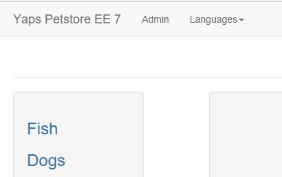

# Tutorial: Build a Java EE and Postgres web app in Azure

This tutorial shows you how to create a Java Enterprise Edition (EE) web app on Azure App Service and connect it to a Postgres database. When you are finished, you will have a [WildFly](https://www.wildfly.org/about/) application storing data in [Azure Database for Postgres](https://azure.microsoft.com/services/postgresql/) running on Azure [App Service on Linux](app-service-linux-intro.md).

In this tutorial, you learn how to:
> [!div class="checklist"]
> * Deploy a Java EE app to Azure using Maven
> * Create a Postgres database in Azure
> * Configure the WildFly server to use Postgres
> * Update and redeploy the app
> * Run unit tests on WildFly

## Prerequisites

1. [Download and install Git](https://git-scm.com/)
2. [Download and install Maven 3](https://maven.apache.org/install.html)
3. [Download and install the Azure CLI](https://docs.microsoft.com/cli/azure/install-azure-cli)

## Clone and edit the sample app

In this step, you will clone the sample application and configure the Maven Project Object Model (POM or *pom.xml*) for deployment.

### Clone the sample

In the terminal window, navigate to a working directory and clone [the sample repository](https://github.com/Azure-Samples/wildfly-petstore-quickstart).

```bash
git clone https://github.com/Azure-Samples/wildfly-petstore-quickstart.git
```

### Update the Maven POM

Update the Maven Azure Plugin with the desired name and resource group of your App Service. You do not need to create the App Service plan or instance beforehand. The Maven plugin will create the resource group and App Service if it does not already exist.

You can scroll down to the `<plugins>` section of *pom.xml*, line 200, to make the changes.

```xml
<!-- Azure App Service Maven plugin for deployment -->
<plugin>
  <groupId>com.microsoft.azure</groupId>
  <artifactId>azure-webapp-maven-plugin</artifactId>
  <version>${version.maven.azure.plugin}</version>
  <configuration>
    <appName>YOUR_APP_NAME</appName>
    <resourceGroup>YOUR_RESOURCE_GROUP</resourceGroup>
    <linuxRuntime>wildfly 14-jre8</linuxRuntime>
  ...
</plugin>  
```

Replace `YOUR_APP_NAME` and `YOUR_RESOURCE_GROUP` with the names of your App Service and resource group.

## Build and deploy the application

We will now use Maven to build our application and deploy it to App Service.

### Build the .war file

The POM in this project is configured to package the application into a Web Archive (WAR) file. Build the application using Maven:

```bash
mvn clean install -DskipTests
```

The test cases in this application are designed to be run when the application is deployed onto WildFly. We will skip the tests to build locally, and you run the tests once the application is deployed onto App Service.

### Deploy to App Service

Now that the WAR is ready, we can use the Azure plugin to deploy to App Service:

```bash
mvn azure-webapp:deploy
```

When the deployment finishes, continue to the next step.

### Create a record

Open a browser and navigate to `https://<your_app_name>.azurewebsites.net/`. Congratulations, you have deployed a Java EE application to Azure App Service!

At this point, the application is using an in-memory H2 database. Click "admin" in the navigation bar and create a new category. The record in your in-memory database will be lost if you restart your App Service instance. In the following steps, you will fix this by provisioning a Postgres database on Azure and configure WildFly to use it.



## Provision a Postgres Database

To provision a Postgres database server, open a terminal and use the [az postgres server create](https://docs.microsoft.com/cli/azure/postgres/server) command, as shown in the following example. Replace the placeholders (including the angle brackets) with values of your choosing, using the same resource group that you provided earlier for your App Service instance. The administrator credentials you provide will enable future access, so be sure to keep a note of them for later use.

```bash
az postgres server create \
    --name <server name> \
    --resource-group <resource group> \
    --location <location>
    --sku-name GP_Gen5_2 \
    --admin-user <administrator username> \
    --admin-password <administrator password> \
```

After you run this command, browse to the Azure portal and navigate to your Postgres database. When the blade is up, copy the "Server name" and "Server admin login name" values, you will need them later.

### Allow access to Azure Services

In the **Connection security** panel of the Azure Database blade, toggle the "Allow access to Azure services" button to the **ON** position.


## Update your Java app for Postgres

We will now make some changes to the Java application to enable it to use our Postgres database.

### Add Postgres credentials to the POM

In *pom.xml*, replace the capitalized placeholder values with your Postgres server name, admin login name, and password. These fields are within the Azure Maven Plugin. (Be sure to replace `YOUR_SERVER_NAME`, `YOUR_PG_USERNAME`, and `YOUR_PG_PASSWORD` in the `<value>` tags... not within the `<name>` tags!)

```xml
<plugin>
      ...
      <appSettings>
      <property>
        <name>POSTGRES_CONNECTIONURL</name>
        <value>jdbc:postgresql://YOUR_SERVER_NAME:5432/postgres?ssl=true</value>
      </property>
      <property>
        <name>POSTGRES_USERNAME</name>
        <value>YOUR_PG_USERNAME</value>
      </property>
      <property>
        <name>POSTGRES_PASSWORD</name>
        <value>YOUR_PG_PASSWORD</value>
      </property>
    </appSettings>
  </configuration>
</plugin>
```

### Update the Java Transaction API

Next, we need to edit our Java Transaction API (JPA) configuration so that our Java application will communicate with Postgres instead of the in-memory H2 database we were using previously. Open an editor to *src/main/resources/META-INF/persistence.xml*. Replace the value for `<jta-data-source>` with `java:jboss/datasources/postgresDS`. Your JTA XML should now have this setting:

```xml
<jta-data-source>java:jboss/datasources/postgresDS</jta-data-source>
```

## Configure the WildFly application server

Before deploying our reconfigured application, we must update the WildFly application server with the Postgres module and its dependencies. More configuration information can be found at [Configure WildFly server](configure-language-java.md#configure-java-ee-wildfly).

To configure the server, we will need the four files in the  *wildfly_config/* directory:

- **postgresql-42.2.5.jar**: This JAR file is the JDBC driver for Postgres. For more information,  see the [official website](https://jdbc.postgresql.org/index.html).
- **postgres-module.xml**: This XML file declares a name for the Postgres module (org.postgres). It also specifies the resources and dependencies necessary for the module to be used.
- **jboss_cli_commands.cl**: This file contains configuration commands that will be executed to by the JBoss CLI. The commands add the Postgres module to the WildFly application server, provide the credentials, declare a JNDI name, set the timeout threshold, etc. If you are unfamiliar with the JBoss CLI, see the [official documentation](https://access.redhat.com/documentation/red_hat_jboss_enterprise_application_platform/7.0/html-single/management_cli_guide/#how_to_cli).
- **startup_script.sh**: Finally, this shell script will be executed whenever your App Service instance is started. The script only performs one function: piping the commands in *jboss_cli_commands.cli* to the JBoss CLI.

We highly suggest reading the contents of these files, especially *jboss_cli_commands.cli*.

### FTP the configuration files

We will need to FTP the contents of *wildfly_config/* to our App Service instance. To get your FTP credentials, click the **Get Publish Profile** button on the App Service blade in the Azure portal. Your FTP username and password will be in the downloaded XML document. For more information on the Publish Profile,  see [this document](https://docs.microsoft.com/azure/app-service/deploy-configure-credentials).

Using an FTP tool of your choice, transfer the four files in *wildfly_config/* to */home/site/deployments/tools/*. (Note that you should not transfer the directory, just the files themselves.)

### Finalize App Service

In the App Service blade navigate to the "Application settings" panel. Under "Runtime", set the "Startup File" field to */home/site/deployments/tools/startup_script.sh*. This will ensure that the shell script is run after the App Service instance is created, but before the WildFly server starts.

Finally, restart your App Service. The button is in the "Overview" panel.

## Redeploy the application

In a terminal window, rebuild and redeploy your application.

```bash
mvn clean install -DskipTests azure-webapp:deploy
```

Congratulations! Your application is now using a Postgres database and any records created in the application will be stored in Postgres, rather than the previous H3 in-memory database. To confirm this, you can make a record and restart your App Service. The records will still be there when your application restarts.

## Clean up

If you don't need these resources for another tutorial (see Next steps), you can delete them by running the following command:

```bash
az group delete --name <your-resource-group>
```

## Next steps

In this tutorial, you learned how to:

> [!div class="checklist"]
> * Deploy a Java EE app to Azure using Maven
> * Create a Postgres database in Azure
> * Configure the WildFly server to use Postgres
> * Update and redeploy the app
> * Run unit tests on WildFly

Advance to the next tutorial to learn how to map a custom DNS name to your app.

> [!div class="nextstepaction"]
> [Tutorial: Map custom DNS name to your app](../app-service-web-tutorial-custom-domain.md)

Or, check out other resources:

> [!div class="nextstepaction"]
> [Configure Java app](configure-language-java.md)
