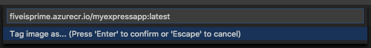

# Create your Node.js application image

Next, use the Docker extension to add the necessary files to create an image for your app, build the image, and push it to a registry.

> [!TIP]
> If you don't already have an app for this quickstart, follow the [Node.js tutorial](https://code.visualstudio.com/docs/nodejs/nodejs-tutorial).

## Add Docker files

Open the **Command Palette** (CTRL + SHIFT + P) and type `add docker files to workspace` to run the **Docker: Add Docker files to workspace** command. This command will create the necessary Docker files. Choose your application type - **Node.js** in this tutorial - along with the port that your application listens on.

> [!TIP]
> Be sure that the port you select matches the port your app listens on. If you used the Express generator, set this to 3000.

This action will add a `Dockerfile` along with some configuration files for Docker compose and a `.dockerignore`.

> [!TIP]
> VS Code has great support for Docker files. See the [Working with Docker](https://code.visualstudio.com/docs/azure/docker) topic to learn about rich language features like smart suggestions, completions, and error detection.

## Build a Docker image

The `Dockerfile` file describes the environment for your app including the location of the source files and the command to start the app within a container.

> [!TIP]
> Containers versus images: A container is an instance of an image.

Open the **Command Palette** (CTRL + SHIFT + P) and run **Docker: Build Image** to build the image. Choose the `Dockerfile` file then give the image a name. It's important that you specify a couple of things here. The format is as follows:

`[registry or username]/[image name]:[tag]`

Here's an example, using the Azure Container Registry:

`fiveisprime.azurecr.io/myexpressapp:latest`

If you're using Docker Hub, use your Docker Hub username. For example:

`fiveisprime/myexpressapp:latest`

When the build finishes, the **Terminal** panel will open and the Docker command will run. Viewing the terminal is a good way to get an understanding of the commands required to do the same steps when you use the terminal directly. You'll also see each step, or layer, that makes up the app environment.

Once built, the image will show up in the **DOCKER** explorer under **Images**.

## Push the image to a registry

Open the **Command Palette** (CTRL + SHIFT + P), run **Docker: Push**, and choose the image you built to push the image to the registry. This command will also execute the Docker command in the Terminal panel to show the status of the operation. When the command finishes, expand the **Images** node in the Docker extension explorer to see your image.

Next, you'll deploy your image to Azure.

## Next steps

> [!div class="nextstepaction"]
> [I've created an image for my application](./tutorial-javascript-vscode-deploy-container.md)
> [!div class="nextstepaction"]
> [I ran into an issue](https://www.research.net/r/PWZWZ52?tutorial=node-deployment-docker-extension&step=containerize-app)
