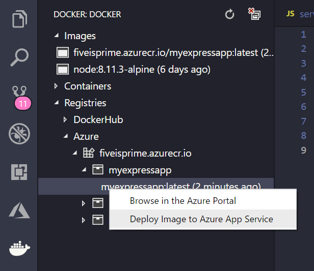

# Deploy the image to Azure App Service

Now that you have your app image built and pushed to a registry, you can deploy to [Azure App Service](https://azure.microsoft.com/en-us/services/app-service/) directly from the Docker extension explorer.

## Deploy the image

Find the image under the **Registries** node in the **DOCKER** explorer, right-click the `:latest` tag, and choose **Deploy Image to Azure App Service**.

From here, follow the prompts. Set up a Resource Group in `West US` and App Service Plan. For this quickstart, use 'myResourceGroup' and 'myPlan' for the Resource Group and plan names then give your app a **unique** name.

Once created, your app is accessible via http://**unique-name**.azurewebsites.net. In this example, I called it `myExpressApp4321`.

A **Resource Group** is essentially a named collection of all our application's resources in Azure. For example, a Resource Group can contain a reference to a website, a database, and an Azure Function.

An **App Service Plan** defines the physical resources that will be used to host our website. In this quickstart, we'll use a **Basic** hosting plan on **Linux** infrastructure, which means the site will be hosted on a Linux machine alongside other websites. You can scale up and be the only site running on a machine later in the Azure portal.

## Browse the website

The **Output** panel will open during deployment to indicate the status of the operation. When the operation completes, find the app you created in the **AZURE APP SERVICE** explorer, right-click it, then choose **Browse Website** to open the site in your browser.

## Next steps

> [!div class="nextstepaction"]
> [My site is on Azure](./tutorial-javascript-vscode-tail-logs.md)
> [!div class="nextstepaction"]
> [I ran into an issue](https://www.research.net/r/PWZWZ52?tutorial=node-deployment-docker-extension&step=deploy-app)
