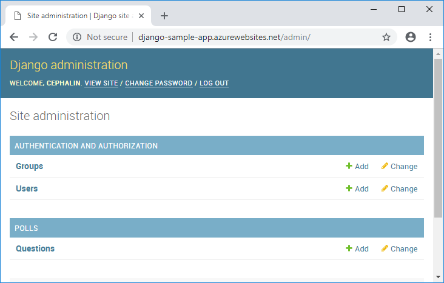

# Tutorial: Deploy a Python (Django) web app with PostgreSQL in Azure App Service

This tutorial shows how to deploy a data-driven Python (Django) web app to [Azure App Service](app-service-linux-intro.md) and connect it to an Azure Database for PostgreSQL database. App Service provides a highly scalable, self-patching web hosting service.



In this tutorial, you learn how to:

> [!div class="checklist"]
> * Create an Azure Database for PostgreSQL database
> * Deploy code to Azure App Service and connect to Postgres
> * Update your code and redeploy
> * View diagnostic logs
> * Manage the web app in the Azure portal

You can follow the steps in this article on macOS, Linux, or Windows.

## Install dependencies

Before you start this tutorial:

- [!INCLUDE [quickstarts-free-trial-note](../../../includes/quickstarts-free-trial-note.md)]
- Install [Azure CLI](/cli/azure/install-azure-cli).
- Install [Git](https://git-scm.com/).
- Install [Python 3](https://www.python.org/downloads/).

## Clone the sample app

In a terminal window, run the following commands to clone the sample app repository, and change to the repository root:

```
git clone https://github.com/Azure-Samples/djangoapp
cd djangoapp
```

The djangoapp sample repository contains the data-driven [Django](https://www.djangoproject.com/) polls app you get by following [Writing your first Django app](https://docs.djangoproject.com/en/2.1/intro/tutorial01/) in the Django documentation. It's provided here for your convenience.

## Prepare app for App Service

Like many Python web frameworks, Django [requires certain changes before they can be run in a production server](https://docs.djangoproject.com/en/2.1/howto/deployment/checklist/), and it's no different with App Service. You need to change and add some settings in the default *azuresite/settings.py* file so that the app works after it's deployed to App Service. 

Take a look at *azuresite/production.py*, which makes the necessary configuration for App Service. Briefly, it does the following:

- Inherit all settings from *azuresite/settings.py*.
- Add the fully qualified domain name of the App Service app to the allowed hosts. 
- Use [WhiteNoise](https://whitenoise.evans.io/en/stable/) to enable serving static files in production, because Django by default doesn't serve static files in production. The WhiteNoise package is already included in *requirements.txt*.
- Add configuration for PostgreSQL database. By default, Django uses Sqlite3 as the database, but it's not suitable for production apps. The [psycopg2-binary](https://pypi.org/project/psycopg2-binary/) package is already included in *requirements.txt*.
- The Postgres configuration uses environment variables. Later, you'll find out how to set environment variables in App Service.

*azuresite/production.py* is included in the repository for convenience, but it's not yet used by the app. To make sure that its settings are used in App Service, you need to configure two files, *manage.py* and *azuresite/wsgi.py*, to access it.

- In *manage.py*, change the following line:

    <pre>
    os.environ.setdefault('DJANGO_SETTINGS_MODULE', 'azuresite.settings')
    </pre>

    To the following code:

    ```python
    if os.environ.get('DJANGO_ENV') == 'production':
        os.environ.setdefault('DJANGO_SETTINGS_MODULE', 'azuresite.production')
    else:
        os.environ.setdefault('DJANGO_SETTINGS_MODULE', 'azuresite.settings')
    ```

    You'll set the environment variable `DJANGO_ENV` later when you configure your App Service app.

- In *azuresite/wsgi.py*, make the same change as above.

    In App Service, you use *manage.py* to run database migrations, and App Service uses *azuresite/wsgi.py* to run your Django app in production. This change in both files ensures that the production settings are used in both cases.

## Sign in to Azure CLI

You should have Azure CLI installed already. [Azure CLI](/cli/azure/what-is-azure-cli) lets you work with Azure resources from the command-line terminal. 

To sign in to Azure, run the [`az login`](/cli/azure/reference-index#az-login) command:

```azurecli
az login
```

Follow the instructions in the terminal to sign into your Azure account. When you're finished, your subscriptions are shown in JSON format in the terminal output.

## Create Postgres database in Azure

<!-- > [!NOTE]
> Before you create an Azure Database for PostgreSQL server, check which [compute generation](/azure/postgresql/concepts-pricing-tiers#compute-generations-and-vcores) is available in your region. If your region doesn't support Gen4 hardware, change *--sku-name* in the following command line to a value that's supported in your region, such as B_Gen4_1.  -->

In this section, you create an Azure Database for PostgreSQL server and database. To start, install the `db-up` extension with the following command:

```azurecli
az extension add --name db-up
```

Create the Postgres database in Azure with the [`az postgres up`](/cli/azure/ext/db-up/postgres#ext-db-up-az-postgres-up) command, as shown in the following example. Replace *\<postgresql-name>* with a *unique* name (the server endpoint is *https://\<postgresql-name>.postgres.database.azure.com*). For *\<admin-username>* and *\<admin-password>*, specify credentials to create an administrator user for this Postgres server.

<!-- Issue: without --location -->
```azurecli
az postgres up --resource-group myResourceGroup --location westus2 --server-name <postgresql-name> --database-name pollsdb --admin-user <admin-username> --admin-password <admin-password> --ssl-enforcement Enabled
```

This command may take a while because it's doing the following:

- Creates a [resource group](../../azure-resource-manager/management/overview.md#terminology) called `myResourceGroup`, if it doesn't exist. Every Azure resource needs to be in one of these. `--resource-group` is optional.
- Creates a Postgres server with the administrative user.
- Creates a `pollsdb` database.
- Allows access from your local IP address.
- Allows access from Azure services.
- Create a database user with access to the `pollsdb` database.

You can do all the steps separately with other `az postgres` commands and `psql`, but `az postgres up` does all of them in one step for you.

When the command finishes, find the output lines that being with `Ran Database Query:`. They show the database user that's created for you, with the username `root` and password `Pollsdb1`. You'll use them later to connect your app to the database.

<!-- not all locations support az postgres up -->
> [!TIP]
> `--location <location-name>`, can be set to any one of the [Azure regions](https://azure.microsoft.com/global-infrastructure/regions/). You can get the regions available to your subscription with the [`az account list-locations`](/cli/azure/account#az-account-list-locations) command. For production apps, put your database and your app in the same location.

## Deploy the App Service app

In this section, you create the App Service app. You will connect this app to the Postgres database you created and deploy your code.

### Create the App Service app

<!-- validation error: Parameter 'ResourceGroup.location' can not be None. -->
<!-- --resource-group is not respected at all -->

Make sure you're back in the repository root (`djangoapp`), because the app will be deployed from this directory.

Create an App Service app with the [`az webapp up`](/cli/azure/webapp#az-webapp-up) command, as shown in the following example. Replace *\<app-name>* with a *unique* name (the server endpoint is *https://\<app-name>.azurewebsites.net*). Allowed characters for *\<app-name>* are `A`-`Z`, `0`-`9`, and `-`.

```azurecli
az webapp up --plan myAppServicePlan --location westus2 --sku B1 --name <app-name>
```
<!-- !!! without --sku creates PremiumV2 plan!! -->

This command may take a while because it's doing the following:

<!-- - Create the resource group if it doesn't exist. `--resource-group` is optional. -->
<!-- No it doesn't. az webapp up doesn't respect --resource-group -->
- Generates a [resource group](../../azure-resource-manager/management/overview.md#terminology) automatically.
- Creates the [App Service plan](../overview-hosting-plans.md) *myAppServicePlan* in the Basic pricing tier (B1), if it doesn't exist. `--plan` and `--sku` are optional.
- Creates the App Service app if it doesn't exist.
- Enables default logging for the app, if not already enabled.
- Uploads the repository using ZIP deployment with build automation enabled.

Once the deployment finishes, you see a JSON output like the following:

<pre>
{
  "URL": "http://&lt;app-name&gt;.azurewebsites.net",
  "appserviceplan": "myAppServicePlan",
  "location": "westus",
  "name": "&lt;app-name&gt;",
  "os": "Linux",
  "resourcegroup": "&lt;app-resource-group&gt;",
  "runtime_version": "python|3.7",
  "runtime_version_detected": "-",
  "sku": "BASIC",
  "src_path": "//var//lib//postgresql//djangoapp"
}
</pre>

Copy the value of *\<app-resource-group>*. You need it to configure the app later. 

> [!TIP]
> The pertinent settings are saved into a hidden *.azure* directory in your repository. You can use the simple command later to redeploy any changes and immediately enable diagnostic logs with:
> 
> ```azurecli
> az webapp up
> ```

The sample code is now deployed, but the app doesn't connect to the Postgres database in Azure yet. You'll do this next.

### Configure environment variables

When you run your app locally, you can set the environment variables in the terminal session. In App Service, you do it with *app settings*, by using the [az webapp config appsettings set](/cli/azure/webapp/config/appsettings#az-webapp-config-appsettings-set) command.

Run the following command to specify the database connection details as app settings. Replace *\<app-name>*, *\<app-resource-group>*, and *\<postgresql-name>* with your own values. Remember that the user credentials `root` and `Pollsdb1` were created for you by `az postgres up`.

```azurecli
az webapp config appsettings set --name <app-name> --resource-group <app-resource-group> --settings DJANGO_ENV="production" DBHOST="<postgresql-name>.postgres.database.azure.com" DBUSER="root@<postgresql-name>" DBPASS="Pollsdb1" DBNAME="pollsdb"
```

For information on how your code accesses these app settings, see [Access environment variables](how-to-configure-python.md#access-environment-variables).

### Run database migrations

To run database migrations in App Service, open an SSH session in the browser by navigating to *https://\<app-name>.scm.azurewebsites.net/webssh/host*:

<!-- doesn't work when container not started -->
<!-- ```azurecli
az webapp ssh --resource-group myResourceGroup --name <app-name>
``` -->

In the SSH session, run the following commands:

```bash
cd site/wwwroot

# Activate default virtual environment in App Service container
source /antenv/bin/activate
# Run database migrations
python manage.py migrate
# Create the super user (follow prompts)
python manage.py createsuperuser
```

### Browse to the Azure app

Browse to the deployed app with URL *http:\//\<app-name>.azurewebsites.net* in a browser. You should see the message **No polls are available**. 

Browse to *http:\//\<app-name>.azurewebsites.net/admin* and sign in using the admin user you created in the last step. Select **Add** next to **Questions**, and create a poll question with some choices.

Browse to the deployed app with URL *http:\//\<app-name>.azurewebsites.net/admin*, and create some poll questions. You can see the questions at *http:\//\<app-name>.azurewebsites.net/*. 


Browse to the deployed app with URL *http:\//\<app-name>.azurewebsites.net* again to see the poll question and answer the question.

App Service detects a Django project in your repository by looking for a *wsgi.py* file in each subdirectory, which `manage.py startproject` creates by default. When App Service finds the file, it loads the Django web app. For more information on how App Service loads Python apps, see [Configure built-in Python image](how-to-configure-python.md).

**Congratulations!** You're running a Python (Django) web app in Azure App Service for Linux.

## Develop app locally and redeploy

In this section, you develop your app in your local environment and redeploy your code to App Service.

### Set up locally and run

To set up your local development environment and run the sample app for the first time, run the following commands:

# [bash](#tab/bash)

```bash
# Configure the Python virtual environment
python3 -m venv venv
source venv/bin/activate

# Install packages
pip install -r requirements.txt
# Run Django migrations
python manage.py migrate
# Create Django superuser (follow prompts)
python manage.py createsuperuser
# Run the dev server
python manage.py runserver
```

# [PowerShell](#tab/powershell)

```powershell
# Configure the Python virtual environment
py -3 -m venv venv
Set-ExecutionPolicy -Scope CurrentUser -ExecutionPolicy RemoteSigned -Force
venv\scripts\activate

# Install packages
pip install -r requirements.txt
# Run Django migrations
python manage.py migrate
# Create Django superuser (follow prompts)
python manage.py createsuperuser
# Run the dev server
python manage.py runserver
```

# [CMD](#tab/cmd)

```CMD
:: Configure the Python virtual environment
py -3 -m venv venv
venv\scripts\activate

:: Install packages
pip install -r requirements.txt
:: Run Django migrations
python manage.py migrate
:: Create Django superuser (follow prompts)
python manage.py createsuperuser
:: Run the dev server
python manage.py runserver
```
---

When the Django web app is fully loaded, it returns something like the following message:

<pre>
Performing system checks...

System check identified no issues (0 silenced).
December 13, 2019 - 10:54:59
Django version 2.1.2, using settings 'azuresite.settings'
Starting development server at http://127.0.0.1:8000/
Quit the server with CONTROL-C.
</pre>

Go to *http:\//localhost:8000* in a browser. You should see the message **No polls are available**. 

Go to *http:\//localhost:8000/admin* and sign in using the admin user you created in the last step. Select **Add** next to **Questions**, and create a poll question with some choices.


Go to *http:\//localhost:8000* again to see the poll question and answer the question. The local Django sample application writes and stores user data to a local Sqlite3 database, so you don't need to worry about messing up your production database. To make your development environment match the Azure environment, consider using a Postgres database locally instead.

To stop the Django server, type Ctrl+C.

### Update the app

Just to see how making app updates works, make a small change in `polls/models.py`. Find the line:

<pre>
choice_text = models.CharField(max_length=200)
</pre>

And change it to:

```python
choice_text = models.CharField(max_length=100)
```

By changing the data model, you need to create a new Django migration. Do it with the following command:

```
python manage.py makemigrations
```

You can test your changes locally by running migrations, running the development server, and navigating to *http:\//localhost:8000/admin*:

```
python manage.py migrate
python manage.py runserver
```

### Redeploy code to Azure

To redeploy the changes, run the following command from the repository root:

```azurecli
az webapp up
```

App Service detects that the app exists and just deploys the code.

### Rerun migrations in Azure

Because you made changes to the data model, you need to rerun database migrations in App Service. Open an SSH session in the browser by navigating to *https://\<app-name>.scm.azurewebsites.net/webssh/host*. Run the following commands:

```
cd site/wwwroot

# Activate default virtual environment in App Service container
source /antenv/bin/activate
# Run database migrations
python manage.py migrate
```

### Review app in production

Browse to *http:\//\<app-name>.azurewebsites.net* and see the changes running live in production. 

## Stream diagnostic logs

You can access the console logs generated from inside the container.

> [!TIP]
> `az webapp up` turns on the default logging for you. For performance reasons, this logging turns itself off after some time, but turns back on each time you run `az webapp up` again. To turn it on manually, run the following command:
>
> ```azurecli
> az webapp log config --name <app-name> --resource-group <app-resource-group> --docker-container-logging filesystem
> ```

Run the following Azure CLI command to see the log stream:

```azurecli
az webapp log tail --name <app-name> --resource-group <app-resource-group>
```

If you don't see console logs immediately, check again in 30 seconds.

> [!NOTE]
> You can also inspect the log files from the browser at `https://<app-name>.scm.azurewebsites.net/api/logs/docker`.

To stop log streaming at any time, type `Ctrl`+`C`.

## Manage your app in the Azure portal

In the [Azure portal](https://portal.azure.com), search for and select the app you created.


By default, the portal shows your app's **Overview** page. This page gives you a view of how your app is doing. Here, you can also perform basic management tasks like browse, stop, restart, and delete. The tabs on the left side of the page show the different configuration pages you can open.


## Clean up resources

If you don't expect to need these resources in the future, delete the resource groups by running the following commands:

```azurecli
az group delete --name myResourceGroup
az group delete --name <app-resource-group>
```

## Next steps

In this tutorial, you learned:

> [!div class="checklist"]
> * Create an Azure Database for PostgreSQL database
> * Deploy code to Azure App Service and connect to Postgres
> * Update your code and redeploy
> * View diagnostic logs
> * Manage the web app in the Azure portal

Go to the next tutorial to learn how to map a custom DNS name to your app:

> [!div class="nextstepaction"]
> [Tutorial: Map custom DNS name to your app](../app-service-web-tutorial-custom-domain.md)

Or check out other resources:

> [!div class="nextstepaction"]
> [Configure Python app](how-to-configure-python.md)
