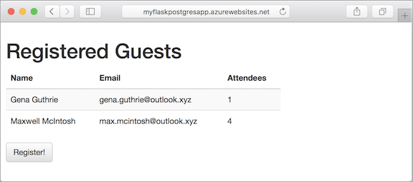

# Build a Docker Python and PostgreSQL web app in Azure

[App Service on Linux](app-service-linux-intro.md) provides a highly scalable, self-patching web hosting service. This tutorial shows how to create a data-driven Python web app, using PostgreSQL as the database back end. When you are done, you have a Python Flask application running within a Docker container in App Service on Linux.



In this tutorial, you learn how to:

> [!div class="checklist"]
> * Create a PostgreSQL database in Azure
> * Connect a Python app to PostgreSQL
> * Deploy the app to Azure
> * View diagnostic logs
> * Update the data model and redeploy the app
> * Manage the app in the Azure portal

You can follow the steps in this article on macOS. Linux and Windows instructions are the same in most cases, but the differences are not detailed in this tutorial.

[!INCLUDE [quickstarts-free-trial-note](../../../includes/quickstarts-free-trial-note.md)]

## Prerequisites

To complete this tutorial:

1. [Install Git](https://git-scm.com/)
1. [Install Python](https://www.python.org/downloads/)
1. [Install and run PostgreSQL](https://www.postgresql.org/download/)

## Test local PostgreSQL installation and create a database

In a local terminal window, run `psql` to connect to your local PostgreSQL server.

```bash
sudo -u postgres psql postgres
```

If you get an error message similar to `unknown user: postgres`, your PostgreSQL installation may be configured with your logged in username. Try the following command instead.

```bash
psql postgres
```

If your connection is successful, your PostgreSQL database is running. If not, make sure that your local PostgresQL database is started by following the instructions for your operating system at [Downloads - PostgreSQL Core Distribution](https://www.postgresql.org/download/).

Create a database called *eventregistration* and set up a separate database user named *manager* with password *supersecretpass*.

```sql
CREATE DATABASE eventregistration;
CREATE USER manager WITH PASSWORD 'supersecretpass';
GRANT ALL PRIVILEGES ON DATABASE eventregistration TO manager;
```

Type `\q` to exit the PostgreSQL client.

<a name="step2"></a>

## Create local Python app

In this step, you set up the local Python Flask project.

### Clone the sample app

Open the terminal window, and `CD` to a working directory.

Run the following commands to clone the sample repository.

```bash
git clone https://github.com/Azure-Samples/flask-postgresql-app.git
cd flask-postgresql-app
```

This sample repository contains a [Flask](http://flask.pocoo.org/) application.

### Run the app locally

Install the required packages and start the application.

```bash
# Bash
python3 -m venv venv
source venv/bin/activate
pip install -r requirements.txt
cd app
FLASK_APP=app.py DBHOST="localhost" DBUSER="manager" DBNAME="eventregistration" DBPASS="supersecretpass" flask db upgrade
FLASK_APP=app.py DBHOST="localhost" DBUSER="manager" DBNAME="eventregistration" DBPASS="supersecretpass" flask run

# PowerShell
pip install virtualenv
virtualenv venv
source venv/bin/activate
pip install -r requirements.txt
cd app
Set-Item Env:FLASK_APP ".\app.py"
DBHOST="localhost" DBUSER="manager" DBNAME="eventregistration" DBPASS="supersecretpass" flask db upgrade
DBHOST="localhost" DBUSER="manager" DBNAME="eventregistration" DBPASS="supersecretpass" flask run
```

When the app is fully loaded, you see something similar to the following message:

```bash
INFO  [alembic.runtime.migration] Context impl PostgresqlImpl.
INFO  [alembic.runtime.migration] Will assume transactional DDL.
INFO  [alembic.runtime.migration] Running upgrade  -> 791cd7d80402, empty message
 * Serving Flask app "app"
 * Running on http://127.0.0.1:5000/ (Press CTRL+C to quit)
```

Navigate to `http://localhost:5000` in a browser. Click **Register!** and create a test user.


The Flask sample application stores user data in the database. If you are successful at registering a user, your app is writing data to the local PostgreSQL database.

To stop the Flask server at anytime, type Ctrl+C in the terminal.

## Create a production PostgreSQL database

In this step, you create a PostgreSQL database in Azure. When your app is deployed to Azure, it uses this cloud database.

[!INCLUDE [cloud-shell-try-it.md](../../../includes/cloud-shell-try-it.md)]

### Create a resource group

[!INCLUDE [Create resource group](../../../includes/app-service-web-create-resource-group-linux-no-h.md)]

### Create an Azure Database for PostgreSQL server

Create a PostgreSQL server with the [`az postgres server create`](/cli/azure/postgres/server?view=azure-cli-latest#az-postgres-server-create) command in the Cloud Shell.

In the following example command, replace *\<postgresql_name>* with a unique server name, and replace *\<admin_username>* and *\<admin_password>* with the desired user credentials. The user credentials are for the database administrator account. The server name is used as part of your PostgreSQL endpoint (`https://<postgresql_name>.postgres.database.azure.com`), so the name needs to be unique across all servers in Azure.

```azurecli-interactive
az postgres server create --resource-group myResourceGroup --name <postgresql_name> --location "West Europe" --admin-user <admin_username> --admin-password <admin_password> --sku-name B_Gen4_1
```

When the Azure Database for PostgreSQL server is created, the Azure CLI shows information similar to the following example:

```json
{
  "administratorLogin": "<admin_username>",
  "fullyQualifiedDomainName": "<postgresql_name>.postgres.database.azure.com",
  "id": "/subscriptions/00000000-0000-0000-0000-000000000000/resourceGroups/myResourceGroup/providers/Microsoft.DBforPostgreSQL/servers/<postgresql_name>",
  "location": "westus",
  "name": "<postgresql_name>",
  "resourceGroup": "myResourceGroup",
  "sku": {
    "capacity": 1,
    "family": "Gen4",
    "name": "B_Gen4_1",
    "size": null,
    "tier": "Basic"
  },
  < JSON data removed for brevity. >
}
```

> [!NOTE]
> Remember \<admin_username> and \<admin_password> for later. You need them to sign in to the Postgre server and its databases.


### Create firewall rules for the PostgreSQL server

In the Cloud Shell, run the following Azure CLI commands to allow access to the database from Azure resources.

```azurecli-interactive
az postgres server firewall-rule create --resource-group myResourceGroup --server-name <postgresql_name> --start-ip-address=0.0.0.0 --end-ip-address=0.0.0.0 --name AllowAllAzureIPs
```

> [!NOTE]
> This setting allows network connections from all IPs within the Azure network. For production use, try to configure the most restrictive firewall rules possible by [using only the outbound IP addresses your app uses](../app-service-ip-addresses.md?toc=%2fazure%2fapp-service%2fcontainers%2ftoc.json#find-outbound-ips).

In the Cloud Shell, run the command again to allow access from your local computer by replacing *\<your_ip_address>* with [your local IPv4 IP address](http://www.whatsmyip.org/).

```azurecli-interactive
az postgres server firewall-rule create --resource-group myResourceGroup --server-name <postgresql_name> --start-ip-address=<your_ip_address> --end-ip-address=<your_ip_address> --name AllowLocalClient
```

## Connect Python app to production database

In this step, you connect your Flask sample app to the Azure Database for PostgreSQL server you created.

### Create empty database and user access

In the local terminal window, connect to the database by running the command below. When prompted for your admin password, use the same password you specified in [Create an Azure Database for PostgreSQL server](#create-an-azure-database-for-postgresql-server).

```bash
psql -h <postgresql_name>.postgres.database.azure.com -U <my_admin_username>@<postgresql_name> postgres
```

Just like in your local Postgres server, create the database and user in the Azure Postgres server.

```bash
CREATE DATABASE eventregistration;
CREATE USER manager WITH PASSWORD 'supersecretpass';
GRANT ALL PRIVILEGES ON DATABASE eventregistration TO manager;
```

Type `\q` to exit the PostgreSQL client.

> [!NOTE]
> It's best practice to create database users with restricted permissions for specific applications, instead of using the admin user. In this example, the `manager` user has full privileges to _only_ the `eventregistration` database.

### Test app connectivity to production database

Back in the local terminal window, run the following commands to run Flask database migration and the Flask server.

```bash
FLASK_APP=app.py DBHOST="<postgresql_name>.postgres.database.azure.com" DBUSER="manager@<postgresql_name>" DBNAME="eventregistration" DBPASS="supersecretpass" flask db upgrade
FLASK_APP=app.py DBHOST="<postgresql_name>.postgres.database.azure.com" DBUSER="manager@<postgresql_name>" DBNAME="eventregistration" DBPASS="supersecretpass" flask run
```

When the app is fully loaded, you see something similar to the following message:

```bash
INFO  [alembic.runtime.migration] Context impl PostgresqlImpl.
INFO  [alembic.runtime.migration] Will assume transactional DDL.
INFO  [alembic.runtime.migration] Running upgrade  -> 791cd7d80402, empty message
 * Serving Flask app "app"
 * Running on http://127.0.0.1:5000/ (Press CTRL+C to quit)
```

Navigate to http://localhost:5000 in a browser. Click **Register!** and create a test registration. You are now writing data to the database in Azure.


## Deploy to Azure

In this step, you deploy the Postgres-connected Python application to Azure App Service.

### Configure repository

The Git deployment engine in App Service invokes `pip` automation when there's an _application.py_ in the repository root. In this tutorial, you'll let the deployment engine run the automation for you. In the local terminal window, navigate to the repository root, create a dummy _application.py_, and commit your changes.

```bash
cd ..
touch application.py
git add .
git commit -m "ensure azure automation"
```

### Configure a deployment user

[!INCLUDE [Configure deployment user](../../../includes/configure-deployment-user-no-h.md)]

### Create an App Service plan 

[!INCLUDE [Create app service plan](../../../includes/app-service-web-create-app-service-plan-linux-no-h.md)]

### Create a web app 

[!INCLUDE [Create web app](../../../includes/app-service-web-create-web-app-python-linux-no-h.md)]

### Configure environment variables

Earlier in the tutorial, you defined environment variables to connect to your PostgreSQL database.

In App Service, you set environment variables as _app settings_ by using the [`az webapp config appsettings set`](/cli/azure/webapp/config/appsettings?view=azure-cli-latest#az-webapp-config-appsettings-set) command in Cloud Shell.

The following example specifies the database connection details as app settings. 

```azurecli-interactive
az webapp config appsettings set --name <app_name> --resource-group myResourceGroup --settings DBHOST="<postgresql_name>.postgres.database.azure.com" DBUSER="manager@<postgresql_name>" DBPASS="supersecretpass" DBNAME="eventregistration"
```

### Push to Azure from Git

[!INCLUDE [app-service-plan-no-h](../../../includes/app-service-web-git-push-to-azure-no-h.md)]

```bash 
Counting objects: 5, done. 
Delta compression using up to 4 threads. 
Compressing objects: 100% (5/5), done. 
Writing objects: 100% (5/5), 489 bytes | 0 bytes/s, done. 
Total 5 (delta 3), reused 0 (delta 0) 
remote: Updating branch 'master'. 
remote: Updating submodules. 
remote: Preparing deployment for commit id '6c7c716eee'. 
remote: Running custom deployment command... 
remote: Running deployment command... 
remote: Handling node.js deployment. 
. 
. 
. 
remote: Deployment successful. 
To https://<app_name>.scm.azurewebsites.net/<app_name>.git 
 * [new branch]      master -> master 
```  

### Configure entry point

By default, the built-in image looks for a _wsgi.py_ or _application.py_ in the root directory as the entry point, but your entry point is _app/app.py_. The _application.py_ you added earlier is empty and does nothing.

In the Cloud Shell, run the [`az webapp config set`](/cli/azure/webapp/config?view=azure-cli-latest#az-webapp-config-set) command to set a custom startup script.

```azurecli-interactive
az webapp config set --name <app_name> --resource-group myResourceGroup --startup-file "gunicorn '--bind=0.0.0.0' --chdir /home/site/wwwroot/app app:app"
```

The `--startup-file` parameter takes a custom command or the path to the file that contains the custom command. Your custom command should have the following format:

```
gunicorn '--bind=0.0.0.0' --chdir /home/site/wwwroot/<subdirectory> <module>:<variable>
```

In the custom command, `--chdir` is required if your entry point is not in the root directory, and `<subdirectory>` is the subdirectory. `<module>` is the name of the _.py_ file and `<variable>` is the variable in the module that represents your web app.

### Browse to the Azure web app

Browse to the deployed web app. It takes some time to start because the container needs to be downloaded and run when the app is requested for the first time. If the page times out or displays an error message, wait a few minutes and refresh the page.

```bash
http://<app_name>.azurewebsites.net
```

You see previously registered guests that were saved to the Azure production database in the previous step.


**Congratulations!** You're running a Python app in App Service for Linux.

## Access diagnostic logs

Because the Python app is running in a container, App Service on Linux lets you access the console logs generated from within the container. To find the logs, navigate to this URL:

```
https://<app_name>.scm.azurewebsites.net/api/logs/docker
```

You should see two JSON objects, each with an `href` property. One `href` points to the Docker console logs (ends with `_docker.log`), and another `href` points to the console logs generated from inside the Python container. 

```json
[  
   {  
      "machineName":"RD0003FF61ACD0_default",
      "lastUpdated":"2018-09-27T16:48:17Z",
      "size":4766,
      "href":"https://<app_name>.scm.azurewebsites.net/api/vfs/LogFiles/2018_09_27_RD0003FF61ACD0_default_docker.log",
      "path":"/home/LogFiles/2018_09_27_RD0003FF61ACD0_default_docker.log"
   },
   {  
      "machineName":"RD0003FF61ACD0",
      "lastUpdated":"2018-09-27T16:48:19Z",
      "size":2589,
      "href":"https://<app_name>.scm.azurewebsites.net/api/vfs/LogFiles/2018_09_27_RD0003FF61ACD0_docker.log",
      "path":"/home/LogFiles/2018_09_27_RD0003FF61ACD0_docker.log"
   }
]
```

Copy the `href` value you want into a browser window to navigate to the logs. The logs are not streamed, so you may experience some delay. To see new logs, refresh the browser page.

## Update data model and redeploy

In this step, you add the number of attendees to each event registration by updating the `Guest` model, then redeploy the update to Azure.

In the local terminal window, check out files from the `modelChange` branch by using the following git command:

```bash
git checkout origin/modelChange -- .
```

This checkout already makes the necessary changes to the model, views, and controllers. It also includes a database migration generated via *alembic* (`flask db migrate`). You can see all changes via the following git command:

```bash
git diff master origin/modelChange
```

### Test your changes locally

In the local terminal window, run the following commands to test your changes locally by running the flask server.

```bash
source venv/bin/activate
cd app
FLASK_APP=app.py DBHOST="<postgresql_name>.postgres.database.azure.com" DBUSER="manager@<postgresql_name>" DBNAME="eventregistration" DBPASS="supersecretpass" flask db upgrade
FLASK_APP=app.py DBHOST="<postgresql_name>.postgres.database.azure.com" DBUSER="manager@<postgresql_name>" DBNAME="eventregistration" DBPASS="supersecretpass" flask run
```

Navigate to http://localhost:5000 in your browser to view the changes. Create a test registration.


### Publish changes to Azure

In the local terminal window, commit all the changes in Git, and then push the code changes to Azure.

```bash 
git add . 
git commit -m "updated data model" 
git push azure master 
``` 

Navigate to your Azure web app and try out the new functionality again. Make sure you refresh the page.

```bash
http://<app_name>.azurewebsites.net
```


## Manage your web app in the Azure Portal

Go to the [Azure portal](https://portal.azure.com) to see the web app you created.

From the left menu, click **App Services**, then click the name of your Azure web app.


By default, the portal shows your web app's **Overview** page. This page gives you a view of how your app is doing. Here, you can also perform basic management tasks like browse, stop, start, restart, and delete. The tabs on the left side of the page show the different configuration pages you can open.


[!INCLUDE [cli-samples-clean-up](../../../includes/cli-samples-clean-up.md)]

## Next steps

In this tutorial, you learned how to:

> [!div class="checklist"]
> * Create a PostgreSQL database in Azure
> * Connect a Python app to PostgreSQL
> * Deploy the app to Azure
> * View diagnostic logs
> * Update the data model and redeploy the app
> * Manage the app in the Azure portal

Advance to the next tutorial to learn how to map a custom DNS name to your web app.

> [!div class="nextstepaction"]
> [Configure built-in Python image](how-to-configure-python.md)

> [!div class="nextstepaction"]
> [Map an existing custom DNS name to Azure Web Apps](../app-service-web-tutorial-custom-domain.md)

