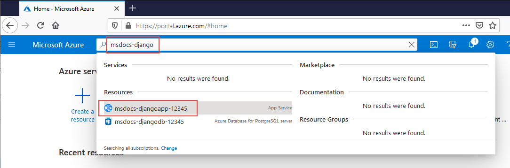
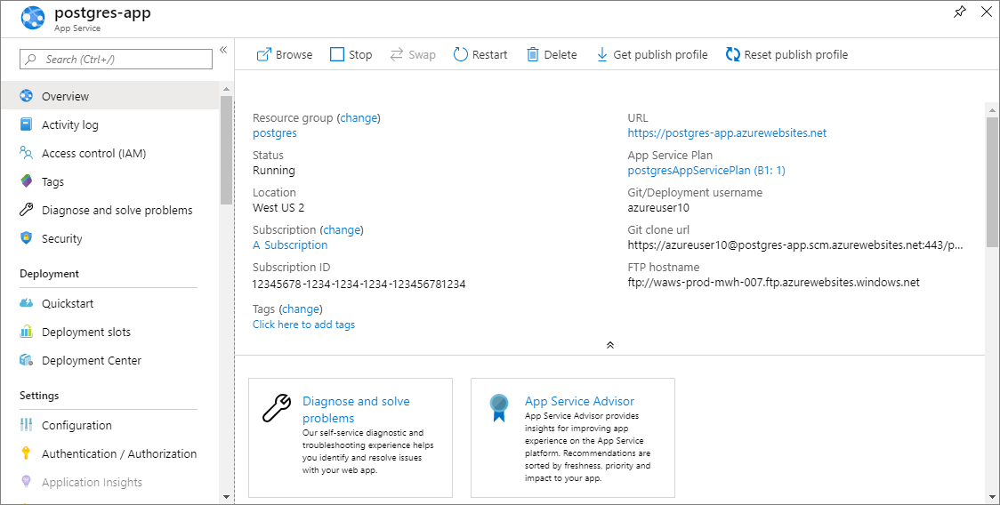

# Tutorial: Run a Python (Django) web app with PostgreSQL in Azure App Service

[Azure App Service](app-service-linux-intro.md) provides a highly scalable, self-patching web hosting service. This tutorial shows how to connect a data-driven Python Django web app to an Azure Database for PostgreSQL database, and deploy and run the app on Azure App Service.


In this tutorial, you learn how to:

> [!div class="checklist"]
> * Create an Azure Database for PostgreSQL database and connect a web app to it
> * Deploy the web app to Azure App Service
> * View diagnostic logs
> * Manage the web app in the Azure portal

You can follow the steps in this article on macOS, Linux, or Windows. The steps are similar in most cases, although differences aren't detailed in this tutorial. Most of the examples below use a `bash` terminal window on Linux. 

## Prerequisites

Before you start this tutorial:

- [!INCLUDE [quickstarts-free-trial-note](../../../includes/quickstarts-free-trial-note.md)]
- Install [Git](https://git-scm.com/).
- Install [Python 3](https://www.python.org/downloads/).
- Install and run [PostgreSQL](https://www.postgresql.org/download/).

## Test PostgreSQL installation and create a database

First, connect to your local PostgreSQL server and create a database: 

In a local terminal window, run `psql` to connect to your local PostgreSQL server as the built-in `postgres` user.

```bash
sudo su - postgres
psql
```
or
```PowerShell
psql -U postgres
```

If your connection is successful, your PostgreSQL database is running. If not, make sure that your local PostgresQL database is started by following the instructions for your operating system at [Downloads - PostgreSQL Core Distribution](https://www.postgresql.org/download/).

Create a new database called *pollsdb*, and set up a database user named *manager* with password *supersecretpass*:

```sql
CREATE DATABASE pollsdb;
CREATE USER manager WITH PASSWORD 'supersecretpass';
GRANT ALL PRIVILEGES ON DATABASE pollsdb TO manager;
```

Type `\q` to exit the PostgreSQL client.

<a name="step2"></a>
## Create and run the local Python app

Next, set up and run the sample Python Django web app.

The [djangoapp](https://github.com/Azure-Samples/djangoapp) sample repository contains the data-driven [Django](https://www.djangoproject.com/) polls app you get by following [Writing your first Django app](https://docs.djangoproject.com/en/2.1/intro/tutorial01/) in the Django documentation.

### Clone the sample app

In a terminal window, run the following commands to clone the sample app repository, and change to the new working directory:

```bash
git clone https://github.com/Azure-Samples/djangoapp.git
cd djangoapp
```

### Configure the Python virtual environment

Create and activate a Python virtual environment to run your app.

```bash
python3 -m venv venv
source venv/bin/activate
```
or
```PowerShell
py -3 -m venv venv
venv\scripts\activate
```

In the `venv` environment, run *env.sh* or *env.ps1* to set the environment variables that *azuresite/settings.py* will use for the database connection settings.

```bash
source ./env.sh
```
or
```PowerShell
.\env.ps1
```

Install the required packages from *requirements.txt*, run [Django migrations](https://docs.djangoproject.com/en/2.1/topics/migrations/), and [create an admin user](https://docs.djangoproject.com/en/2.1/intro/tutorial02/#creating-an-admin-user):

```bash
pip install -r requirements.txt
python manage.py migrate
python manage.py createsuperuser
```

### Run the web app

After you create the admin user, run the Django server.

```bash
python manage.py runserver
```

When the Django web app is fully loaded, it returns something like the following message:

```bash
Performing system checks...

System check identified no issues (0 silenced).
December 13, 2019 - 10:54:59
Django version 2.1.2, using settings 'azuresite.settings'
Starting development server at http://127.0.0.1:8000/
Quit the server with CONTROL-C.
```

Go to *http:\//localhost:8000* in a browser. You should see the message **No polls are available**. 

Go to *http:\//localhost:8000/admin* and sign in using the admin user you created in the last step. Select **Add** next to **Questions**, and create a poll question with some choices.


Go to *http:\//localhost:8000* again to see the poll question and answer the question. The local Django sample application writes and stores user data to the local PostgreSQL database.

To stop the Django server, type Ctrl+C in the terminal.

[!INCLUDE [cloud-shell-try-it.md](../../../includes/cloud-shell-try-it.md)]

Most of the remaining steps in this article use Azure CLI commands in the Azure Cloud Shell. 

## Create and connect to Azure Database for PostgreSQL

In this section, you create an Azure Database for PostgreSQL server and database, and connect your web app to it. When you deploy your web app to Azure App Service, the app uses this cloud database. 

### Create a resource group

You can create a new resource group for your Azure Database for PostgreSQL server, or use an existing resource group. 

[!INCLUDE [Create resource group](../../../includes/app-service-web-create-resource-group-linux-no-h.md)]

### Create an Azure Database for PostgreSQL server

You create a PostgreSQL server with the [az postgres server create](/cli/azure/postgres/server?view=azure-cli-latest#az-postgres-server-create) command in the Cloud Shell.

> [!NOTE]
> Before you create an Azure Database for PostgreSQL server, check which [compute generation](/azure/postgresql/concepts-pricing-tiers#compute-generations-and-vcores) is available in your region. If your region doesn't support Gen4 hardware, change *--sku-name* in the following command line to a value that's supported in your region, such as Gen5. 

In the following command, replace *\<postgresql-name>* with a unique server name. The server name is part of your PostgreSQL endpoint *https://\<postgresql-name>.postgres.database.azure.com*, so the name needs to be unique across all servers in Azure. 

Replace *\<resourcegroup-name>* and *\<region>* with the name and region of the resource group you want to use. For *\<admin-username>* and *\<admin-password>*, create user credentials for the database administrator account. Remember the *\<admin-username>* and *\<admin-password>* to use later for signing in to the PostgreSQL server and databases.

```azurecli-interactive
az postgres server create --resource-group <resourcegroup-name> --name <postgresql-name> --location "<region>" --admin-user <admin-username> --admin-password <admin-password> --sku-name B_Gen5_1
```

When the Azure Database for PostgreSQL server is created, the Azure CLI returns JSON code like the following example:

```json
{
  "administratorLogin": "myusername",
  "earliestRestoreDate": "2020-01-22T19:02:15.727000+00:00",
  "fullyQualifiedDomainName": "myservername.postgres.database.azure.com",
  "id": "/subscriptions/00000000-0000-0000-0000-000000000000/resourceGroups/myresourcegroup/providers/Microsoft.DBforPostgreSQL/servers/myservername",
  "location": "westeurope",
  "masterServerId": "",
  "name": "myservername",
  "replicaCapacity": 5,
  "replicationRole": "None",
  "resourceGroup": "myresourcegroup",
  "sku": {
    "capacity": 1,
    "family": "Gen5",
    "name": "B_Gen5_1",
    "size": null,
    "tier": "Basic"
  },
  < JSON data removed for brevity. >
}
```

### Create firewall rules for the Azure Database for PostgreSQL server

Run the [az postgres server firewall-rule create](/cli/azure/postgres/server/firewall-rule#az-postgres-server-firewall-rule-create) command to allow access to the database from Azure resources. Replace the *\<postgresql-name>* and *\<resourcegroup-name>* placeholders with your values.

```azurecli-interactive
az postgres server firewall-rule create --resource-group <resourcegroup-name> --server-name <postgresql-name> --start-ip-address=0.0.0.0 --end-ip-address=0.0.0.0 --name AllowAllAzureIPs
```

> [!NOTE]
> The preceding setting allows network connections from all IP addresses within the Azure network. For production use, try to configure the most restrictive firewall rules possible by [allowing only the outbound IP addresses your app uses](../overview-inbound-outbound-ips.md?toc=%2fazure%2fapp-service%2fcontainers%2ftoc.json#find-outbound-ips).

Run the `firewall-rule create` command again to allow access from your local computer. Replace *\<your-ip-address>* with [your local IPv4 IP address](https://www.whatsmyip.org/). Replace the *\<postgresql-name>* and *\<resourcegroup-name>* placeholders with your own values.

```azurecli-interactive
az postgres server firewall-rule create --resource-group <resourcegroup-name> --server-name <postgresql-name> --start-ip-address=<your-ip-address> --end-ip-address=<your-ip-address> --name AllowLocalClient
```

### Create and connect to the Azure Database for PostgreSQL database

Connect to your Azure Database for PostgreSQL server by running the following command. Use your own *\<postgresql-name>* and *\<admin-username>*, and sign in with the password you created.

```bash
psql -h <postgresql-name>.postgres.database.azure.com -U <admin-username>@<postgresql-name> postgres
```

Just as you did in your local PostgreSQL server, create a database and user in the Azure Database for PostgreSQL server:

```sql
CREATE DATABASE pollsdb;
CREATE USER manager WITH PASSWORD 'supersecretpass';
GRANT ALL PRIVILEGES ON DATABASE pollsdb TO manager;
```

> [!NOTE]
> It's a best practice to create database users with restricted permissions for specific apps, instead of using the admin user. The `manager` user has full privileges to *only* the `pollsdb` database.

Type `\q` to exit the PostgreSQL client.

### Test app connectivity to the Azure PostgreSQL database

Edit your local *env.sh* or *env.ps1* file to point to to your cloud PostgreSQL database, by replacing *\<postgresql-name>* with your Azure Database for PostgreSQL server name.

```bash
export DBHOST="<postgresql-name>.postgres.database.azure.com"
export DBUSER="manager@<postgresql-name>"
export DBNAME="pollsdb"
export DBPASS="supersecretpass"
```
or
```powershell
$Env:DBHOST = "<postgresql-name>.postgres.database.azure.com"
$Env:DBUSER = "manager@<postgresql-name>"
$Env:DBNAME = "pollsdb"
$Env:DBPASS = "supersecretpass"
```

In the `venv` environment in your local terminal window, run the edited *env.sh* or *env.ps1*. 
```bash
source ./env.sh
```
or
```PowerShell
.\env.ps1
```

Run Django migration to the Azure database, and create an admin user.

```bash
python manage.py migrate
python manage.py createsuperuser
```

Once the admin user is created, run the Django server.

```bash
python manage.py runserver
```

In a browser, go to *http:\//localhost:8000*, and you should see the message **No polls are available** again. 

Go to *http:\//localhost:8000/admin*, sign in using the admin user you created, and create a poll question like before.


Go to *http:\//localhost:8000* again, and see the poll question displayed. Your app is now writing data to the Azure Database for PostgreSQL database.

To stop the Django server, type Ctrl+C in the terminal.

## Deploy the web app to Azure App Service

In this step, you deploy the Azure Database for PostgreSQL database-connected Python app to Azure App Service.

### Configure repository

Because this tutorial uses a Django sample, you need to change and add some settings in your *djangoapp/azuresite/settings.py* file to work with Azure App Service. 

1. Django validates the `HTTP_HOST` header in incoming requests. For your Django web app to work in App Service, you need to add the fully qualified domain name of the app to the allowed hosts. 
   
   Edit *azuresite/settings.py* to change the `ALLOWED_HOSTS` line as follows:
   
   ```python
   ALLOWED_HOSTS = [os.environ['WEBSITE_SITE_NAME'] + '.azurewebsites.net', '127.0.0.1'] if 'WEBSITE_SITE_NAME' in os.environ else []
   ```
   
1. Django doesn't support [serving static files in production](https://docs.djangoproject.com/en/2.1/howto/static-files/deployment/). For this tutorial, you use [WhiteNoise](https://whitenoise.evans.io/en/stable/) to enable serving the files. The WhiteNoise package was already installed with *requirements.txt*. 
   
   To configure Django to use WhiteNoise, in *azuresite/settings.py*, find the `MIDDLEWARE` setting, and add `whitenoise.middleware.WhiteNoiseMiddleware` to the list, just after the `django.middleware.security.SecurityMiddleware` line. Your `MIDDLEWARE` setting should look like this:
   
   ```python
   MIDDLEWARE = [
       'django.middleware.security.SecurityMiddleware',
       'whitenoise.middleware.WhiteNoiseMiddleware',
       ...
   ]
   ```
   
1. At the end of *azuresite/settings.py*, add the following lines:
   
   ```python
   STATICFILES_STORAGE = 'whitenoise.storage.CompressedManifestStaticFilesStorage'
   STATIC_ROOT = os.path.join(BASE_DIR, 'staticfiles')
   ```
   
   For more information about configuring WhiteNoise, see the [WhiteNoise documentation](https://whitenoise.evans.io/en/stable/).

> [!IMPORTANT]
> The database settings section already follows the security best practice of using environment variables. For complete deployment recommendations, see [Django Documentation: deployment checklist](https://docs.djangoproject.com/en/2.1/howto/deployment/checklist/).

Commit your changes into your fork of the *djangoapp* repository:

```bash
git commit -am "configure for App Service"
```

### Configure a deployment user

[!INCLUDE [Configure deployment user](../../../includes/configure-deployment-user-no-h.md)]

### Create App Service plan

[!INCLUDE [Create app service plan](../../../includes/app-service-web-create-app-service-plan-linux-no-h.md)]

### Create a web app

[!INCLUDE [Create web app](../../../includes/app-service-web-create-web-app-python-linux-no-h.md)]

### Configure environment variables

Earlier in the tutorial, you defined environment variables to connect to your PostgreSQL database.

In Azure App Service, you set environment variables as *app settings*, by using the [az webapp config appsettings set](/cli/azure/webapp/config/appsettings?view=azure-cli-latest#az-webapp-config-appsettings-set) command.

In the Azure Cloud Shell, run the following command to specify the database connection details as app settings. Replace *\<app-name>*, *\<resourcegroup-name>*, and *\<postgresql-name>* with your own values.

```azurecli-interactive
az webapp config appsettings set --name <app-name> --resource-group <resourcegroup-name> --settings DBHOST="<postgresql-name>.postgres.database.azure.com" DBUSER="manager@<postgresql-name>" DBPASS="supersecretpass" DBNAME="pollsdb"
```

For information on how your code accesses these app settings, see [Access environment variables](how-to-configure-python.md#access-environment-variables).

### Push to Azure from Git

[!INCLUDE [app-service-plan-no-h](../../../includes/app-service-web-git-push-to-azure-no-h.md)]

```bash 
Counting objects: 60, done.
Delta compression using up to 8 threads.
Compressing objects: 100% (51/51), done.
Writing objects: 100% (60/60), 15.37 KiB | 749.00 KiB/s, done.
Total 60 (delta 9), reused 0 (delta 0)
remote: Deploy Async
remote: Updating branch 'master'.
remote: Updating submodules.
remote: Preparing deployment for commit id '06f3f7c0cb'.
remote: Repository path is /home/site/repository
remote: Running oryx build...
remote: Build orchestrated by Microsoft Oryx, https://github.com/Microsoft/Oryx
remote: You can report issues at https://github.com/Microsoft/Oryx/issues
. 
. 
. 
remote: Done in 100 sec(s).
remote: Running post deployment command(s)...
remote: Triggering recycle (preview mode disabled).
remote: Deployment successful.
remote: Deployment Logs : 'https://<app-name>.scm.azurewebsites.net/newui/jsonviewer?view_url=/api/deployments/06f3f7c0cb52ce3b4aff85c2b5099fbacb65ab94/log'
To https://<app-name>.scm.azurewebsites.net/<app-name>.git 
 * [new branch]      master -> master
```  

The App Service deployment server sees *requirements.txt* in the repository root and runs Python package management automatically after `git push`.

### Browse to the Azure app

Browse to the deployed app with URL *http:\//\<app-name>.azurewebsites.net*. It takes some time to start, because the container must be downloaded and run when the app is requested for the first time. If the page times out or displays an error message, wait a few minutes and refresh the page.

You should see the poll questions that you created earlier. 

App Service detects a Django project in your repository by looking for a *wsgi.py* file in each subdirectory, which `manage.py startproject` creates by default. When App Service finds the file, it loads the Django web app. For more information on how App Service loads Python apps, see [Configure built-in Python image](how-to-configure-python.md).

Go to *http:\//\<app-name>.azurewebsites.net/admin* and sign in using the admin user you created. If you like, create some more poll questions.


**Congratulations!** You're running a Python (Django) web app in Azure App Service for Linux.

## Stream diagnostic logs

[!INCLUDE [Access diagnostic logs](../../../includes/app-service-web-logs-access-no-h.md)]

## Manage your app in the Azure portal

In the [Azure portal](https://portal.azure.com), search for and select the app you created.



By default, the portal shows your app's **Overview** page. This page gives you a view of how your app is doing. Here, you can also perform basic management tasks like browse, stop, restart, and delete. The tabs on the left side of the page show the different configuration pages you can open.



[!INCLUDE [cli-samples-clean-up](../../../includes/cli-samples-clean-up.md)]

## Next steps

Go to the next tutorial to learn how to map a custom DNS name to your app:

> [!div class="nextstepaction"]
> [Tutorial: Map custom DNS name to your app](../app-service-web-tutorial-custom-domain.md)

Or check out other resources:

> [!div class="nextstepaction"]
> [Configure Python app](how-to-configure-python.md)
