# Buy a custom domain name for Azure Web Apps

App Service domains (preview) are top-level domains that are managed directly in Azure. They make it easy to manage custom domains for [Azure Web Apps](app-service-web-overview.md). This tutorial shows you how to buy an App Service domain and assign DNS names to Azure Web Apps.

This article is for Azure App Service (Web Apps, API Apps, Mobile Apps, Logic Apps). For Azure VM or Azure Storage, see [Assign App Service domain to Azure VM or Azure Storage](https://blogs.msdn.microsoft.com/appserviceteam/2017/07/31/assign-app-service-domain-to-azure-vm-or-azure-storage/). For Cloud Services, see 
[Configuring a custom domain name for an Azure cloud service](../cloud-services/cloud-services-custom-domain-name-portal.md).

## Prerequisites

To complete this tutorial:

* [Create an App Service app](/azure/app-service/), or use an app that you created for another tutorial.

## Prepare the app

To use custom domains in Azure Web Apps, your web app's [App Service plan](https://azure.microsoft.com/pricing/details/app-service/) must be a paid tier (**Shared**, **Basic**, **Standard**, or **Premium**). In this step, you make sure that the web app is in the supported pricing tier.

### Sign in to Azure

Open the [Azure portal](https://portal.azure.com) and sign in with your Azure account.

### Navigate to the app in the Azure portal

From the left menu, select **App Services**, and then select the name of the app.

You see the management page of the App Service app.  

### Check the pricing tier

In the left navigation of the app page, scroll to the **Settings** section and select **Scale up (App Service plan)**.

The app's current tier is highlighted by a blue border. Check to make sure that the app is not in the **Free** tier. Custom DNS is not supported in the **Free** tier. 

If the App Service plan is not **Free**, close the **Choose your pricing tier** page and skip to [Buy the domain](#buy-the-domain).

### Scale up the App Service plan

Select any of the non-free tiers (**Shared**, **Basic**, **Standard**, or **Premium**). 

Click **Select**.

When you see the following notification, the scale operation is complete.

## Buy the domain

### Sign in to Azure
Open the [Azure portal](https://portal.azure.com/) and sign in with your Azure account.

### Launch Buy domains
In the **Web Apps** tab, click the name of your web app, select **Settings**, and then select **Custom domains**
   
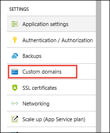

In the **Custom domains** page, click **Buy domains**.

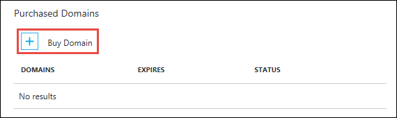

### Configure the domain purchase

In the **App Service Domain** page, in the **Search for domain** box, type the domain name you want to buy and type `Enter`. The suggested available domains are shown just below the text box. Select one or more domains you want to buy. 
   
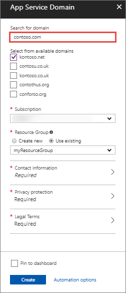

Click the **Contact Information** and fill out the domain's contact information form. When finished, click **OK** to return to the App Service Domain page.
   
It is important that you fill out all required fields with as much accuracy as possible. Incorrect data for contact information can result in failure to purchase domains. 

Next, select the desired options for your domain. See the following table for explanations:

| Setting | Suggested Value | Description |
|-|-|-|
|Auto renew | **Enable** | Renews your App Service Domain automatically every year. Your credit card is charged the same purchase price at the time of renewal. |
|Privacy protection | Enable | Opt in to "Privacy protection", which is included in the purchase price _for free_ (except for top-level domains whose registry do not support privacy protection, such as _.co.in_, _.co.uk_, and so on). |
| Assign default hostnames | **www** and **@** | Select the desired hostname bindings, if desired. When the domain purchase operation is complete, your web app can be accessed at the selected hostnames. If the web app is behind [Azure Traffic Manager](https://azure.microsoft.com/services/traffic-manager/), you don't see the option to assign the root domain (@), because Traffic Manager does not support A records. You can make changes to the hostname assignments after the domain purchase completes. |

### Accept terms and purchase

Click **Legal Terms** to review the terms and the charges, then click **Buy**.

> [!NOTE]
> App Service Domains use Azure DNS to host the domains. In addition to the domain registration fee, usage charges for Azure DNS apply. For information, see [Azure DNS Pricing](https://azure.microsoft.com/pricing/details/dns/).
>
>

Back in the **App Service Domain** page, click **OK**. While the operation is in progress, you see the following notifications:

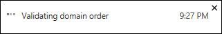

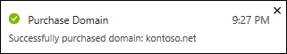

### Test the hostnames

If you have assigned default hostnames to your web app, you also see a success notification for each selected hostname. 

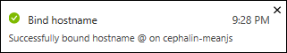

You also see the selected hostnames in the **Custom domains** page, in the **Hostnames** section. 

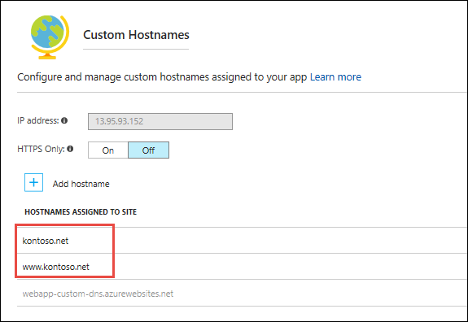

To test the hostnames, navigate to the listed hostnames in the browser. In the example in the preceding screenshot, try navigating to _kontoso.net_ and _www.kontoso.net_.

## Assign hostnames to web app

If you choose not to assign one or more default hostnames to your web app during the purchase process, or if you need to assign a hostname not listed, you can assign a hostname at anytime.

You can also assign hostnames in the App Service Domain to any other web app. The steps depend on whether the App Service Domain and the web app belong to the same subscription.

- Different subscription: Map custom DNS records from the App Service Domain to the web app like an externally purchased domain. For information on adding custom DNS names to an App Service Domain, see [Manage custom DNS records](#custom). To map an external purchased domain to a web app, see [Map an existing custom DNS name to Azure Web Apps](app-service-web-tutorial-custom-domain.md). 
- Same subscription: Use the following steps.

### Launch add hostname
In the **App Services** page, select the name of your web app that you want to assign hostnames to, select **Settings**, and then select **Custom domains**.

Make sure that your purchased domain is listed in the **App Service Domains** section, but don't select it. 

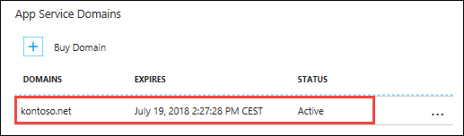

> [!NOTE]
> All App Service Domains in the same subscription are shown in the web app's **Custom domains** page. If your domain is in the web app's subscription, but you cannot see it in the web app's **Custom domains** page, try reopening the **Custom domains** page or refresh the webpage. Also, check the notification bell at the top of the Azure portal for progress or creation failures.
>
>

Select **Add hostname**.

### Configure hostname
In the **Add hostname** dialog, type the fully qualified domain name of your App Service Domain or any subdomain. For example:

- kontoso.net
- www.kontoso.net
- abc.kontoso.net

When finished, select **Validate**. The hostname record type is automatically selected for you.

Select **Add hostname**.

When the operation is complete, you see a success notification for the assigned hostname.  

### Close add hostname
In the **Add hostname** page, assign any other hostname to your web app, as desired. When finished, close the **Add hostname** page.

You should now see the newly assigned hostname(s) in your app's **Custom domains** page.

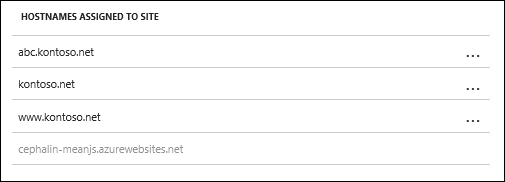

### Test the hostnames

Navigate to the listed hostnames in the browser. In the example in the preceding screenshot, try navigating to _abc.kontoso.net_.

<a name="custom" />

## Manage custom DNS records

In Azure, DNS records for an App Service Domain are managed using [Azure DNS](https://azure.microsoft.com/services/dns/). You can add, remove, and update DNS records, just like for an externally purchased domain.

### Open App Service Domain

In the Azure portal, from the left menu, select **More Services** > **App Service Domains**.

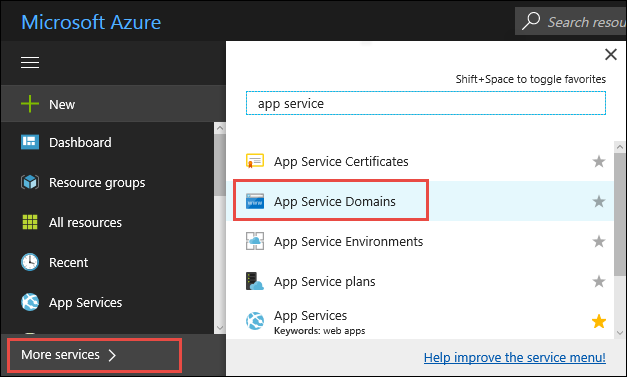

Select the domain to manage. 

### Access DNS zone

In the domain's left menu, select **DNS zone**.

This action opens the [DNS zone](../dns/dns-zones-records.md) page of your App Service Domain in Azure DNS. For information on how to edit DNS records, see [How to manage DNS Zones in the Azure portal](../dns/dns-operations-dnszones-portal.md).

## Cancel purchase (delete domain)

After you purchase the App Service Domain, you have five days to cancel your purchase for a full refund. After five days, you can delete the App Service Domain, but cannot receive a refund.

### Open App Service Domain

In the Azure portal, from the left menu, select **More Services** > **App Service Domains**.

Select the domain to you want to cancel or delete. 

### Delete hostname bindings

In the domain's left menu, select **Hostname bindings**. The hostname bindings from all Azure services are listed here.

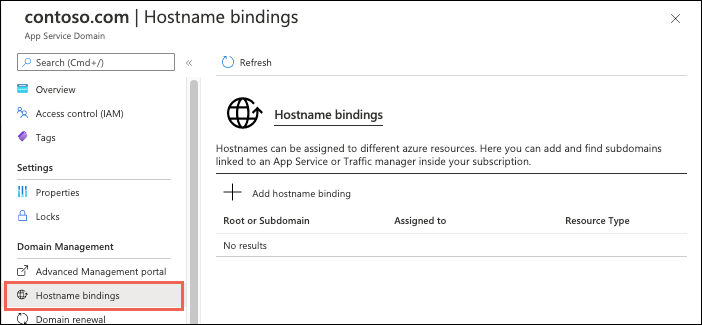

You cannot delete the App Service Domain until all hostname bindings are deleted.

Delete each hostname binding by selecting **...** > **Delete**. After all the bindings are deleted, select **Save**.

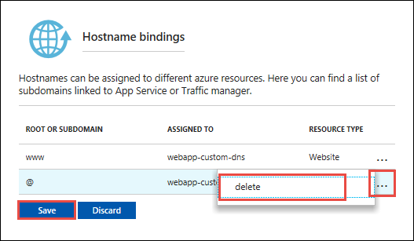

### Cancel or delete

In the domain's left menu, select **Overview**. 

If the cancellation period on the purchased domain has not elapsed, select **Cancel purchase**. Otherwise, you see a **Delete** button instead. To delete the domain without a refund, select **Delete**.

Select **OK** to confirm the operation. If you don't want to proceed, click anywhere outside of the confirmation dialog.

After the operation is complete, the domain is released from your subscription and available for anyone to purchase again. 
