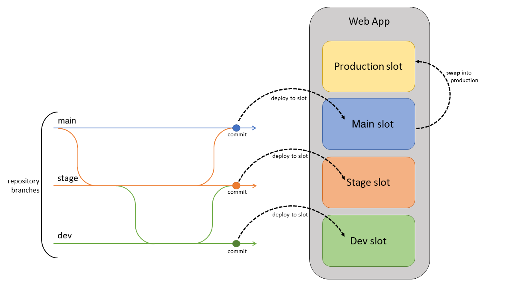
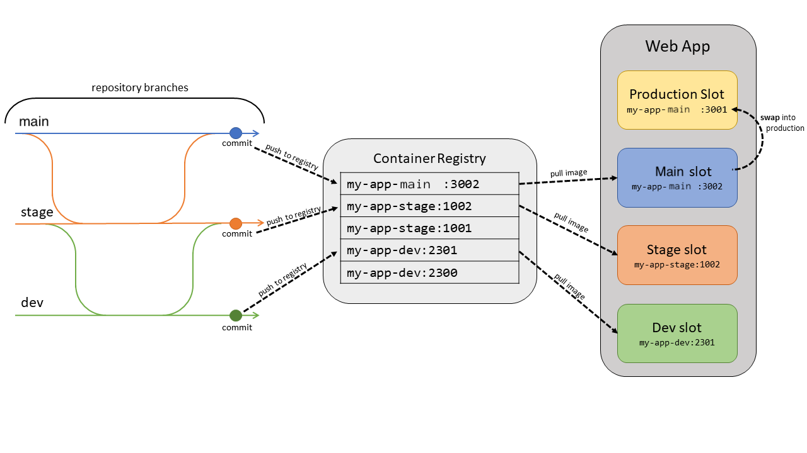

# Deployment Best Practices

Every development team has unique requirements that can make implementing an efficient deployment pipeline difficult on any cloud service. This article introduces the three main components of deploying to App Service: deployment sources, build pipelines, and deployment mechanisms. This article also covers some best practices and tips for specific language stacks.

## Deployment Components

### Deployment Source

A deployment source is the location of your application code. For production apps, the deployment source is usually a repository hosted by version control software such as [GitHub, BitBucket, or Azure Repos](deploy-continuous-deployment.md). For development and test scenarios, the deployment source may be [a project on your local machine](deploy-local-git.md). App Service also supports [OneDrive and Dropbox folders](deploy-content-sync.md) as deployment sources. While cloud folders can make it easy to get started with App Service, it's not typically recommended to use this source for enterprise-level production applications. 

### Build Pipeline

Once you decide on a deployment source, your next step is to choose a build pipeline. A build pipeline reads your source code from the deployment source and executes a series of steps (such as compiling code, minifying HTML and JavaScript, running tests, and packaging components) to get the application in a runnable state. The specific commands executed by the build pipeline depend on your language stack. These operations can be executed on a build server such as Azure Pipelines, or executed locally.

### Deployment Mechanism

The deployment mechanism is the action used to put your built application into the */home/site/wwwroot* directory of your web app. The */wwwroot* directory is a mounted storage location shared by all instances of your web app. When the deployment mechanism puts your application in this directory, your instances receive a notification to sync the new files. App Service supports the following deployment mechanisms:

- Kudu endpoints: [Kudu](https://github.com/projectkudu/kudu/wiki) is the open-source developer productivity tool that runs as a separate process in Windows App Service, and as a second container in Linux App Service. Kudu handles continuous deployments and provides HTTP endpoints for deployment, such as [zipdeploy/](deploy-zip.md).
- FTP and WebDeploy: Using your [site or user credentials](deploy-configure-credentials.md), you can upload files [via FTP](deploy-ftp.md) or WebDeploy. These mechanisms don't go through Kudu.  

Deployment tools such as Azure Pipelines, Jenkins, and editor plugins use one of these deployment mechanisms.

## Use deployment slots

Whenever possible, use [deployment slots](deploy-staging-slots.md) when deploying a new production build. When using a Standard App Service Plan tier or better, you can deploy your app to a staging environment, validate your changes, and do smoke tests. When you're ready, you can swap your staging and production slots. The swap operation warms up the necessary worker instances to match your production scale, thus eliminating downtime.

### Continuously deploy code

If your project has designated branches for testing, QA, and staging, then each of those branches should be continuously deployed to a staging slot. (This is known as the [Gitflow design](https://www.atlassian.com/git/tutorials/comparing-workflows/gitflow-workflow).) This allows your stakeholders to easily assess and test the deployed branch. 

Continuous deployment should never be enabled for your production slot. Instead, your production branch (often main) should be deployed onto a nonproduction slot. When you're ready to release the base branch, swap it into the production slot. Swapping into production—instead of deploying to production—prevents downtime and allows you to roll back the changes by swapping again. 



### Continuously deploy containers

For custom containers from Docker or other container registries, deploy the image into a staging slot and swap into production to prevent downtime. The automation is more complex than code deployment because you must push the image to a container registry and update the image tag on the webapp.

For each branch you want to deploy to a slot, set up automation to do the following on each commit to the branch.

1. **Build and tag the image**. As part of the build pipeline, tag the image with the git commit ID, timestamp, or other identifiable information. It’s best not to use the default “latest” tag. Otherwise, it’s difficult to trace back what code is currently deployed, which makes debugging far more difficult.
1. **Push the tagged image**. Once the image is built and tagged, the pipeline pushes the image to our container registry. In the next step, the deployment slot will pull the tagged image from the container registry.
1. **Update the deployment slot with the new image tag**. When this property is updated, the site will automatically restart and pull the new container image.



There are examples below for common automation frameworks.

### Use Azure DevOps

App Service has [built-in continuous delivery](deploy-continuous-deployment.md) for containers through the Deployment Center. Navigate to your app in the [Azure portal](https://portal.azure.com) and select **Deployment Center** under **Deployment**. Follow the instructions to select your repository and branch. This will configure a DevOps build and release pipeline to automatically build, tag, and deploy your container when new commits are pushed to your selected branch.

### Use GitHub Actions

You can also automate your container deployment [with GitHub Actions](./deploy-ci-cd-custom-container.md).  The workflow file below will build and tag the container with the commit ID, push it to a container registry, and update the specified site slot with the new image tag.

```yaml
name: Build and deploy a container image to Azure Web Apps

on:
  push:
    branches:
    - <your-branch-name>

jobs:
  build-and-deploy:
    runs-on: ubuntu-latest
    
    steps:
    - uses: actions/checkout@main

    -name: Authenticate using a Service Principal
      uses: azure/actions/login@v1
      with:
        creds: ${{ secrets.AZURE_SP }}

    - uses: azure/container-actions/docker-login@v1
      with:
        username: ${{ secrets.DOCKER_USERNAME }}
        password: ${{ secrets.DOCKER_PASSWORD }}

    - name: Build and push the image tagged with the git commit hash
      run: |
        docker build . -t contoso/demo:${{ github.sha }}
        docker push contoso/demo:${{ github.sha }}

    - name: Update image tag on the Azure Web App
      uses: azure/webapps-container-deploy@v1
      with:
        app-name: '<your-webapp-name>'
        slot-name: '<your-slot-name>'
        images: 'contoso/demo:${{ github.sha }}'
```

### Use other automation providers

The steps listed earlier apply to other automation utilities such as CircleCI or Travis CI. However, you need to use the Azure CLI to update the deployment slots with new image tags in the final step. To use the Azure CLI in your automation script, generate a Service Principal using the following command.

```azurecli
az ad sp create-for-rbac --name "myServicePrincipal" --role contributor \
   --scopes /subscriptions/{subscription}/resourceGroups/{resource-group} \
   --sdk-auth
```

In your script, sign in using `az login --service-principal`, providing the principal’s information. You can then use `az webapp config container set` to set the container name, tag, registry URL, and registry password. Below are some helpful links for you to construct your container CI process.

- [How to sign in to the Azure CLI on Circle CI](https://circleci.com/orbs/registry/orb/circleci/azure-cli) 

## Language-Specific Considerations

### Java

Use the Kudu [zipdeploy/](deploy-zip.md) API for deploying JAR applications, and [wardeploy/](deploy-zip.md#deploy-warjarear-packages) for WAR apps. If you're using Jenkins, you can use those APIs directly in your deployment phase. For more information, see [this article](/azure/developer/jenkins/deploy-to-azure-app-service-using-azure-cli).

### Node

By default, Kudu executes the build steps for your Node application (`npm install`). If you're using a build service such as Azure DevOps, then the Kudu build is unnecessary. To disable the Kudu build, create an app setting, `SCM_DO_BUILD_DURING_DEPLOYMENT`, with a value of `false`.

### .NET 

By default, Kudu executes the build steps for your .NET application (`dotnet build`). If you're using a build service such as Azure DevOps, then the Kudu build is unnecessary. To disable the Kudu build, create an app setting, `SCM_DO_BUILD_DURING_DEPLOYMENT`, with a value of `false`.

## Other Deployment Considerations

### Local Cache

Azure App Service content is stored on Azure Storage and is surfaced up in a durable manner as a content share. However, some apps just need a high-performance, read-only content store that they can run with high availability. These apps can benefit from using [local cache](overview-local-cache.md). Local cache isn't recommended for content management sites such as WordPress.

Always use local cache in conjunction with [deployment slots](deploy-staging-slots.md) to prevent downtime. See [this section](overview-local-cache.md#best-practices-for-using-app-service-local-cache) for information on using these features together.

### High CPU or Memory

If your App Service Plan is using over 90% of available CPU or memory, the underlying virtual machine may have trouble processing your deployment. When this happens, temporarily scale up your instance count to perform the deployment. Once the deployment has finished, you can return the instance count to its previous value.

For more information on best practices, visit [App Service Diagnostics](./overview-diagnostics.md) to find out actionable best practices specific to your resource.

- Navigate to your Web App in the [Azure portal](https://portal.azure.com).
- Select on **Diagnose and solve problems** in the left navigation, which opens App Service Diagnostics.
- Choose **Best Practices** homepage tile.
- Select **Best Practices for Availability & Performance** or **Best Practices for Optimal Configuration** to view the current state of your app in regards to these best practices.

You can also use this link to directly open App Service Diagnostics for your resource: `https://portal.azure.com/?websitesextension_ext=asd.featurePath%3Ddetectors%2FParentAvailabilityAndPerformance#@microsoft.onmicrosoft.com/resource/subscriptions/{subscriptionId}/resourceGroups/{resourceGroupName}/providers/Microsoft.Web/sites/{siteName}/troubleshoot`.

## More resources

[Environment variables and app settings reference](reference-app-settings.md)
