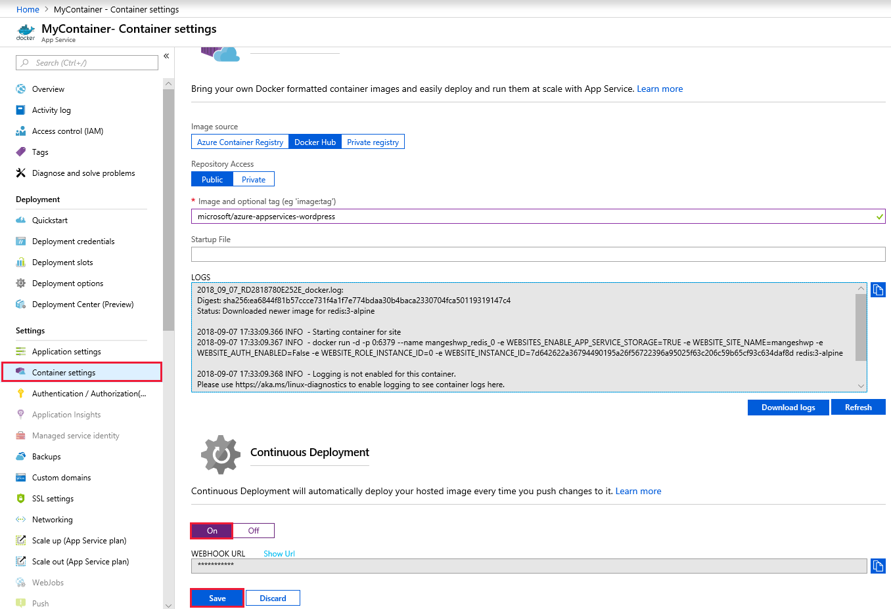

# Continuous deployment with Web App for Containers

In this tutorial, you configure continuous deployment for a custom container image from managed [Azure Container Registry](https://azure.microsoft.com/services/container-registry/) repositories or [Docker Hub](https://hub.docker.com).

## Enable continuous deployment with ACR


1. Sign in to the [Azure portal](https://portal.azure.com).
2. Select the **App Service** option on the left side of the page.
3. Select the name of the app for which you want to configure continuous deployment.
4. On the **Container Settings** page, select **Single Container**
5. Select **Azure Container Registry**
6. Select **Continuous Deployment > On**
7. Select **Save** to enable continuous deployment.

## Use the ACR webhook

Once Continuous Deployment has been enabled, you can view the newly created webhook on your Azure Container Registry webhooks page.


In your Container Registry, click on Webhooks to view the current webhooks.

## Enable continuous deployment with Docker Hub (optional)

1. Sign in to the [Azure portal](https://portal.azure.com).
2. Select the **App Service** option on the left side of the page.
3. Select the name of the app for which you want to configure continuous deployment.
4. On the **Container Settings** page, select **Single Container**
5. Select **Docker Hub**
6. Select **Continuous Deployment > On**
7. Select **Save** to enable continuous deployment.



Copy the Webhook URL. To add a webhook for Docker Hub, follow <a href="https://docs.docker.com/docker-hub/webhooks/" target="_blank">webhooks for Docker Hub</a>.

## Automate with CLI

To configure CI/CD using the Azure CLI, run the [az webapp deployment container config](/cli/azure/webapp/deployment/container?view=azure-cli-latest#az-webapp-deployment-container-config) command to generate the webhook URL. The URL can be used to configure your DockerHub or Azure Container Registry.

```azurecli-interactive
az webapp deployment container config --name <app-name> --resource-group <group-name> --enable-cd true
```

## Next steps

* [Azure Container Registry](https://azure.microsoft.com/services/container-registry/)
* [Create a .NET Core web app in App Service on Linux](quickstart-dotnetcore.md?pivots=platform-linux)
* [Create a Ruby web app in App Service on Linux](quickstart-ruby.md)
* [Quickstart: Run a custom container on App Service](quickstart-custom-container.md?pivots=container-linux)
* [App Service on Linux FAQ](faq-app-service-linux.md)
* [Configure custom Linux containers](configure-custom-container.md)