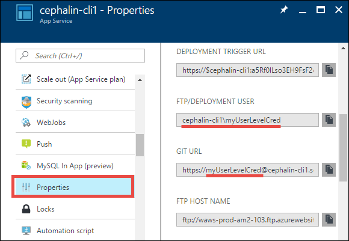
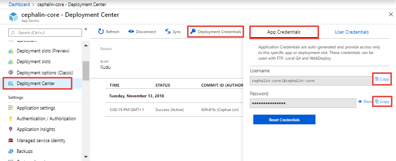

# Configure deployment credentials for Azure App Service
[Azure App Service](https://go.microsoft.com/fwlink/?LinkId=529714) supports two types of credentials for [local Git deployment](deploy-local-git.md) 
and [FTP/S deployment](deploy-ftp.md). These credentials are not the same as your Azure Active Directory credentials.

* **User-level credentials**: one set of credentials for the entire Azure account. It can be used to deploy to App Service for any app, in any subscription, that the Azure account has permission to access. It's the default set that's surfaced in the portal GUI (such as the **Overview** and **Properties**
of the app's [resource page](../azure-resource-manager/manage-resources-portal.md#manage-resources)). When a user is granted app access via Role-Based Access Control (RBAC) or coadmin permissions, that user can use their own user-level credentials until the access is revoked. Do not share these credentials with other Azure users.

* **App-level credentials**: one set of credentials for each app. It can be used to deploy to that app only. The credentials for each app are generated automatically at app creation. They can't be configured manually, but can be reset anytime. For a user to be granted access to app-level credentials via (RBAC), that user must be contributor or higher on the app. Readers are not allowed to publish, and can't access those credentials.

## Set and reset user-level credentials

You can configure your user-level credentials in any app's [resource page](../azure-resource-manager/manage-resources-portal.md#manage-resources). Regardless in which app you configure these credentials, it applies to all apps and for all subscriptions in your Azure account. 

To configure your user-level credentials:

1. In the [Azure portal](https://portal.azure.com), from the left menu, click **App Services** > **&lt;any_app>** > **Deployment center** > **Deployment credentials**.

    In the portal, you must have at least one app before you can access the deployment credentials page. However, with the [Azure CLI](/cli/azure/webapp/deployment/user?view=azure-cli-latest#az-webapp-deployment-user-set), you can configure user-level credentials without an existing app.

2. Click **User Credentials**, configure the user name and password, and then click **Save Credentials**.

    

Once you have set your deployment credentials, you can find the *Git* deployment username in your app's **Overview**,

and *FTP* deployment username in your app's **Properties**.

> [!NOTE]
> Azure does not show your user-level deployment password. If you forget the password, you can reset your credentials by following the steps in this section.
>
>  

## Use user-level credentials with FTP/FTPS

Authenticating to an FTP/FTPS endpoint using user-level credentials requirers a username in the following format:
`<app-name>\<user-name>`

Since user-level credentials are linked to the user and not a specific resource, the username must be in this format to direct the sign-in action to the right app endpoint.

## Get and reset app-level credentials
To get the app-level credentials:

1. In the [Azure portal](https://portal.azure.com), from the left menu, click **App Services** > **&lt;any_app>** > **Deployment center** > **Deployment credentials**.

2. Click **App Credentials**, and click the **Copy** link to copy the username or password.

    

To reset the app-level credentials, click **Reset Credentials** in the same dialog.

## Next steps

Find out how to use these credentials to deploy your app from [local Git](deploy-local-git.md) or using [FTP/S](deploy-ftp.md).
