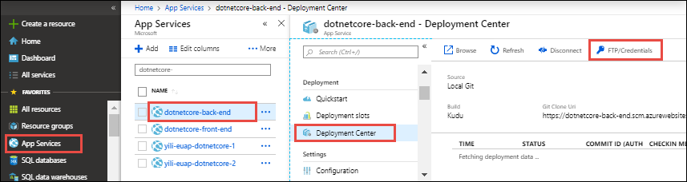

# Configure deployment credentials for Azure App Service
[Azure App Service](https://go.microsoft.com/fwlink/?LinkId=529714) supports two types of credentials for [local Git deployment](deploy-local-git.md) 
and [FTP/S deployment](deploy-ftp.md). These credentials are not the same as your Azure subscription credentials.

[!INCLUDE [app-service-deploy-credentials](../../includes/app-service-deploy-credentials.md)]

## <a name="userscope"></a>Configure user-level credentials

You can configure your user-level credentials in any app's [resource page](../azure-resource-manager/management/manage-resources-portal.md#manage-resources). Regardless in which app you configure these credentials, it applies to all apps and for all subscriptions in your Azure account. 

### In the Cloud Shell

To configure the deployment user in the [Cloud Shell](https://shell.azure.com), run the [az webapp deployment user set](/cli/azure/webapp/deployment/user?view=azure-cli-latest#az-webapp-deployment-user-set) command. Replace \<username> and \<password> with a deployment user username and password. 

- The username must be unique within Azure, and for local Git pushes, must not contain the ‘@’ symbol. 
- The password must be at least eight characters long, with two of the following three elements: letters, numbers, and symbols. 

```azurecli-interactive
az webapp deployment user set --user-name <username> --password <password>
```

The JSON output shows the password as `null`. If you get a `'Conflict'. Details: 409` error, change the username. If you get a `'Bad Request'. Details: 400` error, use a stronger password. 

### In the portal

In the Azure portal, you must have at least one app before you can access the deployment credentials page. To configure your user-level credentials:

1. In the [Azure portal](https://portal.azure.com), from the left menu, select **App Services** > **\<any_app>** > **Deployment center** > **FTP** > **Dashboard**.

    

    Or, if you've already configured Git deployment, select **App Services** > **&lt;any_app>** > **Deployment center** > **FTP/Credentials**.

    

2. Select **User Credentials**, configure the user name and password, and then select **Save Credentials**.

Once you have set your deployment credentials, you can find the *Git* deployment username in your app's **Overview** page,


If Git deployment is configured, the page shows a **Git/deployment username**; otherwise, an **FTP/deployment username**.

> [!NOTE]
> Azure does not show your user-level deployment password. If you forget the password, you can reset your credentials by following the steps in this section.
>
> 

## Use user-level credentials with FTP/FTPS

Authenticating to an FTP/FTPS endpoint using user-level credentials requirers a username in the following format:
`<app-name>\<user-name>`

Since user-level credentials are linked to the user and not a specific resource, the username must be in this format to direct the sign-in action to the right app endpoint.

## <a name="appscope"></a>Get and reset app-level credentials
To get the app-level credentials:

1. In the [Azure portal](https://portal.azure.com), from the left menu, select **App Services** > **&lt;any_app>** > **Deployment center** > **FTP/Credentials**.

2. Select **App Credentials**, and select the **Copy** link to copy the username or password.

To reset the app-level credentials, select **Reset Credentials** in the same dialog.

## Next steps

Find out how to use these credentials to deploy your app from [local Git](deploy-local-git.md) or using [FTP/S](deploy-ftp.md).
