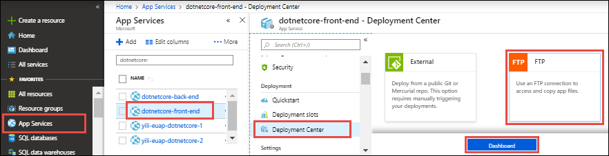
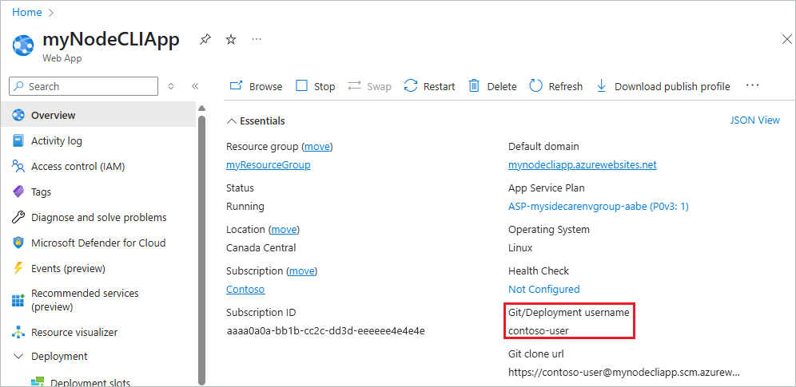

# Configure deployment credentials for Azure App Service
To secure app deployment from a local computer, [Azure App Service](./overview.md) supports two types of credentials for [local Git deployment](deploy-local-git.md) 
and [FTP/S deployment](deploy-ftp.md). These credentials are not the same as your Azure subscription credentials.

[!INCLUDE [app-service-deploy-credentials](../../includes/app-service-deploy-credentials.md)]

> [!NOTE]
> The **Development Center (Classic)** page in the Azure portal, which is the old deployment experience, will be deprecated in March, 2021. This change will not affect any existing deployment settings in your app, and you can continue to manage app deployment in the **Deployment Center** page.

## <a name="userscope"></a>Configure user-scope credentials

# [Azure CLI](#tab/cli)

Run the [az webapp deployment user set](/cli/azure/webapp/deployment/user#az-webapp-deployment-user-set) command. Replace \<username> and \<password> with a deployment user username and password. 

- The username must be unique within Azure, and for local Git pushes, must not contain the ‘@’ symbol. 
- The password must be at least eight characters long, with two of the following three elements: letters, numbers, and symbols. 

```azurecli-interactive
az webapp deployment user set --user-name <username> --password <password>
```

The JSON output shows the password as `null`.

# [Azure PowerShell](#tab/powershell)

You can't configure the user-scope credentials with Azure PowerShell. Use a different method, or consider [using application-scope credentials](#appscope). 

# [Azure portal](#tab/portal)

You can configure your user-scope credentials in any app's [resource page](../azure-resource-manager/management/manage-resources-portal.md#manage-resources). Regardless in which app you configure these credentials, it applies to all apps for all subscriptions in your Azure account. 

In the [Azure portal](https://portal.azure.com), you must have at least one app before you can access the deployment credentials page. To configure your user-scope credentials:

1. From the left menu of your app, select > **Deployment center** > **FTPS credentials** or **Local Git/FTPS credentials**.

    

2. Scroll down to **User scope**, configure the **Username** and **Password**, and then select **Save**.

Once you have set your deployment credentials, you can find the *Git* deployment username in your app's **Overview** page,



If Git deployment is configured, the page shows a **Git/deployment username**; otherwise, an **FTP/deployment username**.

> [!NOTE]
> Azure does not show your user-scope deployment password. If you forget the password, you can reset your credentials by following the steps in this section.
>
> 

-----

## Use user-scope credentials with FTP/FTPS

Authenticating to an FTP/FTPS endpoint using user-scope credentials requires a username in the following format:
`<app-name>\<user-name>`

Since user-scope credentials are linked to the user and not a specific resource, the username must be in this format to direct the sign-in action to the right app endpoint.

## <a name="appscope"></a>Get application-scope credentials

# [Azure CLI](#tab/cli)

Get the application-scope credentials using the [az webapp deployment list-publishing-profiles](/cli/azure/webapp/deployment#az-webapp-deployment-list-publishing-profiles) command. For example:

```azurecli-interactive
az webapp deployment list-publishing-profiles --resource-group <group-name> --name <app-name>
```

For [local Git deployment](deploy-local-git.md), you can also use the [az webapp deployment list-publishing-credentials](/cli/azure/webapp/deployment#az-webapp-deployment-list-publishing-credentials) command to get a Git remote URI for your app, with the application-scope credentials already embedded. For example:

```azurecli-interactive
az webapp deployment list-publishing-credentials --resource-group <group-name> --name <app-name> --query scmUri
```

# [Azure PowerShell](#tab/powershell)

Get the application-scope credentials using the [Get-AzWebAppPublishingProfile](/powershell/module/az.websites/get-azwebapppublishingprofile) command. For example:

```azurepowershell-interactive
Get-AzWebAppPublishingProfile -ResourceGroupName <group-name> -Name <app-name>
```

# [Azure portal](#tab/portal)

1. From the left menu of your app, select **Deployment center** > **FTPS credentials** or **Local Git/FTPS credentials**.

    

2. In the **Application scope** section, select the **Copy** link to copy the username or password.

-----

## Reset application-scope credentials

# [Azure CLI](#tab/cli)

Reset the application-scope credentials using the [az resource invoke-action](/cli/azure/resource#az-resource-invoke-action) command:

```azurecli-interactive
az resource invoke-action --action newpassword --resource-group <group-name> --name <app-name> --resource-type Microsoft.Web/sites
```

# [Azure PowerShell](#tab/powershell)

Reset the application-scope credentials using the [Invoke-AzResourceAction](/powershell/module/az.resources/invoke-azresourceaction) command:

```azurepowershell-interactive
Invoke-AzResourceAction -ResourceGroupName <group-name> -ResourceType Microsoft.Web/sites -ResourceName <app-name> -Action newpassword
```

# [Azure portal](#tab/portal)

1. From the left menu of your app, select **Deployment center** > **FTPS credentials** or **Local Git/FTPS credentials**.

    

2. In the **Application scope** section, select **Reset**.

-----

## Disable basic authentication

Some organizations need to meet security requirements and would rather disable access via FTP or WebDeploy. This way, the organization's members can only access its App Services through APIs that are controlled by Microsoft Entra ID.

### FTP

To disable FTP access to the site, run the following CLI command. Replace the placeholders with your resource group and site name. 

```azurecli-interactive
az resource update --resource-group <resource-group> --name ftp --namespace Microsoft.Web --resource-type basicPublishingCredentialsPolicies --parent sites/<site-name> --set properties.allow=false
```

To confirm that FTP access is blocked, you can try to authenticate using an FTP client such as FileZilla. To retrieve the publishing credentials, go to the overview blade of your site and click Download Publish Profile. Use the file’s FTP hostname, username, and password to authenticate, and you will get a 401 error response, indicating that you are not authorized.

### WebDeploy and SCM

To disable basic auth access to the WebDeploy port and SCM site, run the following CLI command. Replace the placeholders with your resource group and site name. 

```azurecli-interactive
az resource update --resource-group <resource-group> --name scm --namespace Microsoft.Web --resource-type basicPublishingCredentialsPolicies --parent sites/<site-name> --set properties.allow=false
```

To confirm that the publish profile credentials are blocked on WebDeploy, try [publishing a web app using Visual Studio 2019](/visualstudio/deployment/quickstart-deploy-to-azure).

### Disable access to the API

The API in the previous section is backed Azure role-based access control (Azure RBAC), which means you can [create a custom role](../role-based-access-control/custom-roles.md#steps-to-create-a-custom-role) and assign lower-priveldged users to the role so they cannot enable basic auth on any sites. To configure the custom role, [follow these instructions](https://azure.github.io/AppService/2020/08/10/securing-data-plane-access.html#create-a-custom-rbac-role).

You can also use [Azure Monitor](https://azure.github.io/AppService/2020/08/10/securing-data-plane-access.html#audit-with-azure-monitor) to audit any successful authentication requests and use [Azure Policy](https://azure.github.io/AppService/2020/08/10/securing-data-plane-access.html#enforce-compliance-with-azure-policy) to enforce this configuration for all sites in your subscription.

## Next steps

Find out how to use these credentials to deploy your app from [local Git](deploy-local-git.md) or using [FTP/S](deploy-ftp.md).
