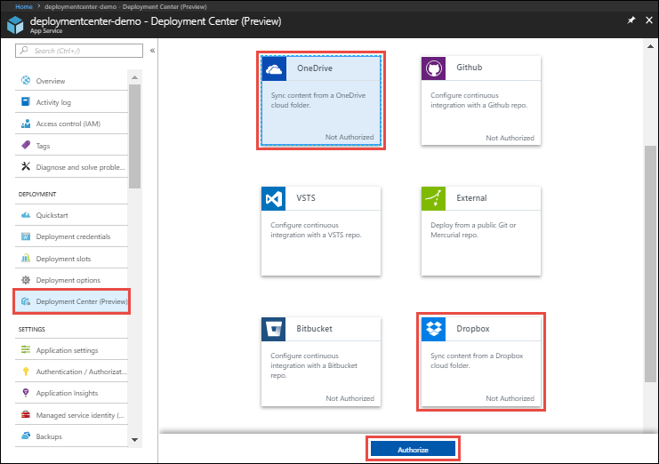
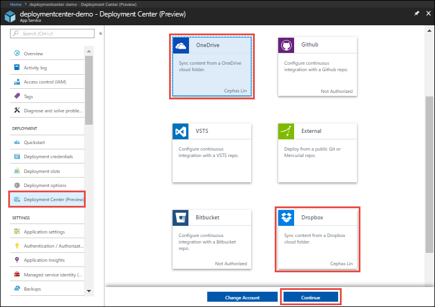
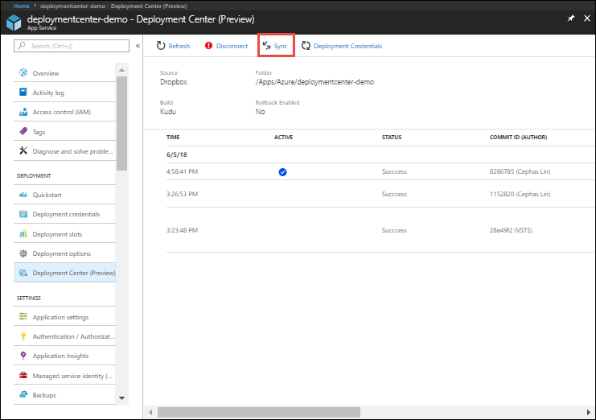
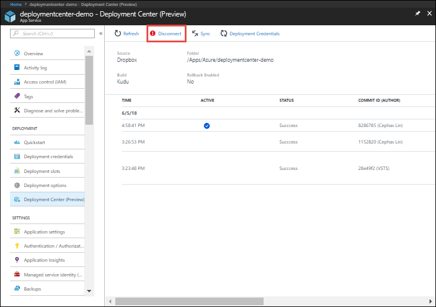

# Sync content from a cloud folder to Azure App Service
This article shows you how to sync your content to [Azure App Service](https://go.microsoft.com/fwlink/?LinkId=529714) from Dropbox and OneDrive. 

The on-demand content sync deployment is powered by the App Service [Kudu deployment engine](https://github.com/projectkudu/kudu/wiki). You can, work with your app code and content in a designated cloud folder, and then sync to App Service with the click of a button. Content sync uses the Kudu build server. 

## Enable content sync deployment

To enable content sync, navigate to your App Service app page in the [Azure portal](https://portal.azure.com).

In the left menu, click **Deployment Center** > **OneDrive** or **Dropbox** > **Authorize**. Follow the authorization prompts. 

You only need to authorize with OneDrive or Dropbox once. If you're already authorized, just click **Continue**. You can change the authorized OneDrive or Dropbox account by clicking **Change account**.

In the **Configure** page, select the folder you want to synchronize. This folder is created under the following designated content path in OneDrive or Dropbox. 
   
* **OneDrive**: `Apps\Azure Web Apps`
* **Dropbox**: `Apps\Azure`

When finished, click **Continue**.

In the **Summary** page, verify your options and click **Finish**.

## Synchronize content

When you want to synchronize content in your cloud folder with App Service, go back to the **Deployment Center** page and click **Sync**.

   
   > [!NOTE]
   > Because of underlying differences in the APIs, **OneDrive for Business** is not supported at this time. 
   > 
   > 

## Disable content sync deployment

To disable content sync, navigate to your App Service app page in the [Azure portal](https://portal.azure.com).

In the left menu, click **Deployment Center** > **Disconnect**.

[!INCLUDE [What happens to my app during deployment?](../../includes/app-service-deploy-atomicity.md)]

## Next steps

> [!div class="nextstepaction"]
> [Deploy from local Git repo](deploy-local-git.md)
