# Continuous deployment to Azure App Service

[Azure App Service](overview.md) enables continuous deployment from GitHub, BitBucket, and [Azure Repos](https://azure.microsoft.com/services/devops/repos/) repositories by pulling in the latest updates. This article shows you how to use the Azure portal to continuously deploy your app through the Kudu build service or [Azure Pipelines](https://azure.microsoft.com/services/devops/pipelines/). 

For more information on the source control services, see [Create a repo (GitHub)], [Create a repo (BitBucket)], or [Create a new Git repo (Azure Repos)].

[!INCLUDE [Prepare repository](../../includes/app-service-deploy-prepare-repo.md)]

## Authorize Azure App Service 

To use Azure Repos, make sure your Azure DevOps organization is linked to your Azure subscription. For more information, see [Set up an Azure DevOps Services account so it can deploy to a web app](https://docs.microsoft.com/azure/devops/pipelines/apps/cd/deploy-webdeploy-webapps?view=azure-devops).

For Bitbucket or GitHub, authorize Azure App Service to connect to your repository. You only need to authorize with a source control service once. 

1. In the [Azure portal](https://portal.azure.com), search for  **App Services** and select.

   

1. Select the App Service you want to deploy.

   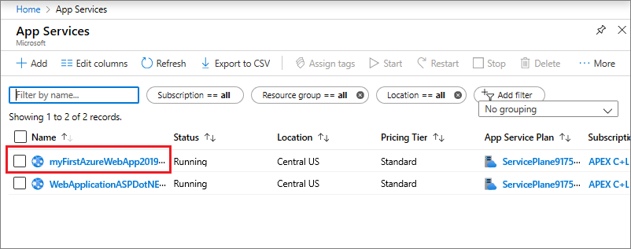
   
1. On the app page, select **Deployment Center** in the left menu.
   
1. On the **Deployment Center** page, select **GitHub** or **Bitbucket**, and then select **Authorize**. 
   
   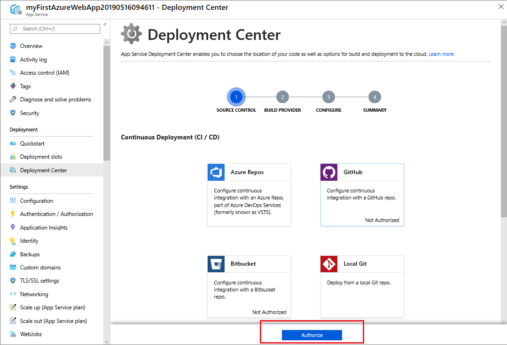
   
1. Sign in to the service if necessary, and follow the authorization prompts. 

## Enable continuous deployment 

After you authorize a source control service, configure your app for continuous deployment through the built-in [Kudu App Service](#option-1-kudu-app-service) build server, or through [Azure Pipelines](#option-2-azure-pipelines). 

### Option 1: Kudu App Service

You can use the built-in Kudu App Service build server to continuously deploy from GitHub, Bitbucket, or Azure Repos. 

1. In the [Azure portal](https://portal.azure.com), search for **App Services**, and then select the App Service you want to deploy. 
   
1. On the app page, select **Deployment Center** in the left menu.
   
1. Select your authorized source control provider on the **Deployment Center** page, and select **Continue**. For GitHub or Bitbucket, you can also select **Change account** to change the authorized account. 
   
   > [!NOTE]
   > To use Azure Repos, make sure your Azure DevOps Services organization is linked to your Azure subscription. For more information, see [Set up an Azure DevOps Services account so it can deploy to a web app](https://docs.microsoft.com/azure/devops/pipelines/apps/cd/deploy-webdeploy-webapps?view=azure-devops).
   
1. For GitHub or Azure Repos, on the **Build provider** page, select **App Service build service**, and then select **Continue**. Bitbucket always uses the App Service build service.
   
   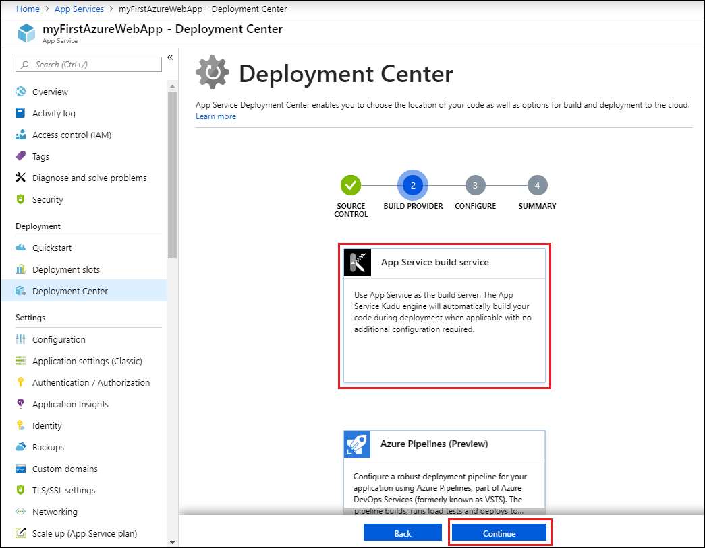
   
1. On the **Configure** page:
   
   - For GitHub, drop down and select the **Organization**, **Repository**, and **Branch** you want to deploy continuously.
     
     > [!NOTE]
     > If you don't see any repositories, you may need to authorize Azure App Service in GitHub. Browse to your GitHub repository and go to **Settings** > **Applications** > **Authorized OAuth Apps**. Select **Azure App Service**, and then select **Grant**. For organization repositories, you must be an owner of the organization to grant the permissions.
     
   - For Bitbucket, select the Bitbucket **Team**, **Repository**, and **Branch** you want to deploy continuously.
     
   - For Azure Repos, select the **Azure DevOps Organization**, **Project**, **Repository**, and **Branch** you want to deploy continuously.
     
     > [!NOTE]
     > If your Azure DevOps organization isn't listed, make sure it's linked to your Azure subscription. For more information, see [Set up an Azure DevOps Services account so it can deploy to a web app](https://docs.microsoft.com/azure/devops/pipelines/apps/cd/deploy-webdeploy-webapps?view=azure-devops)..
     
1. Select **Continue**.
   
   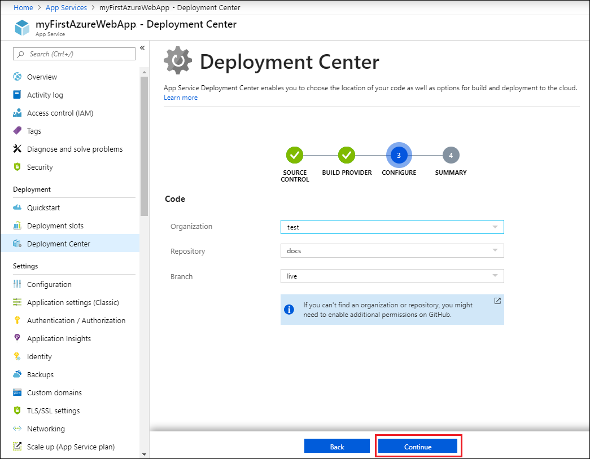
   
1. After you configure the build provider, review the settings on the **Summary** page, and then select **Finish**.
   
1. New commits in the selected repository and branch now deploy continuously into your App Service app. You can track the commits and deployments on the **Deployment Center** page.
   
   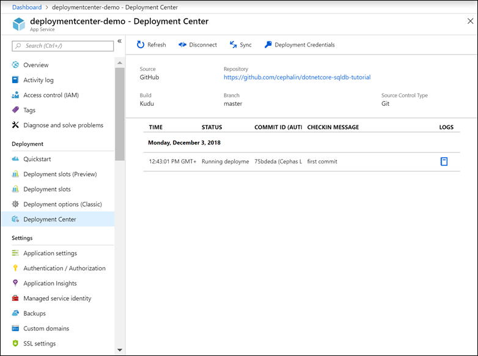

### Option 2: Azure Pipelines 

If your account has the necessary permissions, you can set up Azure Pipelines to continuously deploy from GitHub or Azure Repos. For more information about deploying through Azure Pipelines, see [Deploy a web app to Azure App Services](/azure/devops/pipelines/apps/cd/deploy-webdeploy-webapps).

#### Prerequisites

For Azure App Service to create continuous delivery using Azure Pipelines, your Azure DevOps organization should have the following permissions: 

- Your Azure account must have permissions to write to Azure Active Directory and create a service. 
  
- Your Azure account must have the **Owner** role in your Azure subscription.

- You must be an administrator in the Azure DevOps project you want to use.

#### GitHub + Azure Pipelines

1. In the [Azure portal](https://portal.azure.com), search for **App Services**, and then select the App Service you want to deploy. 
   
1. On the app page, select **Deployment Center** in the left menu.

1. Select **GitHub** as the source control provider on the **Deployment Center** page and select **Continue**. For **GitHub**, you can select **Change Account** to change the authorized account.

    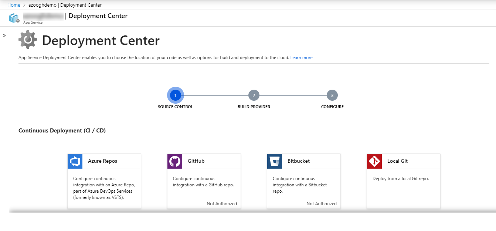
   
1. On the **Build Provider** page, select **Azure Pipelines (Preview)**, and then select **Continue**.

    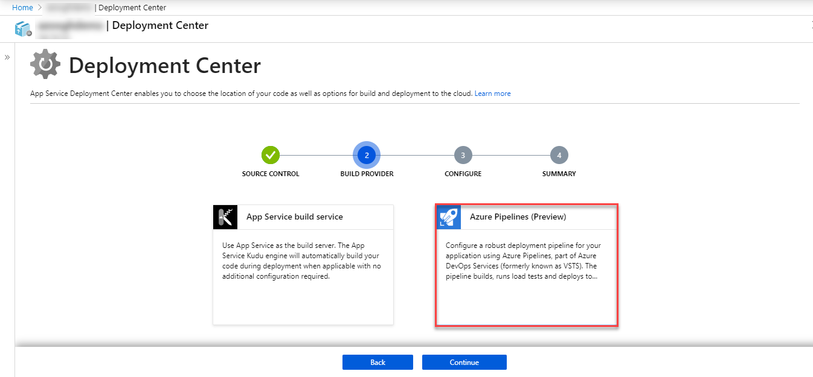
   
1. On the **Configure** page, in the **Code** section, select the **Organization**, **Repository**, and **Branch** you want to deploy continuously and select **Continue**.
     
     > [!NOTE]
     > If you don't see any repositories, you may need to authorize Azure App Service in GitHub. Browse to your GitHub repository and go to **Settings** > **Applications** > **Authorized OAuth Apps**. Select **Azure App Service**, and then select **Grant**. For organization repositories, you must be an owner of the organization to grant the permissions.
       
    In the **Build** section, specify the Azure DevOps Organization, Project, language framework that Azure Pipelines should use to run build tasks, and then select **Continue**.

   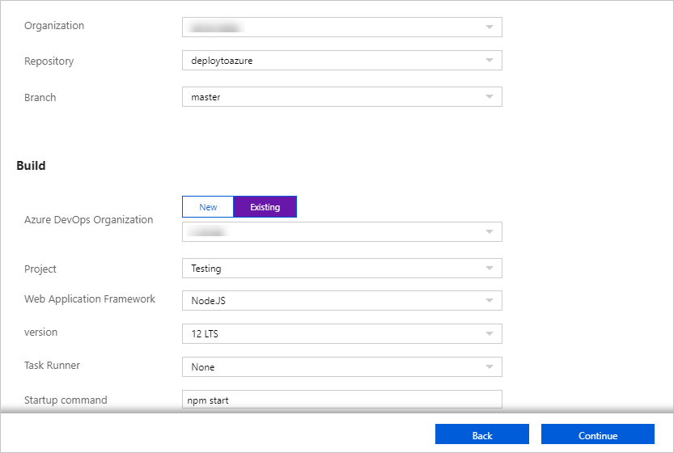

1. After you configure the build provider, review the settings on the **Summary** page, and then select **Finish**.

   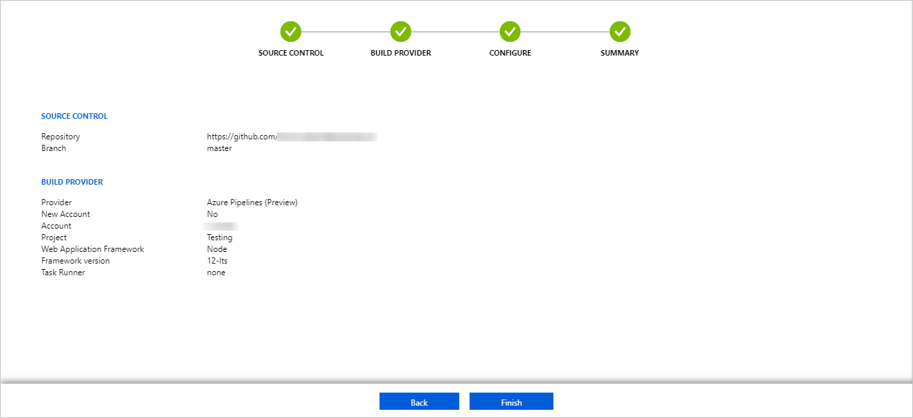
   
1. New commits in the selected repository and branch now deploy continuously into your App Service. You can track the commits and deployments on the **Deployment Center** page.
   
   

#### Azure Repos + Azure Pipelines

1. In the [Azure portal](https://portal.azure.com), search for **App Services**, and then select the App Service you want to deploy. 
   
1. On the app page, select **Deployment Center** in the left menu.

1. Select **Azure Repos** as the source control provider on the **Deployment Center** page and select **Continue**.

    

1. On the **Build Provider** page, select **Azure Pipelines (Preview)**, and then select **Continue**.

    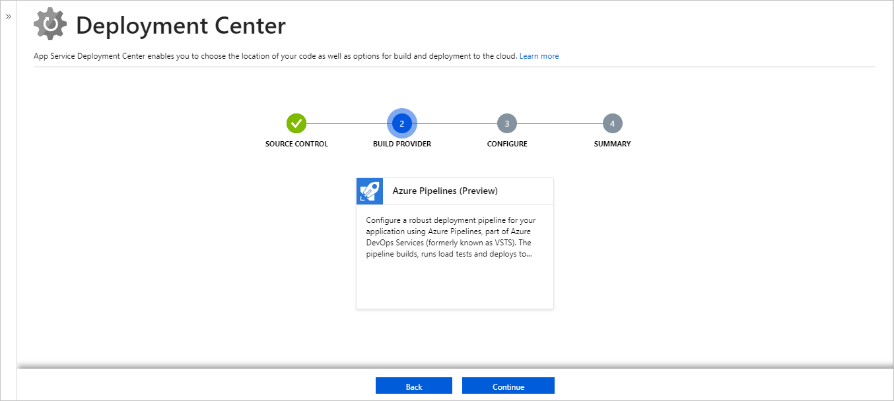

1. On the **Configure** page, in the **Code** section, select the **Organization**, **Repository**, and **Branch** you want to deploy continuously and select **Continue**.

   > [!NOTE]
   > If your existing Azure DevOps organization isn't listed, you may need to link it to your Azure subscription. For more information, see [Define your CD release pipeline](/azure/devops/pipelines/apps/cd/deploy-webdeploy-webapps#cd).

   In the **Build** section, specify the Azure DevOps Organization, Project, language framework that Azure Pipelines should use to run build tasks, and then select **Continue**.

   

1. After you configure the build provider, review the settings on the **Summary** page, and then select **Finish**.  
     
   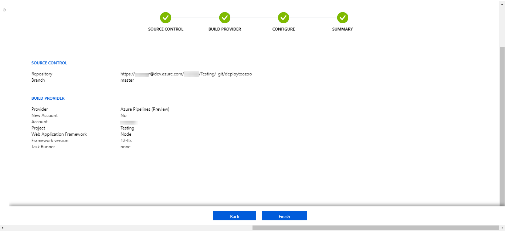

1. New commits in the selected repository and branch now deploy continuously into your App Service. You can track the commits and deployments on the **Deployment Center** page.

## Disable continuous deployment

To disable continuous deployment, select **Disconnect** at the top of your app's **Deployment Center** page.

[!INCLUDE [What happens to my app during deployment?](../../includes/app-service-deploy-atomicity.md)]

## Use unsupported repos

For Windows apps, you can manually configure continuous deployment from a cloud Git or Mercurial repository that the portal doesn't directly support, such as [GitLab](https://gitlab.com/). You do it by choosing the External box in the **Deployment Center** page. For more information, see [Set up continuous deployment using manual steps](https://github.com/projectkudu/kudu/wiki/Continuous-deployment#setting-up-continuous-deployment-using-manual-steps).

## Additional resources

* [Investigate common issues with continuous deployment](https://github.com/projectkudu/kudu/wiki/Investigating-continuous-deployment)
* [Use Azure PowerShell](/powershell/azureps-cmdlets-docs)
* [Git documentation](https://git-scm.com/documentation)
* [Project Kudu](https://github.com/projectkudu/kudu/wiki)

[Create a repo (GitHub)]: https://help.github.com/articles/create-a-repo
[Create a repo (BitBucket)]: https://confluence.atlassian.com/get-started-with-bitbucket/create-a-repository-861178559.html
[Create a new Git repo (Azure Repos)]: /azure/devops/repos/git/creatingrepo
