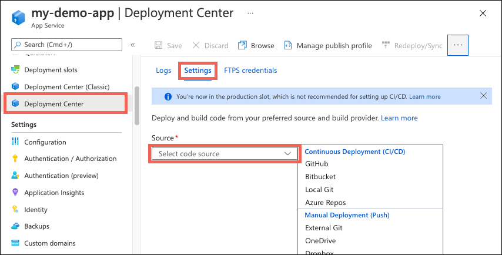
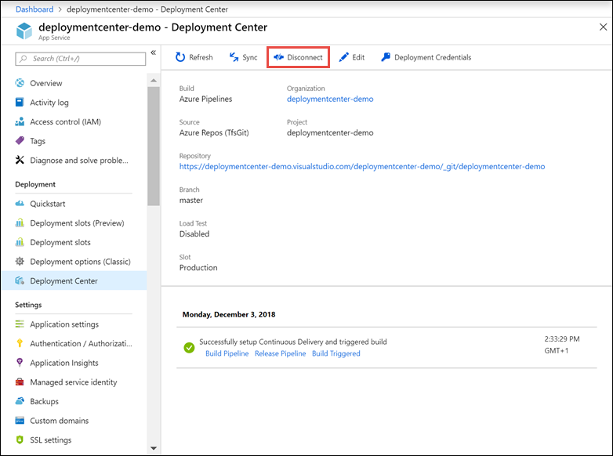

# Continuous deployment to Azure App Service

[Azure App Service](overview.md) enables continuous deployment from [GitHub](https://help.github.com/articles/create-a-repo), [Bitbucket](https://confluence.atlassian.com/get-started-with-bitbucket/create-a-repository-861178559.html), and [Azure Repos](/azure/devops/repos/git/creatingrepo) repositories by pulling in the latest updates.

> [!NOTE]
> The **Development Center (Classic)** page in the Azure portal, an earlier version of the deployment functionality, was deprecated in March 2021. This change doesn't affect existing deployment settings in your app, and you can continue to manage app deployment from the **Deployment Center** page in the portal.

[!INCLUDE [Prepare repository](../../includes/app-service-deploy-prepare-repo.md)]

## Configure the deployment source

1. In the [Azure portal](https://portal.azure.com), go to the management page for your App Service app.

1. In the left pane, select **Deployment Center**. Then select **Settings**. 

1. In the **Source** box, select one of the CI/CD options:

    

Select the tab that corresponds to your build provider to continue.

# [GitHub](#tab/github)

4. [GitHub Actions](#how-does-the-github-actions-build-provider-work) is the default build provider. To change the provider, select **Change provider** > **App Service Build Service** (Kudu) > **OK**.

    > [!NOTE]
    > To use Azure Pipelines as the build provider for your App Service app, configure CI/CD directly from Azure Pipelines. Don't configure it in App Service. The **Azure Pipelines** option just points you in the right direction.

1. If you're deploying from GitHub for the first time, select **Authorize** and follow the authorization prompts. If you want to deploy from a different user's repository, select **Change Account**.

1. After you authorize your Azure account with GitHub, select the **Organization**, **Repository**, and **Branch** to configure CI/CD for. 

    If you can’t find an organization or repository, you might need to enable more permissions on GitHub. For more information, see [Managing access to your organization's repositories](https://docs.github.com/organizations/managing-access-to-your-organizations-repositories).

1. (Preview) Under **Authentication type**, select **User-assigned identity** for better security. For more information, see [frequently asked questions]().

1. When **GitHub Actions** is selected as the build provider, you can select the workflow file you want by using the **Runtime stack** and **Version** dropdown lists. Azure commits this workflow file into your selected GitHub repository to handle build and deploy tasks. To see the file before saving your changes, select **Preview file**.

    > [!NOTE]
    > App Service detects the [language stack setting](configure-common.md#configure-language-stack-settings) of your app and selects the most appropriate workflow template. If you choose a different template, it might deploy an app that doesn't run properly. For more information, see [How the GitHub Actions build provider works](#how-does-the-github-actions-build-provider-work).

1. Select **Save**.
   
    New commits in the selected repository and branch now deploy continuously into your App Service app. You can track the commits and deployments on the **Logs** tab.

# [Bitbucket](#tab/bitbucket)

The Bitbucket integration uses the App Service Build Services (Kudu) for build automation.

4. If you're deploying from Bitbucket for the first time, select **Authorize** and follow the authorization prompts. If you want to deploy from a different user's repository, select **Change Account**.

1. For Bitbucket, select the Bitbucket **Team**, **Repository**, and **Branch** you want to deploy continuously.

1. Select **Save**.
   
    New commits in the selected repository and branch now deploy continuously into your App Service app. You can track the commits and deployments on the **Logs** tab.
   
# [Local Git](#tab/local)

See [Local Git deployment to Azure App Service](deploy-local-git.md).

# [Azure Repos](#tab/repos)
   
   > [!NOTE]
   > Azure Repos is supported as a deployment source for Windows apps.
   >

4. App Service Build Service (Kudu) is the default build provider.

    > [!NOTE]
    > To use Azure Pipelines as the build provider for your App Service app, configure CI/CD directly from Azure Pipelines. Don't configure it in App Service. The **Azure Pipelines** option just points you in the right direction.

1. Select the **Azure DevOps Organization**, **Project**, **Repository**, and **Branch** you want to deploy continuously. 

    If your DevOps organization isn't listed, it's not yet linked to your Azure subscription. For more information, see [Create an Azure service connection](/azure/devops/pipelines/library/connect-to-azure).

-----

## Disable continuous deployment

1. In the [Azure portal](https://portal.azure.com), go to the management page for your App Service app.

1. In the left pane, select **Deployment Center**. Then select **Settings** > **Disconnect**:

    

1. By default, the GitHub Actions workflow file is preserved in your repository, but it continues to trigger deployment to your app. To delete the file from your repository, select **Delete workflow file**.

1. Select **OK**.

[!INCLUDE [What happens to my app during deployment?](../../includes/app-service-deploy-atomicity.md)]

## Frequently asked questions

- [How does the GitHub Actions build provider work?](#how-does-the-github-actions-build-provider-work)
- [How do I configure continuous deployment without basic authentication?](#how-do-i-configure-continuous-deployment-without-basic-authentication)
- [What does the user-assigned identity option do for GitHub Actions?](#what-does-the-user-assigned-identity-option-do-for-github-actions)
- [I see "You do not have sufficient permissions on this app to assign role-based access to a managed identity and configure federated credentials." when I select the user-assigned identity option with GitHut Actions.](#i-see-you-do-not-have-sufficient-permissions-on-this-app-to-assign-role-based-access-to-a-managed-identity-and-configure-federated-credentials-when-i-select-the-user-assigned-identity-option-with-githut-actions)
- [How do I deploy from other repositories](#how-do-i-deploy-from-other-repositories)

#### How does the GitHub Actions build provider work?

The GitHub Actions build provider is an option for [CI/CD from GitHub](#configure-the-deployment-source). It completes these actions to set up CI/CD:

- Deposits a GitHub Actions workflow file into your GitHub repository to handle build and deploy tasks to App Service.
- Adds the publishing profile for your app as a GitHub secret. The workflow file uses this secret to authenticate with App Service.
- Captures information from the [workflow run logs](https://docs.github.com/actions/managing-workflow-runs/using-workflow-run-logs) and displays it on the **Logs** tab in your app's Deployment Center.

You can customize the GitHub Actions build provider in these ways:

- Customize the workflow file after it's generated in your GitHub repository. For more information, see [Workflow syntax for GitHub Actions](https://docs.github.com/actions/reference/workflow-syntax-for-github-actions). Just make sure that the workflow deploys to App Service with the [azure/webapps-deploy](https://github.com/Azure/webapps-deploy) action.
- If the selected branch is protected, you can still preview the workflow file without saving the configuration and then manually add it into your repository. This method doesn't give you log integration with the Azure portal.
- Instead of using a user-assigned managed identity or the publishing profile, you can also deploy by using a [service principal](deploy-github-actions.md?tabs=userlevel) in Microsoft Entra ID.

#### How do I configure continuous deployment without basic authentication?

To configure continuous deployment [without basic authentication](configure-basic-auth-disable.md), try using GitHub Actions with the **user-assigned identity** option.

#### What does the user-assigned identity option do for GitHub Actions?

When you select **user-assigned identity** under the **GitHub Actions** source, Azure creates a [user-managed identity](/en-us/entra/identity/managed-identities-azure-resources/overview#managed-identity-types) for you and [federates it with GitHub as an authorized client](/entra/workload-id/workload-identity-federation-create-trust-user-assigned-managed-identity?pivots=identity-wif-mi-methods-azp). This user-managed identity isn't shown in the **Identities** page for your app.

This automatically created user-managed identity should be used only for the GitHub Actions deployment. Using it for other configurations isn't supported.

#### I see "You do not have sufficient permissions on this app to assign role-based access to a managed identity and configure federated credentials." when I select the user-assigned identity option with GitHut Actions.

To use the **user-assigned identity** option for your GitHub Actions deployment, you need the `Microsoft.Authorization/roleAssignments/write` permission on your app. By default, the **User Access Administrator** role and **Owner** role have this permission already, but the **Contributor** role doesn't.

#### How do I deploy from other repositories

For Windows apps, you can manually configure continuous deployment from a cloud Git or Mercurial repository that the portal doesn't directly support, like [GitLab](https://gitlab.com/). You do that by selecting **External Git** in the **Source** dropdown list. For more information, see [Set up continuous deployment using manual steps](https://github.com/projectkudu/kudu/wiki/Continuous-deployment#setting-up-continuous-deployment-using-manual-steps).

## More resources

* [Deploy from Azure Pipelines to Azure App Services](/azure/devops/pipelines/apps/cd/deploy-webdeploy-webapps)
* [Investigate common problems with continuous deployment](https://github.com/projectkudu/kudu/wiki/Investigating-continuous-deployment)
* [Use Azure PowerShell](/powershell/azure/)
* [Project Kudu](https://github.com/projectkudu/kudu/wiki)
