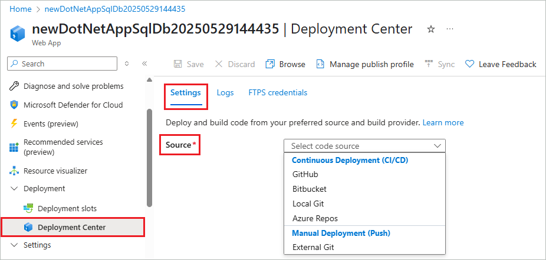
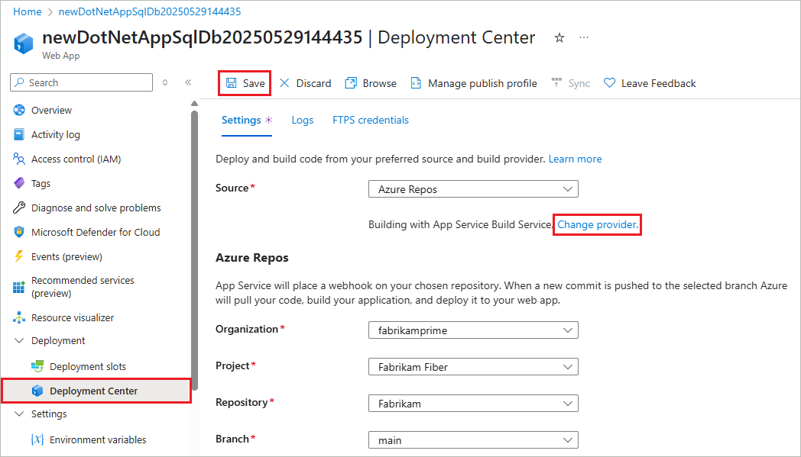

# Configure continuous deployment to Azure App Service

This article explains how you can configure continuous deployment (CD) to [Azure App Service](overview.md) by pulling in updates from [GitHub](https://help.github.com/articles/create-a-repo), [Bitbucket](https://confluence.atlassian.com/get-started-with-bitbucket/create-a-repository-861178559.html), [Azure Repos](/azure/devops/repos/), or other repositories.

## Prerequisites

Write permissions on an Azure App Service app in a source-control repository.

[!INCLUDE [Prepare repository](../../includes/app-service-deploy-prepare-repo.md)]

## Enable continuous deployment

1. In the [Azure portal](https://portal.azure.com), go to the page for your App Service app and select **Deployment Center** from the left navigation menu.

1. On the **Settings** tab under **Source**, select your source control repository type.

   

1. Follow the instructions for your source type to configure the deployment.

   

All listed sources can build with App Service Build Service. Some sources can also build with GitHub Actions or Azure Pipelines. For more information, see [Build providers](#what-are-the-build-providers).

# [GitHub](#tab/github)

[GitHub Actions](#github-actions) is the default GitHub build provider. To change the provider, select **Change provider**, select **App Service Build Service** or **Azure Pipelines**, and then select **OK**.

If necessary, select **Authorize** and follow the authorization prompts for GitHub. To deploy from another user's repository, select **Change Account**.

1. Select the appropriate GitHub **Organization**, **Repository**, and **Branch**.

   If you can't find an organization or repository, you might need to enable more permissions on GitHub. For more information, see [Managing access to your organization's repositories](https://docs.github.com/organizations/managing-access-to-your-organizations-repositories).

1. Under **Authentication type**, select **User-assigned identity** for better security.

   If your Azure account has the required permissions, App Service creates a [user-assigned managed identity](#what-does-the-user-assigned-identity-option-do-for-github-actions) for you, or you can choose an existing managed identity. If you don't have the required permissions, work with your Azure administrator to create an [identity with the required role on your app](#why-do-i-see-the-error-this-identity-does-not-have-write-permissions-on-this-app-please-select-a-different-identity-or-work-with-your-admin-to-grant-the-website-contributor-role-to-your-identity-on-this-app), and then select it in the dropdown.

1. App Service selects a workflow template based on your app's [language stack setting](configure-common.md#configure-language-stack-settings) and commits it into your selected GitHub repository. You can optionally select **Preview file** to see the workflow file before saving your changes.

1. Select **Save**.

# [Bitbucket](#tab/bitbucket)

Bitbucket integration uses the App Service build service for build automation.

If necessary, select **Authorize** and follow the authorization prompts. If you want to deploy from another user's repository, select **Change Account**.

1. Select the Bitbucket **Team**, **Repository**, and **Branch** that you want to deploy continuously.

1. Select **Save**.

# [Local Git](#tab/local)

Follow the instructions at [Deploy to Azure App Service by using Git locally](deploy-local-git.md).

# [Azure Repos](#tab/repos)

App Service Build Service is the default build provider for Azure Repos. To use Azure Pipelines instead, select **Change provider** > **Azure Pipelines** > **OK** and then go to Azure Pipelines in Azure DevOps to configure your pipeline.

1. If you keep App Service Build Service as the build provider, select the **Azure DevOps Organization**, **Project**, **Repository**, and **Branch** you want to deploy continuously.

   If your DevOps organization isn't listed, make sure to link it to your Azure subscription. For more information, see [Create an Azure service connection](/azure/devops/pipelines/library/connect-to-azure).

1. Select **Save**.

# [External Git](#tab/others)

For Windows apps, you can select **External Git** to manually configure continuous deployment from a cloud Git or Mercurial repository that the Azure portal doesn't directly support, like [GitLab](https://gitlab.com/). For more information, see [Set up continuous deployment using manual steps](https://github.com/projectkudu/kudu/wiki/Continuous-deployment#setting-up-continuous-deployment-using-manual-steps).

-----

New commits in the selected repository and branch now deploy continuously into your App Service app. You can track the commits and deployments on the **Logs** tab.

## Disable continuous deployment

To disable continuous deployment for a connected source:

1. In the [Azure portal](https://portal.azure.com), go to the page for your App Service app and select **Deployment Center** from the left navigation menu.

1. On the **Settings** tab, select **Disconnect**.

    

1. Select **OK**.

For GitHub, the workflow file remains in the repository by default, but you no longer see the integrated progress on the **Logs** tab of the **Deployment Center**.

## What are the build providers?

Build providers help you build a continuous integration and continuous delivery (CI/CD) solution with Azure App Service by automating build, test, and deployment. Some deployment sources offer several build provider options. All listed sources can build with App Service Build Service.

You're not limited to the listed build provider options, but App Service helps you quickly set up the listed options and start getting integrated deployment logging.

### GitHub Actions

The GitHub Actions build provider is available only for GitHub source and is the default for GitHub deployments. The build provider sets up CI/CD by depositing a GitHub Actions workflow file into your GitHub repository that handles App Service build and deployment tasks.

For basic authentication, the GitHub Actions build provider adds the publish profile for your app as a GitHub secret. The workflow file uses this secret to authenticate with App Service.

For user-assigned identity, App Service enables the recommended Microsoft OpenID Connect authentication and configures the necessary resources in Azure and GitHub. For more information, see [What does the user-assigned identity option do for GitHub Actions?](#what-does-the-user-assigned-identity-option-do-for-github-actions)

The GitHub Actions build provider captures information from the [workflow run logs](https://docs.github.com/actions/managing-workflow-runs/using-workflow-run-logs) and displays it on the **Logs** tab in the app's **Deployment Center**.

You can customize the GitHub Actions build provider in several ways:

- Customize the workflow file after it generates in your GitHub repository. For more information, see [Workflow syntax for GitHub Actions](https://docs.github.com/actions/reference/workflow-syntax-for-github-actions). Deploy the customized workflow to App Service with the [`azure/webapps-deploy`](https://github.com/Azure/webapps-deploy) action.
- If the selected branch is protected, preview the workflow file without saving the configuration. Customize the file, and then manually add it to your repository. This method doesn't give you log integration with the Azure portal.
- Deploy by using a Microsoft Entra ID [service principal](deploy-github-actions.md?tabs=userlevel) instead of using basic authentication or a user-assigned identity. You can't configure this method in the portal.

### App Service build service

The App Service build service is the native App Service deployment and build engine. When you select this option, App Service adds a webhook into the repository you authorized. Any code push to the repository triggers the webhook, and App Service pulls in the changes and does any deployment tasks. For more information, see [Deploying from GitHub (Kudu)](https://github.com/projectkudu/kudu/wiki/Deploying-from-GitHub).

The App Service build service requires [Source Control Manager (SCM) basic authentication](configure-basic-auth-disable.md) for the webhook to work. Basic authentication is less secure than other authentication methods. For more information, see:

- [Project Kudu](https://github.com/projectkudu/kudu/wiki)
- [Investigate common problems with continuous deployment](https://github.com/projectkudu/kudu/wiki/Investigating-continuous-deployment)
- [Deploy without basic authentication](configure-basic-auth-disable.md#deploy-without-basic-authentication)

### Azure Pipelines

Azure Pipelines is the build component of Azure DevOps. You can configure a pipeline to build, test, and deploy your app to App Service from [any supported source repository](/azure/devops/pipelines/repos).

To use Azure Pipelines as the build provider, select the **Azure Pipelines** option in App Service **Deployment Center**, then go directly to [Azure DevOps](https://go.microsoft.com/fwlink/?linkid=2245703) to configure the pipeline. For more information, see [Deploy to App Service using Azure Pipelines](deploy-azure-pipelines.md).

## Frequently asked questions

- [How does the GitHub Actions build provider work if basic authentication is disabled?](#how-does-the-github-actions-build-provider-work-if-basic-authentication-is-disabled)
- [What happens to my app during deployment that can cause failure or unpredictable behavior?](#what-happens-to-my-app-during-deployment-that-can-cause-failure-or-unpredictable-behavior)
- [What does the user-assigned identity option do for GitHub Actions?](#what-does-the-user-assigned-identity-option-do-for-github-actions)
- [Why do I see the error "You do not have sufficient permissions on this app to assign role-based access to a managed identity and configure federated credentials"?](#why-do-i-see-the-error-you-do-not-have-sufficient-permissions-on-this-app-to-assign-role-based-access-to-a-managed-identity-and-configure-federated-credentials)
- [Why do I see the error "This identity does not have write permissions on this app. Please select a different identity, or work with your admin to grant the Website Contributor role to your identity on this app"?](#why-do-i-see-the-error-this-identity-does-not-have-write-permissions-on-this-app-please-select-a-different-identity-or-work-with-your-admin-to-grant-the-website-contributor-role-to-your-identity-on-this-app)

### How does the GitHub Actions build provider work if basic authentication is disabled?

The GitHub Actions build provider doesn't work with basic authentication if basic authentication is disabled. Try using GitHub Actions with the user-assigned identity option instead. For more information, see [Deploy without basic authentication](configure-basic-auth-disable.md#deploy-without-basic-authentication).

[!INCLUDE [What happens to my app during deployment that can cause failure or unpredictable behavior?](../../includes/app-service-deploy-atomicity.md)]

### What does the user-assigned identity option do for GitHub Actions?

When you select **User-assigned identity** for **GitHub** source, App Service configures all the necessary resources in Azure and GitHub. App Service enables the recommended Microsoft OpenID Connect authentication with GitHub Actions.

Specifically, App Service does the following operations:

- [Creates a federated credential](/entra/workload-id/workload-identity-federation-create-trust-user-assigned-managed-identity?pivots=identity-wif-mi-methods-azp) between a user-assigned managed identity in Azure and your selected repository and branch in GitHub.
- Creates the secrets `AZURE_CLIENT_ID`, `AZURE_TENANT_ID`, and `AZURE_SUBSCRIPTION_ID` from the federated credential in your selected GitHub repository.
- Assigns the identity to your app.

You can then use the [`Azure/login`](https://github.com/Azure/login) action in a GitHub Actions workflow in your GitHub repository to authenticate with your app by using OpenID Connect. For examples, see [Add the workflow file to your GitHub repository](deploy-github-actions.md#add-the-workflow-file-to-your-github-repository).

If your Azure account has the [required permissions](#why-do-i-see-the-error-you-do-not-have-sufficient-permissions-on-this-app-to-assign-role-based-access-to-a-managed-identity-and-configure-federated-credentials), App Service creates a user-assigned managed identity and configures it for you. This identity isn't shown on the **Identity** page of your app. If your Azure account doesn't have the required permissions, you must select an [existing identity with the required role](#why-do-i-see-the-error-this-identity-does-not-have-write-permissions-on-this-app-please-select-a-different-identity-or-work-with-your-admin-to-grant-the-website-contributor-role-to-your-identity-on-this-app).

### Why do I see the error "You do not have sufficient permissions on this app to assign role-based access to a managed identity and configure federated credentials"?

The message indicates that your Azure account doesn't have the required permissions to create a user-assigned managed identity for GitHub Actions. You need the following permissions, scoped to your app:

- `Microsoft.Authorization/roleAssignments/write`
- `Microsoft.ManagedIdentity/userAssignedIdentities/write`

By default, the Azure **User Access Administrator** and **Owner** roles have these permissions, but the **Contributor** role doesn't. If you don't have the required permissions, work with your Azure administrator to create a user-assigned managed identity that has the **Websites Contributor** role. You can then select that identity in the **Identity** dropdown list for GitHub source in the App Service **Deployment Center**.

For more information on using alternative steps, see [Deploy to App Service using GitHub Actions](deploy-github-actions.md).

### Why do I see the error "This identity does not have write permissions on this app. Please select a different identity, or work with your admin to grant the Website Contributor role to your identity on this app"?

The message indicates that the selected user-assigned managed identity doesn't have the required role to [enable OpenID Connect]((#what-does-the-user-assigned-identity-option-do-for-github-actions) between the GitHub repository and the App Service app. The identity must have **Owner**, **Contributor**, or **Websites Contributor** role on the app. The least privileged role that the identity needs is **Websites Contributor**.

## Related content

- [Deploying from GitHub (Kudu)](https://github.com/projectkudu/kudu/wiki/Deploying-from-GitHub)
- [Deploy to App Service using GitHub Actions](deploy-github-actions.md)
- [Deploy to Azure App Service by using Git locally](deploy-local-git.md)
- [Investigate common problems with continuous deployment](https://github.com/projectkudu/kudu/wiki/Investigating-continuous-deployment)
- [Disable basic authentication in Azure App Service deployments](configure-basic-auth-disable.md)

