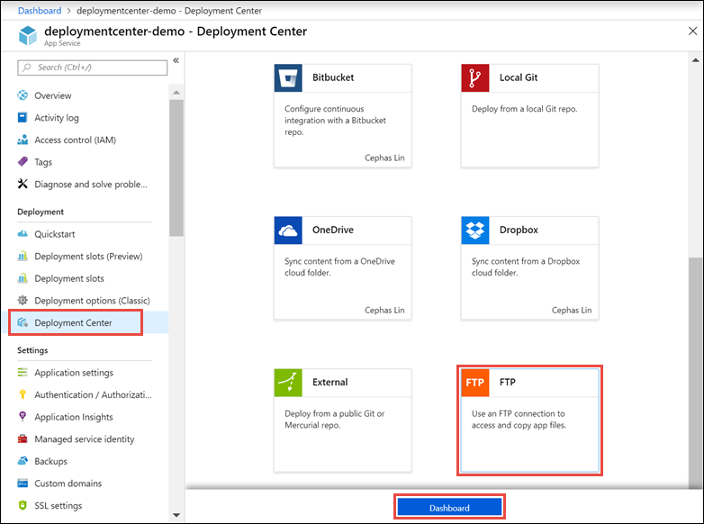
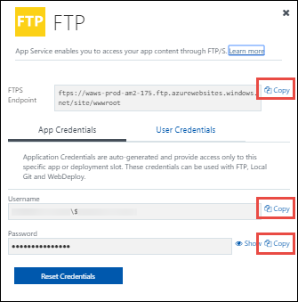

# Deploy your app to Azure App Service using FTP/S

This article shows you how to use FTP or FTPS to deploy your web app, mobile app backend, 
or API app to [Azure App Service](https://go.microsoft.com/fwlink/?LinkId=529714).

The FTP/S endpoint for your app is already active. No configuration is necessary to enable FTP/S deployment.

## Open FTP dashboard

In the [Azure portal](https://portal.azure.com), open your app's [resource page](../azure-resource-manager/manage-resources-portal.md#manage-resources).

To open the FTP dashboard, click **Deployment Center** > **FTP** > **Dashboard**.

## Get FTP connection information

In the FTP dashboard, click **Copy** to copy the FTPS endpoint and app credentials.

It's recommended that you use **App Credentials** to deploy to your app because it's unique to each app. However, if you click **User Credentials**, you can set user-level credentials that you can use for FTP/S login to all App Service apps in your subscription.

> [!NOTE]
> Authenticating to an FTP/FTPS endpoint using user-level credentials requirers
> a username in the following format: 
>
>`<app-name>\<user-name>`
>
> Since user-level credentials are linked to the user and not a specific resource,
> the username must be in this format to direct the sign-in action to the right app endpoint.
>

## Deploy files to Azure

1. From your FTP client (for example, [Visual Studio](https://www.visualstudio.com/vs/community/), [Cyberduck](https://cyberduck.io/), or [WinSCP](https://winscp.net/index.php)), use the connection information you gathered to connect to your app.
2. Copy your files and their respective directory structure to the [**/site/wwwroot** directory](https://github.com/projectkudu/kudu/wiki/File-structure-on-azure) in Azure (or the **/site/wwwroot/App_Data/Jobs/** directory for WebJobs).
3. Browse to your app's URL to verify the app is running properly. 

> [!NOTE] 
> Unlike [Git-based deployments](deploy-local-git.md), FTP deployment doesn't support the following deployment automations: 
>
> - dependency restores (such as NuGet, NPM, PIP, and Composer automations)
> - compilation of .NET binaries
> - generation of web.config (here is a [Node.js example](https://github.com/projectkudu/kudu/wiki/Using-a-custom-web.config-for-Node-apps))
> 
> Generate these necessary files manually on your local machine, and then deploy them together with your app.
>

## Enforce FTPS

For enhanced security, you should allow FTP over SSL only. You can also disable both FTP and FTPS if you don't use FTP deployment.

In your app's resource page in [Azure portal](https://portal.azure.com), select **App settings** in the left navigation.

To disable unencrypted FTP, select **FTPS Only**. To disable both FTP and FTPS entirely, select **Disable**. When finished, click **Save**. If using **FTPS Only** you must enforce TLS 1.2 or higher by navigating to the **SSL settings** blade of your web app. TLS 1.0 and 1.1 are not supported with **FTPS Only**.

## Automate with scripts

For FTP deployment using [Azure CLI](/cli/azure), see [Create a web app and deploy files with FTP (Azure CLI)](./scripts/cli-deploy-ftp.md).

For FTP deployment using [Azure PowerShell](/cli/azure), see [Upload files to a web app using FTP (PowerShell)](./scripts/powershell-deploy-ftp.md).

[!INCLUDE [What happens to my app during deployment?](../../includes/app-service-deploy-atomicity.md)]

## Troubleshoot FTP deployment

- [How can I troubleshoot FTP deployment?](#how-can-i-troubleshoot-ftp-deployment)
- [I'm not able to FTP and publish my code. How can I resolve the issue?](#im-not-able-to-ftp-and-publish-my-code-how-can-i-resolve-the-issue)
- [How can I connect to FTP in Azure App Service via passive mode?](#how-can-i-connect-to-ftp-in-azure-app-service-via-passive-mode)

### How can I troubleshoot FTP deployment?

The first step for troubleshooting FTP deployment is isolating a deployment issue from a runtime application issue.

A deployment issue typically results in no files or wrong files deployed to your app. You can troubleshoot by investigating your FTP deployment or selecting an alternate deployment path (such as source control).

A runtime application issue typically results in the right set of files deployed to your app but incorrect app behavior. You can troubleshoot by focusing on code behavior at runtime and investigating specific failure paths.

To determine a deployment or runtime issue, see [Deployment vs. runtime issues](https://github.com/projectkudu/kudu/wiki/Deployment-vs-runtime-issues).

### I'm not able to FTP and publish my code. How can I resolve the issue?
Check that you've entered the correct hostname and [credentials](#open-ftp-dashboard). Check also that the following FTP ports on your machine are not blocked by a firewall:

- FTP control connection port: 21
- FTP data connection port: 989, 10001-10300
 
### How can I connect to FTP in Azure App Service via passive mode?
Azure App Service supports connecting via both Active and Passive mode. Passive mode is preferred because your deployment machines are usually behind a firewall (in the operating system or as part of a home or business network). See an [example from the WinSCP documentation](https://winscp.net/docs/ui_login_connection). 

## Next steps

For more advanced deployment scenarios, try [deploying to Azure with Git](deploy-local-git.md). Git-based deployment to Azure
enables version control, package restore, MSBuild, and more.

## More resources

* [Azure App Service Deployment Credentials](deploy-configure-credentials.md)
