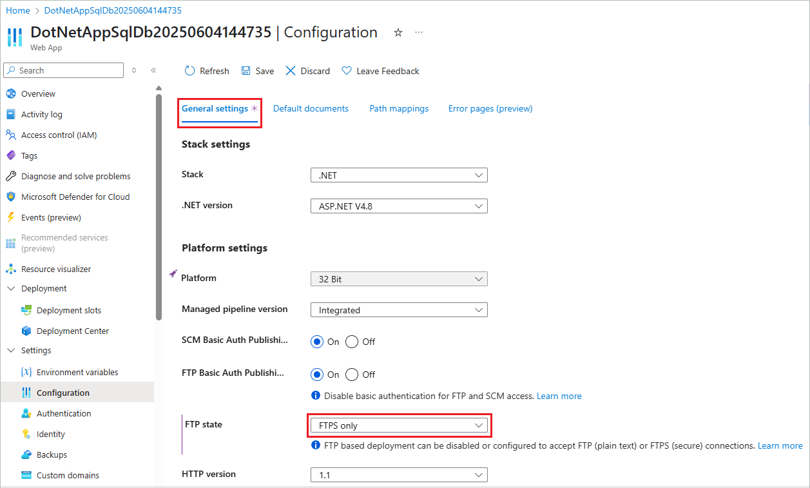

# Deploy your app to Azure App Service using FTP/S

This article shows you how to use FTP or FTPS to deploy your web app, mobile app backend, 
or API app to [Azure App Service](./overview.md).

The FTP/S endpoint for your app is already active. No configuration is necessary to enable FTP/S deployment.

> [!NOTE]
> The **Development Center (Classic)** page in the Azure portal, which is the old deployment experience, will be deprecated in March, 2021. This change will not affect any existing deployment settings in your app, and you can continue to manage app deployment in the **Deployment Center** page.

## Get deployment credentials

1. Follow the instructions at [Configure deployment credentials for Azure App Service](deploy-configure-credentials.md) to copy the application-scope credentials or set the user-scope credentials. You can connect to the FTP/S endpoint of your app using either credentials.

1. Craft the FTP username in the following format, depending on your choice of credential scope:

    | Application-scope | User-scope |
    | - | - |
    |`<app-name>\$<app-name>`|`<app-name>\<deployment-user>`|

    ---

    In App Service, the FTP/S endpoint is shared among apps. Because the user-scope credentials aren't linked to a specific resource, you need to prepend the user-scope username with the app name as shown above.

## Get FTP/S endpoint
    
# [Azure portal](#tab/portal)

In the same management page for your app where you copied the deployment credentials (**Deployment Center** > **FTP Credentials**), copy the **FTPS endpoint**.

# [Azure CLI](#tab/cli)

Run the [az webapp deployment list-publishing-profiles](/cli/azure/webapp/deployment#az-webapp-deployment-list-publishing-profiles) command. The following example uses a [JMESPath query](/cli/azure/query-azure-cli) to extract the FTP/S endpoints from the output.

```azurecli-interactive
az webapp deployment list-publishing-profiles --name <app-name> --resource-group <group-name> --query "[?ends_with(profileName, 'FTP')].{profileName: profileName, publishUrl: publishUrl}"
```

Each app has two FTP/S endpoints, one is read-write, while the other is read-only (`profileName` contains `ReadOnly`) and is for data recovery scenarios. To deploy files with FTP, copy the URL of the read-write endpoint.

# [Azure PowerShell](#tab/powershell)

Run the [Get-AzWebAppPublishingProfile](/powershell/module/az.websites/get-azwebapppublishingprofile) command. The following example extracts the FTP/S endpoint from the XML output.

```azurepowershell-interactive
$xml = [xml](Get-AzWebAppPublishingProfile -Name <app-name> -ResourceGroupName <group-name> -OutputFile null)
$xml.SelectNodes("//publishProfile[@publishMethod=`"FTP`"]/@publishUrl").value
```

-----

## Deploy files to Azure

1. From your FTP client (for example, [Visual Studio](https://www.visualstudio.com/vs/community/), [Cyberduck](https://cyberduck.io/), or [WinSCP](https://winscp.net/index.php)), use the connection information you gathered to connect to your app.
2. Copy your files and their respective directory structure to the [**/site/wwwroot** directory](https://github.com/projectkudu/kudu/wiki/File-structure-on-azure) in Azure (or the **/site/wwwroot/App_Data/Jobs/** directory for WebJobs).
3. Browse to your app's URL to verify the app is running properly. 

> [!NOTE] 
> Unlike [Git-based deployments](deploy-local-git.md) and [Zip deployment](deploy-zip.md), FTP deployment doesn't support build automation, such as: 
>
> - dependency restores (such as NuGet, NPM, PIP, and Composer automations)
> - compilation of .NET binaries
> - generation of web.config (here is a [Node.js example](https://github.com/projectkudu/kudu/wiki/Using-a-custom-web.config-for-Node-apps))
> 
> Generate these necessary files manually on your local machine, and then deploy them together with your app.
>

## Enforce FTPS

For enhanced security, you should allow FTP over TLS/SSL only. You can also disable both FTP and FTPS if you don't use FTP deployment.

# [Azure portal](#tab/portal)

1. In your app's resource page in [Azure portal](https://portal.azure.com), select **Configuration** > **General settings** from the left navigation.

2. To disable unencrypted FTP, select **FTPS Only** in **FTP state**. To disable both FTP and FTPS entirely, select **Disabled**. When finished, click **Save**. If using **FTPS Only**, you must enforce TLS 1.2 or higher by navigating to the **TLS/SSL settings** blade of your web app. TLS 1.0 and 1.1 are not supported with **FTPS Only**.

    

# [Azure CLI](#tab/cli)

Run the [az webapp config set](/cli/azure/webapp/deployment#az-webapp-deployment-list-publishing-profiles) command with the `--ftps-state` argument.

```azurecli-interactive
az webapp config set --name <app-name> --resource-group <group-name> --ftps-state FtpsOnly
```

Possible values for `--ftps-state` are `AllAllowed` (FTP and FTPS enabled), `Disabled` (FTP and FTPs disabled), and `FtpsOnly` (FTPS only).

# [Azure PowerShell](#tab/powershell)

Run the [Set-AzWebApp](/powershell/module/az.websites/set-azwebapp) command with the `-FtpsState` parameter.

```azurepowershell-interactive
Set-AzWebApp -Name <app-name> -ResourceGroupName <group-name> -FtpsState FtpsOnly
```

Possible values for `--ftps-state` are `AllAllowed` (FTP and FTPS enabled), `Disabled` (FTP and FTPs disabled), and `FtpsOnly` (FTPS only).

-----

[!INCLUDE [What happens to my app during deployment?](../../includes/app-service-deploy-atomicity.md)]

## Troubleshoot FTP deployment

- [How can I troubleshoot FTP deployment?](#how-can-i-troubleshoot-ftp-deployment)
- [I'm not able to FTP and publish my code. How can I resolve the issue?](#im-not-able-to-ftp-and-publish-my-code-how-can-i-resolve-the-issue)
- [How can I connect to FTP in Azure App Service via passive mode?](#how-can-i-connect-to-ftp-in-azure-app-service-via-passive-mode)

#### How can I troubleshoot FTP deployment?

The first step for troubleshooting FTP deployment is isolating a deployment issue from a runtime application issue.

A deployment issue typically results in no files or wrong files deployed to your app. You can troubleshoot by investigating your FTP deployment or selecting an alternate deployment path (such as source control).

A runtime application issue typically results in the right set of files deployed to your app but incorrect app behavior. You can troubleshoot by focusing on code behavior at runtime and investigating specific failure paths.

To determine a deployment or runtime issue, see [Deployment vs. runtime issues](https://github.com/projectkudu/kudu/wiki/Deployment-vs-runtime-issues).

#### I'm not able to FTP and publish my code. How can I resolve the issue?
Check that you've entered the correct [hostname](#get-ftps-endpoint) and [credentials](#get-deployment-credentials). Check also that the following FTP ports on your machine are not blocked by a firewall:

- FTP control connection port: 21, 990
- FTP data connection port: 989, 10001-10300
 
#### How can I connect to FTP in Azure App Service via passive mode?
Azure App Service supports connecting via both Active and Passive mode. Passive mode is preferred because your deployment machines are usually behind a firewall (in the operating system or as part of a home or business network). See an [example from the WinSCP documentation](https://winscp.net/docs/ui_login_connection). 

### How can I determine the method that was used to deploy my Azure App Service?
Let us say you take over owning an app and you wish to find out how the Azure App Service was deployed so you can make changes and deploy them. You can determine how an Azure App Service was deployed by checking the application settings. If the app was deployed using an external package URL, you will see the WEBSITE_RUN_FROM_PACKAGE setting in the application settings with a URL value. Or if it was deployed using zip deploy, you will see the WEBSITE_RUN_FROM_PACKAGE setting with a value of 1. If the app was deployed using Azure DevOps, you will see the deployment history in the Azure DevOps portal. If Azure Functions Core Tools was used, you will see the deployment history in the Azure portal.

## More resources

* [Local Git deployment to Azure App Service](deploy-local-git.md)
* [Azure App Service Deployment Credentials](deploy-configure-credentials.md)
* [Sample: Create a web app and deploy files with FTP (Azure CLI)](./scripts/cli-deploy-ftp.md).
* [Sample: Upload files to a web app using FTP (PowerShell)](./scripts/powershell-deploy-ftp.md).
