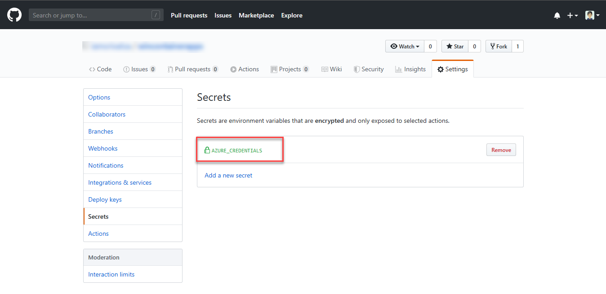
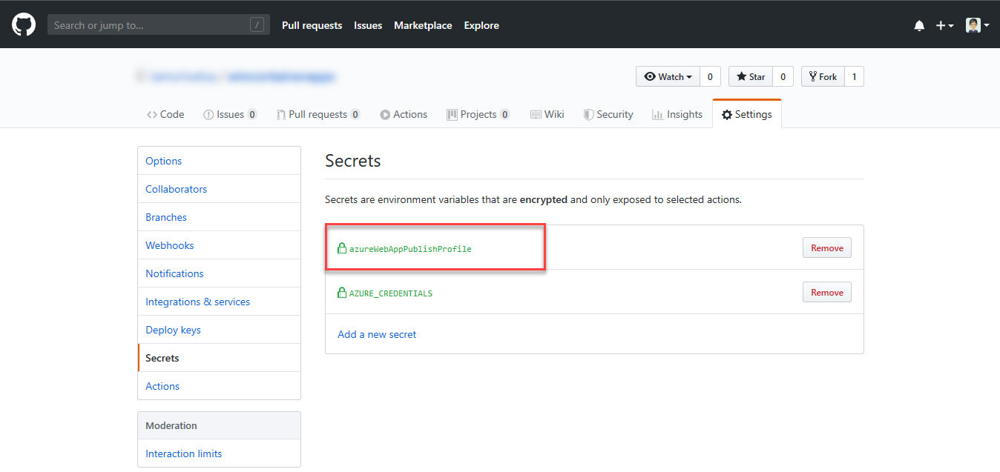

# Deploy to App Service using GitHub Actions

[GitHub Actions](https://help.github.com/en/articles/about-github-actions) gives you the flexibility to build an automated software development lifecycle workflow. With the Azure App Service Actions for GitHub, you can automate your workflow to deploy to [Azure App Service](overview.md) using GitHub Actions.

> [!IMPORTANT]
> GitHub Actions is currently in beta. You must first [sign-up to join the preview](https://github.com/features/actions) using your GitHub account.
> 

A workflow is defined by a YAML (.yml) file in the `/.github/workflows/` path in your repository. This definition contains the various steps and parameters that make up the workflow.

For an Azure App Service workflow, the file has three sections:

|Section  |Tasks  |
|---------|---------|
|**Authentication** | 1. Define a service principal <br /> 2. Create a GitHub secret |
|**Build** | 1. Set up the environment <br /> 2. Build the web app |
|**Deploy** | 1. Deploy the web app |

## Create a service principal

You can create a [service principal](../active-directory/develop/app-objects-and-service-principals.md#service-principal-object) by using the [az ad sp create-for-rbac](https://docs.microsoft.com/cli/azure/ad/sp?view=azure-cli-latest#az-ad-sp-create-for-rbac) command in the [Azure CLI](https://docs.microsoft.com/cli/azure/). You can run this command using [Azure Cloud Shell](https://shell.azure.com/) in the Azure portal or by selecting the **Try it** button.

```azurecli-interactive
az ad sp create-for-rbac --name "myApp" --role contributor --scopes /subscriptions/<subscription-id>/resourceGroups/<group-name>/providers/Microsoft.Web/sites/<app-name> --sdk-auth
```

In this example, replace the placeholders in the resource with your subscription ID, resource group name, and app name. The output is the role assignment credentials that provide access to your App Service app. Copy this JSON object, which you can use to authenticate from GitHub.

> [!NOTE]
> You do not need to create a service principal if you decide to use publish profile for authentication.

> [!IMPORTANT]
> It is always a good practice to grant minimum access. This is why the scope in the previous example is limited to the specific App Service app and not the entire resource group.

## Configure the GitHub secret

You could also use app-level credentials i.e. publish profile for deployment. Follow the steps to configure the secret:

1. Download the publish profile for the App Service app from the portal using **Get Publish profile** option.

2. In [GitHub](https://github.com/), browse your repository, select **Settings > Secrets > Add a new secret**

    

3. Paste the contents for the downloaded publish profile file into the secret's value field.

4. Now in the workflow file in your branch: `.github/workflows/workflow.yml` replace the secret for the input `publish-profile` of the deploy Azure Web App action.
    
    ```yaml
        - uses: azure/webapps-deploy@v2
          with:
            publish-profile: ${{ secrets.azureWebAppPublishProfile }}
    ```

5. You see the secret as shown below once defined.

    

## Set up the environment

Setting up the environment can be done using one of the setup actions.

|**Language**  |**Setup Action**  |
|---------|---------|
|**.NET**     | `actions/setup-dotnet` |
|**Java**     | `actions/setup-java` |
|**JavaScript** | `actions/setup-node` |
|**Python**     | `actions/setup-python` |

The following examples show the part of the workflow that sets up the environment for the various supported languages:

**JavaScript**

```yaml
    - name: Setup Node 10.x
      uses: actions/setup-node@v1
      with:
        node-version: '10.x'
```
**Python**

```yaml
    - name: Setup Python 3.6
      uses: actions/setup-python@v1
      with:
        python-version: 3.6
```

**.NET**

```yaml
    - name: Setup Dotnet 2.2.300
      uses: actions/setup-dotnet@v1
      with:
        dotnet-version: '2.2.300'
```

**Java**

```yaml
    - name: Setup Java 1.8.x
      uses: actions/setup-java@v1
      with:
        # If your pom.xml <maven.compiler.source> version is not in 1.8.x
        # Please change the Java version to match the version in pom.xml <maven.compiler.source>
        java-version: '1.8.x'
```

## Build the web app

This depends on the language and for languages supported by Azure App Service, this section should be the standard build steps of each language.

The following examples show the part of the workflow that builds the web app, in the various supported languages.

**JavaScript**

```yaml
    - name: 'Run npm'
      shell: bash
      run: |
        # If your web app project is not located in your repository's root
        # Please change your directory for npm in pushd
        pushd .
        npm install
        npm run build --if-present
        npm run test --if-present
        popd
```

**Python**

```yaml
    - name: 'Run pip'
      shell: bash
      run: |
        # If your web app project is not located in your repository's root
        # Please change your directory for pip in pushd
        pushd .
        python -m pip install --upgrade pip
        pip install -r requirements.txt --target=".python_packages/lib/python3.6/site-packages"
        popd
```

**.NET**

```yaml
    - name: 'Run dotnet build'
      shell: bash
      run: |
        # If your web app project is not located in your repository's root
        # Please consider using pushd to change your path
        pushd .
        dotnet build --configuration Release --output ./output
        popd
```

**Java**

```yaml
    - uses: actions/checkout@v1
    - name: Set up JDK 1.8
      uses: actions/setup-java@v1
      with:
        java-version: 1.8
    - name: Build with Maven
      run: mvn -B package --file pom.xml
```
## Deploy to App Service

To deploy your code to an App Service app, use the `azure/webapps-deploy@v2` action. This action has four parameters:

| **Parameter**  | **Explanation**  |
|---------|---------|
| **app-name** | (Required) Name of the App Service app | 
| **publish-profile** | (Optional) Publish profile file contents with Web Deploy secrets |
| **package** | (Optional) Path to package or folder. *.zip, *.war, *.jar or a folder to deploy |
| **slot-name** | (Optional) Enter an existing Slot other than the Production slot |

### Deploy using Publish Profile

Below is the sample workflow to build and deploy a Node.js app to Azure using publish profile.

```yaml
# File: .github/workflows/workflow.yml

on: push

jobs:
  build-and-deploy:
    runs-on: ubuntu-latest
    steps:
    # checkout the repo
    - name: 'Checkout GitHub Action' 
      uses: actions/checkout@master
    
    - name: Setup Node 10.x
      uses: actions/setup-node@v1
      with:
        node-version: '10.x'
    - name: 'npm install, build, and test'
      run: |
        npm install
        npm run build --if-present
        npm run test --if-present
       
    - name: 'Run Azure webapp deploy action using publish profile credentials'
          uses: azure/webapps-deploy@v2
          with: 
            app-name: node-rn
            publish-profile: ${{ secrets.azureWebAppPublishProfile }}
```

### Deploy using Azure service principal

Below is the sample workflow to build and deploy a Node.js app to Azure using an Azure service principal.

```yaml
on: [push]

name: Node.js

jobs:
  build-and-deploy:
    runs-on: ubuntu-latest
    steps:
    # checkout the repo
    - name: 'Checkout GitHub Action' 
      uses: actions/checkout@master
   
    - uses: azure/login@v1
      with:
        creds: ${{ secrets.AZURE_CREDENTIALS }}
        
    - name: Setup Node 10.x
      uses: actions/setup-node@v1
      with:
        node-version: '10.x'
    
    - name: 'npm install, build, and test'
      run: |
        npm install
        npm run build --if-present
        npm run test --if-present
               
    # deploy web app using Azure credentials
    - uses: azure/webapps-deploy@v2
      with:
        app-name: 'node-rn'

    # Azure logout 
    - name: logout
      run: |
        az logout
```

## Next steps

You can find our set of Actions grouped into different repositories on GitHub, each one containing documentation and examples to help you use GitHub for CI/CD and deploy your apps to Azure.

- [Actions workflow to deploy to Azure](https://github.com/Azure/actions-workflow-samples)

- [Azure login](https://github.com/Azure/login)

- [Azure WebApp](https://github.com/Azure/webapps-deploy)

- [Azure WebApp for containers](https://github.com/Azure/webapps-container-deploy)

- [Docker login/logout](https://github.com/Azure/docker-login)

- [Events that trigger workflows](https://help.github.com/en/articles/events-that-trigger-workflows)

- [K8s deploy](https://github.com/Azure/k8s-deploy)

- [Starter Workflows](https://github.com/actions/starter-workflows)
