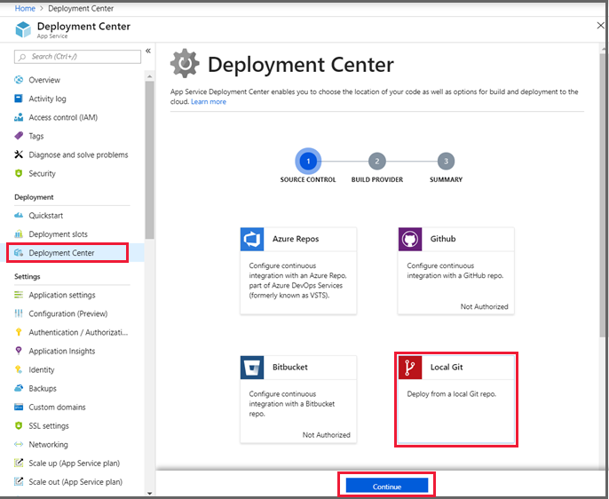
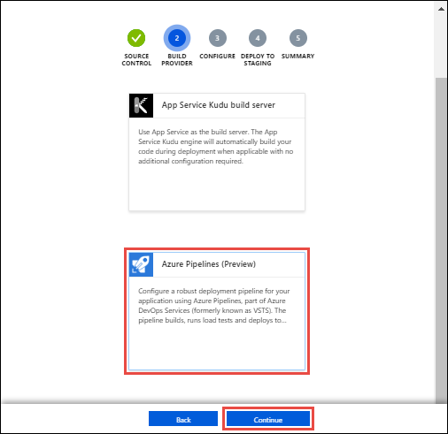
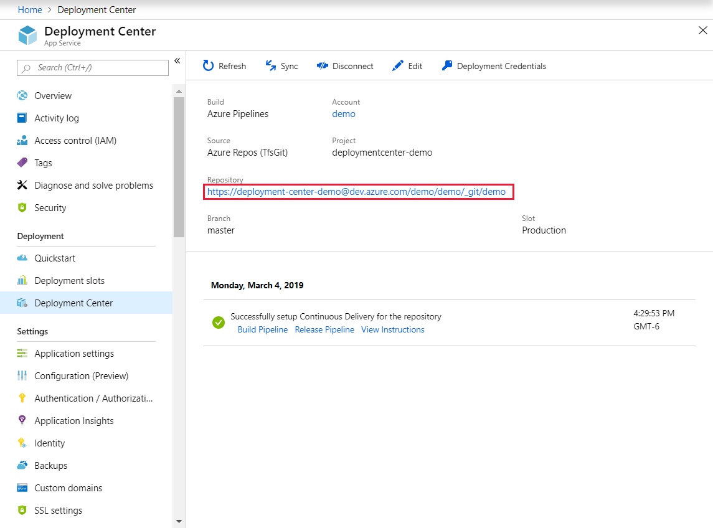

# Local Git deployment to Azure App Service

This how-to guide shows you how to deploy your app to [Azure App Service](overview.md) from a Git repository on your local computer.

## Prerequisites

To follow the steps in this how-to guide:

- [!INCLUDE [quickstarts-free-trial-note](../../includes/quickstarts-free-trial-note.md)]
  
- [Install Git](https://www.git-scm.com/downloads).
  
- Have a local Git repository with code you want to deploy. To download a sample repository, run the following command in your local terminal window:
  
  ```bash
  git clone https://github.com/Azure-Samples/nodejs-docs-hello-world.git
  ```

[!INCLUDE [Prepare repository](../../includes/app-service-deploy-prepare-repo.md)]

[!INCLUDE [cloud-shell-try-it.md](../../includes/cloud-shell-try-it.md)]

## Deploy with Kudu build server

The easiest way to enable local Git deployment for your app with the Kudu App Service build server is to use Azure Cloud Shell. 

### Configure a deployment user

[!INCLUDE [Configure a deployment user](../../includes/configure-deployment-user-no-h.md)]

### Get the deployment URL

To get the URL to enable local Git deployment for an existing app, run [`az webapp deployment source config-local-git`](/cli/azure/webapp/deployment/source?view=azure-cli-latest#az-webapp-deployment-source-config-local-git) in the Cloud Shell. Replace \<app-name> and \<group-name> with the names of your app and its Azure resource group.

```azurecli-interactive
az webapp deployment source config-local-git --name <app-name> --resource-group <group-name>
```
> [!NOTE]
> If you are using a linux app-service-plan, you need to add this parameter: --runtime python|3.7


Or, to create a new Git-enabled app, run [`az webapp create`](/cli/azure/webapp?view=azure-cli-latest#az-webapp-create) in the Cloud Shell with the `--deployment-local-git` parameter. Replace \<app-name>, \<group-name>, and \<plan-name> with the names for your new Git app, its Azure resource group, and its Azure App Service plan.

```azurecli-interactive
az webapp create --name <app-name> --resource-group <group-name> --plan <plan-name> --deployment-local-git
```

Either command returns a URL like: `https://<deployment-username>@<app-name>.scm.azurewebsites.net/<app-name>.git`. Use this URL to deploy your app in the next step.

Instead of using this account-level URL, you can also enable local Git by using app-level credentials. Azure App Service automatically generates these credentials for every app. 

Get the app credentials by running the following command in the Cloud Shell. Replace \<app-name> and \<group-name> with your app's name and Azure resource group name.

```azurecli-interactive
az webapp deployment list-publishing-credentials --name <app-name> --resource-group <group-name> --query scmUri --output tsv
```

Use the URL that returns to deploy your app in the next step.

### Deploy the web app

1. Open a local terminal window to your local Git repository, and add an Azure remote. In the following command, replace \<url> with the deployment user-specific URL or app-specific URL you got from the previous step.
   
   ```bash
   git remote add azure <url>
   ```
   
1. Push to the Azure remote with `git push azure master`. 
   
1. In the **Git Credential Manager** window, enter your [deployment user password](#configure-a-deployment-user), not your Azure sign-in password.
   
1. Review the output. You may see runtime-specific automation, such as MSBuild for ASP.NET, `npm install` for Node.js, and `pip install` for Python. 
   
1. Browse to your app in the Azure portal to verify that the content is deployed.

## Deploy with Azure Pipelines builds

If your account has the necessary permissions, you can set up Azure Pipelines (Preview) to enable local Git deployment for your app. 

- Your Azure account must have permissions to write to Azure Active Directory and create a service. 
  
- Your Azure account must have the **Owner** role in your Azure subscription.

- You must be an administrator in the Azure DevOps project you want to use.

To enable local Git deployment for your app with Azure Pipelines (Preview):

1. In the [Azure portal](https://portal.azure.com), search for and select **App Services**. 

1. Select your Azure App Service app and select **Deployment Center** in the left menu.
   
1. On the **Deployment Center** page, select **Local Git**, and then select **Continue**. 
   
   
   
1. On the **Build provider** page, select **Azure Pipelines (Preview)**, and then select **Continue**. 
   
   

1. On the **Configure** page, configure a new Azure DevOps organization, or specify an existing organization, and then select **Continue**.
   
   > [!NOTE]
   > If your existing Azure DevOps organization isn't listed, you may need to link it to your Azure subscription. For more information, see [Define your CD release pipeline](/azure/devops/pipelines/apps/cd/deploy-webdeploy-webapps#cd).
   
1. Depending on your App Service plan [pricing tier](https://azure.microsoft.com/pricing/details/app-service/plans/), you may see a **Deploy to staging** page. Choose whether to [enable deployment slots](deploy-staging-slots.md), and then select **Continue**.
   
1. On the **Summary** page, review the settings, and then select **Finish**.
   
1. When the Azure Pipeline is ready, copy the Git repository URL from the **Deployment Center** page to use in the next step. 
   
   

1. In your local terminal window, add an Azure remote to your local Git repository. In the command, replace \<url> with the URL of the Git repository that you got from the previous step.
   
   ```bash
   git remote add azure <url>
   ```
   
1. Push to the Azure remote with `git push azure master`. 
   
1. On the **Git Credential Manager** page, sign in with your visualstudio.com username. For other authentication methods, see [Azure DevOps Services authentication overview](/vsts/git/auth-overview?view=vsts).
   
1. Once deployment is finished, view the build progress at `https://<azure_devops_account>.visualstudio.com/<project_name>/_build`, and the deployment progress at `https://<azure_devops_account>.visualstudio.com/<project_name>/_release`.
   
1. Browse to your app in the Azure portal to verify that the content is deployed.

[!INCLUDE [What happens to my app during deployment?](../../includes/app-service-deploy-atomicity.md)]

## Troubleshoot deployment

You may see the following common error messages when you use Git to publish to an App Service app in Azure:

|Message|Cause|Resolution
---|---|---|
|`Unable to access '[siteURL]': Failed to connect to [scmAddress]`|The app isn't up and running.|Start the app in the Azure portal. Git deployment isn't available when the web app is stopped.|
|`Couldn't resolve host 'hostname'`|The address information for the 'azure' remote is incorrect.|Use the `git remote -v` command to list all remotes, along with the associated URL. Verify that the URL for the 'azure' remote is correct. If needed, remove and recreate this remote using the correct URL.|
|`No refs in common and none specified; doing nothing. Perhaps you should specify a branch such as 'master'.`|You didn't specify a branch during `git push`, or you haven't set the `push.default` value in `.gitconfig`.|Run `git push` again, specifying the master branch: `git push azure master`.|
|`src refspec [branchname] does not match any.`|You tried to push to a branch other than master on the 'azure' remote.|Run `git push` again, specifying the master branch: `git push azure master`.|
|`RPC failed; result=22, HTTP code = 5xx.`|This error can happen if you try to push a large git repository over HTTPS.|Change the git configuration on the local machine to make the `postBuffer` bigger. For example: `git config --global http.postBuffer 524288000`.|
|`Error - Changes committed to remote repository but your web app not updated.`|You deployed a Node.js app with a _package.json_ file that specifies additional required modules.|Review the `npm ERR!` error messages before this error for more context on the failure. The following are the known causes of this error, and the corresponding `npm ERR!` messages:<br /><br />**Malformed package.json file**: `npm ERR! Couldn't read dependencies.`<br /><br />**Native module doesn't have a binary distribution for Windows**:<br />`npm ERR! \cmd "/c" "node-gyp rebuild"\ failed with 1` <br />or <br />`npm ERR! [modulename@version] preinstall: \make || gmake\ `|

## Additional resources

- [Project Kudu documentation](https://github.com/projectkudu/kudu/wiki)
- [Continuous deployment to Azure App Service](deploy-continuous-deployment.md)
- [Sample: Create a web app and deploy code from a local Git repository (Azure CLI)](./scripts/cli-deploy-local-git.md?toc=%2fcli%2fazure%2ftoc.json)
- [Sample: Create a web app and deploy code from a local Git repository (PowerShell)](./scripts/powershell-deploy-local-git.md?toc=%2fpowershell%2fmodule%2ftoc.json)
