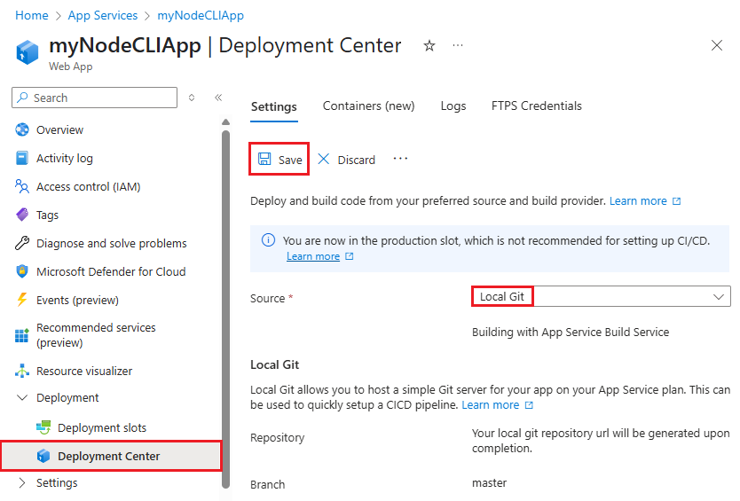

# Local Git deployment to Azure App Service

This how-to guide shows you how to deploy your app to [Azure App Service](overview.md) from a Git repository on your local computer.

## Prerequisites

To follow the steps in this how-to guide:

- [!INCLUDE [quickstarts-free-trial-note](../../includes/quickstarts-free-trial-note.md)]
  
- [Install Git](https://www.git-scm.com/downloads).

- Have a local Git repository with code you want to deploy. To download a sample repository, run the following command in your local terminal window:
  
  ```bash
  git clone https://github.com/Azure-Samples/nodejs-docs-hello-world.git
  ```

[!INCLUDE [Prepare repository](../../includes/app-service-deploy-prepare-repo.md)]

## Configure a deployment user

See [Configure deployment credentials for Azure App Service](deploy-configure-credentials.md). You can use either user-scope credentials or application-scope credentials.

## Create a Git enabled app

If you already have an App Service app and want to configure local Git deployment for it, see [Configure an existing app](#configure-an-existing-app) instead.

# [Azure CLI](#tab/cli)

Run [`az webapp create`](/cli/azure/webapp#az_webapp_create) with the `--deployment-local-git` option. For example:

```azurecli-interactive
az webapp create --resource-group <group-name> --plan <plan-name> --name <app-name> --runtime "<runtime-flag>" --deployment-local-git
```

The output contains a URL like: `https://<deployment-username>@<app-name>.scm.azurewebsites.net/<app-name>.git`. Use this URL to deploy your app in the next step.

# [Azure PowerShell](#tab/powershell)

Run [New-AzWebApp](/powershell/module/az.websites/new-azwebapp) from the root of your Git repository. For example:

```azurepowershell-interactive
New-AzWebApp -Name <app-name>
```

When your run this cmdlet from a directory that's a Git repository, it automatically creates a Git remote to your App Service app for you, named `azure`.

# [Azure portal](#tab/portal)

In the portal, you need to create an app first, then configure deployment for it. See [Configure an existing app](#configure-an-existing-app).

-----

## Configure an existing app

If you haven't created an app yet, see [Create a Git enabled app](#create-a-git-enabled-app) instead.

# [Azure CLI](#tab/cli)

Run [`az webapp deployment source config-local-git`](/cli/azure/webapp/deployment/source#az_webapp_deployment_source_config_local_git). For example:

```azurecli-interactive
az webapp deployment source config-local-git --name <app-name> --resource-group <group-name>
```

The output contains a URL like: `https://<deployment-username>@<app-name>.scm.azurewebsites.net/<app-name>.git`. Use this URL to deploy your app in the next step.

> [!TIP]
> This URL contains the user-scope deployment username. If you like, you can [use the application-scope credentials](deploy-configure-credentials.md#appscope) instead. 

# [Azure PowerShell](#tab/powershell)

Set the `scmType` of your app by running the [Set-AzResource](/powershell/module/az.resources/set-azresource) cmdlet.

```powershell-interactive
$PropertiesObject = @{
    scmType = "LocalGit";
}

Set-AzResource -PropertyObject $PropertiesObject -ResourceGroupName <group-name> `
-ResourceType Microsoft.Web/sites/config -ResourceName <app-name>/web `
-ApiVersion 2015-08-01 -Force
```

# [Azure portal](#tab/portal)

1. In the [Azure portal](https://portal.azure.com), navigate to your app's management page.

1. From the left menu, select **Deployment Center** > **Settings**. Select **Local Git** in **Source**, then click **Save**.

    

1. In the Local Git section, copy the **Git Clone Uri** for later. This Uri doesn't contain any credentials.

-----

## Deploy the web app

1. In a local terminal window, change the directory to the root of your Git repository, and add a Git remote using the URL you got from your app. If your chosen method doesn't give you a URL, use `https://<app-name>.scm.azurewebsites.net/<app-name>.git` with your app name in `<app-name>`.
   
   ```bash
   git remote add azure <url>
   ```

    > [!NOTE]
    > If you [created a Git-enabled app in PowerShell using New-AzWebApp](#create-a-git-enabled-app), the remote is already created for you.
   
1. Push to the Azure remote with `git push azure master`. 
   
1. In the **Git Credential Manager** window, enter your [user-scope or application-scope credentials](#configure-a-deployment-user), not your Azure sign-in credentials.

    If your Git remote URL already contains the username and password, you won't be prompted. 
   
1. Review the output. You may see runtime-specific automation, such as MSBuild for ASP.NET, `npm install` for Node.js, and `pip install` for Python. 
   
1. Browse to your app in the Azure portal to verify that the content is deployed.

## Troubleshoot deployment

You may see the following common error messages when you use Git to publish to an App Service app in Azure:

|Message|Cause|Resolution
---|---|---|
|`Unable to access '[siteURL]': Failed to connect to [scmAddress]`|The app isn't up and running.|Start the app in the Azure portal. Git deployment isn't available when the web app is stopped.|
|`Couldn't resolve host 'hostname'`|The address information for the 'azure' remote is incorrect.|Use the `git remote -v` command to list all remotes, along with the associated URL. Verify that the URL for the 'azure' remote is correct. If needed, remove and recreate this remote using the correct URL.|
|`No refs in common and none specified; doing nothing. Perhaps you should specify a branch such as 'main'.`|You didn't specify a branch during `git push`, or you haven't set the `push.default` value in `.gitconfig`.|Run `git push` again, specifying the main branch: `git push azure main`.|
|`Error - Changes committed to remote repository but deployment to website failed.`|You pushed a local branch that doesn't match the app deployment branch on 'azure'.|Verify that current branch is `master`. To change the default branch, use `DEPLOYMENT_BRANCH` application setting.|
|`src refspec [branchname] does not match any.`|You tried to push to a branch other than main on the 'azure' remote.|Run `git push` again, specifying the main branch: `git push azure main`.|
|`RPC failed; result=22, HTTP code = 5xx.`|This error can happen if you try to push a large git repository over HTTPS.|Change the git configuration on the local machine to make the `postBuffer` bigger. For example: `git config --global http.postBuffer 524288000`.|
|`Error - Changes committed to remote repository but your web app not updated.`|You deployed a Node.js app with a _package.json_ file that specifies additional required modules.|Review the `npm ERR!` error messages before this error for more context on the failure. The following are the known causes of this error, and the corresponding `npm ERR!` messages:<br /><br />**Malformed package.json file**: `npm ERR! Couldn't read dependencies.`<br /><br />**Native module doesn't have a binary distribution for Windows**:<br />`npm ERR! \cmd "/c" "node-gyp rebuild"\ failed with 1` <br />or <br />`npm ERR! [modulename@version] preinstall: \make || gmake\ `|

## Additional resources

- [App Service build server (Project Kudu documentation)](https://github.com/projectkudu/kudu/wiki)
- [Continuous deployment to Azure App Service](deploy-continuous-deployment.md)
- [Sample: Create a web app and deploy code from a local Git repository (Azure CLI)](./scripts/cli-deploy-local-git.md?toc=%2fcli%2fazure%2ftoc.json)
- [Sample: Create a web app and deploy code from a local Git repository (PowerShell)](./scripts/powershell-deploy-local-git.md?toc=%2fpowershell%2fmodule%2ftoc.json)
