# Set up staging environments in Azure App Service
<a name="Overview"></a>

When you deploy your web app, web app on Linux, mobile back end, or API app to [Azure App Service](https://go.microsoft.com/fwlink/?LinkId=529714), you can use a separate deployment slot instead of the default production slot when you're running in the **Standard**, **Premium**, or **Isolated** App Service plan tier. Deployment slots are live apps with their own host names. App content and configurations elements can be swapped between two deployment slots, including the production slot. 

Deploying your application to a non-production slot has the following benefits:

* You can validate app changes in a staging deployment slot before swapping it with the production slot.
* Deploying an app to a slot first and swapping it into production makes sure that all instances of the slot are warmed up before being swapped into production. This eliminates downtime when you deploy your app. The traffic redirection is seamless, and no requests are dropped because of swap operations. You can automate this entire workflow by configuring [auto swap](#Auto-Swap) when pre-swap validation isn't needed.
* After a swap, the slot with previously staged app now has the previous production app. If the changes swapped into the production slot aren't as you expect, you can perform the same swap immediately to get your "last known good site" back.

Each App Service plan tier supports a different number of deployment slots. There's no additional charge for using deployment slots. To find out the number of slots your app's tier supports, see [App Service limits](../azure-resource-manager/management/azure-subscription-service-limits.md#app-service-limits). 

To scale your app to a different tier, make sure that the target tier supports the number of slots your app already uses. For example, if your app has more than five slots, you can't scale it down to the **Standard** tier, because the **Standard** tier supports only five deployment slots. 

<a name="Add"></a>

## Add a slot
The app must be running in the **Standard**, **Premium**, or **Isolated** tier in order for you to enable multiple deployment slots.


1. in the [Azure portal](https://portal.azure.com/), search for and select **App Services** and select your app. 
   
    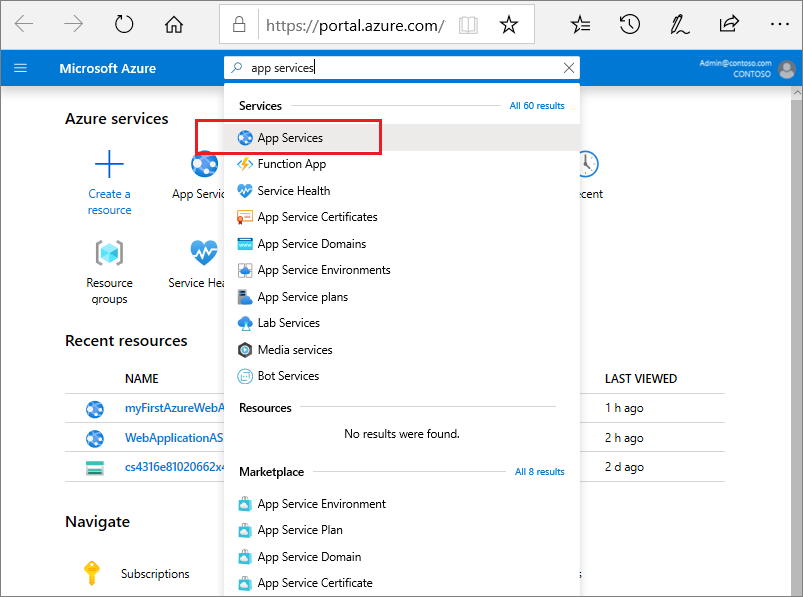
   

2. In the left pane, select **Deployment slots** > **Add Slot**.
   
    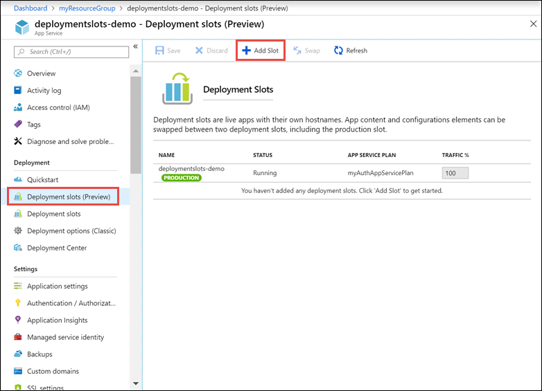
   
   > [!NOTE]
   > If the app isn't already in the **Standard**, **Premium**, or **Isolated** tier, you receive a message that indicates the supported tiers for enabling staged publishing. At this point, you have the option to select **Upgrade** and go to the **Scale** tab of your app before continuing.
   > 

3. In the **Add a slot** dialog box, give the slot a name, and select whether to clone an app configuration from another deployment slot. Select **Add** to continue.
   
    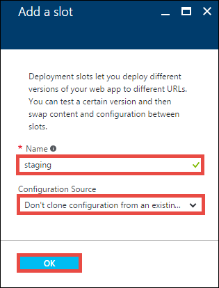
   
    You can clone a configuration from any existing slot. Settings that can be cloned include app settings, connection strings, language framework versions, web sockets, HTTP version, and platform bitness.

4. After the slot is added, select **Close** to close the dialog box. The new slot is now shown on the **Deployment slots** page. By default, **Traffic %** is set to 0 for the new slot, with all customer traffic routed to the production slot.

5. Select the new deployment slot to open that slot's resource page.
   
    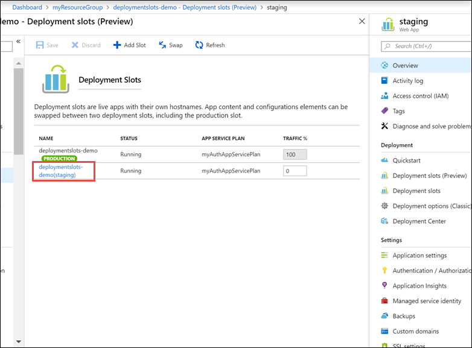

    The staging slot has a management page just like any other App Service app. You can change the slot's configuration. To remind you that you're viewing the deployment slot, the app name is shown as **\<app-name>/\<slot-name>**, and the app type is **App Service (Slot)**. You can also see the slot as a separate app in your resource group, with the same designations.

6. Select the app URL on the slot's resource page. The deployment slot has its own host name and is also a live app. To limit public access to the deployment slot, see [Azure App Service IP restrictions](app-service-ip-restrictions.md).

The new deployment slot has no content, even if you clone the settings from a different slot. For example, you can [publish to this slot with Git](app-service-deploy-local-git.md). You can deploy to the slot from a different repository branch or a different repository.

<a name="AboutConfiguration"></a>

## What happens during a swap

### Swap operation steps

When you swap two slots (usually from a staging slot into the production slot), App Service does the following to ensure that the target slot doesn't experience downtime:

1. Apply the following settings from the target slot (for example, the production slot) to all instances of the source slot: 
    - [Slot-specific](#which-settings-are-swapped) app settings and connection strings, if applicable.
    - [Continuous deployment](deploy-continuous-deployment.md) settings, if enabled.
    - [App Service authentication](overview-authentication-authorization.md) settings, if enabled.
    
    Any of these cases trigger all instances in the source slot to restart. During [swap with preview](#Multi-Phase), this marks the end of the first phase. The swap operation is paused, and you can validate that the source slot works correctly with the target slot's settings.

1. Wait for every instance in the source slot to complete its restart. If any instance fails to restart, the swap operation reverts all changes to the source slot and stops the operation.

1. If [local cache](overview-local-cache.md) is enabled, trigger local cache initialization by making an HTTP request to the application root ("/") on each instance of the source slot. Wait until each instance returns any HTTP response. Local cache initialization causes another restart on each instance.

1. If [auto swap](#Auto-Swap) is enabled with [custom warm-up](#Warm-up), trigger [Application Initiation](https://docs.microsoft.com/iis/get-started/whats-new-in-iis-8/iis-80-application-initialization) by making an HTTP request to the application root ("/") on each instance of the source slot.

    If `applicationInitialization` isn't specified, trigger an HTTP request to the application root of the source slot on each instance. 
    
    If an instance returns any HTTP response, it's considered to be warmed up.

1. If all instances on the source slot are warmed up successfully, swap the two slots by switching the routing rules for the two slots. After this step, the target slot (for example, the production slot) has the app that's previously warmed up in the source slot.

1. Now that the source slot has the pre-swap app previously in the target slot, perform the same operation by applying all settings and restarting the instances.

At any point of the swap operation, all work of initializing the swapped apps happens on the source slot. The target slot remains online while the source slot is being prepared and warmed up, regardless of where the swap succeeds or fails. To swap a staging slot with the production slot, make sure that the production slot is always the target slot. This way, the swap operation doesn't affect your production app.

### Which settings are swapped?

[!INCLUDE [app-service-deployment-slots-settings](../../includes/app-service-deployment-slots-settings.md)]

To configure an app setting or connection string to stick to a specific slot (not swapped), go to the **Configuration** page for that slot. Add or edit a setting, and then select **deployment slot setting**. Selecting this check box tells App Service that the setting is not swappable. 

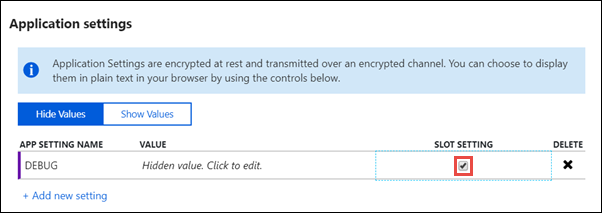

<a name="Swap"></a>

## Swap two slots 
You can swap deployment slots on your app's **Deployment slots** page and the **Overview** page. For technical details on the slot swap, see [What happens during swap](#AboutConfiguration).

> [!IMPORTANT]
> Before you swap an app from a deployment slot into production, make sure that production is your target slot and that all settings in the source slot are configured exactly as you want to have them in production.
> 
> 

To swap deployment slots:

1. Go to your app's **Deployment slots** page and select **Swap**.
   
    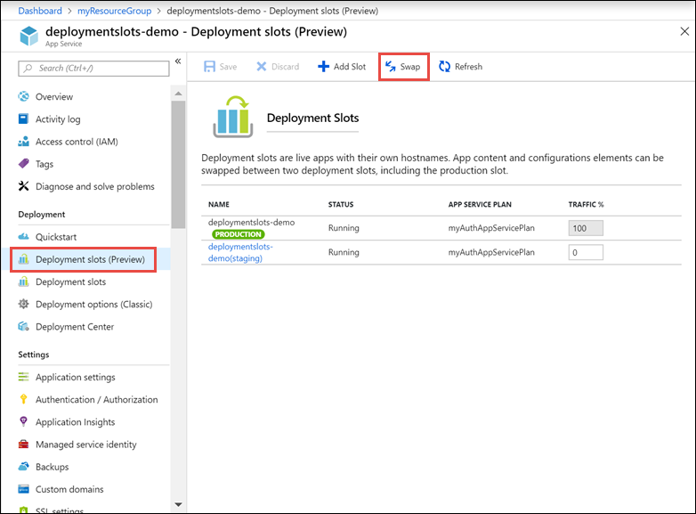

    The **Swap** dialog box shows settings in the selected source and target slots that will be changed.

2. Select the desired **Source** and **Target** slots. Usually, the target is the production slot. Also, select the **Source Changes** and **Target Changes** tabs and verify that the configuration changes are expected. When you're finished, you can swap the slots immediately by selecting **Swap**.

    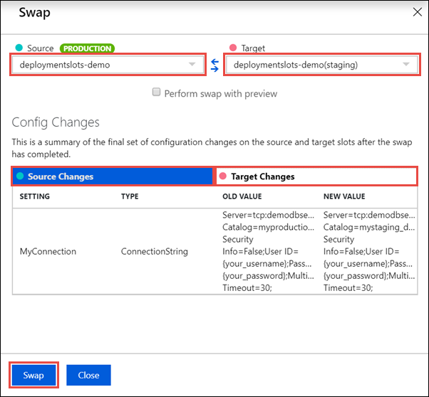

    To see how your target slot would run with the new settings before the swap actually happens, don't select **Swap**, but follow the instructions in [Swap with preview](#Multi-Phase).

3. When you're finished, close the dialog box by selecting **Close**.

If you have any problems, see [Troubleshoot swaps](#troubleshoot-swaps).

<a name="Multi-Phase"></a>

### Swap with preview (multi-phase swap)

Before you swap into production as the target slot, validate that the app runs with the swapped settings. The source slot is also warmed up before the swap completion, which is desirable for mission-critical applications.

When you perform a swap with preview, App Service performs the same [swap operation](#AboutConfiguration) but pauses after the first step. You can then verify the result on the staging slot before completing the swap. 

If you cancel the swap, App Service reapplies configuration elements to the source slot.

To swap with preview:

1. Follow the steps in [Swap deployment slots](#Swap) but select **Perform swap with preview**.

    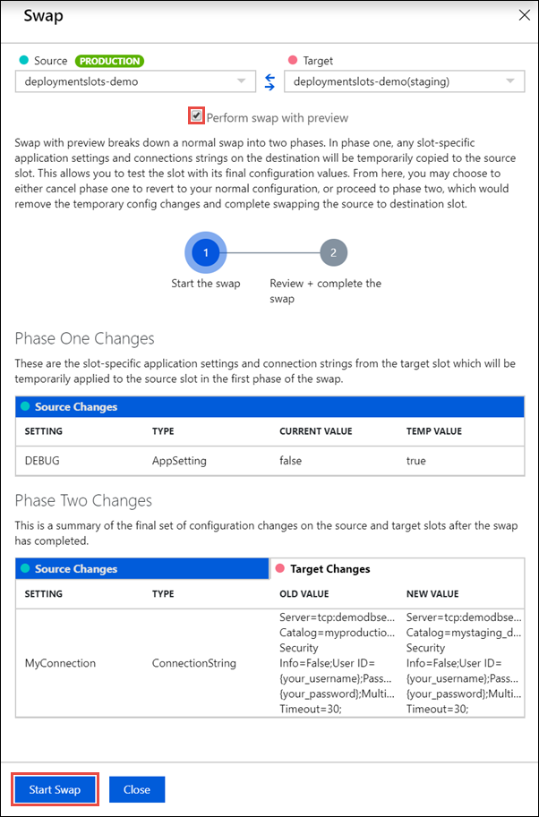

    The dialog box shows you how the configuration in the source slot changes in phase 1, and how the source and target slot change in phase 2.

2. When you're ready to start the swap, select **Start Swap**.

    When phase 1 finishes, you're notified in the dialog box. Preview the swap in the source slot by going to `https://<app_name>-<source-slot-name>.azurewebsites.net`. 

3. When you're ready to complete the pending swap, select **Complete Swap** in **Swap action** and select **Complete Swap**.

    To cancel a pending swap, select **Cancel Swap** instead.

4. When you're finished, close the dialog box by selecting **Close**.

If you have any problems, see [Troubleshoot swaps](#troubleshoot-swaps).

To automate a multi-phase swap, see [Automate with PowerShell](#automate-with-powershell).

<a name="Rollback"></a>

## Roll back a swap
If any errors occur in the target slot (for example, the production slot) after a slot swap, restore the slots to their pre-swap states by swapping the same two slots immediately.

<a name="Auto-Swap"></a>

## Configure auto swap

> [!NOTE]
> Auto swap isn't supported in web apps on Linux.

Auto swap streamlines Azure DevOps scenarios where you want to deploy your app continuously with zero cold starts and zero downtime for customers of the app. When auto swap is enabled from a slot into production, every time you push your code changes to that slot, App Service automatically [swaps the app into production](#swap-operation-steps) after it's warmed up in the source slot.

   > [!NOTE]
   > Before you configure auto swap for the production slot, consider testing auto swap on a non-production target slot.
   > 

To configure auto swap:

1. Go to your app's resource page. Select **Deployment slots** > *\<desired source slot>* > **Configuration** > **General settings**.
   
2. For **Auto swap enabled**, select **On**. Then select the desired target slot for **Auto swap deployment slot**, and select **Save** on the command bar. 
   
    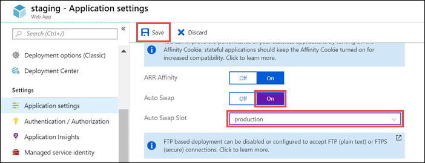

3. Execute a code push to the source slot. Auto swap happens after a short time, and the update is reflected at your target slot's URL.

If you have any problems, see [Troubleshoot swaps](#troubleshoot-swaps).

<a name="Warm-up"></a>

## Specify custom warm-up

Some apps might require custom warm-up actions before the swap. The `applicationInitialization` configuration element in web.config lets you specify custom initialization actions. The [swap operation](#AboutConfiguration) waits for this custom warm-up to finish before swapping with the target slot. Here's a sample web.config fragment.

```xml
<system.webServer>
    <applicationInitialization>
        <add initializationPage="/" hostName="[app hostname]" />
        <add initializationPage="/Home/About" hostName="[app hostname]" />
    </applicationInitialization>
</system.webServer>
```

For more information on customizing the `applicationInitialization` element, see [Most common deployment slot swap failures and how to fix them](https://ruslany.net/2017/11/most-common-deployment-slot-swap-failures-and-how-to-fix-them/).

You can also customize the warm-up behavior with one or both of the following [app settings](configure-common.md):

- `WEBSITE_SWAP_WARMUP_PING_PATH`: The path to ping to warm up your site. Add this app setting by specifying a custom path that begins with a slash as the value. An example is `/statuscheck`. The default value is `/`. 
- `WEBSITE_SWAP_WARMUP_PING_STATUSES`: Valid HTTP response codes for the warm-up operation. Add this app setting with a comma-separated list of HTTP codes. An example is `200,202` . If the returned status code isn't in the list, the warmup and swap operations are stopped. By default, all response codes are valid.

> [!NOTE]
> The `<applicationInitialization>` configuration element is part of each app start-up, whereas the two warm-up behavior app settings apply only to slot swaps.

If you have any problems, see [Troubleshoot swaps](#troubleshoot-swaps).

## Monitor a swap

If the [swap operation](#AboutConfiguration) takes a long time to complete, you can get information on the swap operation in the [activity log](../monitoring-and-diagnostics/monitoring-overview-activity-logs.md).

On your app's resource page in the portal, in the left pane, select **Activity log**.

A swap operation appears in the log query as `Swap Web App Slots`. You can expand it and select one of the suboperations or errors to see the details.

## Route traffic

By default, all client requests to the app's production URL (`http://<app_name>.azurewebsites.net`) are routed to the production slot. You can route a portion of the traffic to another slot. This feature is useful if you need user feedback for a new update, but you're not ready to release it to production.

### Route production traffic automatically

To route production traffic automatically:

1. Go to your app's resource page and select **Deployment slots**.

2. In the **Traffic %** column of the slot you want to route to, specify a percentage (between 0 and 100) to represent the amount of total traffic you want to route. Select **Save**.

    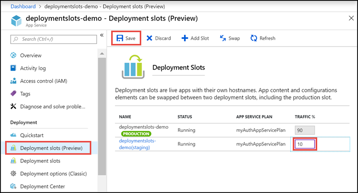

After the setting is saved, the specified percentage of clients is randomly routed to the non-production slot. 

After a client is automatically routed to a specific slot, it's "pinned" to that slot for the life of that client session. On the client browser, you can see which slot your session is pinned to by looking at the `x-ms-routing-name` cookie in your HTTP headers. A request that's routed to the "staging" slot has the cookie `x-ms-routing-name=staging`. A request that's routed to the production slot has the cookie `x-ms-routing-name=self`.

   > [!NOTE]
   > Next to the Azure portal, you can also use the [`az webapp traffic-routing set`](/cli/azure/webapp/traffic-routing#az-webapp-traffic-routing-set) command in the Azure CLI to set the routing percentages from CI/CD tools like DevOps pipelines or other automation systems.
   > 

### Route production traffic manually

In addition to automatic traffic routing, App Service can route requests to a specific slot. This is useful when you want your users to be able to opt in to or opt out of your beta app. To route production traffic manually, you use the `x-ms-routing-name` query parameter.

To let users opt out of your beta app, for example, you can put this link on your webpage:

```html
<a href="<webappname>.azurewebsites.net/?x-ms-routing-name=self">Go back to production app</a>
```

The string `x-ms-routing-name=self` specifies the production slot. After the client browser accesses the link, it's redirected to the production slot. Every subsequent request has the `x-ms-routing-name=self` cookie that pins the session to the production slot.

To let users opt in to your beta app, set the same query parameter to the name of the non-production slot. Here's an example:

```
<webappname>.azurewebsites.net/?x-ms-routing-name=staging
```

By default, new slots are given a routing rule of `0%`, shown in grey. When you explicitly set this value to `0%` (shown in black text), your users can access the staging slot manually by using the `x-ms-routing-name` query parameter. But they won't be routed to the slot automatically because the routing percentage is set to 0. This is an advanced scenario where you can "hide" your staging slot from the public while allowing internal teams to test changes on the slot.

<a name="Delete"></a>

## Delete a slot

Search for and select your app. Select **Deployment slots** > *\<slot to delete>* > **Overview**. The app type is shown as **App Service (Slot)** to remind you that you're viewing a deployment slot. Select **Delete** on the command bar.  

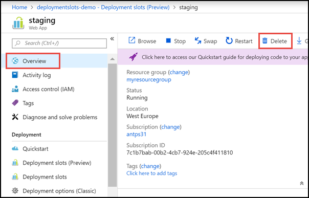

<!-- ======== AZURE POWERSHELL CMDLETS =========== -->

<a name="PowerShell"></a>

## Automate with PowerShell

[!INCLUDE [updated-for-az](../../includes/updated-for-az.md)]

Azure PowerShell is a module that provides cmdlets to manage Azure through Windows PowerShell, including support for managing deployment slots in Azure App Service.

For information on installing and configuring Azure PowerShell, and on authenticating Azure PowerShell with your Azure subscription, see [How to install and configure Microsoft Azure PowerShell](/powershell/azure/overview).  

---
### Create a web app
```powershell
New-AzWebApp -ResourceGroupName [resource group name] -Name [app name] -Location [location] -AppServicePlan [app service plan name]
```

---
### Create a slot
```powershell
New-AzWebAppSlot -ResourceGroupName [resource group name] -Name [app name] -Slot [deployment slot name] -AppServicePlan [app service plan name]
```

---
### Initiate a swap with a preview (multi-phase swap), and apply destination slot configuration to the source slot
```powershell
$ParametersObject = @{targetSlot  = "[slot name – e.g. "production"]"}
Invoke-AzResourceAction -ResourceGroupName [resource group name] -ResourceType Microsoft.Web/sites/slots -ResourceName [app name]/[slot name] -Action applySlotConfig -Parameters $ParametersObject -ApiVersion 2015-07-01
```

---
### Cancel a pending swap (swap with review) and restore the source slot configuration
```powershell
Invoke-AzResourceAction -ResourceGroupName [resource group name] -ResourceType Microsoft.Web/sites/slots -ResourceName [app name]/[slot name] -Action resetSlotConfig -ApiVersion 2015-07-01
```

---
### Swap deployment slots
```powershell
$ParametersObject = @{targetSlot  = "[slot name – e.g. "production"]"}
Invoke-AzResourceAction -ResourceGroupName [resource group name] -ResourceType Microsoft.Web/sites/slots -ResourceName [app name]/[slot name] -Action slotsswap -Parameters $ParametersObject -ApiVersion 2015-07-01
```

### Monitor swap events in the activity log
```powershell
Get-AzLog -ResourceGroup [resource group name] -StartTime 2018-03-07 -Caller SlotSwapJobProcessor  
```

---
### Delete a slot
```powershell
Remove-AzResource -ResourceGroupName [resource group name] -ResourceType Microsoft.Web/sites/slots –Name [app name]/[slot name] -ApiVersion 2015-07-01
```

## Automate with Resource Manager templates

[Azure Resource Manager templates](https://docs.microsoft.com/azure/azure-resource-manager/template-deployment-overview) are declarative JSON files used to automate the deployment and configuration of Azure resources. To swap slots by using Resource Manager templates, you will set two properties on the *Microsoft.Web/sites/slots* and *Microsoft.Web/sites* resources:

- `buildVersion`: this is a string property which represents the current version of the app deployed in the slot. For example: "v1", "1.0.0.1", or "2019-09-20T11:53:25.2887393-07:00".
- `targetBuildVersion`: this is a string property that specifies what `buildVersion` the slot should have. If the targetBuildVersion does not equal the current `buildVersion`, then this will trigger the swap operation by finding the slot which has the specified `buildVersion`.

### Example Resource Manager template

The following Resource Manager template will update the `buildVersion` of the staging slot and set the `targetBuildVersion` on the production slot. This will swap the two slots. The template assumes you already have a webapp created with a slot named "staging".

```json
{
    "$schema": "https://schema.management.azure.com/schemas/2015-01-01/deploymentTemplate.json#",
    "contentVersion": "1.0.0.0",
    "parameters": {
        "my_site_name": {
            "defaultValue": "SwapAPIDemo",
            "type": "String"
        },
        "sites_buildVersion": {
            "defaultValue": "v1",
            "type": "String"
        }
    },
    "resources": [
        {
            "type": "Microsoft.Web/sites/slots",
            "apiVersion": "2018-02-01",
            "name": "[concat(parameters('my_site_name'), '/staging')]",
            "location": "East US",
            "kind": "app",
            "properties": {
                "buildVersion": "[parameters('sites_buildVersion')]"
            }
        },
        {
            "type": "Microsoft.Web/sites",
            "apiVersion": "2018-02-01",
            "name": "[parameters('my_site_name')]",
            "location": "East US",
            "kind": "app",
            "dependsOn": [
                "[resourceId('Microsoft.Web/sites/slots', parameters('my_site_name'), 'staging')]"
            ],
            "properties": {
                "targetBuildVersion": "[parameters('sites_buildVersion')]"
            }
        }        
    ]
}
```

This Resource Manager template is idempotent, meaning that it can be executed repeatedly and produce the same state of the slots. After the first execution, `targetBuildVersion` will match the current `buildVersion`, so a swap will not be triggered.

<!-- ======== Azure CLI =========== -->

<a name="CLI"></a>

## Automate with the CLI

For [Azure CLI](https://github.com/Azure/azure-cli) commands for deployment slots, see [az webapp deployment slot](/cli/azure/webapp/deployment/slot).

## Troubleshoot swaps

If any error occurs during a [slot swap](#AboutConfiguration), it's logged in *D:\home\LogFiles\eventlog.xml*. It's also logged in the application-specific error log.

Here are some common swap errors:

- An HTTP request to the application root is timed. The swap operation waits for 90 seconds for each HTTP request, and retries up to 5 times. If all retries are timed out, the swap operation is stopped.

- Local cache initialization might fail when the app content exceeds the local disk quota specified for the local cache. For more information, see [Local cache overview](overview-local-cache.md).

- During [custom warm-up](#Warm-up), the HTTP requests are made internally (without going through the external URL). They can fail with certain URL rewrite rules in *Web.config*. For example, rules for redirecting domain names or enforcing HTTPS can prevent warm-up requests from reaching the app code. To work around this issue, modify your rewrite rules by adding the following two conditions:

    ```xml
    <conditions>
      <add input="{WARMUP_REQUEST}" pattern="1" negate="true" />
      <add input="{REMOTE_ADDR}" pattern="^100?\." negate="true" />
      ...
    </conditions>
    ```
- Without a custom warm-up, the URL rewrite rules can still block HTTP requests. To work around this issue, modify your rewrite rules by adding the following condition:

    ```xml
    <conditions>
      <add input="{REMOTE_ADDR}" pattern="^100?\." negate="true" />
      ...
    </conditions>
    ```
- Some [IP restriction rules](app-service-ip-restrictions.md) might prevent the swap operation from sending HTTP requests to your app. IPv4 address ranges that start with `10.` and `100.` are internal to your deployment. You should allow them to connect to your app.

- After slot swaps, the app may experience unexpected restarts. This is because after a swap, the hostname binding configuration goes out of sync, which by itself doesn't cause restarts. However, certain underlying storage events (such as storage volume failovers) may detect these discrepancies and force all worker processes to restart. To minimize these types of restarts, set the [`WEBSITE_ADD_SITENAME_BINDINGS_IN_APPHOST_CONFIG=1` app setting](https://github.com/projectkudu/kudu/wiki/Configurable-settings#disable-the-generation-of-bindings-in-applicationhostconfig) on *all slots*. However, this app setting does *not* work with Windows Communication Foundation (WCF) apps.

## Next steps
[Block access to non-production slots](app-service-ip-restrictions.md)
