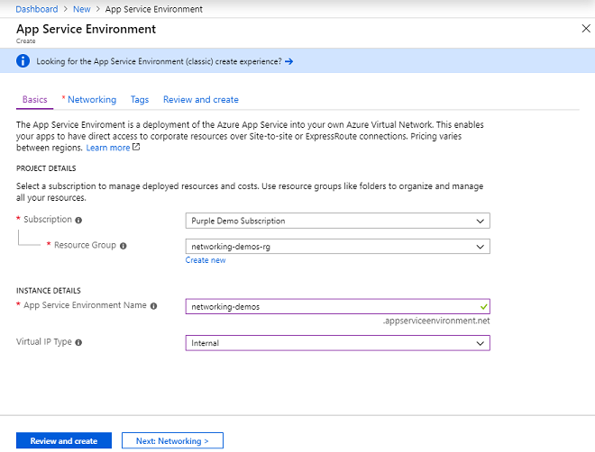

# Create and use an Internal Load Balancer App Service Environment 

The Azure App Service Environment is a deployment of Azure App Service into a subnet in an Azure virtual network (VNet). There are two ways to deploy an App Service Environment (ASE): 

- With a VIP on an external IP address, often called an External ASE.
- With a VIP on an internal IP address, often called an ILB ASE because the internal endpoint is an internal load balancer (ILB). 

This article shows you how to create an ILB ASE. For an overview on the ASE, see [Introduction to App Service Environments][Intro]. To learn how to create an External ASE, see [Create an External ASE][MakeExternalASE].

## Overview 

You can deploy an ASE with an internet-accessible endpoint or with an IP address in your VNet. To set the IP address to a VNet address, the ASE must be deployed with an ILB. When you deploy your ASE with an ILB, you must provide the name of your ASE. The name of your ASE is used in the domain suffix for the apps in your ASE.  The domain suffix for your ILB ASE is &lt;ASE name&gt;.appservicewebsites.net. Apps that are made in an ILB ASE are not put in the public DNS. 

Earlier versions of the ILB ASE required you to provide a domain suffix and a default certificate for HTTPS connections. The domain suffix is no longer collected at ILB ASE creation and a default certificate is also no longer collected. When you create an ILB ASE now, the default certificate is provided by Microsoft and is trusted by the browser. You are still able to set custom domain names on apps in your ASE and set certificates on those custom domain names. 

With an ILB ASE, you can do things such as:

-   Host intranet applications securely in the cloud, which you access through a site-to-site or ExpressRoute.
-   Protect apps with a WAF device
-   Host apps in the cloud that aren't listed in public DNS servers.
-   Create internet-isolated back-end apps, which your front-end apps can securely integrate with.

### Disabled functionality ###

There are some things that you can't do when you use an ILB ASE:

-   Use IP-based SSL.
-   Assign IP addresses to specific apps.
-   Buy and use a certificate with an app through the Azure portal. You can obtain certificates directly from a certificate authority and use them with your apps. You can't obtain them through the Azure portal.

## Create an ILB ASE ##

To create an ILB ASE:

1. In the Azure portal, select **Create a resource** > **Web** > **App Service Environment**.

2. Select your subscription.

3. Select or create a resource group.

4. Enter the name of your App Service Environment.

5. Select virtual IP type of Internal.

	

6. Select Networking

7. Select or create a Virtual Network. If you create a new VNet here, it will be defined with an address range of 192.168.250.0/23. To create a VNet with a different address range or in a different resource group than the ASE, use the Azure Virtual Network creation portal. 

8. Select or create an empty a subnet. If you want to select a subnet, it must be empty and not delegated. The subnet size cannot be changed after the ASE is created. We recommend a size of `/24`, which has 256 addresses and can handle a maximum-sized ASE and any scaling needs. 

	![ASE networking][1]

7. Select **Review and Create** then select **Create**.

## Create an app in an ILB ASE ##

You create an app in an ILB ASE in the same way that you create an app in an ASE normally.

1. In the Azure portal, select **Create a resource** > **Web** > **Web App**.

1. Enter the name of the app.

1. Select the subscription.

1. Select or create a resource group.

1. Select your Publish, Runtime Stack, and Operating System.

1. Select a location where the location is an existing ILB ASE.  You can also create a new ASE during app creation by selecting an Isolated App Service plan. If you wish to create a new ASE, select the region you want the ASE to be created in.

1. Select or create an App Service plan. 

1. Select **Review and Create** then select **Create** when you are ready.

### Web jobs, Functions and the ILB ASE 

Both Functions and web jobs are supported on an ILB ASE but for the portal to work with them, you must have network access to the SCM site.  This means your browser must either be on a host that is either in or connected to the virtual network. If your ILB ASE has a domain name that does not end in *appserviceenvironment.net*, you will need to get your browser to trust the HTTPS certificate being used by your scm site.

## DNS configuration 

When you use an External VIP, the DNS is managed by Azure. Any app created in your ASE is automatically added to Azure DNS, which is a public DNS. In an ILB ASE, you must manage your own DNS. The domain suffix used with an ILB ASE depends on the name of the ASE. The domain suffix is *&lt;ASE name&gt;.appserviceenvironment.net*. The IP address for your ILB is in the portal under **IP addresses**. 

To configure your DNS:

- create a zone for *&lt;ASE name&gt;.appserviceenvironment.net*
- create an A record in that zone that points * to the ILB IP address 
- create a zone in *&lt;ASE name&gt;.scm.appserviceenvironment.net* named scm
- create an A record in the scm zone that points to the ILB IP address

## Publish with an ILB ASE

For every app that's created, there are two endpoints. In an ILB ASE, you have *&lt;app name&gt;.&lt;ILB ASE Domain&gt;* and *&lt;app name&gt;.scm.&lt;ILB ASE Domain&gt;*. 

The SCM site name takes you to the Kudu console, called the **Advanced portal**, within the Azure portal. The Kudu console lets you view environment variables, explore the disk, use a console, and much more. For more information, see [Kudu console for Azure App Service][Kudu]. 

Internet-based CI systems, such as GitHub and Azure DevOps, will still work with an ILB ASE if the build agent is internet accessible and on the same network as ILB ASE. So in case of Azure DevOps, if the build agent is created on the same VNET as ILB ASE (different subnet is fine), it will be able to pull code from Azure DevOps git and deploy to ILB ASE. 
If you don't want to create your own build agent, you need to use a CI system that uses a pull model, such as Dropbox.

The publishing endpoints for apps in an ILB ASE use the domain that the ILB ASE was created with. This domain appears in the app's publishing profile and in the app's portal blade (**Overview** > **Essentials** and also **Properties**). If you have an ILB ASE with the domain suffix *&lt;ASE name&gt;.appserviceenvironment.net*, and an app named *mytest*, use *mytest.&lt;ASE name&gt;.appserviceenvironment.net* for FTP and *mytest.scm.contoso.net* for web deployment.

## Configure an ILB ASE with a WAF device ##

You can combine a web application firewall (WAF) device with your ILB ASE to only expose the apps that you want to the internet and keep the rest only accessible from in the VNet. This enables you to build secure multi-tier applications among other things.

To learn more about how to configure your ILB ASE with a  WAF device, see [Configure a web application firewall with your App Service environment][ASEWAF]. This article shows how to use a Barracuda virtual appliance with your ASE. Another option is to use Azure Application Gateway. Application Gateway uses the OWASP core rules to secure any applications placed behind it. For more information about Application Gateway, see [Introduction to the Azure web application firewall][AppGW].

## ILB ASEs made before May 2019

ILB ASEs that were made before May 2019 required you to set the domain suffix during ASE creation. They also required you to upload a default certificate that was based on that domain suffix. Also, with an older ILB ASE you can't perform single sign-on to the Kudu console with apps in that ILB ASE. When configuring DNS for an older ILB ASE, you need to set the wildcard A record in a zone that matches to your domain suffix. 

## Get started ##

* To get started with ASEs, see [Introduction to App Service environments][Intro]. 

<!--Image references-->
[1]: ./media/creating_and_using_an_internal_load_balancer_with_app_service_environment/createilbase-network.png
[2]: ./media/creating_and_using_an_internal_load_balancer_with_app_service_environment/createilbase-webapp.png
[5]: ./media/creating_and_using_an_internal_load_balancer_with_app_service_environment/createilbase-ipaddresses.png

<!--Links-->
[Intro]: ./intro.md
[MakeExternalASE]: ./create-external-ase.md
[MakeASEfromTemplate]: ./create-from-template.md
[MakeILBASE]: ./create-ilb-ase.md
[ASENetwork]: ./network-info.md
[UsingASE]: ./using-an-ase.md
[UDRs]: ../../virtual-network/virtual-networks-udr-overview.md
[NSGs]: ../../virtual-network/security-overview.md
[ConfigureASEv1]: app-service-web-configure-an-app-service-environment.md
[ASEv1Intro]: app-service-app-service-environment-intro.md
[webapps]: ../overview.md
[mobileapps]: ../../app-service-mobile/app-service-mobile-value-prop.md
[Functions]: ../../azure-functions/index.yml
[Pricing]: https://azure.microsoft.com/pricing/details/app-service/
[ARMOverview]: ../../azure-resource-manager/resource-group-overview.md
[ConfigureSSL]: ../web-sites-purchase-ssl-web-site.md
[Kudu]: https://azure.microsoft.com/resources/videos/super-secret-kudu-debug-console-for-azure-web-sites/
[ASEWAF]: app-service-app-service-environment-web-application-firewall.md
[AppGW]: ../../application-gateway/application-gateway-web-application-firewall-overview.md
[customdomain]: ../app-service-web-tutorial-custom-domain.md
[linuxapp]: ../containers/app-service-linux-intro.md
