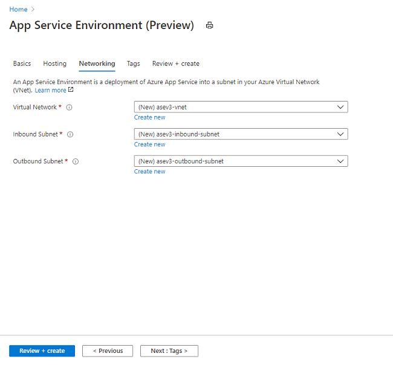

# Create an App Service Environment
> [!NOTE]
> This article is about the App Service Environment v3 which is used with Isolated v2 App Service plans
> 

The [App Service Environment (ASE)][Intro] is a single tenant deployment of the App Service that injects into your Azure Virtual Network (VNet). A deployment of an ASE will require use of one subnet. This subnet can't be used for anything else other than the ASE. 

## Before you create your ASE

After your ASE is created, you can't change:

- Location
- Subscription
- Resource group
- Azure Virtual Network (VNet) used
- Subnets used
- Subnet size
- Name of your ASE

The subnet needs to be large enough to hold the maximum size that you'll scale your ASE. Pick a large enough subnet to support your maximum scale needs since it can't be changed after creation. The recommended size is a /24 with 256 addresses.

## Creating an ASE in the portal

1. To create an ASE, search the marketplace for **App Service Environment v3**.  
2. Basics:  Select the Subscription, select or create the Resource Group, and enter the name of your ASE.  Select the type of Virtual IP type. If you select Internal, your inbound ASE address will be an address in your ASE subnet. If you select External, your inbound ASE address will be a public internet facing address. The ASE name will be also used for the domain suffix of your ASE. If your ASE name is *contoso* and you have an Internal VIP ASE, then the domain suffix will be *contoso.appserviceenvironment.net*. If your ASE name is *contoso* and you have an external VIP, the domain suffix will be *contoso.p.azurewebsites.net*. 

3. Hosting: Select *Enabled* or *Disabled* for Host Group deployment. Host Group deployment is used to select dedicated hardware. If you select Enabled, your ASE will be deployed onto dedicated hardware. When you deploy onto dedicated hardware, you are charged for the entire dedicated host during ASE creation and then a reduced price for your App Service plan instances. 

4. Networking:  Select or create your Virtual Network, select or create your subnet. If you are creating an internal VIP ASE, you will have the option to configure Azure DNS private zones to point your domain suffix to your ASE. Details on how to manually configure DNS are in the DNS section under [Using an App Service Environment][UsingASE].

5. Review and Create: Check that your configuration is correct and select create. Your ASE can take up to nearly two hours to create. 

After your ASE creation completes, you can select it as a location when creating your apps. To learn more about creating apps in your new ASE or managing your ASE, read [Using an App Service Environment][UsingASE]

## Dedicated hosts

The ASE is normally deployed on VMs that are provisioned on a multi-tenant hypervisor. If you need to deploy on dedicated systems, including the hardware, you can provision your ASE onto dedicated hosts. Dedicated hosts come in a pair to ensure redundancy. Dedicated host-based ASE deployments are priced differently than normal. There is a charge for the dedicated host and then another charge for each App Service plan instance. Deployments on host groups are not zone redundant. To deploy onto dedicated hosts, select **enable** for host group deployment on the Hosting tab.

<!--Links-->
[Intro]: ./overview.md
[MakeASE]: ./creation.md
[ASENetwork]: ./networking.md
[UsingASE]: ./using.md
[UDRs]: ../../virtual-network/virtual-networks-udr-overview.md
[NSGs]: ../../virtual-network/network-security-groups-overview.md
[Pricing]: https://azure.microsoft.com/pricing/details/app-service/
[ARMOverview]: ../../azure-resource-manager/management/overview.md
[ConfigureSSL]: ../configure-ssl-certificate.md
[Kudu]: https://azure.microsoft.com/resources/videos/super-secret-kudu-debug-console-for-azure-web-sites/
[AppDeploy]: ../deploy-local-git.md
[ASEWAF]: app-service-app-service-environment-web-application-firewall.md
[AppGW]: ../../web-application-firewall/ag/ag-overview.md
[logalerts]: ../../azure-monitor/alerts/alerts-log.md
