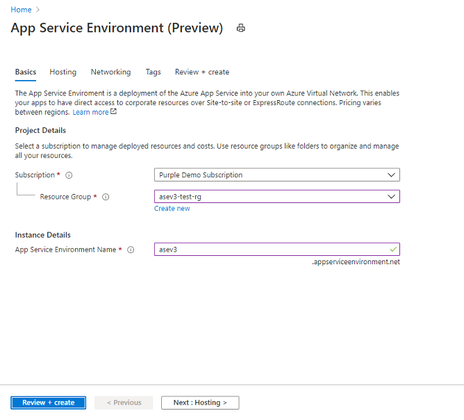
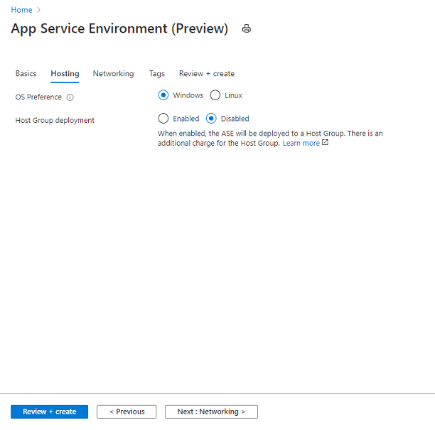
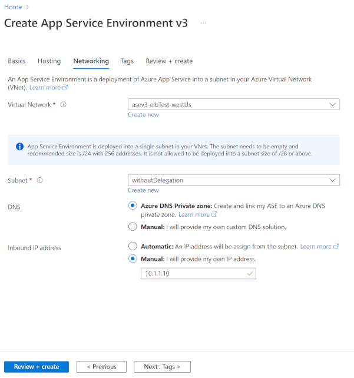
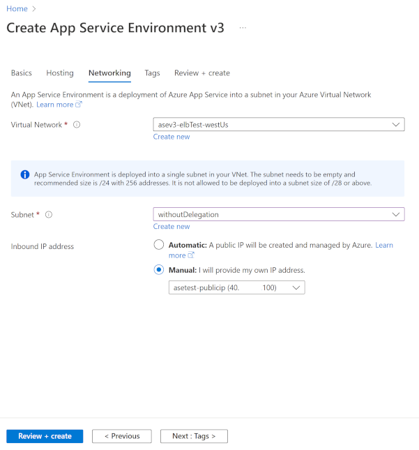

# Create an App Service Environment

[App Service Environment][Intro] is a single-tenant deployment of Azure App Service. You use it with an Azure virtual network. You need one subnet for a deployment of App Service Environment, and this subnet can't be used for anything else. 

> [!NOTE]
> This article is about App Service Environment v3, which is used with isolated v2 App Service plans.

## Before you create your App Service Environment

After you create your App Service Environment, you can't change any of the following:

- Location
- Subscription
- Resource group
- Azure virtual network
- Subnets
- Subnet size
- Name of your App Service Environment

Make your subnet large enough to hold the maximum size that you'll scale your App Service Environment. The recommended size is a /24 with 256 addresses.

## Deployment considerations

Before you deploy your App Service Environment, think about the virtual IP (VIP) type and the deployment type.

With an *internal VIP*, an address in your App Service Environment subnet reaches your apps. Your apps aren't on a public DNS. When you create your App Service Environment in the Azure portal, you have an option to create an Azure private DNS zone for your App Service Environment. With an *external VIP*, your apps are on an address facing the public internet, and they're in a public DNS.  For both *internal VIP* and *external VIP* you can specify *Inbound IP address*, you can select *Automatic* or *Manual* options. If you want to use the *Manual* option for an *external VIP*, you must first create a standard *Public IP address* in Azure. 

For the deployment type, you can choose *single zone*, *zone redundant*, or *host group*. The single zone is available in all regions where App Service Environment v3 is available. With the single zone deployment type, you have a minimum charge in your App Service plan of one instance of Windows Isolated v2. As soon as you use one or more instances, then that charge goes away. It isn't an additive charge.

In a zone redundant App Service Environment, your apps spread across three zones in the same region. Zone redundant is available in regions that support availability zones. With this deployment type, the smallest size for your App Service plan is three instances. That ensures that there's an instance in each availability zone. App Service plans can be scaled up one or more instances at a time. Scaling doesn't need to be in units of three, but the app is only balanced across all availability zones when the total instances are multiples of three.

A zone redundant deployment has triple the infrastructure, and ensures that even if two of the three zones go down, your workloads remain available. Due to the increased system need, the minimum charge for a zone redundant App Service Environment is nine instances. If you've fewer than this number of instances, the difference is charged as Windows I1v2. If you've nine or more instances, there's no added charge to have a zone redundant App Service Environment. To learn more about zone redundancy, see [Regions and availability zones](./overview-zone-redundancy.md).

In a host group deployment, your apps are deployed onto a dedicated host group. The dedicated host group isn't zone redundant. With this type of deployment, you can install and use your App Service Environment on dedicated hardware. There's no minimum instance charge for using App Service Environment on a dedicated host group, but you do have to pay for the host group when you're provisioning the App Service Environment. You also pay a discounted App Service plan rate as you create your plans and scale out.

With a dedicated host group deployment, there are a finite number of cores available that are used by both the App Service plans and the infrastructure roles. This type of deployment can't reach the 200 total instance count normally available in App Service Environment. The number of total instances possible is related to the total number of App Service plan instances, plus the load-based number of infrastructure roles.

## Create an App Service Environment in the portal

Here's how:

1. Search Azure Marketplace for *App Service Environment v3*.

2. From the **Basics** tab, for **Subscription**, select the subscription. For **Resource Group**, select or create the resource group, and enter the name of your App Service Environment. For **Virtual IP**, select **Internal** if you want your inbound address to be an address in your subnet. Select **External** if you want your inbound address to face the public internet. For **App Service Environment Name**, enter a name. The name must be no more than 36 characters. The name you choose will also be used for the domain suffix. For example, if the name you choose is *contoso*, and you have an internal VIP, the domain suffix will be `contoso.appserviceenvironment.net`. If the name you choose is *contoso*, and you have an external VIP, the domain suffix will be `contoso.p.azurewebsites.net`. 

    

3. From the **Hosting** tab, for **Physical hardware isolation**, select **Enabled** or **Disabled**. If you enable this option, you can deploy onto dedicated hardware. With a dedicated host deployment, you're charged for two dedicated hosts per our pricing when you create the App Service Environment v3 and then, as you scale, you're charged a specialized Isolated v2 rate per vCore. I1v2 uses two vCores, I2v2 uses four vCores, and I3v2 uses eight vCores per instance. For **Zone redundancy**, select **Enabled** or **Disabled**.

    

4. From the **Networking** tab, for **Virtual Network**, select or create your virtual network. For **Subnet**, select or create your subnet. If you're creating an App Service Environment with an internal VIP, you can configure Azure DNS private zones to point your domain suffix to your App Service Environment. For more information, see the DNS section in [Use an App Service Environment][UsingASE]. If you're creating an App Service Environment with an internal VIP, you can specify private IP address using **Manual** option for **Inbound IP address**.

    

If you're creating an App Service Environment with an external VIP, you can select public IP address using **Manual** option for **Inbound IP address**.

5. From the **Review + create** tab, check that your configuration is correct, and select **Create**. Your App Service Environment can take more than one hour to create. 

When your App Service Environment has been successfully created, you can select it as a location when you're creating your apps.

To learn how to create an App Service Environment from an ARM template, see [Create an App Service Environment by using an Azure Resource Manager template](how-to-create-from-template.md).

<!--Links-->
[Intro]: ./overview.md
[UsingASE]: ./using.md
