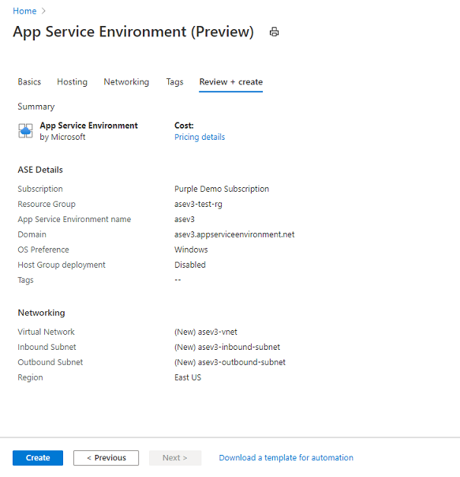

# Create an App Service Environment

> [!NOTE]
> This article is about the App Service Environment v3 (preview)
> 

The [App Service Environment (ASE)][Intro] is a single tenant deployment of the App Service that injects into your Azure Virtual Network (VNet).  ASEv3 only supports exposing apps on a private address in your Vnet. When an ASEv3 is created during preview, these resources are added to your subscription.

- App Service Environment
- Private endpoint

A deployment of an ASE will require use of two subnets.  One subnet will hold the private endpoint.  This subnet can be used for other things such as VMs.  The other subnet is used for outbound calls made from the ASE.  This subnet can't be used for anything else other than the ASE. 

## Before you create your ASE

After your ASE is created, you can't change:

- Location
- Subscription
- Resource group
- Azure Virtual Network (VNet) used
- Subnets used
- Subnet size
- Name of your ASE

The outbound subnet needs to be large enough to hold the maximum size that you'll scale your ASE. Pick a large enough subnet to support your maximum scale needs since it can't be changed after creation. The recommended size is a /24 with 256 addresses.

After the ASE is created, you can add apps to it. When your ASEv3 has no App Service plans in it, there is a charge as though you had one instance of an I1v2 App Service plan in your ASE.  

The ASEv3 is only offered in select regions. More regions will be added as the preview moves along towards GA. 

## Creating an ASE in the portal

1. To create an ASEv3, search the marketplace for **App Service Environment (preview)**.  
2. Basics:  Select the Subscription, select or create the Resource Group, and enter the name of your ASE.  The ASE name will be also used for the domain suffix of your ASE.  If your ASE name is *contoso* then the domain suffix will be *contoso.appserviceenvironment.net*.  This name will be automatically set in your Azure DNS private zone used by the Vnet the ASE is deployed into. 

    

3. Hosting: Select OS Preference, Host Group deployment. The OS preference indicates the operating system you'll initially use for your apps in this ASE. You can add apps of the other OS after ASE creation. Host Group deployment is used to select dedicated hardware. With ASEv3 you can select Enabled and then land on dedicated hardware. You are charged for the entire dedicated host with ASE creation and then a reduced price for your App Service plan instances. 

    

4. Networking:  Select or create your Virtual Network, select or create your inbound subnet, select or create your outbound subnet. Any subnet used for outbound must be empty and delegated to Microsoft.Web/hostingEnvironments. If you create your subnet through the portal, the subnet will automatically be delegated for you.

    

5. Review and Create: Check that your configuration is correct and select create. Your ASE will take approximately an hour to create. 

    

After your ASE creation completes, you can select it as a location when creating your apps. To learn more about creating apps in your new ASE, read [Using an App Service Environment][UsingASE]

## OS Preference
In an ASE you can have Windows apps, Linux apps or both. In ASEv2, the initial preference selected during creation adds the high availability infrastructure for that OS during ASE creation. To add apps of the other OS, just make the apps as usual and select the OS you want. In ASEv3, this will not affect backend behavior appreciatively.  

## Dedicated hosts
The ASE is normally deployed on VMs that are provisioned on a multi-tenant hypervisor. If you need to deploy on dedicated systems, including the hardware, you can provision your ASE onto dedicated hosts. In the initial ASEv3 preview, dedicated hosts come in a pair. Each dedicated host is in a separate availability zone, if the region permits it. Dedicated host-based ASE deployments are priced differently than normal. There is a charge for the dedicated host and then another charge for each App Service plan instance.  

<!--Links-->
[Intro]: ./overview.md
[MakeASE]: ./creation.md
[ASENetwork]: ./networking.md
[UsingASE]: ./using.md
[UDRs]: ../../virtual-network/virtual-networks-udr-overview.md
[NSGs]: ../../virtual-network/network-security-groups-overview.md
[Pricing]: https://azure.microsoft.com/pricing/details/app-service/
[ARMOverview]: ../../azure-resource-manager/management/overview.md
[ConfigureSSL]: ../configure-ssl-certificate.md
[Kudu]: https://azure.microsoft.com/resources/videos/super-secret-kudu-debug-console-for-azure-web-sites/
[AppDeploy]: ../deploy-local-git.md
[ASEWAF]: app-service-app-service-environment-web-application-firewall.md
[AppGW]: ../../web-application-firewall/ag/ag-overview.md
[logalerts]: ../../azure-monitor/alerts/alerts-log.md
