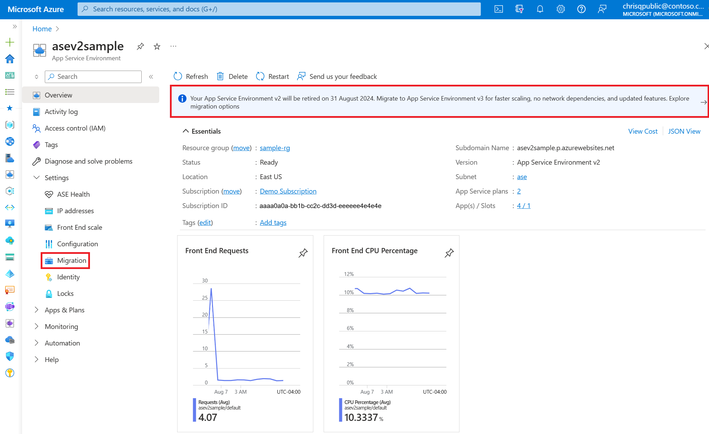

# Use the migration feature to migrate App Service Environment v2 to App Service Environment v3

An App Service Environment v2 can be automatically migrated to an [App Service Environment v3](overview.md) using the migration feature. To learn more about the migration process and to see if your App Service Environment supports migration at this time, see the [Migration to App Service Environment v3 Overview](migrate.md).

> [!IMPORTANT]
> It is recommended to use this feature for dev environments first before migrating any production environments to ensure there are no unexpected issues. Please provide any feedback related to this article or the feature using the buttons at the bottom of the page.
>

## Prerequisites

Ensure you understand how migrating to an App Service Environment v3 will affect your applications. Review the [migration process](migrate.md#overview-of-the-migration-process-using-the-migration-feature) to understand the process timeline and where and when you'll need to get involved. Also review the [FAQs](migrate.md#frequently-asked-questions), which may answer some questions you currently have.

::: zone pivot="experience-azcli"

The recommended experience for the migration feature is using the [Azure portal](how-to-migrate.md?pivots=experience-azp). If you decide to use the Azure CLI to carry out the migration, you should follow the steps described here in order and as written since you'll be making Azure REST API calls. The recommended way for making these API calls is by using the [Azure CLI](/cli/azure/). For information about other methods, see [Getting Started with Azure REST](/rest/api/azure/).

For this guide, [install the Azure CLI](/cli/azure/install-azure-cli) or use the [Azure Cloud Shell](https://shell.azure.com/).

## 1. Get your App Service Environment ID

Run these commands to get your App Service Environment ID and store it as an environment variable. Replace the placeholders for name and resource group with your values for the App Service Environment you want to migrate.

```azurecli
ASE_NAME=<Your-App-Service-Environment-name>
ASE_RG=<Your-Resource-Group>
ASE_ID=$(az appservice ase show --name $ASE_NAME --resource-group $ASE_RG --query id --output tsv)
```

## 2. Validate migration is supported

The following command will check whether your App Service Environment is supported for migration. If you receive an error or if your App Service Environment is in an unhealthy or suspended state, you can't migrate at this time. If your environment [won't be supported for migration](migrate.md#supported-scenarios) or you want to migrate to App Service Environment v3 without using the migration feature, see the [manual migration options](migration-alternatives.md).

```azurecli
az rest --method post --uri "${ASE_ID}/migrate?api-version=2021-02-01&phase=validation"
```

If there are no errors, your migration is supported and you can continue to the next step.

## 3. Generate IP addresses for your new App Service Environment v3

Run the following command to create the new IPs. This step will take about 15 minutes to complete. Don't scale or make changes to your existing App Service Environment during this time.

```azurecli
az rest --method post --uri "${ASE_ID}/migrate?api-version=2021-02-01&phase=premigration"
```

Run the following command to check the status of this step.

```azurecli
az rest --method get --uri "${ASE_ID}?api-version=2021-02-01" --query properties.status
```

If it's in progress, you'll get a status of "Migrating". Once you get a status of "Ready", run the following command to get your new IPs. If you don't see the new IPs immediately, wait a few minutes and try again.

```azurecli
az rest --method get --uri "${ASE_ID}/configurations/networking?api-version=2021-02-01"
```

## 4. Update dependent resources with new IPs

Don't move on to migration immediately after completing the previous step. Using the new IPs, update any resources and networking components to ensure your new environment functions as intended once migration is complete. It's your responsibility to make any necessary updates.

## 5. Delegate your App Service Environment subnet

App Service Environment v3 requires the subnet it's in to have a single delegation of `Microsoft.Web/hostingEnvironments`. Previous versions didn't require this delegation. You'll need to confirm your subnet is delegated properly and update the delegation if needed before migrating. You can update the delegation either by running the following command or by navigating to the subnet in the [Azure portal](https://portal.azure.com).

```azurecli
az network vnet subnet update -g $ASE_RG -n <subnet-name> --vnet-name <vnet-name> --delegations Microsoft.Web/hostingEnvironments
```


## 6. Migrate to App Service Environment v3

Only start this step once you've completed all pre-migration actions listed previously and understand the [implications of migration](migrate.md#migrate-to-app-service-environment-v3) including what will happen during this time. There will be about one hour of downtime. Scaling and modifications to your existing App Service Environment will be blocked during this step.

```azurecli
az rest --method post --uri "${ASE_ID}/migrate?api-version=2021-02-01&phase=fullmigration"
```

Run the following command to check the status of your migration. The status will show as "Migrating" while in progress.

```azurecli
az rest --method get --uri "${ASE_ID}?api-version=2021-02-01" --query properties.status
```

Once you get a status of "Ready", migration is done and you have an App Service Environment v3. Your apps will now be running in your new environment.

Get the details of your new environment by running the following command or by navigating to the [Azure portal](https://portal.azure.com).

```azurecli
az appservice ase show --name $ASE_NAME --resource-group $ASE_RG
```

::: zone-end

::: zone pivot="experience-azp"

## 1. Validate migration is supported

From the [Azure portal](https://portal.azure.com), navigate to the **Overview** page for the App Service Environment you'll be migrating. The platform will validate if migration is supported for your App Service Environment. Wait a couple seconds after the page loads for this validation to take place.

If migration is supported for your App Service Environment, there are three ways to access the migration feature. These methods include a banner at the top of the Overview page, a new item in the left-hand side menu called **Migration (preview)**, and an info box on the **Configuration** page. Select any of these methods to move on to the next step in the migration process.




If you don't see these elements, your App Service Environment isn't supported for migration at this time or your environment is in an unhealthy or suspended state (which blocks migration). If your environment [won't be supported for migration](migrate.md#supported-scenarios) or you want to migrate to App Service Environment v3 without using the migration feature, see the [manual migration options](migration-alternatives.md).

The migration page will guide you through the series of steps to complete the migration.


## 2. Generate IP addresses for your new App Service Environment v3

Under **Generate new IP addresses**, confirm you understand the implications and start the process. This step will take about 15 minutes to complete. Don't scale or make changes to your existing App Service Environment during this time. If you may see a message a few minutes after starting this step asking you to refresh the page, select refresh as shown in the sample to allow your new IP addresses to appear.


## 3. Update dependent resources with new IPs

When the previous step finishes, you'll be shown the IP addresses for your new App Service Environment v3. Using the new IPs, update any resources and networking components to ensure your new environment functions as intended once migration is complete. It's your responsibility to make any necessary updates. Don't move on to the next step until you confirm that you have made these updates.


## 4. Delegate your App Service Environment subnet

App Service Environment v3 requires the subnet it's in to have a single delegation of `Microsoft.Web/hostingEnvironments`. Previous versions didn't require this delegation. You'll need to confirm your subnet is delegated properly and update the delegation if needed before migrating. A link to your subnet is given so that you can confirm and update as needed.


## 5. Migrate to App Service Environment v3

Once you've completed all of the above steps, you can start migration. Make sure you understand the [implications of migration](migrate.md#migrate-to-app-service-environment-v3) including what will happen during this time. There will be about one hour of downtime. Scaling and modifications to your existing App Service Environment will be blocked during this step.

When migration is complete, you'll have an App Service Environment v3 and all of your apps will be running in your new environment. You can confirm the environment's version by checking the **Configuration** page for your App Service Environment.

::: zone-end

## Next steps

> [!div class="nextstepaction"]
> [Using an App Service Environment v3](using.md)

> [!div class="nextstepaction"]
> [App Service Environment v3 Networking](networking.md)
