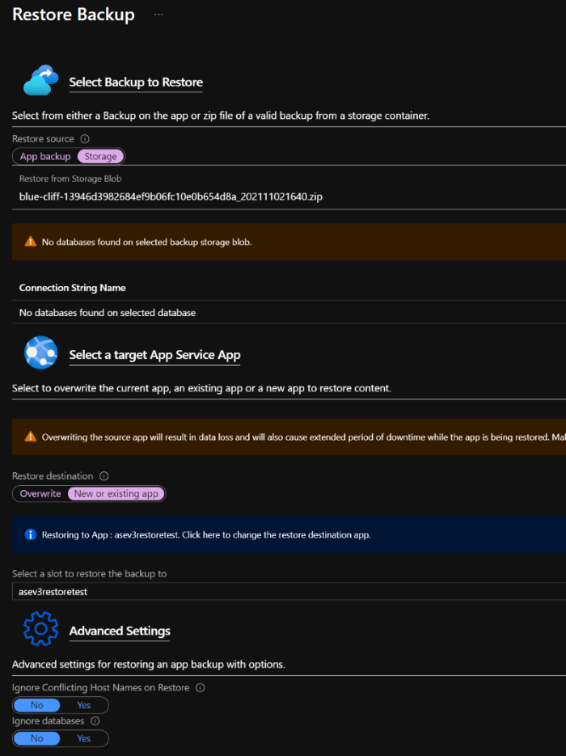
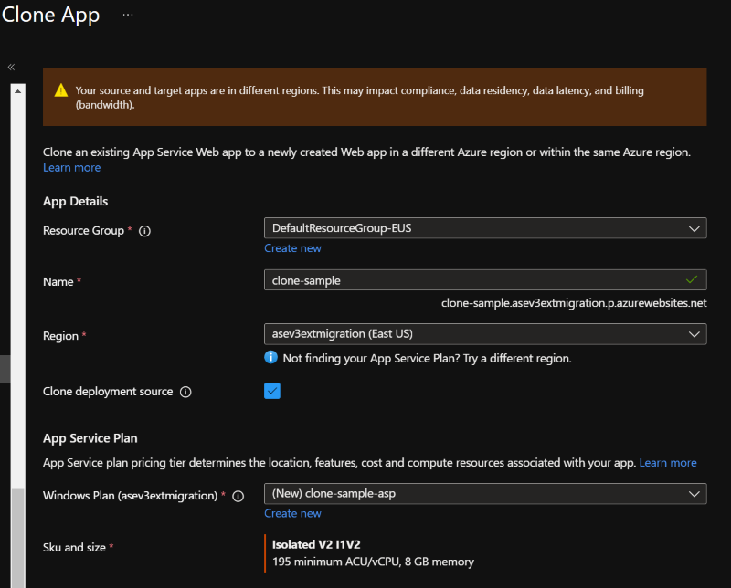
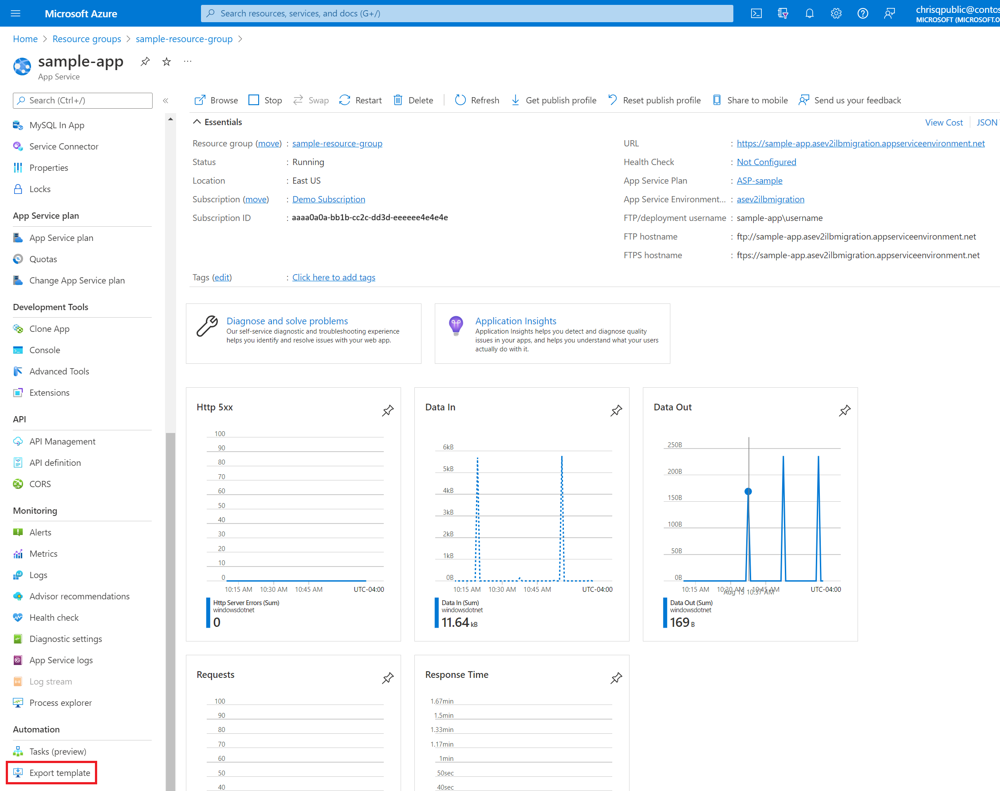
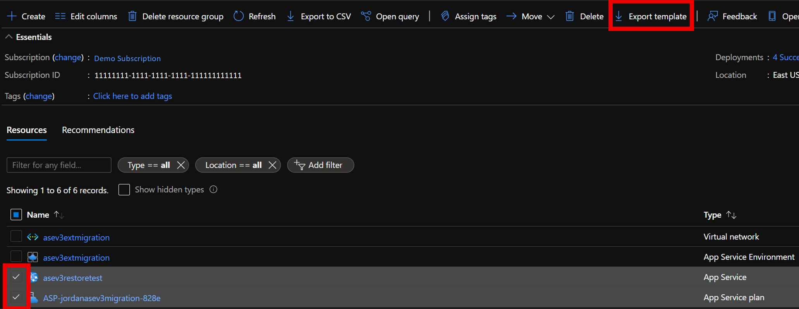

# Migrate to App Service Environment v3 without using the migration feature

> [!NOTE]
> The App Service Environment v3 [migration feature](migrate.md) is now available in preview for a set of supported environment configurations. Consider that feature which provides an automated migration path to [App Service Environment v3](overview.md).
>

If you're currently using App Service Environment v1 or v2, you have the opportunity to migrate your workloads to [App Service Environment v3](overview.md). App Service Environment v3 has [advantages and feature differences](overview.md#feature-differences) that provide enhanced support for your workloads and can reduce overall costs. Consider using the [migration feature](migrate.md) if your environment falls into one of the [supported scenarios](migrate.md#supported-scenarios). If your environment isn't currently supported by the migration feature, you can wait for support if your scenario is listed in the [upcoming supported scenarios](migrate.md#preview-limitations). Otherwise, you can choose to use one of the alternative migration options given below.

If your App Service Environment [won't be supported for migration](migrate.md#migration-feature-limitations) with the migration feature, you must use one of the alternative methods to migrate to App Service Environment v3.

## Prerequisites

Scenario: An existing app running on an App Service Environment v1 or App Service Environment v2 and you need that app to run on an App Service Environment v3.

For any migration method that doesn't use the [migration feature](migrate.md), you'll need to [create the App Service Environment v3](creation.md) and a new subnet using the method of your choice. There are [feature differences](overview.md#feature-differences) between App Service Environment v1/v2 and App Service Environment v3 as well as [networking changes](networking.md) that will involve new (and for internet-facing environments, additional) IP addresses. You'll need to update any infrastructure that relies on these IPs.

Note that multiple App Service Environments can't exist in a single subnet. If you need to use your existing subnet for your new App Service Environment v3, you'll need to delete the existing App Service Environment before you create a new one. For this scenario, the recommended migration method is to [back up your apps and then restore them](#back-up-and-restore) on the new environment after it gets created and configured. There will be application downtime during this process because of the time it takes to delete the old environment (15 minutes), create the new App Service Environment v3 (30 minutes), configure any infrastructure and connected resources to work with the new environment (your responsibility), and deploy your apps onto the new environment (application deployment, type, and quantity dependent).

### Checklist before migrating apps

- [Create an App Service Environment v3](creation.md)
- After creating the new environment, update any networking dependencies with the IP addresses associated with the new environment
- Plan for downtime (if applicable)
- Decide on a process for recreating your apps in your new environment

## Isolated v2 App Service plans

App Service Environment v3 uses Isolated v2 App Service plans that are priced and sized differently than those from Isolated plans. Review the [SKU details](https://azure.microsoft.com/pricing/details/app-service/windows/) to understand how you're new environment will need to be sized and scaled to ensure appropriate capacity. There's no difference in how you create App Service plans for App Service Environment v3 compared to previous versions.

## Back up and restore

The [back up](../manage-backup.md) and [restore](../web-sites-restore.md) feature allows you to keep your app configuration, file content, and database connected to your app when migrating to your new environment. Make sure you review the [requirements and restrictions](../manage-backup.md#requirements-and-restrictions) of this feature.

The step-by-step instructions in the current documentation for [back up](../manage-backup.md) and [restore](../web-sites-restore.md) should be sufficient to allow you to use this feature. When restoring, the **Storage** option lets you select any backup ZIP file from any existing Azure Storage account container in your subscription. A sample of a restore configuration is given below.



|Benefits     |Limitations    |
|---------|---------|
|Quick - should only take 5-10 minutes per app        |Support is limited to [certain database types](../manage-backup.md#what-gets-backed-up)         |
|Multiple apps can be restored at the same time (restoration needs to be configured for each app individually)       |Old and new environments as well as supporting resources (for example apps, databases, storage accounts and containers) must all be in the same subscription        |
|In-app MySQL databases are automatically backed up without any configuration        |Backups can be up to 10 GB of app and database content, up to 4 GB of which can be the database backup. If the backup size exceeds this limit, you get an error.        |
|Can restore the app to a snapshot of a previous state         |Using a [firewall enabled storage account](../../storage/common/storage-network-security.md) as the destination for your backups isn't supported   |
|Can integrate with [Azure Traffic Manager](../../traffic-manager/traffic-manager-overview.md) and [Azure Application Gateway](../../application-gateway/overview.md) to distribute traffic across old and new environments          |Using a [private endpoint enabled storage account](../../storage/common/storage-private-endpoints.md) for backup and restore isn't supported  |
|Can create empty web apps to restore to in your new environment before you start restoring to speed up the process   |        |

## Clone your app to an App Service Environment v3

[Cloning your apps](../app-service-web-app-cloning.md) is another feature that can be used to get your **Windows** apps onto your App Service Environment v3. There are limitations with cloning apps. These limitations are the same as those for the App Service Backup feature, see [Back up an app in Azure App Service](../manage-backup.md#requirements-and-restrictions).

> [!NOTE]
> Cloning apps is supported on Windows App Service only.
>

This solution is recommended for users that are using Windows App Service and can't migrate using the [migration feature](migrate.md). You'll need to set up your new App Service Environment v3 before cloning any apps. Cloning an app can take up to 30 minutes to complete. Cloning can be done using PowerShell as described in the [documentation](../app-service-web-app-cloning.md#cloning-an-existing-app-to-an-app-service-environment) or using the Azure portal as described below.

To clone an app using the [Azure portal](https://www.portal.azure.com), navigate to your existing App Service and select **Clone App** under **Development Tools**. Fill in the required fields using the details for your new App Service Environment v3.

1. Select an existing or create a new **Resource Group**
1. Give your app a **Name**. This name can be the same as the old app, but note the site's default URL using the new environment will be different. You'll need to update any custom DNS or connected resources to point to the new URL.
1. Use your App Service Environment v3 name for **Region**
1. Choose whether or not to clone your deployment source
1. You can use an existing Windows **App Service plan** from your new environment if you created one already, or create a new one. The available Windows App Service plans in your new App Service Environment v3, if any, will be listed in the dropdown.
1. Modify **SKU and size** as needed using one of the Isolated v2 options if creating a new App Service plan. Note App Service Environment v3 uses Isolated v2 plans, which have more memory and CPU per corresponding instance size compared to the Isolated plan. For more information, see [App Service Environment v3 pricing](overview.md#pricing).



|Benefits     |Limitations     |
|---------|---------|
|Can be automated using PowerShell        |Only supported on Windows App Service        |
|Multiple apps can be cloned at the same time (cloning needs to be configured for each app individually or using a script)       |Support is limited to [certain database types](../manage-backup.md#what-gets-backed-up)         |
|Can integrate with [Azure Traffic Manager](../../traffic-manager/traffic-manager-overview.md) and [Azure Application Gateway](../../application-gateway/overview.md) to distribute traffic across old and new environments       |Old and new environments as well as supporting resources (for example apps, databases, storage accounts and containers) must all be in the same subscription        |

## Manually create your apps on an App Service Environment v3

If the above features don't support your apps or you're looking to take a more manual route, you have the option of deploying your apps following the same process you used for your existing App Service Environment. At this time, all deployment methods except FTP are supported on App Service Environment v3. You don't need to make updates when you deploy your apps to your new environment unless you want to make changes or take advantage of App Service Environment v3's dedicated features.

You can export [Azure Resource Manager (ARM) templates](../../azure-resource-manager/templates/overview.md) of your existing apps, App Service plans, and any other supported resources and deploy them in your new environment. To export a template for just your app, head over to your App Service and go to **Export template** under **Automation**.



You can also export templates for multiple resources directly from your resource group by going to your resource group, selecting the resources you want a template for, and then selecting **Export template**.



The following initial changes to your Azure Resource Manager templates are required to get your apps onto your App Service Environment v3:

- Update SKU parameters for App Service plan to an Isolated v2 plan as shown below if creating a new plan

    ```json
    "type": "Microsoft.Web/serverfarms",
    "apiVersion": "2021-02-01",
    "name": "[parameters('serverfarm_name')]",
    "location": "East US",
    "sku": {
        "name": "I1v2",
        "tier": "IsolatedV2",
        "size": "I1v2",
        "family": "Iv2",
        "capacity": 1
    },
    ```

- Update App Service plan (serverfarm) parameter the app is to be deployed into to the plan associated with the App Service Environment v3
- Update hosting environment profile (hostingEnvironmentProfile) parameter to the new App Service Environment v3 resource ID
- An Azure Resource Manager template export includes all properties exposed by the resource providers for the given resources. Remove all non-required properties such as those which point to the domain of the old app. For example, you `sites` resource could be simplified to the below:

    ```json
    "type": "Microsoft.Web/sites",
    "apiVersion": "2021-02-01",
    "name": "[parameters('site_name')]",
    "location": "East US",
    "dependsOn": [
        "[resourceId('Microsoft.Web/serverfarms', parameters('serverfarm_name'))]"
    ],
    "properties": {
        "serverFarmId": "[resourceId('Microsoft.Web/serverfarms', parameters('serverfarm_name'))]",
        "siteConfig": {
            "linuxFxVersion": "NODE|14-lts"
         },
        "hostingEnvironmentProfile": {
            "id": "[parameters('hostingEnvironments_externalid')]"
        }
    }
    ```

Other changes may be required depending on how your app is configured.

Azure Resource Manager templates can be [deployed](../deploy-complex-application-predictably.md) using multiple methods including using the Azure portal, Azure CLI, or PowerShell.

## Guidance for manual migration

The [migration feature](migrate.md) automates the migration to App Service Environment v3 and at the same time transfers all of your apps to the new environment. There's about one hour of downtime during this migration. If you're in a position where you can't have any downtime, the recommendation is to use one of the manual options to recreate your apps in an App Service Environment v3.

You can distribute traffic between your old and new environment using an [Application Gateway](../networking/app-gateway-with-service-endpoints.md). If you're using an Internal Load Balancer (ILB) App Service Environment, see the [considerations](../networking/app-gateway-with-service-endpoints.md#considerations-for-ilb-ase) and [create an Azure Application Gateway](integrate-with-application-gateway.md) with an extra backend pool to distribute traffic between your environments. For internet facing App Service Environments, see these [considerations](../networking/app-gateway-with-service-endpoints.md#considerations-for-external-ase). You can also use services like [Azure Front Door](../../frontdoor/quickstart-create-front-door.md), [Azure Content Delivery Network (CDN)](../../cdn/cdn-add-to-web-app.md), and [Azure Traffic Manager](../../cdn/cdn-traffic-manager.md) to distribute traffic between environments. Using these services allows for testing of your new environment in a controlled manner and allows you to move to your new environment at your own pace.

Once your migration and any testing with your new environment is complete, delete your old App Service Environment, the apps that are on it, and any supporting resources that you no longer need. You'll continue to be charged for any resources that haven't been deleted.

## Next steps

> [!div class="nextstepaction"]
> [App Service Environment v3 Networking](networking.md)

> [!div class="nextstepaction"]
> [Using an App Service Environment v3](using.md)

> [!div class="nextstepaction"]
> [Integrate your ILB App Service Environment with the Azure Application Gateway](integrate-with-application-gateway.md)
