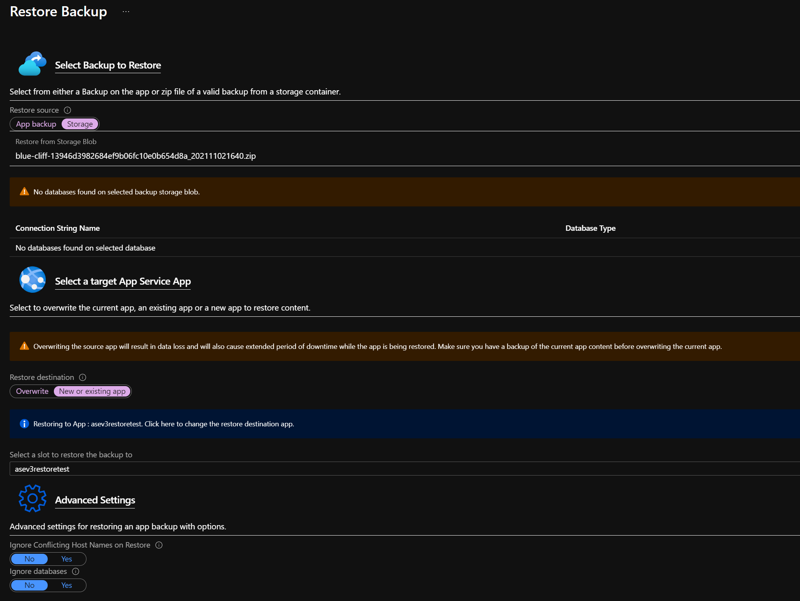
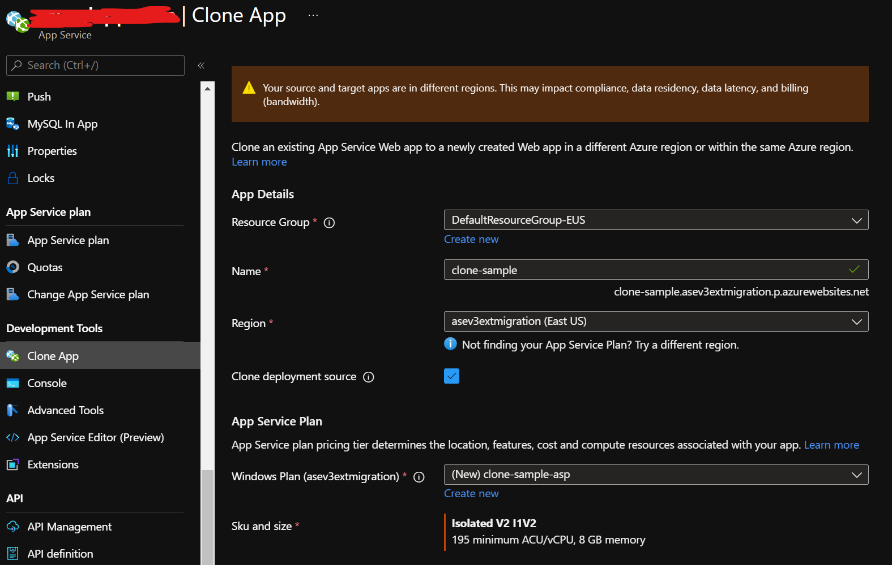

# Migrate to App Service Environment v3 Without Using the Migration Tool

> [!NOTE]
> The App Service Environment v3 [migration tool](migrate.md) is now available in preview for a set of supported environment configurations. Consider that tool which provides an automated migration path to [App Service Environment v3](overview.md).
>

If you're currently using App Service Environment v1 or v2, you have the opportunity to migrate your workloads to [App Service Environment v3](overview.md). App Service Environment v3 has [advantages and feature differences](overview.md#feature-differences) that provide enhanced support for your workloads and can reduce overall costs. Consider using the [migration tool](migration.md) if your environment falls into one of the [supported configurations](migrate.md#supported-scenarios). If your environment isn't currently supported by the migration tool, you can wait for support if your scenario is listed in the [upcoming supported scenarios](migrate.md#preview-limitations). Otherwise, you choose to use one of the alternative migration options given below.

> [!IMPORTANT]
> If your App Service Environment will [not be supported for migration](migrate.md#migration-tool-limitations) with the migration tool, you must use one of the alternative methods to migrate to App Service Environment v3.
>

## Prerequisites

Scenario: An existing app running on an App Service Environment v1 or v2 and you need that app to run on an App Service Environment v3.

For any migration method that doesn't use the [migration tool](migration.md), you'll need to [create the App Service Environment v3](creation.md) and a new subnet using the method of your choice. There are feature differences between App Service Environment v1/v2 and v3 as well as [networking changes](networking.md) that will involve new (and an extra one for internet facing environments) IP addresses. You'll need to update any infrastructure that relies on these IPs.

> [!WARNING]
> Multiple App Service Environments can't exist in a single subnet. If you need to use your existing subnet for your new App Service Environment v3, you'll need to delete the existing App Service Environment before creating a new one. 
>
> For this scenario, the recommended migration method is to [back up your apps and then restore them](#back-up-and-restore) on the new environment after it gets created and configured. There will be application downtime during this process due to the time it takes to delete the old environment (15 minutes), create the new App Service Environment v3 (30 minutes), configure any infrastructure and connected resources to work with the new environment (your responsibility), and deploy your apps onto the new environment (application deployment, type, and quantity dependent).  
>

### Checklist before migrating apps

<!-- TO DO
- create new ase
- update networking dependencies with new IPs
- ... -->

## Manually migrate your apps onto an App Service Environment v3

### Back up and restore

The [back up](../manage-backup.md) and [restore](../web-sites-restore.md) feature allows you to keep your app configuration, file content, and database connected to your app when migrating to your new environment. Make sure you review the [requirements and restrictions](../manage-backup.md#requirements-and-restrictions) of this feature.

The step-by-step instructions in the current documentation for [back up](../manage-backup.md) and [restore](../web-sites-restore.md) should be sufficient to allow you to use this feature. Note that when restoring, the **Storage** option lets you select any backup ZIP file from any existing Azure Storage account and container in your subscription. Also note that you can create the apps that you'll be restoring to before starting the process, or you can configure the new apps during the restoration process. A sample of the restore configuration screen is given below.

|Benefits     |Limitations    |
|---------|---------|
|Quick - should only take 5-10 minutes per app        |Support is limited to [certain database types](../manage-backup.md#what-gets-backed-up)         |
|Multiple apps can be restored at the same time (restoration needs to be configured for each app individually)       |Old and new environments as well as supporting resources (for example apps, databases, storage accounts and containers) must all be in the same subscription        |
|In-app MySQL databases are automatically backed up without any configuration        |Backups can be up to 10 GB of app and database content, up to 4 GB of which can be the database backup. If the backup size exceeds this limit, you get an error.        |
|Can restore the app to a snapshot of a previous state         |Using a [firewall enabled storage account](../../storage/common/storage-network-security.md) as the destination for your backups isn't supported   |
|Can integrate with [Azure Traffic Manager](../../traffic-manager/traffic-manager-overview.md) and [Azure Application Gateway](../../application-gateway/overview.md) to distribute traffic across old and new apps          |Using a [private endpoint enabled storage account](../../storage/common/storage-private-endpoints.md) for backup and restore isn't supported  |

### Clone your app to an App Service Environment v3

[Cloning your apps](../app-service-web-app-cloning.md) is another feature that can be used to get your **Windows** apps onto your App Service Environment v3. There are limitations with cloning apps. These limitations are the same as those for the App Service Backup feature, see [Back up an app in Azure App Service](../manage-backup.md#requirements-and-restrictions).

> [!NOTE]
> Cloning apps is supported on Windows App Service only.
>

This solution is recommended for users that are running Windows apps and can't migrate using the [migration tool](migrate.md). You'll need to set up your new App Service Environment v3 before cloning any apps. Cloning an app can take up to 30 minutes to complete. Cloning can be done using PowerShell as described in the [documentation](../app-service-web-app-cloning.md#cloning-an-existing-app-to-an-app-service-environment) or using the Azure portal as described below.

To clone an app using the [Azure portal](https://www.portal.azure.com), navigate to your existing App Service and select **Clone App** under **Development Tools**. Fill in the required fields using the details for your new App Service Environment v3. 

- Select an existing or create a new **Resource Group**
- Give your app a **Name**. This name can be the same as the old app, but note the site's default URL using the new environment will be different. You'll need to update any custom DNS to point to the new URL.
- Use your App Service Environment v3 name for **Region**
- Choose whether or not to clone your deployment source
- You can use an existing Windows **App Service Plan** from your new environment if you created one already, or create a new one. The available Windows App Service Plans in your new App Service Environment v3, if any, will be listed in the dropdown.
- Modify **SKU and size** as needed using one of the Isolated V2 options if creating a new App Service Plan. Note App Service Environment v3 uses Isolated V2 plans, which have more memory and cores per corresponding instance size for the Isolated plan. For more details, see [App Service v3 pricing](overview.md#pricing).

|Benefits     |Limitations     |
|---------|---------|
|Can be automated using PowerShell        |Only supported on Windows apps        |
|Multiple apps can be cloned at the same time (cloning needs to be configured for each app individually or using a script)       |Support is limited to [certain database types](../manage-backup.md#what-gets-backed-up)         |
|Can integrate with [Azure Traffic Manager](../../traffic-manager/traffic-manager-overview.md) and [Azure Application Gateway](../../application-gateway/overview.md) to distribute traffic across old and new apps       |Old and new environments as well as supporting resources (for example apps, databases, storage accounts and containers) must all be in the same subscription        |
|       |Backups can be up to 10 GB of app and database content, up to 4 GB of which can be the database backup. If the backup size exceeds this limit, you get an error.        |
|        |Using a [firewall enabled storage account](../../storage/common/storage-network-security.md) as the destination for your backups isn't supported   |
|        |Using a [private endpoint enabled storage account](../../storage/common/storage-private-endpoints.md) for backup and restore isn't supported  |

### Manually create your apps on an App Service Environment v3

<!-- TO DO
export and use ARM templates
follow same process you used to create apps on old ASE -->

## Recommendations

<!-- TO DO
manual with app gateway and traffic redirection for testing to ensure functions as intended -->