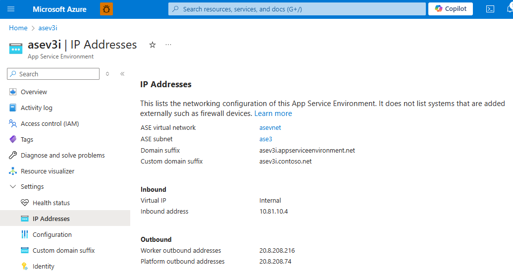

# App Service Environment networking

App Service Environment is a single-tenant deployment of Azure App Service that hosts Windows and Linux containers, web apps, API apps, logic apps, and function apps. When you install an App Service Environment, you pick the Azure virtual network that you want it to be deployed in. All of the inbound and outbound application traffic is inside the virtual network you specify. You deploy into a single subnet in your virtual network, and nothing else can be deployed into that subnet.

> [!NOTE]
> This article is about App Service Environment v3, which is used with isolated v2 App Service plans.

## Subnet requirements

You must delegate the subnet to `Microsoft.Web/hostingEnvironments`, and the subnet must be empty.

The size of the subnet can affect the scaling limits of the App Service plan instances within the App Service Environment. It's a good idea to use a `/24` address space (256 addresses) for your subnet, to ensure enough addresses to support production scale.

>[!NOTE]
> Windows Containers uses an additional IP address per app for each App Service plan instance, and you need to size the subnet accordingly. If your App Service Environment has for example 2 Windows Container App Service plans each with 25 instances and each with 5 apps running, you will need 300 IP addresses and additional addresses to support horizontal (in/out) scale.
>
> Sample calculation:
>
> For each App Service plan instance, you need:  
> 5 Windows Container apps = 5 IP addresses  
> 1 IP address per App Service plan instance  
> 5 + 1 = 6 IP addresses
>
> For 25 instances:  
> 6 x 25 = 150 IP addresses per App Service plan
>
> Since you have 2 App Service plans, 2 x 150 = 300 IP addresses.

If you use a smaller subnet, be aware of the following limitations:

- Any particular subnet has five addresses reserved for management purposes. In addition to the management addresses, App Service Environment dynamically scales the supporting infrastructure, and uses between 4 and 27 addresses, depending on the configuration and load. You can use the remaining addresses for instances in the App Service plan. The minimal size of your subnet is a `/27` address space (32 addresses).

- If you run out of addresses within your subnet, you can be restricted from scaling out your App Service plans in the App Service Environment. Another possibility is that you can experience increased latency during intensive traffic load, if Microsoft isn't able to scale the supporting infrastructure.

## Addresses

App Service Environment has the following network information at creation:

| Address type | Description |
|--------------|-------------|
| App Service Environment virtual network | The virtual network deployed into. |
| App Service Environment subnet | The subnet deployed into. |
| Domain suffix | The domain suffix that is used by the apps made. |
| Virtual IP (VIP) | The VIP type used. The two possible values are internal and external. |
| Inbound address | The inbound address is the address at which your apps are reached. If you have an internal VIP, it's an address in your App Service Environment subnet. If the address is external, it's a public-facing address. |
| Default outbound addresses | The apps use this address, by default, when making outbound calls to the internet. |

You can find details in the **IP Addresses** portion of the portal, as shown in the following screenshot:



As you scale your App Service plans in your App Service Environment, you'll use more addresses out of your subnet. The number of addresses you use varies, based on the number of App Service plan instances you have, and how much traffic there is. Apps in the App Service Environment don't have dedicated addresses in the subnet. The specific addresses used by an app in the subnet will change over time.

## Ports and network restrictions

For your app to receive traffic, ensure that inbound network security group (NSG) rules allow the App Service Environment subnet to receive traffic from the required ports. In addition to any ports you'd like to receive traffic on, you should ensure that Azure Load Balancer is able to connect to the subnet on port 80. This port is used for health checks of the internal virtual machine. You can still control port 80 traffic from the virtual network to your subnet.

It's a good idea to configure the following inbound NSG rule:

|Source / Destination Port(s)|Direction|Source|Destination|Purpose|
|-|-|-|-|-|
|* / 80,443|Inbound|VirtualNetwork|App Service Environment subnet range|Allow app traffic and internal health ping traffic|

The minimal requirement for App Service Environment to be operational is:

|Source / Destination Port(s)|Direction|Source|Destination|Purpose|
|-|-|-|-|-|
|* / 80|Inbound|AzureLoadBalancer|App Service Environment subnet range|Allow internal health ping traffic|

If you use the minimum required rule, you might need one or more rules for your application traffic. If you're using any of the deployment or debugging options, you must also allow this traffic to the App Service Environment subnet. The source of these rules can be the virtual network, or one or more specific client IPs or IP ranges. The destination is always the App Service Environment subnet range.
The internal health ping traffic on port 80 is isolated between the Load balancer and the internal servers. No outside traffic can reach the health ping endpoint.

The normal app access ports inbound are as follows:

|Use|Ports|
|-|-|
|HTTP/HTTPS|80, 443|
|FTP/FTPS|21, 990, 10001-10020|
|Visual Studio remote debugging|4022, 4024, 4026|
|Web Deploy service|8172|

> [!NOTE]
> For FTP access, even if you want to disallow standard FTP on port 21, you still need to allow traffic from the LoadBalancer to the App Service Environment subnet range on port 21, as this is used for internal health ping traffic for the ftp service specifically.

## Network routing

You can set route tables without restriction. You can tunnel all of the outbound application traffic from your App Service Environment to an egress firewall device, such as Azure Firewall. In this scenario, the only thing you have to worry about is your application dependencies.

Application dependencies include endpoints that your app needs during runtime. Besides APIs and services the app is calling, dependencies could also be derived endpoints like certificate revocation list (CRL) check endpoints and identity/authentication endpoint, for example Azure Active Directory. If you're using [continuous deployment in App Service](../deploy-continuous-deployment.md), you might also need to allow endpoints depending on type and language. Specifically for [Linux continuous deployment](https://github.com/microsoft/Oryx/blob/main/doc/hosts/appservice.md#network-dependencies), you'll need to allow `oryx-cdn.microsoft.io:443`.

You can put your web application firewall devices, such as Azure Application Gateway, in front of inbound traffic. Doing so allows you to expose specific apps on that App Service Environment.

Your application will use one of the default outbound addresses for egress traffic to public endpoints. If you want to customize the outbound address of your applications on an App Service Environment, you can add a NAT gateway to your subnet.

> [!NOTE]
> Outbound SMTP connectivity (port 25) is supported for App Service Environment v3. The supportability is determined by a setting on the subscription where the virtual network is deployed. For virtual networks/subnets created before 1. August 2022 you need to initiate a temporary configuration change to the virtual network/subnet for the setting to be synchronized from the subscription. An example could be to add a temporary subnet, associate/dissociate an NSG temporarily or configure a service endpoint temporarily. For more information and troubleshooting, see [Troubleshoot outbound SMTP connectivity problems in Azure](../../virtual-network/troubleshoot-outbound-smtp-connectivity.md).

## Private endpoint

In order to enable Private Endpoints for apps hosted in your App Service Environment, you must first enable this feature at the App Service Environment level.

You can activate it through the Azure portal. In the App Service Environment configuration pane, turn **on** the setting `Allow new private endpoints`.
Alternatively the following CLI can enable it:

```azurecli-interactive
az appservice ase update --name myasename --allow-new-private-endpoint-connections true
```

For more information about Private Endpoint and Web App, see [Azure Web App Private Endpoint][privateendpoint] 

## DNS

The following sections describe the DNS considerations and configuration that apply inbound to and outbound from your App Service Environment. The examples use the domain suffix `appserviceenvironment.net` from Azure Public Cloud. If you're using other clouds like Azure Government, you'll need to use their respective domain suffix.

### DNS configuration to your App Service Environment

If your App Service Environment is made with an external VIP, your apps are automatically put into public DNS. If your App Service Environment is made with an internal VIP, you might need to configure DNS for it. When you created your App Service Environment, if you selected having Azure DNS private zones configured automatically, then DNS is configured in your virtual network. If you chose to configure DNS manually, you need to either use your own DNS server or configure Azure DNS private zones. To find the inbound address, go to the App Service Environment portal, and select **IP Addresses**. 

If you want to use your own DNS server, add the following records:

1. Create a zone for `<App Service Environment-name>.appserviceenvironment.net`.
1. Create an A record in that zone that points * to the inbound IP address used by your App Service Environment.
1. Create an A record in that zone that points @ to the inbound IP address used by your App Service Environment.
1. Create a zone in `<App Service Environment-name>.appserviceenvironment.net` named `scm`.
1. Create an A record in the `scm` zone that points * to the IP address used by the private endpoint of your App Service Environment.

To configure DNS in Azure DNS private zones:

1. Create an Azure DNS private zone named `<App Service Environment-name>.appserviceenvironment.net`.
1. Create an A record in that zone that points * to the inbound IP address.
1. Create an A record in that zone that points @ to the inbound IP address.
1. Create an A record in that zone that points *.scm to the inbound IP address.

In addition to the default domain provided when an app is created, you can also add a custom domain to your app. You can set a custom domain name without any validation on your apps. If you're using custom domains, you need to ensure they have DNS records configured. You can follow the preceding guidance to configure DNS zones and records for a custom domain name (replace the default domain name with the custom domain name). The custom domain name works for app requests, but doesn't work for the `scm` site. The `scm` site is only available at *&lt;appname&gt;.scm.&lt;asename&gt;.appserviceenvironment.net*.

### DNS configuration for FTP access

For FTP access to Internal Load balancer (ILB) App Service Environment v3 specifically, you need to ensure DNS is configured. Configure an Azure DNS private zone or equivalent custom DNS with the following settings:

1. Create an Azure DNS private zone named `ftp.appserviceenvironment.net`.
1. Create an A record in that zone that points `<App Service Environment-name>` to the inbound IP address.

In addition to setting up DNS, you also need to enable it in the [App Service Environment configuration](./configure-network-settings.md#ftp-access) and at the [app level](../deploy-ftp.md?tabs=cli#enforce-ftps).

### DNS configuration from your App Service Environment

The apps in your App Service Environment will use the DNS that your virtual network is configured with. If you want some apps to use a different DNS server, you can manually set it on a per app basis, with the app settings `WEBSITE_DNS_SERVER` and `WEBSITE_DNS_ALT_SERVER`. `WEBSITE_DNS_ALT_SERVER` configures the secondary DNS server. The secondary DNS server is only used when there's no response from the primary DNS server.

## More resources

- [Environment variables and app settings reference](../reference-app-settings.md)

<!--Links-->
[privateendpoint]: ../networking/private-endpoint.md
 
