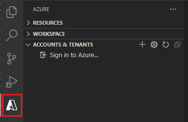
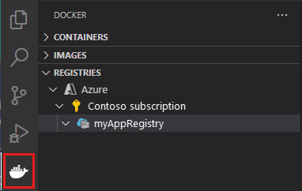
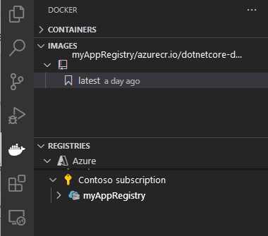
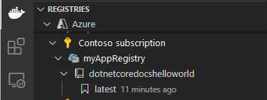

[Azure App Service](../../overview.md) on Linux provides pre-defined application stacks on Linux with support for languages such as .NET, PHP, Node.js and others. You can also use a custom Docker image to run your web app on an application stack that isn't already defined in Azure. This quickstart shows you how to deploy an image from an [Azure Container Registry](../../../container-registry/index.yml) (ACR) to App Service.

> [!NOTE]
> For information regarding running containerized applications in a serverless environment, please see [Container Apps](../../../container-apps/overview.md).
>

To complete this quickstart, you need:

* An [Azure account](https://azure.microsoft.com/free/?utm_source=campaign&utm_campaign=vscode-tutorial-docker-extension&mktingSource=vscode-tutorial-docker-extension)
* [Docker](https://www.docker.com/community-edition)
* [Visual Studio Code](https://code.visualstudio.com/)
* The [Azure App Service extension for VS Code](https://marketplace.visualstudio.com/items?itemName=ms-azuretools.vscode-azureappservice). You can use this extension to create, manage, and deploy Linux Web Apps on the Azure Platform as a Service (PaaS).
* The [Docker extension for VS Code](https://marketplace.visualstudio.com/items?itemName=ms-azuretools.vscode-docker). You can use this extension to simplify the management of local Docker images and commands and to deploy built app images to Azure.

## 1 - Create a container registry

This quickstart uses Azure Container Registry as the registry of choice. You're free to use other registries, but the steps may differ slightly.

Create a container registry by following the instructions in [Quickstart: Create a private container registry using the Azure portal](../../../container-registry/container-registry-get-started-portal.md).

> [!IMPORTANT]
> Be sure to set the **Admin User** option to **Enable** when you create the Azure container registry. You can also set it from the **Access keys** section of your registry page in the Azure portal. This setting is required for App Service access. For managed identity, see [Deploy from ACR tutorial](../../tutorial-custom-container.md?pivots=container-linux#vi-configure-the-web-app).

## 2 - Sign in

1. Launch Visual Studio Code. 
1. Select the **Azure** logo in the [Activity Bar](https://code.visualstudio.com/docs/getstarted/userinterface), navigate to the **APP SERVICE** explorer, then select **Sign in to Azure** and follow the instructions.

    

1. In the [Status Bar](https://code.visualstudio.com/docs/getstarted/userinterface) at the bottom, verify your Azure account email address. In the **APP SERVICE** explorer, your subscription should be displayed.

1. In the Activity Bar, select the **Docker** logo. In the **REGISTRIES** explorer, verify that the container registry you created appears.

    

## 3 - Check prerequisites

Verify that you have Docker installed and running. The following command will display the Docker version if it's running.

```bash
docker --version
```

## 4 - Create and build image

1. In Visual Studio Code, open an empty folder and add a file called `Dockerfile`. In the Dockerfile, paste in the content based on your desired language framework:

# [.NET](#tab/dotnet)

<!-- https://mcr.microsoft.com/v2/appsvc%2Fdotnetcore/tags/list -->
```dockerfile
FROM mcr.microsoft.com/appsvc/dotnetcore:lts

ENV PORT 8080
EXPOSE 8080

ENV ASPNETCORE_URLS "http://*:${PORT}"

ENTRYPOINT ["dotnet", "/defaulthome/hostingstart/hostingstart.dll"]
```

In this Dockerfile, the parent image is one of the built-in .NET containers of App Service. You can find the source files for it [in the Azure-App-Service/ImageBuilder GitHub repository, under GenerateDockerFiles/dotnetcore](https://github.com/Azure-App-Service/ImageBuilder/tree/master/GenerateDockerFiles/dotnetcore). Its [Dockerfile](https://github.com/Azure-App-Service/ImageBuilder/blob/master/GenerateDockerFiles/dotnetcore/debian-9/Dockerfile) copies a simple .NET app into `/defaulthome/hostingstart`. Your Dockerfile simply starts that app.

# [Node.js](#tab/node)

<!-- https://mcr.microsoft.com/v2/appsvc%2Fnode/tags/list -->
```dockerfile
FROM mcr.microsoft.com/appsvc/node:10-lts

ENV HOST 0.0.0.0
ENV PORT 8080
EXPOSE 8080

ENTRYPOINT ["pm2", "start", "--no-daemon", "/opt/startup/default-static-site.js"]
```

In this Dockerfile, the parent image is one of the built-in Node.js containers of App Service. You can find the source files for it [in the Azure-App-Service/ImageBuilder GitHub repository, under GenerateDockerFiles/node/node-template](https://github.com/Azure-App-Service/ImageBuilder/tree/master/GenerateDockerFiles/node/node-template). Its [Dockerfile](https://github.com/Azure-App-Service/ImageBuilder/blob/master/GenerateDockerFiles/node/node-template/Dockerfile) copies a simple Node.js app into `/opt/startup`. Your Dockerfile simply starts that app using PM2, which is already installed by the parent image.

# [Python](#tab/python)

<!-- https://mcr.microsoft.com/v2/appsvc%2Fpython/tags/list -->
```dockerfile
FROM mcr.microsoft.com/appsvc/python:latest

ENV PORT 8080
EXPOSE 8080

ENTRYPOINT ["gunicorn", "--timeout", "600", "--access-logfile", "'-'", "--error-logfile", "'-'", "--chdir=/opt/defaultsite", "application:app"]
```

In this Dockerfile, the parent image is one of the built-in Python containers of App Service. You can find the source files for it [in the Azure-App-Service/ImageBuilder GitHub repository, under GenerateDockerFiles/python/template-3.9](https://github.com/Azure-App-Service/ImageBuilder/tree/master/GenerateDockerFiles/python/template-3.9). Its [Dockerfile](https://github.com/Azure-App-Service/ImageBuilder/blob/master/GenerateDockerFiles/python/template-3.9/Dockerfile) copies a simple Python app into `/opt/defaultsite`. Your Dockerfile simply starts that app using Gunicorn, which is already installed by the parent image.

# [Java](#tab/java)

<!-- https://mcr.microsoft.com/v2/azure-app-service%2Fjava/tags/list -->
```dockerfile
FROM mcr.microsoft.com/azure-app-service/java:11-java11_stable

ENV PORT 80
EXPOSE 80

ENTRYPOINT ["java", "-Dserver.port=80", "-jar", "/tmp/appservice/parkingpage.jar"]
```

In this Dockerfile, the parent image is one of the built-in Java containers of App Service. You can find the source files for it [in the Azure-App-Service/java GitHub repository, under java/tree/dev/java11-alpine](https://github.com/Azure-App-Service/java/tree/dev/java11-alpine). Its [Dockerfile](https://github.com/Azure-App-Service/java/blob/dev/java11-alpine/Dockerfile) copies a simple Java app into `/tmp/appservice`. Your Dockerfile simply starts that app.

---

2. [Open the Command Palette](https://code.visualstudio.com/docs/getstarted/userinterface#_command-palette), and type **Docker Images: Build Image**. Type **Enter** to run the command.

3. In the image tag box, specify the tag you want in the following format: `<acr-name>.azurecr.io/<image-name>/<tag>`, where `<acr-name>` is the name of the container registry you created. Press **Enter**.

4. When the image finishes building, click **Refresh** at the top of the **IMAGES** explorer and verify that the image is built successfully.

    

## 5 - Deploy to container registry

1. In the Activity Bar, click the **Docker** icon. In the **IMAGES** explorer, find the image you built.
1. Expand the image, right-click on the tag you want, and click **Push**.
1. Make sure the image tag begins with `<acr-name>.azurecr.io` and press **Enter**.
1. When Visual Studio Code finishes pushing the image to your container registry, click **Refresh** at the top of the **REGISTRIES** explorer and verify that the image is pushed successfully.

    

##  6 - Deploy to App Service

1. In the **REGISTRIES** explorer, expand the image, right-click the tag, and select **Deploy image to Azure App Service**.
1. Follow the prompts to choose a subscription, a globally unique app name, a resource group, and an App Service plan. Choose **B1 Basic** for the pricing tier, and a region near you.

After deployment, your app is available at `http://<app-name>.azurewebsites.net`.

A **Resource Group** is a named collection of all your application's resources in Azure. For example, a Resource Group can contain a reference to a website, a database, and an Azure Function.

An **App Service Plan** defines the physical resources that will be used to host your website. This quickstart uses a **Basic** hosting plan on **Linux** infrastructure, which means the site will be hosted on a Linux machine alongside other websites. If you start with the **Basic** plan, you can use the Azure portal to scale up so that yours is the only site running on a machine. For pricing, see [App Service pricing](https://azure.microsoft.com/pricing/details/app-service/linux).

## 7 - Browse the website

The **Output** panel shows the status of the deployment operations. When the operation completes, select **Open Site** in the pop-up notification to open the site in your browser.

> [!div class="nextstepaction"]
> [I ran into an issue](https://www.research.net/r/PWZWZ52?tutorial=quickstart-docker&step=deploy-app)

## 8 - Clean up resources

[!INCLUDE [Clean-up Portal web app resources](../../../../includes/clean-up-section-portal-no-h.md)]

## Next steps

Congratulations, you've successfully completed this quickstart.

The App Service app pulls from the container registry every time it starts. If you rebuild your image, you just need to push it to your container registry, and the app pulls in the updated image when it restarts. To tell your app to pull in the updated image immediately, restart it.

> [!div class="nextstepaction"]
> [Secure with custom domain and certificate](../../tutorial-secure-domain-certificate.md)

> [!div class="nextstepaction"]
> [Migrate to Windows container in Azure](../../tutorial-custom-container.md)

> [!div class="nextstepaction"]
> [Integrate your app with an Azure virtual network](../../overview-vnet-integration.md)

> [!div class="nextstepaction"]
> [Use Private Endpoints for App Service apps](../../networking/private-endpoint.md)

> [!div class="nextstepaction"]
> [Azure Monitor overview](/azure/azure-monitor/overview)

> [!div class="nextstepaction"]
> [Application monitoring for Azure App Service overview](/azure/azure-monitor/app/azure-web-apps)

> [!div class="nextstepaction"]
> [How to use managed identities for App Service and Azure Functions](../../overview-managed-identity.md)

> [!div class="nextstepaction"]
> [Configure custom container](../../configure-custom-container.md)

> [!div class="nextstepaction"]
> [Multi-container app tutorial](../../tutorial-multi-container-app.md)


Other Azure extensions:

* [Azure Cosmos DB](https://marketplace.visualstudio.com/items?itemName=ms-azuretools.vscode-cosmosdb)
* [Azure Functions](https://marketplace.visualstudio.com/items?itemName=ms-azuretools.vscode-azurefunctions)
* [Azure CLI Tools](https://marketplace.visualstudio.com/items?itemName=ms-vscode.azurecli)
* [Azure Resource Manager Tools](https://marketplace.visualstudio.com/items?itemName=msazurermtools.azurerm-vscode-tools)
* [Azure Tools](https://marketplace.visualstudio.com/items?itemName=ms-vscode.vscode-node-azure-pack) extension pack includes all the extensions above.
