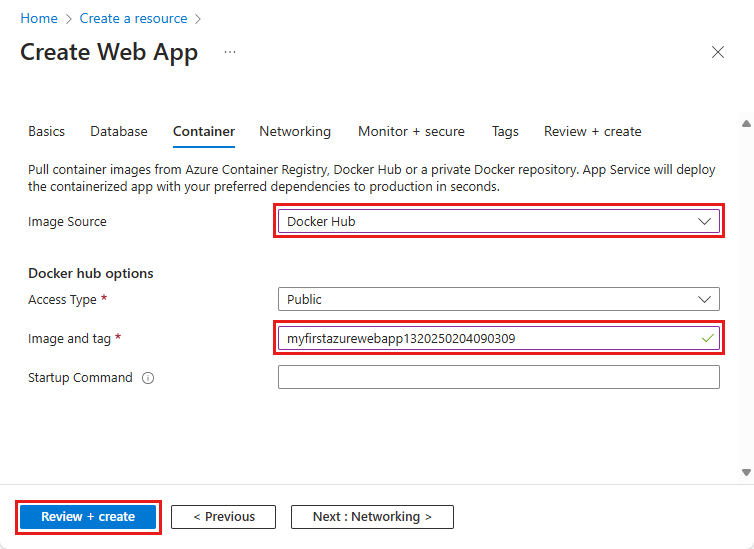

[Azure App Service](../../overview.md) provides pre-defined application stacks on Windows like ASP.NET or Node.js, running on IIS. However, the pre-configured application stacks [lock down the operating system and prevent low-level access](../../operating-system-functionality.md). Custom Windows containers don't have these restrictions, and let developers fully customize the containers and give containerized applications full access to Windows functionality. 

This quickstart shows how to deploy an ASP.NET app, in a Windows image, to [Azure Container Registry](../../../container-registry/container-registry-intro.md) from Visual Studio. You run the app in a custom container in Azure App Service.

To complete this quickstart, you need:

- [Install Docker for Windows](https://docs.docker.com/docker-for-windows/install/)
- [Switch Docker to run Windows containers](/virtualization/windowscontainers/quick-start/quick-start-windows-10)
- [Install Visual Studio 2022](https://www.visualstudio.com/downloads/) with the **ASP.NET and web development** and **Azure development** workloads. In *Visual Studio 2022 Community*, ensure **.NET Framework project and item templates** component is selected with **ASP.NET and web development workload**. If you've installed Visual Studio 2022 already:
    - Install the latest updates in Visual Studio by selecting **Help** > **Check for Updates**.
    - Add the workloads in Visual Studio by selecting **Tools** > **Get Tools and Features**.

## 1 - Create an ASP.NET web app

Create an ASP.NET web app by following these steps:

1. Open Visual Studio and then select **Create a new project**.

1. In **Create a new project**, find and choose **ASP.NET Web Application (.NET Framework)** for C#, then select **Next**.

   :::image type="content" source="../../media/quickstart-custom-container/create-new-project.png?text=VS create a new project" alt-text="Screenshot of the Create a new project dialog.":::

1. In **Configure your new project**, under **Project name**, name the application *myfirstazurewebapp*. Under **Framework**, select **.NET Framework 4.8** and then select **Create**.

    :::image type="content" source="../../media/quickstart-custom-container/configure-web-app-project-container.png?text=Configure your web app project" alt-text="Screenshot of the Configure your web app project.":::

1. You can deploy any type of ASP.NET web app to Azure. For this quickstart, choose the **MVC** template.

1. Under **Authentication**, select **None**. Under **Advanced**, select **Docker support** and uncheck **Configure for HTTPS**. Select **Create**.

     :::image type="content" source="../../media/quickstart-custom-container/select-mvc-template-for-container.png?text=Create ASP.NET Web Application" alt-text="Screenshot of the Create ASP.NET Web Application dialog.":::

1. If the *Dockerfile* file isn't opened automatically, open it from the **Solution Explorer**.

1. You need a [supported parent image](../../configure-custom-container.md#supported-parent-images). Change the parent image by replacing the `FROM` line with the following code and save the file:

   ```dockerfile
   FROM mcr.microsoft.com/dotnet/framework/aspnet:4.8-windowsservercore-ltsc2019
   ```

1. From the Visual Studio menu, select **Debug** > **Start Without Debugging** to run the web app locally.

    :::image type="content" source="../../media/quickstart-custom-container/local-web-app.png?text=Run app locally" alt-text="Screenshot of the app running locally.":::

## 2 - Publish to Azure Container Registry

1. In **Solution Explorer**, right-click the **myfirstazurewebapp** project and select **Publish**.

1. In **Target**, select **Docker Container Registry**, and then select **Next**.

    :::image type="content" source="../../media/quickstart-custom-container/select-docker-container-registry-visual-studio-2022.png?text=Select Docker Container Registry" alt-text="Screenshot of the Select Docker Container Registry screen.":::

1. In **Specific Target**, select **Azure Container Registry**, and then select **Next**.

    :::image type="content" source="../../media/quickstart-custom-container/publish-to-azure-container-registry-visual-studio-2022.png?text=Publish to Azure Container Registry" alt-text="Screenshot of the Publish from project overview page.":::

1. In **Publish**, make sure the correct subscription is chosen. In **Container registries** select the **+** button to create a new Azure Container Registry.

    :::image type="content" source="../../media/quickstart-custom-container/create-new-azure-container-registry.png?text=Create new Azure Container Registry" alt-text="Screenshot of the Create new Azure Container Registry screen.":::

1. In **Create new**, make sure the correct subscription is chosen. Under **Resource group**, select **New** and type *myResourceGroup* for the name, and select **OK**. Under **SKU**, select **Basic**. Under **Registry location**, select a location of the registry then select **Create**.

    :::image type="content" source="../../media/quickstart-custom-container/new-azure-container-registry-details.png?text=Azure Container Registry details" alt-text="Screenshot of Azure Container Registry details.":::

1. In **Publish**, under **Container Registry**, select the registry you created, and then select **Finish**.

    :::image type="content" source="../../media/quickstart-custom-container/select-existing-azure-container-registry.png?text=Select existing Azure Container Registry" alt-text="Screenshot of the Select existing Azure Container Registry screen.":::

   Wait for the deployment to complete. The **Publish** page now shows the repository name. Select the *copy button* to copy the **Repository** name for later.

    :::image type="content" source="../../media/quickstart-custom-container/published-docker-repository-visual-studio-2022.png?text=Screenshot that highlights the repository name." alt-text="Screenshot that highlights the repository name.":::

## 3 - Create a Windows custom container

1. Sign in to the [Azure portal](https://portal.azure.com).

1. Choose **Create a resource** in the upper left-hand corner of the Azure portal.

1. Under **Popular services**, select **Create** under **Web App**.

1. In **Create Web App**, choose your subscription and a **Resource Group**. You can create a new resource group if needed.

1. Provide an app name, such as *win-container-demo*. Choose **Docker Container** for **Publish** and **Windows** for **Operating System**. Select **Next: Docker** to continue.

   

1. For **Image Source**, choose **Docker Hub** and for **Image and tag**, enter the repository name you copied in [Publish to Azure Container Registry](#2---publish-to-azure-container-registry).

   

    If you have a custom image elsewhere for your web application, such as in [Azure Container Registry](../../../container-registry/index.yml) or in any other private repository, you can configure it here. Select **Review + Create** to continue.

1. Verify all the details and then select **Create** and wait for Azure to create the required resources.


## 4 - Browse to the custom container

When the Azure operation is complete, a notification box is displayed.


1. Click **Go to resource**.

1. In the overview of this resource, follow the link next to **URL**.

A new browser page opens to the following page:


Wait a few minutes and try again, until you get the default ASP.NET home page:


**Congratulations!** You're running your first custom Windows container in Azure App Service.

## 5 - See container start-up logs

It may take some time for the Windows container to load. To see the progress, navigate to the following URL by replacing *\<app_name>* with the name of your app.
```
https://<app_name>.scm.azurewebsites.net/api/logstream
```

The streamed logs look like this:

```
2018-07-27T12:03:11  Welcome, you are now connected to log-streaming service.
27/07/2018 12:04:10.978 INFO - Site: win-container-demo - Start container succeeded. Container: facbf6cb214de86e58557a6d073396f640bbe2fdec88f8368695c8d1331fc94b
27/07/2018 12:04:16.767 INFO - Site: win-container-demo - Container start complete
27/07/2018 12:05:05.017 INFO - Site: win-container-demo - Container start complete
27/07/2018 12:05:05.020 INFO - Site: win-container-demo - Container started successfully
```

## 6 - Update locally and redeploy

1. In Visual Studio, in **Solution Explorer**, open **Views** > **Home** > **Index.cshtml**.

1. Find the `<div class="jumbotron">` HTML tag near the top, and replace the entire element with the following code:

   ```html
   <div class="jumbotron">
       <h1>ASP.NET in Azure!</h1>
       <p class="lead">This is a simple app that we've built that demonstrates how to deploy a .NET app to Azure App Service.</p>
   </div>
   ```

1. To redeploy to Azure, right-click the **myfirstazurewebapp** project in **Solution Explorer** and choose **Publish**.

1. On the publish page, select **Publish** and wait for publishing to complete.

1. To tell App Service to pull in the new image from Docker Hub, restart the app. Back in the app page in the portal, click **Restart** > **Yes**.

   

[Browse to the custom container](#4---browse-to-the-custom-container) again. As you refresh the webpage, the app should revert to the "Starting up" page at first, then display the updated webpage again after a few minutes.


## 7 - Clean up resources

[!INCLUDE [Clean-up Portal web app resources](../../../../includes/clean-up-section-portal-no-h.md)]


## Next steps

> [!div class="nextstepaction"]
> [Secure with custom domain and certificate](../../tutorial-secure-domain-certificate.md)

> [!div class="nextstepaction"]
> [Migrate to Windows container in Azure](../../tutorial-custom-container.md)

> [!div class="nextstepaction"]
> [Integrate your app with an Azure virtual network](../../overview-vnet-integration.md)

> [!div class="nextstepaction"]
> [Use Private Endpoints for App Service apps](../../networking/private-endpoint.md)

> [!div class="nextstepaction"]
> [Azure Monitor overview](/azure/azure-monitor/overview)

> [!div class="nextstepaction"]
> [Application monitoring for Azure App Service overview](/azure/azure-monitor/app/azure-web-apps)

> [!div class="nextstepaction"]
> [How to use managed identities for App Service and Azure Functions](../../overview-managed-identity.md)

> [!div class="nextstepaction"]
> [Configure custom container](../../configure-custom-container.md)

> [!div class="nextstepaction"]
> [Multi-container app tutorial](../../tutorial-multi-container-app.md)
