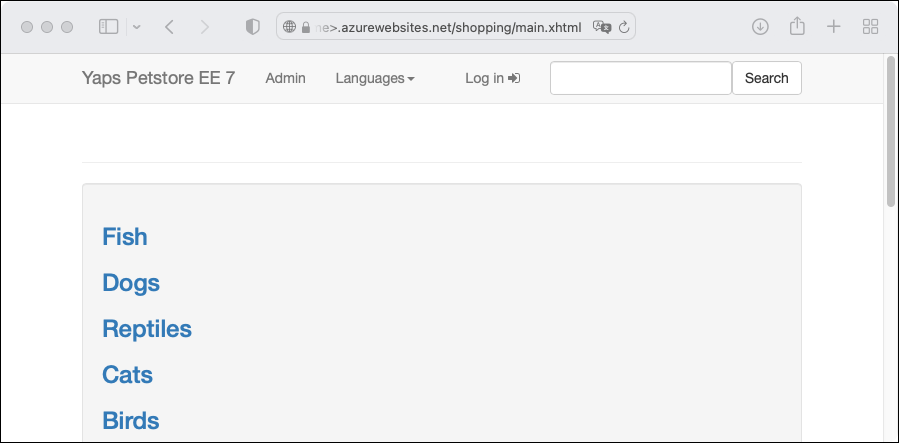

In this quickstart, you'll use the [Maven Plugin for Azure App Service Web Apps](https://github.com/microsoft/azure-maven-plugins/blob/develop/azure-webapp-maven-plugin/README.md) to deploy a Java web application to a Linux JBoss EAP server in [Azure App Service](/azure/app-service/). App Service provides a highly scalable, self-patching web app hosting service. Use the tabs to switch between Tomcat, JBoss, or embedded server (Java SE) instructions.



If Maven isn't your preferred development tool, check out our similar tutorials for Java developers:
+ [Gradle](../../configure-language-java.md?pivots=platform-linux#gradle)
+ [IntelliJ IDEA](/azure/developer/java/toolkit-for-intellij/create-hello-world-web-app)
+ [Eclipse](/azure/developer/java/toolkit-for-eclipse/create-hello-world-web-app)
+ [Visual Studio Code](https://code.visualstudio.com/docs/java/java-webapp)

[!INCLUDE [quickstarts-free-trial-note](../../../../includes/quickstarts-free-trial-note.md)]

## 1 - Use Azure Cloud Shell

[!INCLUDE [cloud-shell-try-it-no-header.md](../../../../includes/cloud-shell-try-it-no-header.md)]

## 2 - Create a Java app

Clone the Pet Store demo application.

```azurecli-interactive
git clone https://github.com/Azure-Samples/app-service-java-quickstart
```

Change directory to the completed pet store project and build it.

> [!TIP]
> The `petstore-ee7` sample requires **Java 11 or newer**. The `booty-duke-app-service` sample project requires **Java 17**. If your installed version of Java is less than 17, run the build from within the `petstore-ee7` directory, rather than at the top level.

```azurecli-interactive
cd app-service-java-quickstart
git checkout 20230308
cd petstore-ee7
mvn clean install
```

If you see a message about being in **detached HEAD** state, this message is safe to ignore. Because you won't make any Git commit in this quickstart, detached HEAD state is appropriate.

## 3 - Configure the Maven plugin

The deployment process to Azure App Service uses your Azure credentials from the Azure CLI automatically. If the Azure CLI isn't installed locally, then the Maven plugin authenticates with OAuth or device sign-in. For more information, see [authentication with Maven plugins](https://github.com/microsoft/azure-maven-plugins/wiki/Authentication).

Run the Maven command shown next to configure the deployment. This command helps you to set up the App Service operating system, Java version, and Tomcat version.

```azurecli-interactive
mvn com.microsoft.azure:azure-webapp-maven-plugin:2.12.0:config
```

1. For **Create new run configuration**, type **Y**, then **Enter**.
1. For **Define value for OS**, type **2** for Linux, then **Enter**.
1. For **Define value for javaVersion**, type **2** for Java 11, then **Enter**.
1. For **webContainer** option, type **1** for Jbosseap 7, then **Enter**.
1. For **Define value for pricingTier**, type **1** for P1v3, then **Enter**.
1. For **Confirm**, type **Y**, then **Enter**.

    ```
    Please confirm webapp properties
    AppName : petstoreee7-1690443003536
    ResourceGroup : petstoreee7-1690443003536-rg
    Region : centralus
    PricingTier : P1v3
    OS : Linux
    Java Version: Java 11
    Web server stack: Jbosseap 7
    Deploy to slot : false
    Confirm (Y/N) [Y]: 
    [INFO] Saving configuration to pom.
    [INFO] ------------------------------------------------------------------------
    [INFO] BUILD SUCCESS
    [INFO] ------------------------------------------------------------------------
    [INFO] Total time:  19.914 s
    [INFO] Finished at: 2023-07-27T07:30:20Z
    [INFO] ------------------------------------------------------------------------
    ```

After you've confirmed your choices, the plugin adds the above plugin element and requisite settings to your project's `pom.xml` file that configure your web app to run in Azure App Service.

The relevant portion of the `pom.xml` file should look similar to the following example.

```xml-interactive
<build>
    <plugins>
        <plugin>
            <groupId>com.microsoft.azure</groupId>
            <artifactId>>azure-webapp-maven-plugin</artifactId>
            <version>x.xx.x</version>
            <configuration>
                <schemaVersion>v2</schemaVersion>
                <resourceGroup>your-resourcegroup-name</resourceGroup>
                <appName>your-app-name</appName>
            ...
            </configuration>
        </plugin>
    </plugins>
</build>           
```

You can modify the configurations for App Service directly in your `pom.xml`. Some common configurations are listed in the following table:

Property | Required | Description | Version
---|---|---|---
`<schemaVersion>` | false | Specify the version of the configuration schema. Supported values are: `v1`, `v2`. | 1.5.2
`<subscriptionId>` | false | Specify the subscription ID. | 0.1.0+
`<resourceGroup>` | true | Azure Resource Group for your Web App. | 0.1.0+
`<appName>` | true | The name of your Web App. | 0.1.0+
`<region>` | false | Specifies the region to host your Web App; the default value is **centralus**. All valid regions at [Supported Regions](https://azure.microsoft.com/global-infrastructure/services/?products=app-service) section. | 0.1.0+
`<pricingTier>` | false | The pricing tier for your Web App. The default value is **P1v2** for production workload, while **B2** is the recommended minimum for Java dev/test. For more information, see [App Service Pricing](https://azure.microsoft.com/pricing/details/app-service/linux/)| 0.1.0+
`<runtime>` | false | The runtime environment configuration. For more information, see [Configuration Details](https://github.com/microsoft/azure-maven-plugins/wiki/Azure-Web-App:-Configuration-Details). | 0.1.0+
`<deployment>` | false | The deployment configuration. For more information, see [Configuration Details](https://github.com/microsoft/azure-maven-plugins/wiki/Azure-Web-App:-Configuration-Details). | 0.1.0+

For the complete list of configurations, see the plugin reference documentation. All the Azure Maven Plugins share a common set of configurations. For these configurations see [Common Configurations](https://github.com/microsoft/azure-maven-plugins/wiki/Common-Configuration). For configurations specific to App Service, see [Azure Web App: Configuration Details](https://github.com/microsoft/azure-maven-plugins/wiki/Azure-Web-App:-Configuration-Details).

Be careful about the values of `<appName>` and `<resourceGroup>` (`petstoreee7-1690443003536` and `petstoreee7-1690443003536-rg` accordingly in the demo). They're used later.

## 4 - Deploy the app

With all the configuration ready in your *pom.xml* file, you can deploy your Java app to Azure with one single command.

```azurecli-interactive
# Disable testing, as it requires Wildfly to be installed locally.
mvn package azure-webapp:deploy -DskipTests
```

Once deployment is completed, your application is ready at `http://<appName>.azurewebsites.net/` (`http://petstoreee7-1690443003536.azurewebsites.net` in the demo). Open the url with your local web browser, you should see


**Congratulations!** You've deployed your first Java app to App Service.

## 5 - Clean up resources

In the preceding steps, you created Azure resources in a resource group. If you don't need the resources in the future, delete the resource group from portal, or by running the following command in the Cloud Shell:

```azurecli-interactive
az group delete --name <your resource group name; for example: petstoreee7-1690443003536-rg> --yes
```

This command may take a minute to run.
