[Azure App Service](../../overview.md) provides a highly scalable, self-patching web app hosting service. This quickstart tutorial shows how to deploy a Java SE app to Azure App Service on Linux using the Azure portal. To follow a quickstart that deploys to Tomcat or JBoss EAP, select one of the Maven options above.

This quickstart configures an App Service app in the **Free** tier and incurs no cost for your Azure subscription.

This quickstart shows you how to make these changes within your browser, without having to install the development environment tools on your machine.

# [Java SE](#tab/javase)

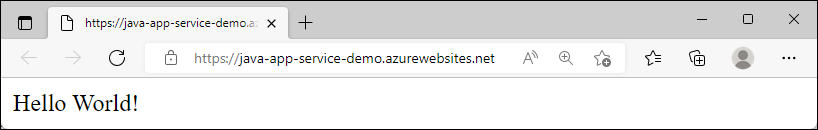

# [Tomcat](#tab/tomcat)


# [JBoss EAP](#tab/jbosseap)

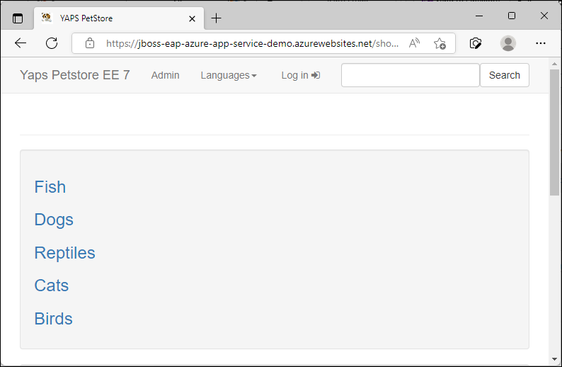

---

You can follow the steps here using a Mac, Windows, or Linux machine. Once the prerequisites are installed, it takes about five minutes to complete the steps.

To complete this quickstart you need:

1. An Azure account with an active subscription. [Create an account for free](https://azure.microsoft.com/free/?utm_source=campaign&utm_campaign=visual-studio-code-tutorial-app-service-extension&mktingSource=visual-studio-code-tutorial-app-service-extension).
1. A GitHub account to fork a repository.

## 1 - Fork the sample repository

# [Java SE](#tab/javase)

1. In your browser, navigate to the repository containing [the sample code](https://github.com/Azure-Samples/java-docs-spring-hello-world).

1. In the upper right corner, select **Fork**.

    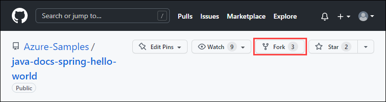

1. On the **Create a new fork** screen, confirm the **Owner** and **Repository name** fields. Select **Create fork**.

    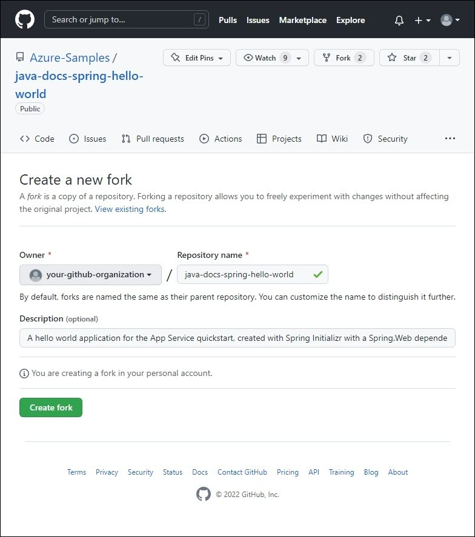

    >[!NOTE]
    > This should take you to the new fork. Your fork URL will look something like this: `https://github.com/YOUR_GITHUB_ACCOUNT_NAME/java-docs-spring-hello-world`

# [Tomcat](#tab/tomcat)

1. In your browser, navigate to the repository containing [the sample code](https://github.com/Azure-Samples/java-docs-spring-hello-world).

1. In the upper right corner, select **Fork**.

    

1. On the **Create a new fork** screen, confirm the **Owner** and **Repository name** fields. Select **Create fork**.

    

    >[!NOTE]
    > This should take you to the new fork. Your fork URL will look something like this: `https://github.com/YOUR_GITHUB_ACCOUNT_NAME/java-docs-spring-hello-world`


# [JBoss EAP](#tab/jbosseap)

1. In your browser, navigate to the repository containing [the sample code](https://github.com/agoncal/agoncal-application-petstore-ee7).

1. In the upper right corner, select **Fork**.

    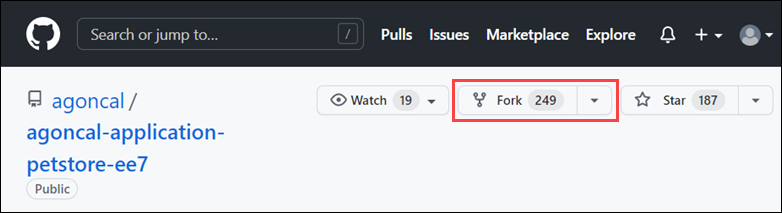

1. On the **Create a new fork** screen, confirm the **Owner** and **Repository name** fields. Select **Create fork**.

    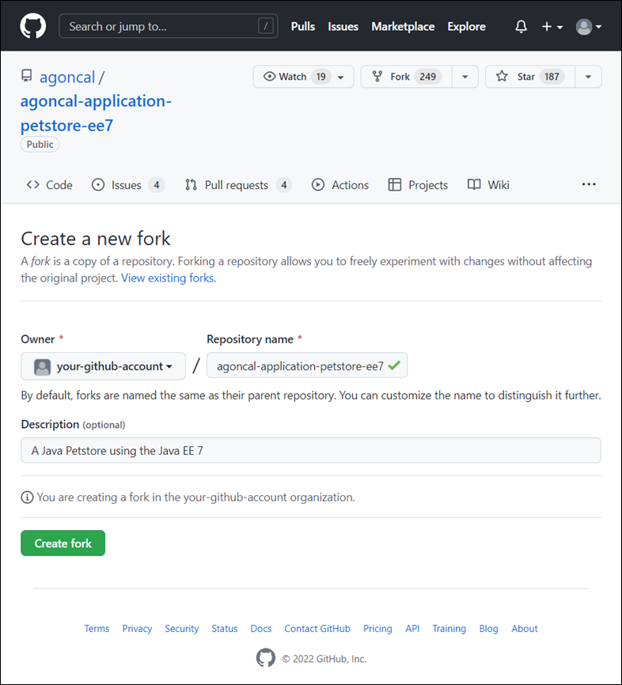

    >[!NOTE]
    > This should take you to the new fork. Your fork URL will look something like this: `https://github.com/YOUR_GITHUB_ACCOUNT_NAME/agoncal-application-petstore-ee7`

---

## 2 - Create Azure resources and configure deployment

1. Log in to the Azure portal.

1. Type **app services** in the search. Under **Services**, select **App Services**.

    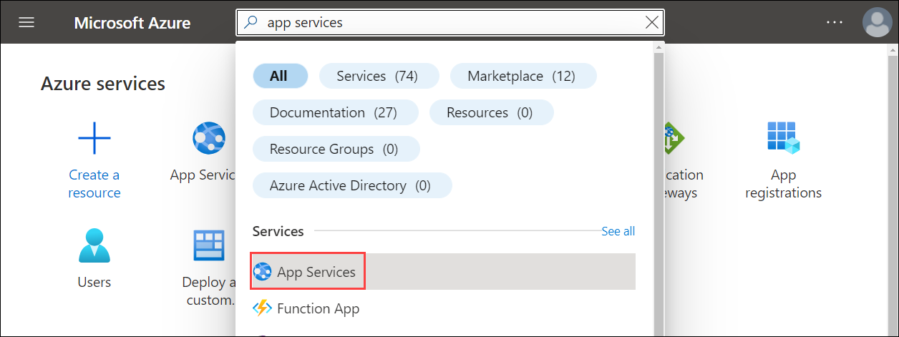


1. In the **App Services** page, select **Create**.

    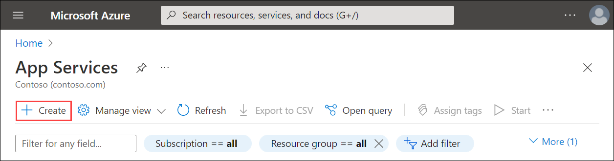

1. Fill out the **Create Web App** page as follows.

# [Java SE](#tab/javase)

   - **Resource Group**: Create a resource group named _myResourceGroup_.
   - **Name**: Type a globally unique name for your web app. 
   - **Publish**: Select _Code_.
   - **Runtime stack**: Select _Java 11_. 
   - **Java web-server stack**: Select _Java SE (Embedded Web Server)_.
   - **Operating system**: Select _Linux_.
   - **Region**: Select an Azure region close to you.
   - **App Service Plan**: Create an app service plan named _myAppServicePlan_.

# [Tomcat](#tab/tomcat)

   - **Resource Group**: Create a resource group named _myResourceGroup_.
   - **Name**: Type a globally unique name for your web app. 
   - **Publish**: Select _Code_.
   - **Runtime stack**: Select _Java 11_. 
   - **Java web-server stack**: Select _Tomcat 8.5_ or _Tomcat 9.0_.
   - **Operating system**: Select _Linux_.
   - **Region**: Select an Azure region close to you.
   - **App Service Plan**: Create an app service plan named _myAppServicePlan_.

# [JBoss EAP](#tab/jbosseap)

   - **Resource Group**: Create a resource group named _myResourceGroup_.
   - **Name**: Type a globally unique name for your web app. 
   - **Publish**: Select _Code_.
   - **Runtime stack**: Select _Java 11_. 
   - **Java web-server stack**: Select _Red Hat JBoss EAP 7_.
   - **Operating system**: Select _Linux_.
   - **Region**: Select an Azure region close to you.
   - **App Service Plan**: Create an app service plan named _myAppServicePlan_.

---

1.  To change the App Service Plan tier, next to **Sku and size**, select **Change size**.    

1.  In the Spec Picker, on the **Production** tab, select **P1V3**. Select the **Apply** button at the bottom of the page.

    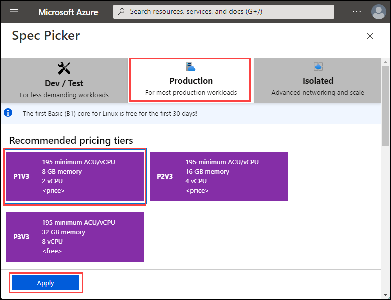  

1. Select the **Review + create** button at the bottom of the page.

1. After validation runs, select the **Create** button at the bottom of the page. This will create an Azure resource group, app service plan, and app service.

1. After the Azure resources are created, select **Go to resource**.

1. From the left navigation, select **Deployment Center**.

    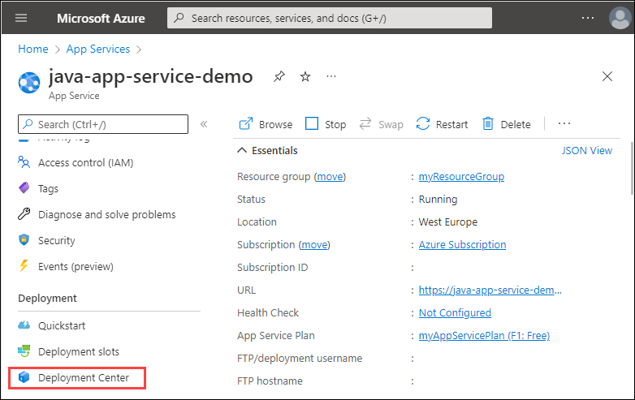  

1.  Under **Settings**, select a **Source**. For this quickstart, select _GitHub_.

1.  In the section under **GitHub**, select the following settings:

# [Java SE](#tab/javase)

- Organization: Select your organization.
- Repository: Select _java-docs-spring-hello-world_.
- Branch: Select _main_.

# [Tomcat](#tab/tomcat)

- Organization: Select your organization.
- Repository: Select _java-docs-spring-hello-world_.
- Branch: Select _tomcat_.

# [JBoss EAP](#tab/jbosseap)

- Organization: Select your organization.
- Repository: Select _agoncal-application-petstore-ee7_.
- Branch: Select _master_.

---

1. Select **Save**.

    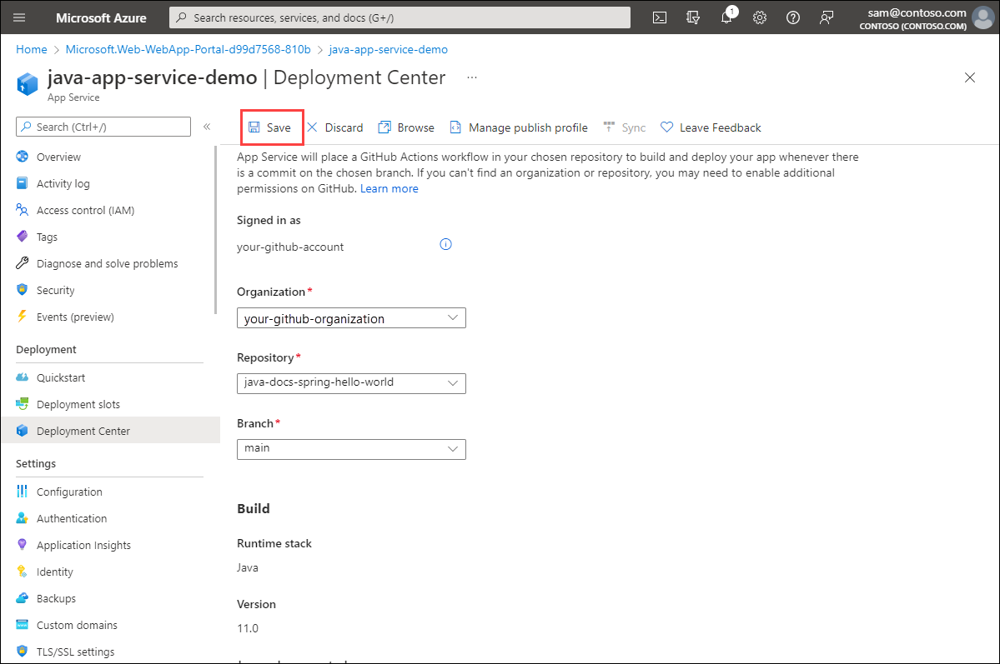  

    > [!TIP]
    > This quickstart uses GitHub. Additional continuous deployment sources include Bitbucket, Local Git, Azure Repos, and External Git. FTPS is also a supported deployment method.
  
1. Once the GitHub integration is saved, select **Overview** > **URL**.

    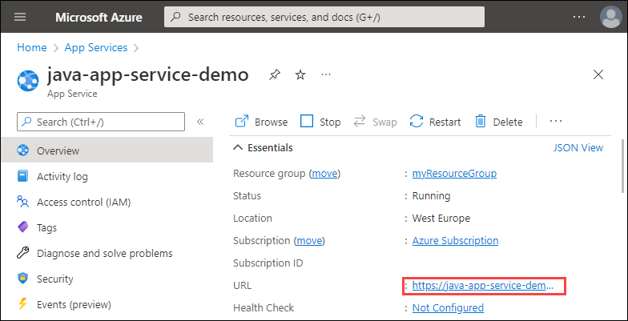  

# [Java SE](#tab/javase)

The Java SE sample code is running in an Azure App Service Linux web app.


**Congratulations!** You've deployed your first Java app to App Service using the Azure portal.

# [Tomcat](#tab/tomcat)

The Java Tomcat sample code is running in an Azure App Service Linux web app.


**Congratulations!** You've deployed your first Java app to App Service using the Azure portal.

# [JBoss EAP](#tab/jbosseap)

You will see the placeholder page with the message "Hey, Java developers!". The code isn't deploying successfully yet. We will update the GitHub Action workflow in the next step.

---

## 3 - Update the fork in GitHub and deploy the changes

# [Java SE](#tab/javase)

1. Browse to your GitHub fork of java-docs-spring-hello-world.

1. On your repo page, press `.` to start Visual Studio Code within your browser.

    > [!NOTE]
    > The URL will change from GitHub.com to GitHub.dev. This feature only works with repos that have files. This does not work on empty repos.

    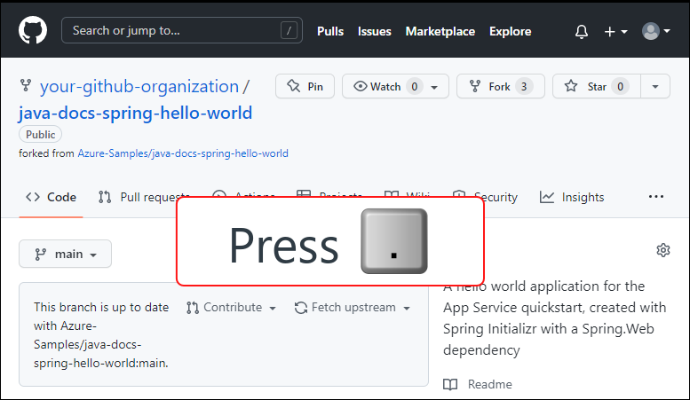

1. Navigate to **src/main/java/com/example/demo/DemoApplication.java**.

    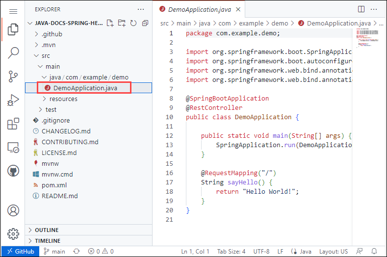

1. Edit the **sayHello** method so that it shows "Hello Azure!" instead of "Hello World!"

    ```java
    @RequestMapping("/")
    String sayHello() {
        return "Hello Azure!";
    }
    ```

1. From the **Source Control** pane, select the **Stage Changes** button to stage the change.

    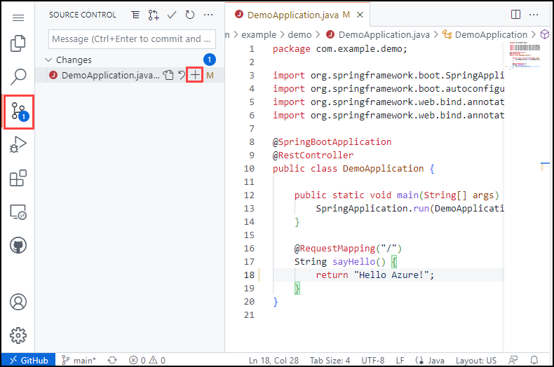

1. Enter a commit message such as `Hello Azure`. Then, select **Commit and Push**.

    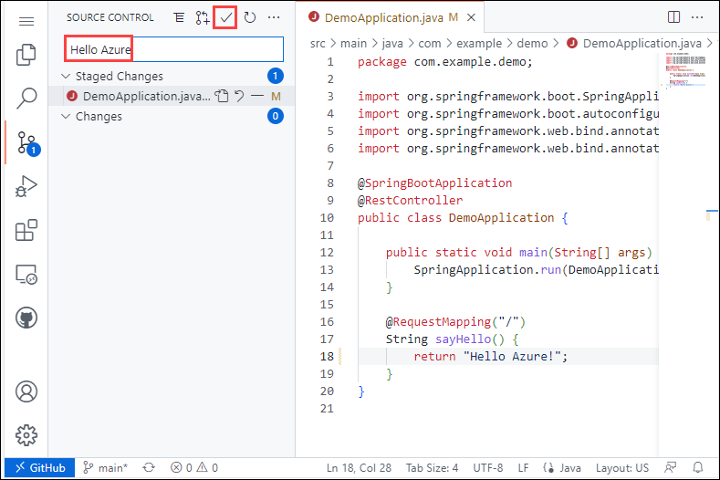

1. Once deployment has completed, return to the browser window that opened during the **Browse to the app** step, and refresh the page.

    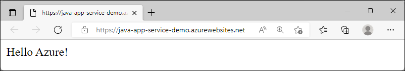

# [Tomcat](#tab/tomcat)

1. Browse to your GitHub fork of java-docs-spring-hello-world. Change the branch to `tomcat`.

    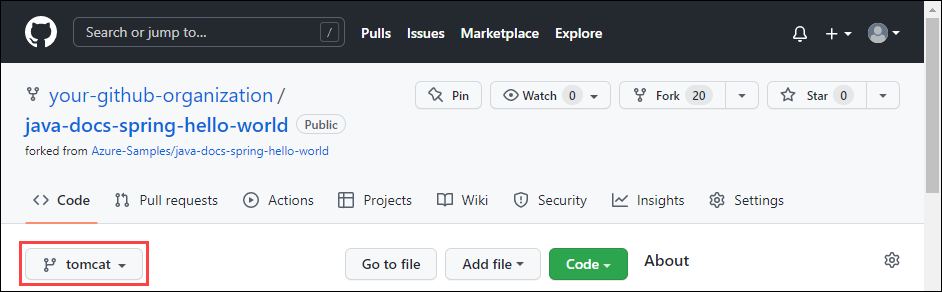


1. On your repo page, press `.` to start Visual Studio Code within your browser.

    > [!NOTE]
    > The URL will change from GitHub.com to GitHub.dev. This feature only works with repos that have files. This does not work on empty repos.

    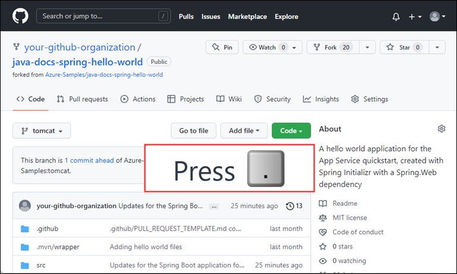

1. Navigate to **src/main/java/com/example/demo/DemoApplication.java**.

    

1. Edit the **sayHello** method so that it shows "Hello Azure!" instead of "Hello World!"

    ```java
    @RequestMapping("/")
    String sayHello() {
        return "Hello Azure!";
    }
    ```

1. From the **Source Control** pane, select the **Stage Changes** button to stage the change.

    

1. Enter a commit message such as `Hello Azure`. Then, select **Commit and Push**.

    

1. Once deployment has completed, return to the browser window that opened during the **Browse to the app** step, and refresh the page.

    

# [JBoss EAP](#tab/jbosseap)

1. Browse to your GitHub fork of agoncal-application-petstore-ee7.

1. On your repo page, press `.` to start Visual Studio Code within your browser.

    > [!NOTE]
    > The URL will change from GitHub.com to GitHub.dev. This feature only works with repos that have files. This does not work on empty repos.

    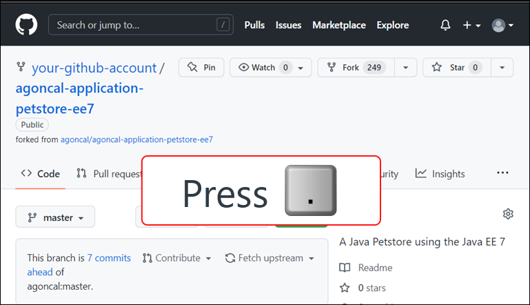

1. Navigate to the GitHub Actions YML file created in **.github/workflows**. Update the `mvn clean install` line to include `-DskipTests`.

    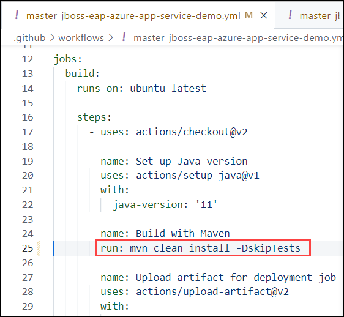

    If we committed and pushed our changes at this point, the code would get deployed to the Azure App Service. However, you would see the messaging that the Red Hat JBoss Enterprise Application Platform is running. 

    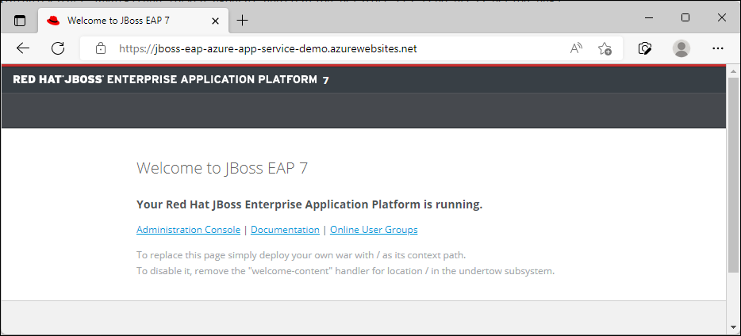

    The key message on this screen is to deploy your own war with `/` as its context path. So we need to set the context path.

1. Right-click on the **src/main/webapp/WEB-INF/** folder and create a new file named **jboss-web.xml** to set the context root to `/`. Enter the following contents:

    ```xml
    <jboss-web>
        <context-root>/</context-root>
    </jboss-web>
    ```

1. From the **Source Control** pane, hovering over Changes, select the **Stage Changes** button to stage the files.

    

1. Enter a commit message such as `Updating JBoss EAP Azure App Service configuration`. Then, select **Commit and Push**.

    

1. Once deployment has completed, return to the browser window that opened during the **Browse to the app** step, and refresh the page.

    

---

## 4 - Manage your new Azure app

1. Go to the [Azure portal](https://portal.azure.com) to manage the web app you created. Search for and select **App Services**.

        

1. Select the name of your Azure app.

    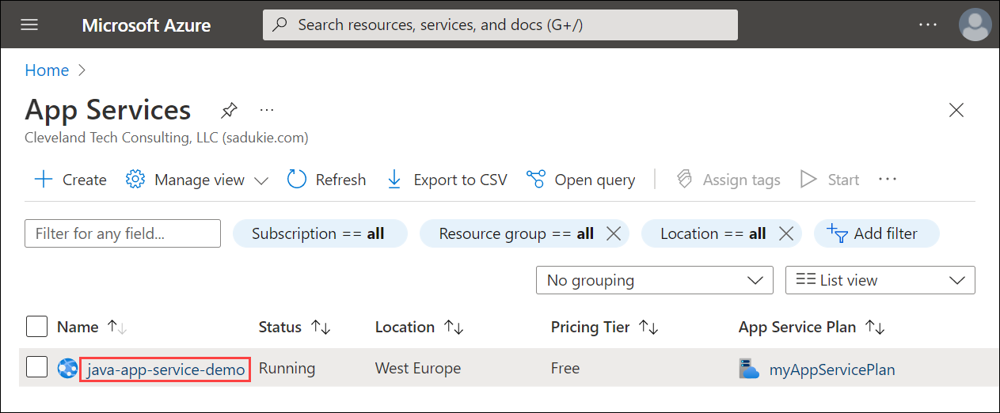

Your web app's **Overview** page will be displayed. Here, you can perform basic management tasks like **Browse**, **Stop**, **Restart**, and **Delete**.

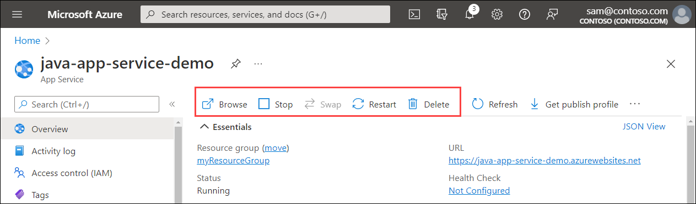

The web app menu provides different options for configuring your app.

## 5 - Clean up resources

When you're finished with the sample app, you can remove all of the resources for the app from Azure. It will not incur extra charges and keep your Azure subscription uncluttered. Removing the resource group also removes all resources in the resource group and is the fastest way to remove all Azure resources for your app.

1. From your App Service **Overview** page, select the resource group you created earlier.

1. From the resource group page, select **Delete resource group**. Confirm the name of the resource group to finish deleting the resources.
