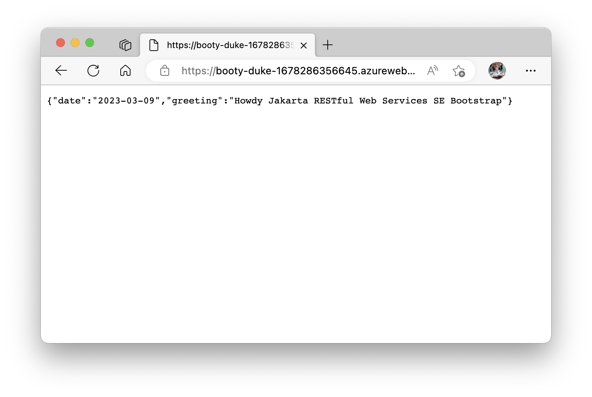

[Azure App Service](../../overview.md) provides a highly scalable, self-patching web app hosting service. This quickstart shows how to use the [Azure CLI](/cli/azure/get-started-with-azure-cli) with the [Azure Web App Plugin for Maven](https://github.com/Microsoft/azure-maven-plugins/tree/develop/azure-webapp-maven-plugin) to deploy a .jar, .war or .ear file. Use the tabs to switch between Java SE, Tomcat, and JBoss EAP instructions.

# [Java SE](#tab/javase)



# [Tomcat](#tab/tomcat)


# [JBoss EAP](#tab/jbosseap)


---

If Maven isn't your preferred development tool, check out our similar tutorials for Java developers:
+ [Gradle](../../configure-language-java.md?pivots=platform-linux#gradle)
+ [IntelliJ IDEA](/azure/developer/java/toolkit-for-intellij/create-hello-world-web-app)
+ [Eclipse](/azure/developer/java/toolkit-for-eclipse/create-hello-world-web-app)
+ [Visual Studio Code](https://code.visualstudio.com/docs/java/java-webapp)

[!INCLUDE [quickstarts-free-trial-note](../../../../includes/quickstarts-free-trial-note.md)]

## 1 - Use Azure Cloud Shell

[!INCLUDE [cloud-shell-try-it-no-header.md](../../../../includes/cloud-shell-try-it-no-header.md)]

## 2 - Create a Java app

# [Java SE](#tab/javase)

Clone the [sample project](https://github.com/Azure-Samples/app-service-java-quickstart) and check out the source code that runs with this version of the article.

> [!TIP]
> Though App Service supports older versions of Java, the `booty-duke-app-service` sample project uses Java records and requires **Java 17**. For more information about Java records, see [JEP 395](https://openjdk.org/jeps/395).

```azurecli-interactive
git clone https://github.com/Azure-Samples/app-service-java-quickstart
```

Change directory to the completed project and build from the top level. Then `cd` to the subdirectory for booty duke.

```azurecli-interactive
cd app-service-java-quickstart
git checkout 20230308
mvn clean install
cd booty-duke-app-service
```

If you see a message about being in **detached HEAD** state, this message is safe to ignore. Because you will not be making any commits, detached HEAD state is appropriate.

# [Tomcat](#tab/tomcat)

Execute the following Maven command in the Cloud Shell prompt to create a new app named `helloworld`:

```azurecli-interactive
mvn archetype:generate "-DgroupId=example.demo" "-DartifactId=helloworld" "-DarchetypeArtifactId=maven-archetype-webapp" "-Dversion=1.0-SNAPSHOT"
```

Then change your working directory to the project folder:

```azurecli-interactive
cd helloworld
```

# [JBoss EAP](#tab/jbosseap)

Clone the Pet Store demo application.

```azurecli-interactive
git clone https://github.com/Azure-Samples/app-service-java-quickstart
```

Change directory to the completed project and build from the top level. Then `cd` to the subdirectory for petstore.

> [!TIP]
> The `petstore-ee7` sample requires **Java 11 or newer**. The `booty-duke-app-service` sample project requires **Java 17**. If your installed version of Java is less than 17, run the build from within the `petstore-ee7` directory, rather than at the top level.

```azurecli-interactive
cd app-service-java-quickstart
git checkout 20230308
cd petstore-ee7
mvn clean install
```

If you see a message about being in **detached HEAD** state, this message is safe to ignore. Because you will not be making any commits, detached HEAD state is appropriate.

---

## 3 - Configure the Maven plugin

> [!TIP]
> The Maven plugin supports **Java 17** and **Tomcat 10.0**. For more information about latest support, see [Java 17 and Tomcat 10.0 are available on Azure App Service](https://devblogs.microsoft.com/java/java-17-and-tomcat-10-0-available-on-azure-app-service/).

The deployment process to Azure App Service uses your Azure credentials from the Azure CLI automatically. If the Azure CLI isn't installed locally, then the Maven plugin authenticates with Oauth or device login. For more information, see [authentication with Maven plugins](https://github.com/microsoft/azure-maven-plugins/wiki/Authentication).

Run the Maven command shown next to configure the deployment. This command helps you to set up the App Service operating system, Java version, and Tomcat version.

```azurecli-interactive
mvn com.microsoft.azure:azure-webapp-maven-plugin:2.11.0:config
```

# [Java SE](#tab/javase)

1. If prompted for **Create new run configuration**, select **Y**.
1. When prompted with **Subscription** option, select the proper `Subscription` by entering the number printed at the start of the line.
1. When prompted with **Web App** option, select the default option, `<create>`, by pressing enter.
1. When prompted with **OS** option, select **Linux** by pressing enter.
1. When prompted with **javaVersion** option, select **Java 17**.
1. When prompted with **Pricing Tier** option, select **P1v2**.
1. Finally, press enter on the last prompt to confirm your selections.

    ```
    Please confirm webapp properties
    AppName : booty-duke-1678285507374
    ResourceGroup : booty-duke-1678285507374-rg
    Region : centralus
    PricingTier : P1v2
    OS : Linux
    Java Version: Java 17
    Web server stack: Java SE
    Deploy to slot : false
    Confirm (Y/N) [Y]: Y
    [INFO] Saving configuration to pom.
    [INFO] ------------------------------------------------------------------------
    [INFO] BUILD SUCCESS
    [INFO] ------------------------------------------------------------------------
    [INFO] Total time:  01:03 min
    [INFO] Finished at: 2023-03-08T15:25:47+01:00
    [INFO] ------------------------------------------------------------------------
    ```

# [Tomcat](#tab/tomcat)

1. If prompted for **Create new run configuration**, select **Y**.
1. When prompted with **Subscription** option, select the proper `Subscription` by entering the number printed at the line start.
1. When prompted with **Web App** option, select the default option, `<create>`, by pressing enter.
1. When prompted with **OS** option, select **Linux** by pressing enter.
1. When prompted with **javaVersion** option, select **Java 11**.
1. When prompted with **webcontainer** option, select **Tomcat 8.5**.
1. When prompted with **Pricing Tier** option, select **P1v2**.
1. Finally, press enter on the last prompt to confirm your selections.

    ```
    Please confirm webapp properties
    Subscription Id : ********-****-****-****-************
    AppName : helloworld-1599003744223
    ResourceGroup : helloworld-1599003744223-rg
    Region : centralus
    PricingTier : P1v2
    OS : Linux
    Web server stack : Tomcat 8.5
    Deploy to slot : false
    Confirm (Y/N)? : Y
    [INFO] Saving configuration to pom.
    [INFO] ------------------------------------------------------------------------
    [INFO] BUILD SUCCESS
    [INFO] ------------------------------------------------------------------------
    [INFO] Total time: 50.785 s
    [INFO] Finished at: 2020-09-01T16:43:09-07:00
    [INFO] ------------------------------------------------------------------------
    ```

# [JBoss EAP](#tab/jbosseap)

1. If prompted for **Create new run configuration**, select **Y**.
1. If prompted with **Subscription** option, select the proper `Subscription` by entering the number printed at the line start.
1. When prompted with **Web App** option, accept the default option `<create>` by pressing enter.
1. When prompted with **OS** option, select **Linux** by pressing enter.
1. When prompted with **javaVersion** option, select **Java 11**.
1. When prompted with **webContainer** option, select **Jbosseap 7**`
1. When prompted with **pricingTier** option, select **P1v3**
1. Finally, press enter on the last prompt to confirm your selections.

    ```
    Please confirm webapp properties
    Subscription Id : ********-****-****-****-************
    AppName : petstoreee7-1623451825408
    ResourceGroup : petstoreee7-1623451825408-rg
    Region : centralus
    PricingTier : P1v3
    OS : Linux
    Java : Java 11
    Web server stack: Jbosseap 7
    Deploy to slot : false
    Confirm (Y/N) [Y]: y
    [INFO] Saving configuration to pom.
    [INFO] ------------------------------------------------------------------------
    [INFO] BUILD SUCCESS
    [INFO] ------------------------------------------------------------------------
    [INFO] Total time:  02:07 min
    [INFO] Finished at: 2023-03-10T15:34:00+01:00
    [INFO] ------------------------------------------------------------------------
    ```

---

After you've confirmed your choices, the plugin adds the above plugin element and requisite settings to your project's `pom.xml` file that configure your web app to run in Azure App Service.

The relevant portion of the `pom.xml` file should look similar to the following example.

```xml-interactive
<build>
    <plugins>
        <plugin>
            <groupId>com.microsoft.azure</groupId>
            <artifactId>>azure-webapp-maven-plugin</artifactId>
            <version>x.xx.x</version>
            <configuration>
                <schemaVersion>v2</schemaVersion>
                <resourceGroup>your-resourcegroup-name</resourceGroup>
                <appName>your-app-name</appName>
            ...
            </configuration>
        </plugin>
    </plugins>
</build>           
```

You can modify the configurations for App Service directly in your `pom.xml`. Some common configurations are listed below:

Property | Required | Description | Version
---|---|---|---
`<schemaVersion>` | false | Specify the version of the configuration schema. Supported values are: `v1`, `v2`. | 1.5.2
`<subscriptionId>` | false | Specify the subscription ID. | 0.1.0+
`<resourceGroup>` | true | Azure Resource Group for your Web App. | 0.1.0+
`<appName>` | true | The name of your Web App. | 0.1.0+
`<region>` | false | Specifies the region to host your Web App; the default value is **centralus**. All valid regions at [Supported Regions](https://azure.microsoft.com/global-infrastructure/services/?products=app-service) section. | 0.1.0+
`<pricingTier>` | false | The pricing tier for your Web App. The default value is **P1v2** for production workload, while **B2** is the recommended minimum for Java dev/test. For more information, see [App Service Pricing](https://azure.microsoft.com/pricing/details/app-service/linux/)| 0.1.0+
`<runtime>` | false | The runtime environment configuration. For more information, see [Configuration Details](https://github.com/microsoft/azure-maven-plugins/wiki/Azure-Web-App:-Configuration-Details). | 0.1.0+
`<deployment>` | false | The deployment configuration. For more information, see [Configuration Details](https://github.com/microsoft/azure-maven-plugins/wiki/Azure-Web-App:-Configuration-Details). | 0.1.0+

For the complete list of configurations, see the plugin reference documentation. All the Azure Maven Plugins share a common set of configurations. For these configurations see [Common Configurations](https://github.com/microsoft/azure-maven-plugins/wiki/Common-Configuration). For configurations specific to App Service, see [Azure Web App: Configuration Details](https://github.com/microsoft/azure-maven-plugins/wiki/Azure-Web-App:-Configuration-Details).

Be careful about the values of `<appName>` and `<resourceGroup>` (`helloworld-1590394316693` and `helloworld-1590394316693-rg` accordingly in the demo), they are used later.

## 4 - Deploy the app

With all the configuration ready in your pom file, you can deploy your Java app to Azure with one single command.

# [Java SE](#tab/javase)
```azurecli-interactive
mvn package azure-webapp:deploy
```
# [Tomcat](#tab/tomcat)
```azurecli-interactive
mvn package azure-webapp:deploy
```
# [JBoss EAP](#tab/jbosseap)

```azurecli-interactive
# Disable testing, as it requires Wildfly to be installed locally.
mvn package azure-webapp:deploy -DskipTests
```

-----

Once deployment is completed, your application is ready at `http://<appName>.azurewebsites.net/` (`http://helloworld-1590394316693.azurewebsites.net` in the demo). Open the url with your local web browser, you should see

# [Java SE](#tab/javase)


# [Tomcat](#tab/tomcat)


# [JBoss EAP](#tab/jbosseap)


---

**Congratulations!** You've deployed your first Java app to App Service.

## 5 - Clean up resources

In the preceding steps, you created Azure resources in a resource group. If you don't need the resources in the future, delete the resource group from portal, or by running the following command in the Cloud Shell:

```azurecli-interactive
az group delete --name <your resource group name; for example: helloworld-1558400876966-rg> --yes
```

This command may take a minute to run.
