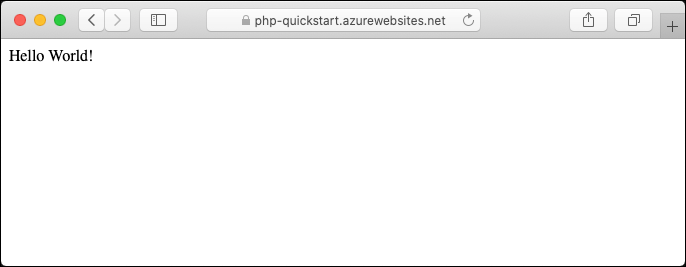
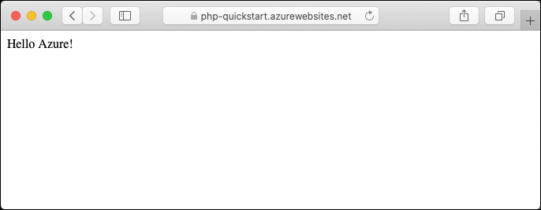
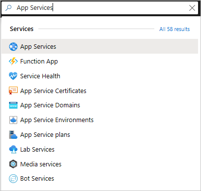

[!INCLUDE [php-eol-notice](../php-windows-eol-notice.md)]

[Azure App Service](../../overview.md) provides a highly scalable, self-patching web hosting service.  This quickstart tutorial shows how to deploy a PHP app to Azure App Service on Windows.

You create the web app using the [Azure CLI](/cli/azure/get-started-with-azure-cli) in Cloud Shell, and you use Git to deploy sample PHP code to the web app.



You can follow the steps here using a Mac, Windows, or Linux machine. Once the prerequisites are installed, it takes about five minutes to complete the steps.

[!INCLUDE [quickstarts-free-trial-note](../../../../includes/quickstarts-free-trial-note.md)]

> [!NOTE]
> [After November 28, 2022, PHP will only be supported on App Service on Linux.](https://github.com/Azure/app-service-linux-docs/blob/master/Runtime_Support/php_support.md#end-of-life-for-php-74)

## Prerequisites

To complete this quickstart:

* <a href="https://git-scm.com/" target="_blank">Install Git</a>
* <a href="https://php.net/manual/install.php" target="_blank">Install PHP</a>

## Download the sample locally

1. In a terminal window, run the following commands. It will clone the sample application to your local machine, and navigate to the directory containing the sample code.

    ```bash
    git clone https://github.com/Azure-Samples/php-docs-hello-world
    cd php-docs-hello-world
    ```
    
1. Make sure the default branch is `main`.

    ```bash
    git branch -m main
    ```
    
    > [!TIP]
    > The branch name change isn't required by App Service. However, since many repositories are changing their default branch to `main`, this quickstart also shows you how to deploy a repository from `main`.
    
## Run the app locally

1. Run the application locally so that you see how it should look when you deploy it to Azure. Open a terminal window and use the `php` command to launch the built-in PHP web server.

    ```bash
    php -S localhost:8080
    ```
    
1. Open a web browser, and navigate to the sample app at `http://localhost:8080`.

    You see the **Hello World!** message from the sample app displayed in the page.
    
    
    
1. In your terminal window, press **Ctrl+C** to exit the web server.

[!INCLUDE [cloud-shell-try-it.md](../../../../includes/cloud-shell-try-it.md)]

[!INCLUDE [Configure deployment user](../../../../includes/configure-deployment-user.md)]

[!INCLUDE [Create resource group](../../../../includes/app-service-web-create-resource-group.md)]

[!INCLUDE [Create app service plan](../../../../includes/app-service-web-create-app-service-plan-linux.md)]

## Create a web app

1. In the Cloud Shell, create a web app in the `myAppServicePlan` App Service plan with the [`az webapp create`](/cli/azure/webapp#az_webapp_create) command.

    In the following example, replace `<app-name>` with a globally unique app name (valid characters are `a-z`, `0-9`, and `-`). The runtime is set to `PHP|7.4`. To see all supported runtimes, run [`az webapp list-runtimes`](/cli/azure/webapp#az_webapp_list_runtimes).

    ```azurecli-interactive
    az webapp create --resource-group myResourceGroup --plan myAppServicePlan --name <app-name> --runtime 'PHP|8.1' --deployment-local-git
    ```
    
    When the web app has been created, the Azure CLI shows output similar to the following example:

    <pre>
    Local git is configured with url of 'https://&lt;username&gt;@&lt;app-name&gt;.scm.azurewebsites.net/&lt;app-name&gt;.git'
    {
      "availabilityState": "Normal",
      "clientAffinityEnabled": true,
      "clientCertEnabled": false,
      "cloningInfo": null,
      "containerSize": 0,
      "dailyMemoryTimeQuota": 0,
      "defaultHostName": "&lt;app-name&gt;.azurewebsites.net",
      "enabled": true,
      &lt; JSON data removed for brevity. &gt;
    }
    </pre>
    
    You've created an empty new web app, with git deployment enabled.

    > [!NOTE]
    > The URL of the Git remote is shown in the `deploymentLocalGitUrl` property, with the format `https://<username>@<app-name>.scm.azurewebsites.net/<app-name>.git`. Save this URL as you need it later.
    >

1. Browse to your newly created web app. Replace _&lt;app-name>_ with your unique app name created in the prior step.

    ```bash
    http://<app-name>.azurewebsites.net
    ```

    Here's what your new web app should look like:

    

[!INCLUDE [Push to Azure](../../../../includes/app-service-web-git-push-to-azure.md)]

  <pre>
  Counting objects: 2, done.
  Delta compression using up to 4 threads.
  Compressing objects: 100% (2/2), done.
  Writing objects: 100% (2/2), 352 bytes | 0 bytes/s, done.
  Total 2 (delta 1), reused 0 (delta 0)
  remote: Updating branch 'main'.
  remote: Updating submodules.
  remote: Preparing deployment for commit id '25f18051e9'.
  remote: Generating deployment script.
  remote: Running deployment command...
  remote: Handling Basic Web Site deployment.
  remote: Kudu sync from: '/home/site/repository' to: '/home/site/wwwroot'
  remote: Copying file: '.gitignore'
  remote: Copying file: 'LICENSE'
  remote: Copying file: 'README.md'
  remote: Copying file: 'index.php'
  remote: Ignoring: .git
  remote: Finished successfully.
  remote: Running post deployment command(s)...
  remote: Deployment successful.
  To https://&lt;app-name&gt;.scm.azurewebsites.net/&lt;app-name&gt;.git
      cc39b1e..25f1805  main -> main
  </pre>

## Browse to the app

Browse to the deployed application using your web browser.

```
http://<app-name>.azurewebsites.net
```

The PHP sample code is running in an Azure App Service web app.


**Congratulations!** You've deployed your first PHP app to App Service.

## Update locally and redeploy the code

1. Using a local text editor, open the `index.php` file within the PHP app, and make a small change to the text within the string next to `echo`:

    ```php
    echo "Hello Azure!";
    ```

1. In the local terminal window, commit your changes in Git, and then push the code changes to Azure.

    ```bash
    git commit -am "updated output"
    git push azure main
    ```

1. Once deployment has completed, return to the browser window that opened during the **Browse to the app** step, and refresh the page.

    

## Manage your new Azure app

1. Go to the <a href="https://portal.azure.com" target="_blank">Azure portal</a> to manage the web app you created. Search for and select **App Services**.

    

2. Select the name of your Azure app.

    

    Your web app's **Overview** page will be displayed. Here, you can perform basic management tasks like **Browse**, **Stop**, **Restart**, and **Delete**.

    

    The web app menu provides different options for configuring your app.

[!INCLUDE [cli-samples-clean-up](../../../../includes/cli-samples-clean-up.md)]

