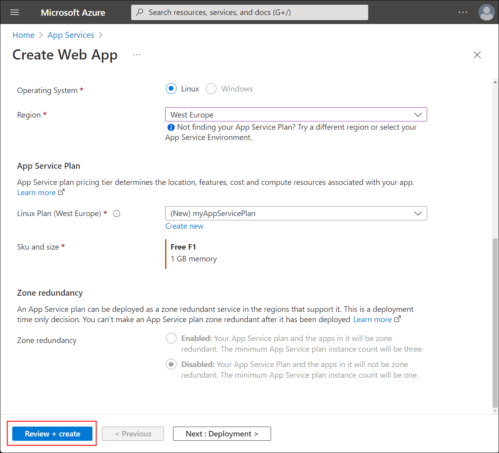
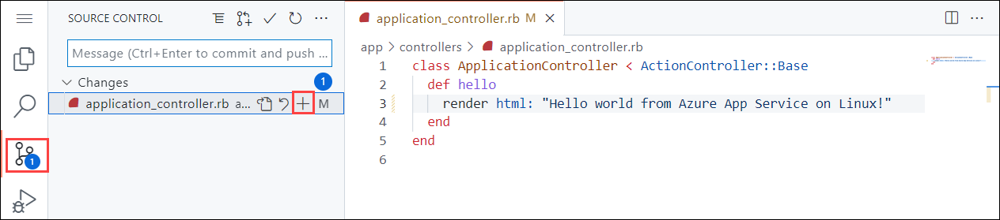
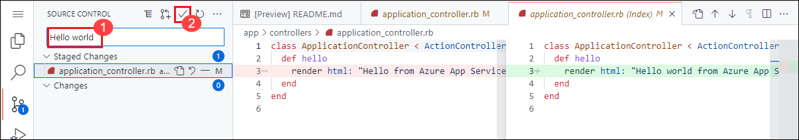

[Azure App Service](../../overview.md) provides a highly scalable, self-patching web hosting service. This quickstart tutorial shows how to deploy a Ruby app to Azure App Service on Linux using the Azure portal.

This quickstart configures an App Service app in the **Free** tier and incurs no cost for your Azure subscription.

This quickstart shows you how to make these changes within your browser, without having to install the development environment tools on your machine.


You can follow the steps here using a Mac, Windows, or Linux machine. Once the prerequisites are installed, it takes about five minutes to complete the steps.

To complete this quickstart you need:

1. An Azure account with an active subscription. [Create an account for free](https://azure.microsoft.com/free/?utm_source=campaign&utm_campaign=vscode-tutorial-app-service-extension&mktingSource=vscode-tutorial-app-service-extension).
2. A GitHub account to fork a repository.

## 1 - Fork the sample repository

1. In your browser, navigate to the repository containing [the sample code](https://github.com/Azure-Samples/ruby-docs-hello-world).

2. In the upper right corner, select **Fork**.

    

3. On the **Create a new fork** screen, confirm the **Owner** and **Repository name** fields. Select **Create fork**.

    

    >[!NOTE]
    > This should take you to the new fork. Your fork URL will look something like this: https://github.com/YOUR_GITHUB_ACCOUNT_NAME/ruby-docs-hello-world

## 2 - Deploy to Azure

1. Sign into the Azure portal.

2. At the top of the portal, type **app services** in the search box. Under **Services**, select **App Services**.

    

3. In the **App Services** page, select **Create**.

    

4. Fill out the **Create Web App** page as follows.
   - **Resource Group**: Create a resource group named *myResourceGroup*.
   - **Name**: Type a globally unique name for your web app. 
   - **Publish**: Select *Code*.
   - **Runtime stack**: Select *Ruby 2.7*. 
   - **Operating system**: Select *Linux*.
   - **Region**: Select an Azure region close to you.
   - **App Service Plan**: Create an app service plan named *myAppServicePlan*.

5.  To change to the Free tier, next to **Sku and size**, select **Change size**. 
   
6.  In the Spec Picker, select **Dev/Test** tab, select **F1**, and select the **Apply** button at the bottom of the page.

       

7. Select the **Review + create** button at the bottom of the page.

       

8. After validation runs, select the **Create** button at the bottom of the page. This will create an Azure resource group, app service plan, and app service.

9. After the Azure resources are created, select **Go to resource**.

10. From the left navigation, select **Deployment Center**.

      

11. Under **Settings**, select a **Source**. For this quickstart, select *GitHub*.

12. In the section under **GitHub**, select the following settings:
    - Organization: Select your organization.
    - Repository: Select *ruby-docs-hello-world*.
    - Branch: Select the default branch for your repository.

13. Select **Save**.

      

    > [!TIP]
    > This quickstart uses GitHub. Additional continuous deployment sources include Bitbucket, Local Git, Azure Repos, and External Git. FTPS is also a supported deployment method.

14. Once the GitHub integration is saved, from the left navigation of your app, select **Overview** > **URL**. 

15. On the Overview, select the link under **URL**.

      

The Ruby sample code is running in an Azure App Service Linux web app.


**Congratulations!** You've deployed your first Ruby app to App Service using the Azure portal.

## 3 - Update in GitHub and redeploy the code

1. Browse to your GitHub fork of ruby-docs-hello-world.

2. On your repo page, press `.` to start Visual Studio code within your browser.

    > [!NOTE]
    > The URL will change from GitHub.com to GitHub.dev. This feature only works with repos that have files. This does not work on empty repos.

3. Navigate to **app/controllers/application_controller.rb**.

    

4. Edit the *ApplicationController* class so that it shows "Hello world from Azure App Service on Linux!" instead of "Hello from Azure App Service on Linux!".

    ```ruby
    class ApplicationController < ActionController::Base
        def hello
            render html: "Hello world from Azure App Service on Linux!"
        end
    end
    ```

5. From the **Source Control** menu, select the **Stage Changes** button to stage the change.

    

6. Enter a commit message such as `Hello world`. Then, select Commit and Push.

    

7. Once deployment has completed, return to the browser window that opened during the **Browse to the app** step, and refresh the page.

    

## 4 - Manage your new Azure app

1. Go to the Azure portal to manage the web app you created. Search for and select **App Services**.

        

2. Select the name of your Azure app.

    

Your web app's **Overview** page will be displayed. Here, you can perform basic management tasks like **Browse**, **Stop**, **Restart**, and **Delete**.


The web app menu provides different options for configuring your app.

## 5 - Clean up resources

When you're finished with the sample app, you can remove all of the resources for the app from Azure. It will not incur extra charges and keep your Azure subscription uncluttered. Removing the resource group also removes all resources in the resource group and is the fastest way to remove all Azure resources for your app.

1. From your App Service **Overview** page, select the resource group you created in the [Create Azure resources](#create-azure-resources) step.

2. From the resource group page, select **Delete resource group**. Confirm the name of the resource group to finish deleting the resources.
